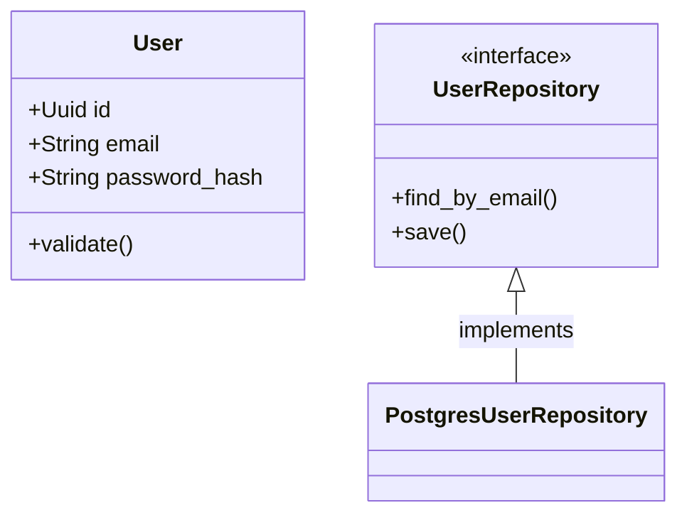

# /docs-gen - ドキュメント自動生成

指定されたクレートやモジュールを解析し、仕様書（Markdown）と設計図（Mermaid）を生成します。
大規模プロジェクトにおける「仕様のブラックボックス化」を防ぎます。

## 使用法

```bash
/docs-gen crates/core
```

## 実行手順

1. **コード解析**
   - 指定されたディレクトリ内の `struct`, `enum`, `trait`, `public function` を抽出します。
   - コメントやドキュメンテーションコメント (`///`) を読み取ります。

2. **ドキュメント生成**
   - 以下の構成でMarkdownファイル (`docs/architecture.md`) を生成/更新します。
     - **概要**: モジュールの責務
     - **主要データ構造**: 構造体定義と役割
     - **インターフェース**: Trait定義
     - **依存関係**: 他クレートとの関係

3. **Mermaid図生成**
   - クラス図 (`classDiagram`)：構造体とTraitの関係
   - シーケンス図 (`sequenceDiagram`)：主要な処理フロー

## 出力例

```markdown
# Core モジュール仕様書

## 概要
ビジネスロジックの中核を担う。外部依存を持たず、純粋なRustコードで構成される。

## Mermaid クラス図


```
