# 🌊 Aiome Ripple Map

## Phase 8.8: Aegis Sentinel Infrastructure Integration
### 1. Incident Repository & DB Optimization
- **変更内容**:
    - `libs/infrastructure/src/aegis/incident_repo.rs` [NEW]: `IncidentRepository` を新設し、システムインシデント（WASM・ホスト実行時の異常）の記録をSQLite/Postgres共通のドライバで処理できるよう統一。
    - `libs/infrastructure/src/skills/mod.rs` & `skill_arena.rs` [MODIFY]: 生のSQLクエリを削除し、`IncidentRepository` を用いるようにリファクタリング。さらに `RwLock` の書き込みロック期間から重いデータベースI/O操作を分離。
    - `apps/api-server/src/stream.rs` [MODIFY]: `CoreEvent::AegisSentinel` のパターンマッチを追加し、Dream Loop からのイベントがフロントエンドのSSEへ伝搬するように修正。
    - `apps/management-console/src/hooks/useSystemVitality.tsx` & `App.tsx` [MODIFY]: `aegis_sentinel` イベントの UI 側購読を追加し、重大度に応じたアラートレンダリングと i18n 翻訳を実装。
- **波及効果**:
    - Aiome の自律型免疫システム (Aegis Sentinel) がカーネルレベルからUIアラートまで E2E で貫通した。
    - `SkillArena` 評価時のロック競合（Lock Contention）が排除され、複数エージェント並行実行時のレイテンシと安定性が向上した。
    - データベース操作が抽象化されたことで、PostgreSQL 環境への移行がシームレスに行えるようになった。

## Phase 8.5: Infrastructure Hardening & Nurture Integration
### 1. Cross-Domain Error Unification
- **変更内容**:
    - `libs/aiome-commerce/src/x402.rs` [MODIFY]: `X402Error` から `AiomeError` への `From` トレイト実装。
    - `libs/avatar-engine/src/loader.rs` [MODIFY]: `LoaderError` から `AiomeError` への `From` トレイト実装。
    - `libs/avatar-engine/src/proportions.rs` [MODIFY]: `ProportionError` から `AiomeError` への `From` トレイト実装。
- **波及効果**:
    - Aiome および Nurture ドメイン間で発生する各モジュールの特化エラーが `AiomeError` に一元化され、HTTPレイヤーや呼び出し元へシームレスに伝播可能となった。
    - `?` 演算子によるクリーンなエラーハンドリングが実現。

### 2. Zero-Trust Environment Variable Scubbing
- **変更内容**:
    - `Project-Nurture/apps/nurture-api/src/main.rs` [MODIFY]: 起動時の `std::env::remove_var` を `shared::security::scrub_env` に置換。
- **波及効果**:
    - `NURTURE_INTERNAL_SECRET` や `STRIPE_WEBHOOK_SECRET` 等のメモリ・常駐リスクが解消され、Aiome OSSのセキュリティ基準と完全に統一された。

### 3. KarmaForge Sandbox Integration
- **変更内容**:
    - `Project-Nurture/libs/nurture-infra/src/economy/karma_forge.rs` [MODIFY]: `PythonExecutor` を用いて、`sage_meditation` メソッドを通じたコンテナ化（Podman）サンドボックスによる経済分析ロジックを実装。
    - `Project-Nurture/apps/nurture-api/src/state.rs` [MODIFY]: `AppState` 初期化時に `PythonExecutor` を `KarmaForge` へ DI 注入するよう修正。
- **波及効果**:
    - ユーザー提供のデータや外部要素に基づく分析スクリプトが本体プロセスから隔離され、RCE リスクを排除したセキュアな Economy 監査が可能となった。

## Phase 6: Infrastructure Decoupling (Repository Pattern & Trait Isolation)
### 1. SemanticCache & MemoryCrystallizer Isolation
- **変更内容**:
    - `libs/infrastructure/src/job_queue/mod.rs` [MODIFY]: `SemanticCacheRepository` と `DistillationOps` トレイトを追加定義。`UniversalJobQueue` にこれらのトレイトを実装。
    - `libs/infrastructure/src/llm/semantic_cache.rs` [MODIFY]: `SemanticCache` の初期化引数を `Arc<UniversalJobQueue>` から `Arc<dyn SemanticCacheRepository>` に変更。
    - `libs/infrastructure/src/memory_crystallizer.rs` [MODIFY]: `MemoryCrystallizer` の初期化引数を `Arc<UniversalJobQueue>` から `Arc<dyn DistillationOps>` に変更。
    - `apps/api-server/src/bootstrap.rs` [MODIFY]: 上記の変更に伴い、DI時のキャストを追加。
    - テストファイル全般 [MODIFY]: `mockall` で生成したモックリポジトリを使用するように `SemanticCache` と `MemoryCrystallizer` のテストをリファクタリング。
- **波及効果**:
    - `SemanticCache` および `MemoryCrystallizer` が `UniversalJobQueue` への直接依存から脱却し、単体テスト時のSQLite（ファイルIO）依存が排除された。
    - `get_pool()` などの内部実装を外部に露出しない、堅牢な Interface Segregation Principle (ISP) が実現。

## Phase 4: Agentic Core Refactoring & Zero-Trust Sync
- **変更内容**:
    - `apps/api-server/src/internal_services/mod.rs` [MODIFY]: `Watchtower`, `Heartbeat`, `Dream`, `OxiLean` タスクの `panic!` を graceful restart ループに置換。
    - `apps/samsara-hub/src/mdns_listener.rs` [MODIFY]: `mDNS` ブラウズ時の `panic!` を再試行ループに置換し、P2P 発見がクラッシュするのを防ぐ。
- **波及効果**:
    - 内部サービスがクラッシュしてもアプリケーション全体を道連れにせず、自律的に復旧可能になり、システムの可用性が向上。

### 2. SecretString Credential Protection
- **変更内容**:
    - `libs/infrastructure/src/tts.rs` [MODIFY]: `OpenAiTtsProvider` の `api_key: String` を `secrecy::SecretString` に置換。
    - `libs/infrastructure/src/trend_sonar.rs` [MODIFY]: `WebSearchAdapter` と `SerpAnalysisAdapter` の `api_key: String` を `secrecy::SecretString` に置換。
    - `apps/api-server/src/bootstrap.rs` [MODIFY]: `OpenAiTtsProvider` 初期化時、不必要に `expose_secret().to_string()` していた箇所を削除し、直接 `SecretString` を引き回すように修正。
- **波及効果**:
    - メモリダンプや不用意なロギングによって API キーが平文のまま漏洩するリスク（CWE-532, CWE-316）を完全に排除した。

## Phase P3: Infrastructure Stabilization & Edge Integration
### 1. UniversalGigEngine Migration
- **変更内容**:
    - `apps/aiome-node/Cargo.toml` [MODIFY]: `aiome-commerce` と `aiome-core` への依存関係を追加し、実機エンジン稼働の準備を完了。
    - `apps/aiome-node/src/main.rs` [MODIFY]: `DummyGigEngine` と `DummyValidator` を撤廃。本番運用に向けた `UniversalGigEngine` をインジェクト。
    - `apps/aiome-node/src/main.rs` [MODIFY]: Edge Node 環境での不正な決済挙動を防ぐため、常に `AiomeError::Infrastructure` を返す `StubCommerceEngine` と `DisabledLlmProvider` を実装・注入。
- **波及効果**:
    - `aiome-node` がスタブから本番レベルの基盤へ移行。将来的な Commerce 統合（本番への昇格）への準備が整った。同時に誤った「成功（Phantom Success）」によるインシデントリスクをゼロ化した。

### 2. RTBF/GDPR Blob Storage S3 Purge
- **変更内容**:
    - `libs/infrastructure/Cargo.toml` [MODIFY]: `aws-sdk-s3` と `aws-config` をオプショナル（feature gate: `s3`）として追加。
    - `libs/infrastructure/src/blob_storage.rs` [MODIFY]: `BlobStorageAdapter` に S3 クライアントとバケットを保持する構成を追加。`purge_actor_assets` に `delete_objects` を用いた一括物理削除ロジックを実装。
- **波及効果**:
    - クラウドストレージ（S3/R2）に対する RTBF（忘れられる権利）要件を満たすことが可能となった。

### 3. URL Hardcoding Elimination & Panic Remediation
- **変更内容**:
    - `libs/infrastructure/src/tts.rs` [MODIFY]: `OpenAiTtsProvider` でエンドポイントURLを動的化（環境変数経由）。
    - `libs/infrastructure/src/generative_engine.rs` [MODIFY]: `FalAiGenerativeEngine` で Base URL を動的化（環境変数経由）。
    - `libs/infrastructure/src/tts.rs` / `cortex_query.rs` [MODIFY]: `#![allow(clippy::unwrap_used)]` 外での本番 `unwrap()` を `Result` ハンドリングに修正。
- **波及効果**:
    - 環境差異（オンプレミス、クラウド）への対応力が強化され、予期せぬパニック（プロセス終了）リスクが低減された。

## Phase RLM: Recursive Language Model Integration
### 1. RlmClient & CortexQueryEngine Deep Query Extension
- **変更内容**:
    - `libs/aiome-contracts/src/rlm.rs` [NEW]: `RlmProvider` および `RlmConfig` トレイトを追加し、RLM サイドカーへの通信契約を定義。
    - `libs/infrastructure/src/llm/rlm_client.rs` [NEW]: `CostCircuitBreaker` による予算制約（Budget Limit）保護を備えた `RlmClient` 実装を追加。
    - `libs/infrastructure/src/cortex_query.rs` [MODIFY]: `CortexQueryEngine` に `rlm_provider` 注入ポイントを追加し、標準検索で回答できない複雑なクエリに対して再帰的推論を行う `deep_query` メソッドを実装。
    - `apps/api-server/src/bootstrap.rs` [MODIFY]: `RlmClient` をインスタンス化し、`AppState` および `CortexQueryEngine` へ DI として注入。
- **波及効果**:
    - Aiome のインフラストラクチャにおける複雑な論理推論機能（Recursive Reasoning）が完全に統合され、システムは Nurture 側の予算や意図を逸脱することなく、自律的にディープクエリへフォールバックできるようになった。
    - 影響範囲は `aiome` 側に閉じられており、`Project-Nurture` リポジトリに変更を波及させることなく強力なリーズニングレイヤーを実現した。

## Phase 5: RTBF & Cognitive Observability Hardening
### 1. RTBF `forget_actor` Atomic Purging
- **変更内容**:
    - `libs/infrastructure/src/job_queue/security.rs` [MODIFY]: `SecurityOps` トレイトに `forget_actor` を追加し、`UniversalJobQueue` に実装。`ekyc_sessions`、`jobs`、`guild_members` に加え、`chat_history`, `chat_memory_summaries`, `security_audit` に対する完全なアトミックパージを実装。誤ったスキーマ参照（`cortex_chat_history`）を修正し、`audit_ledger_global` への操作ログ記録を追加して完全な RTBF コンプライアンスを達成。
- **波及効果**:
    - Aiome のインフラストラクチャにおける GDPR (RTBF) コンプライアンスが達成された。

### 2. Cognitive Observability (Thinking Extraction)
- **変更内容**:
    - `apps/api-server/src/agent_engine.rs` [MODIFY]: `extract_thinking_process` ヘルパーを新設し、`<thinking>...</thinking>` ブロックを抽出。複数のタグや未閉鎖タグの安全なパースに対応。
    - `apps/api-server/src/stream.rs` [MODIFY]: `Event::text` ストリームから思考プロセスをブロック（UI 非表示）しつつ、DBの `metadata` カラムに記録。
    - `libs/infrastructure/src/context_engine.rs` [MODIFY]: 履歴再構築時に `metadata.thinking` をパースし、RAG用システムプロンプトに復元注入。
- **波及効果**:
    - UI を汚すことなくエージェントの思考プロセスを監査・追跡可能になった。

## Phase 5: Compliance & eKYC Hardening (GDPR / RTBF)
### 1. GDPR "Right to be Forgotten" (RTBF) Pipeline
- **変更内容**:
    - `aiome/apps/api-server/src/routes/auth.rs` [MODIFY]: `delete_account_handler` を実装し、PII（`cortex_chat_history`, `system_settings`）をアトミックトランザクションでハードデリート。
    - `aiome/apps/api-server/src/routes/auth.rs` [MODIFY]: `OxiLeanProofCertificate` を使って Nurture API (`/internal/forget/:actor_id`) へ削除要求をセキュアにカスケード。
    - `aiome/apps/api-server/src/router.rs` [MODIFY]: 欠落していたルーティングを修正し `rate_limit(1, 10s)` を適用してブルートフォース保護を追加。
- **波のアフェクト（波及効果）**:
    - Aiome 側でのアカウント削除が Project-Nurture 側にも連動し、法的要件である GDPR RTBF を 100% 満たすアーキテクチャが完成した。
    - 不可逆操作に対するレートリミット保護によりシステムの耐久性が向上。

### 2. eKYC Enforcement Layer
- **変更内容**:
    - `Project-Nurture/libs/nurture-core/src/ekyc.rs` [NEW]: `EkycVerifier` および関連構造体を実装。
    - `Project-Nurture/libs/nurture-infra/src/ekyc/store.rs` [NEW]: `SQLiteEkycStore` を実装し、DB ステータスと連動する検証ロジックを確立。
    - `Project-Nurture/apps/nurture-api/src/routes/escrow.rs`, `upload.rs` [MODIFY]: CSAM フィルタリングの最上位層として eKYC 状態チェックを統合。未認証アカウントによるクリティカルアクションをブロック。
    - `Project-Nurture/libs/nurture-infra/src/test_utils/mock_ekyc.rs` [NEW]: `MockEkycStore` を実装し、`#[cfg(any(test, debug_assertions))]` ガードによる厳密な分離を適用。
- **波のアフェクト（波及効果）**:
    - Project-Nurture のエスクローやアップロード経路に AML (Anti-Money Laundering) ポリシーが適用され、不正な資金洗浄やスパム生成をシステムレベルで遮断する防御壁が機能するようになった。
## Economic Hardening & SettlementProtocol Enforcement (A2C Synergy)
### 1. Nurture `/internal/deduct` API & S2S Authentication
- **変更内容**:
    - `Project-Nurture/apps/nurture-api/src/routes/internal.rs` [NEW]: `deduct_cost` および `release_escrow` エンドポイントの実装。Defense-in-Depth (DiD) ベースの入出力バリデーションと HTTP 400/500 の分離。
    - `Project-Nurture/apps/nurture-api/src/main.rs` [MODIFY]: `NURTURE_INTERNAL_SECRET` を検証する `internal_auth_middleware` を全体の `/internal` スコープにレイヤー適用。
    - `aiome/libs/aiome-commerce/src/stripe.rs` [MODIFY]: 直叩きの `reqwest::Client` を廃止し、グローバル構成された `aiome_core::http::get_http_client()` へ移行 (SSRF 防御と Connection Pooling)。10秒のタイムアウト付与。
- **波及効果**:
    - Aiome 側の LLM 生成 (StripeCommerceEngine) から Nurture の決済インフラへ、安全かつタイムアウト制御された HTTP リクエストが飛ぶようになった。内部ポートを直接公開しなくて済む。

### 2. A2C (Asset-to-Creator) 分配の強制化
- **変更内容**:
    - `aiome/libs/aiome-contracts/src/traits.rs` [MODIFY]: `CommerceEngine::deduct_generation_cost` メソッドのシグネチャに `asset_id` を追加。
    - `Project-Nurture/libs/nurture-infra/src/economy/bridge.rs` [MODIFY]: `deduct_generation_cost` 内での直接的な Wallet 上書きを廃止。`asset_id` 指定の有無に応じて `SettlementProtocol::settle()` のトランザクションへ流し込み、System Fee・Creator Return・Burn の3重バッチ分配を強制する設計に移行。
    - `Project-Nurture/libs/nurture-infra/src/economy/bridge.rs` [MODIFY]: `creator_points_earned` が定価ベースで算出されていたバグを修正。動的課金額 (推論コスト) ベースに乗算されるように修正。
- **波及効果**:
    - Aiome エージェントが Nurture 上の Asset を利用して生成した推論コストが、正しく Asset 制作者へのポイント還元として分配されるようになった。
    - O(1) でのトランザクションがアトミックに実行され、楽観ロックにより二重引き落としが完全にブロックされる。

## OxiLean Formal Verification Integration (Phase 0-1)
### 1. `vendor/oxilean-kernel` 導入 & Cargo.toml 隔離
- **変更内容**:
    - `vendor/oxilean-kernel/` [NEW]: OxiLean CiC kernel (Apache-2.0, 0-deps TCB) をコピー配置。
    - `vendor/oxilean-kernel/Cargo.toml` [MODIFY]: `version.workspace = true` 等の上流参照を実値にハードコード。
    - `Cargo.toml` (workspace root) [MODIFY]: `exclude = ["vendor/*"]` を追加。
- **波及効果**:
    - `vendor/oxilean-kernel` は Aiome ワークスペースの `member` ではない。`cargo check --workspace` の対象外。
    - `shadow-worker/Cargo.toml` が `path = "../../vendor/oxilean-kernel"` で参照するため、shadow-worker のビルドグラフに含まれる。
    - 上流 OxiLean のアップデート適用時は、`vendor/` のファイルを手動で更新し、`Cargo.toml` の workspace 参照解消を再実施する必要あり。

### 2. `ProofVerifier` gRPC Service & Proto 拡張
- **変更内容**:
    - `libs/aiome-contracts/proto/a2a_internal.proto` [MODIFY]: `ProofVerifier` service、`ProofRequest`、`ProofResult` message を追加。
    - `libs/aiome-core-contracts/proto/a2a_internal.proto` [MODIFY]: 上記と完全同期。
- **波及効果**:
    - `aiome-contracts` / `aiome-core-contracts` の `cargo build` で tonic codegen が `ProofVerifierServer` / `ProofVerifierClient` を自動生成。
    - 既存 `DockerConductor` service には影響なし（proto3 の service 追加は後方互換）。
    - `api-server` 側が将来 `ProofVerifierClient` を使用する場合、`aiome-contracts` への依存のみで利用可能。

### 3. `OxiLeanProofService` (shadow-worker)
- **変更内容**:
    - `apps/shadow-worker/src/proof_service.rs` [NEW]: `OxiLeanProofService` struct + `ProofVerifier` trait impl。3重防御 (timeout + catch_unwind + semaphore)。4 テストケース。
    - `apps/shadow-worker/src/main.rs` [MODIFY]: `mod proof_service` 追加。`ProofVerifierServer` を gRPC ルータに登録。`OXILEAN_PROOF_TIMEOUT_SECS` / `OXILEAN_PROOF_SEMAPHORE_PERMITS` 環境変数読み取り。
    - `apps/shadow-worker/Cargo.toml` [MODIFY]: `oxilean-kernel` 依存追加。
- **波及効果**:
    - `api-server` の `AppState` に `proof_semaphore` フィールドを追加する場合、`api_integration_tests.rs` の `create_test_server()` (L489, L665) にもフィールド追加が必要。
    - `Dockerfile.shadow-worker` の `COPY . .` は `.dockerignore` に `vendor/` が含まれないため、ビルドコンテキストに自動的に含まれる。

### 4. `verify-proof` API Endpoint Rate Limiting & Integration
- **変更内容**:
    - `apps/api-server/src/router.rs` [MODIFY]: `/api/skills/verify-proof` ルートに対し、1リクエスト/10秒の `tower::ServiceBuilder` レートリミット（`rate_limit_1_10s`）を適用。
    - `apps/api-server/src/api_integration_tests.rs` [MODIFY]: `test_verify_skill_proof_endpoint_connected` 結合テストを追加し、404 (Skill WASM not found) と 429 (Too Many Requests) のエラーハンドリングを実証。
    - `apps/api-server/src/api.rs` [MODIFY]: OpenAPI ドキュメントへ `verify_skill_proof` エンドポイントおよび入出力構造体をマージ。
- **波及効果**:
    - Aiome の主権的検証パイプライン（Sovereign Verification Pipeline）が DoS 攻撃に対して強固に保護された。
    - 今後 `verify-proof` を呼び出す Project-Nurture フロントエンドや外部エージェントは、10秒間隔のポーリング・リトライ制御を実装する必要がある。

## Agentic AI Adaptation Framework (Reflexion x3)
### 1. AgentHook Architecture & NurtureAgentHook
- **変更内容**:
    - `libs/aiome-contracts/src/plugin.rs` [MODIFY]: `AiomePlugin` トレイトに `agent_hooks()` メソッドを追加（デフォルト実装あり: 空 Vec）。
    - `apps/api-server/src/plugin_loader.rs` [MODIFY]: `PluginRegistry::get_agent_hooks()` を実装。全登録プラグインから `AgentHook` を収集。
    - `apps/api-server/src/bootstrap.rs` [MODIFY]: プラグインレジストリ初期化直後に `HookManager` へフック自動登録。
    - `Project-Nurture/apps/nurture-api/src/plugin.rs` [MODIFY]: `NurtureAgentHook` を実装。ジョブ完了時に `KarmaForge::cross_synthesize` をトリガー。
- **波及効果**:
    - 新規プラグイン追加時: `agent_hooks()` をオーバーライドすれば自動的に `HookManager` に登録される。プラグインコード以外の変更は不要。
    - `HookManager::trigger_job_completed` の呼び出し元を変更する場合は、ベストエフォート型の失敗分離設計を維持すること。

### 2. HookManager ベストエフォート化
- **変更内容**:
    - `libs/infrastructure/src/security/hook_manager.rs` [MODIFY]: `trigger_job_completed` をショートサーキット型から個別障害分離型に変更。`tracing::warn!` で失敗フックを記録。
- **波及効果**:
    - `trigger_pre_execution` / `trigger_post_execution` には未適用。これらはセキュリティゲートとして失敗時にブロックする設計を維持。
    - フック追加時に全フック成功を前提としたロジックを組まないこと。

### 3. GAP-5 CognitiveSentinel エントロピー修正
- **変更内容**:
    - `libs/infrastructure/src/cognitive_sentinel.rs` [MODIFY]: `calculate_entropy` のビンインデックスに `clamp(0, bins-1)` を適用。診断ステップの論理順序を再配置。4件の境界テスト追加。
- **波及効果**:
    - `CognitiveSentinel` を呼び出す `HookChain` / `DreamState` は変更不要。戻り値の型に変更なし。
    - `ContextBudget` のデフォルト値はエージェントの思考ログを分析し必要に応じて調整すること。

### 4. GAP-3 ContextEngine UTF-8 安全化
- **変更内容**:
    - `libs/infrastructure/src/context_engine.rs` [MODIFY]: 履歴切り詰めの raw バイトスライスを `shared::strings::truncate_bytes_safely` に置換。マジックナンバー `4000` を `budget.max_history_chars` に置換。
- **波及効果**:
    - `fetch_budgeted_context` / `get_context_with_facts` の呼び出し元は変更不要。内部挙動のみ安全化。
    - `ContextBudget::max_history_chars` のデフォルト値変更は `context_engine.rs` の `impl Default for ContextBudget` に影響。

### 5. GAP-1 SkillMaturity Display & Quarantined 明示化
- **変更内容**:
    - `libs/infrastructure/src/skills/mod.rs` [MODIFY]: `SkillMaturity` に `Display` トレイト実装。`Quarantined` への明示的マッチブランチ追加。昇格メソッドの安全性ドキュメント付与。
- **波及効果**:
    - `WasmSkillManager` の DB 保存/読み込みは `Display` 出力を使用。新しい `SkillMaturity` バリアント追加時は `Display` と `FromStr`（該当する場合）の両方を同期すること。
    - 昇格操作は呼び出し元で成功率バリデーションを必須とする（TypeState 直接操作のため）。

## Infrastructure Gap Closure (TDD + Reflexion x2)
### 1. TIMESFM Sidecar Health Check Integration
- **変更内容**:
    - `apps/api-server/src/routes/bootstrap.rs` [MODIFY]: `bootstrap_status` ハンドラに `TIMESFM_SIDECAR_URL` のヘルスチェックを追加。`check_sidecar_health("timesfm-sidecar", ...)` を `geo-optimizer` の直後に挿入。テストケースも `timesfm-sidecar` エントリを含むように拡張。
- **波及効果**:
    - フロントエンド `SeoPulseView.tsx` は既に `sidecar_status` 配列から名前ベースでフィルタリングしているため、新しい `timesfm-sidecar` エントリは自動的に利用可能。ただし `SeoPulseView` は `geo-optimizer` のみを `find()` しているため、TimesFM の表示を追加する場合は別途修正が必要。
    - `.env.example` の `TIMESFM_SIDECAR_URL` (L205) は既に存在するため追加不要。

### 2. nurture_auditor.py Pydantic BaseModel AST Extraction
- **変更内容**:
    - `scripts/nurture_auditor.py` [MODIFY]: `analyze_py_file` に `ast.ClassDef` 走査を追加。`isinstance(base, ast.Name) and base.id == 'BaseModel'`（直接 import）と `isinstance(base, ast.Attribute) and base.attr == 'BaseModel'`（ドット import）の2パターン対応。抽出されたクラスは `app_data["structs"]` に統合。
- **波及効果**:
    - `scripts/impact_query.py` の BFS 探索グラフにおいて、Python クラス（Pydantic モデル）がノードとして出現するようになる。これにより `impact_query.py AuditRequest` のようなクエリが可能に。
    - `deep_scan_matrix.md` の `geo-optimizer` セクションに `AuditRequest` が `Key Structs` として出現。

### 3. SeoPulseView Sidebar Routing Integration
- **変更内容**:
    - `apps/management-console/src/App.tsx` [MODIFY]: `intermediate` ビューモード配列に `'seo-pulse'` を追加。サイドバー NavItem、ヘッダータイトルマッピング（`t('page.seoPulse')`）、コンテンツルーティングを独立タブとして統合。`agent` タブ内の `<SeoPulseView />` ハードコード描画を廃止。
    - `apps/management-console/src/i18n/en.json` [MODIFY]: `nav.seoPulse` ("SEO Pulse") と `page.seoPulse` ("SEO Pulse Dashboard") を追加。
    - `apps/management-console/src/i18n/ja.json` [MODIFY]: `nav.seoPulse` ("SEO パルス") と `page.seoPulse` ("SEO パルスダッシュボード") を追加。
- **波及効果**:
    - `intermediate` モードのユーザーが `seo-pulse` タブにアクセス可能になる。`beginner` モードからは見えない。`advanced` モードからは `intermediate` を継承するため自動的にアクセス可能。
    - `SeoPulseView` コンポーネントに props を追加する場合は、`App.tsx` L584 の `<SeoPulseView />` 呼び出しを同時更新する必要がある。

### 4. Vite manualChunks Optimization
- **変更内容**:
    - `apps/management-console/vite.config.ts` [MODIFY]: `build.rollupOptions.output.manualChunks` を追加し、`vendor` / `ui` / `network` の3チャンクを定義。
- **波及効果**:
    - `index.js` のサイズが 1,307KB → 1,164KB に削減（11% 改善）。ただし `vis-network` (521KB) は `network` チャンクとして分離されたのみでサイズ自体は変わらない。
    - Tauri デスクトップビルドでは全チャンクがバンドルされるため影響なし。Web デプロイ時のみ初期ロード時間が改善。

## Quality Gate History API & Frontend Integration (Reflexion x3)
### 1. Quality Gate History Endpoint & SeoPulseView Merge
- **変更内容**:
    - `apps/api-server/src/routes/quality_gate.rs` [NEW]: `GET /api/v1/quality-gate/history` エンドポイントを新設。`QualityGateStore::list_recent` から履歴を取得し、`limit` パラメータに `.min(100)` の API レイヤークランプ（Defense-in-Depth）を適用。OpenAPI に 403 Forbidden レスポンスを追加。
    - `apps/api-server/src/api.rs` [MODIFY]: `quality_gate_history` ルートの登録と、`QualityGateEntry` の OpenAPI コンポーネント追加。
    - `apps/management-console/src/components/SeoPulseView.tsx` [MODIFY]: `authenticatedFetch` を用いた履歴取得フローを実装。SSE ライブイベントと DB 履歴の `job_id` / `id` による Deduplication と時間順マージを確立。`safeTimeString` ヘルパーおよび `Array.isArray` 型ガードを追加。
- **波及効果**:
    - `QualityGateStore` (infrastructure) のインターフェースに変更はなし。既存の `list_recent` を呼び出すのみ。
    - `authenticatedFetch` (auth.ts) の利用パターンが SeoPulseView に拡張されたため、`sessionStorage` の `aiome_secret` キーが認証の SSOT であることが強化された。
    - SeoPulseView の SSE イベントハンドラと履歴データのマージロジックが追加されたため、新しいイベントタイプを追加する際は Deduplication キー (`job_id` / `id`) の整合性を確認する必要がある。

### 2. SSE conductor フィールド伝搬 (Reflexion Pass 4)
- **変更内容**:
    - `libs/aiome-core-contracts/src/events.rs` [MODIFY]: `CoreEvent::QualityGate` に `conductor: String` フィールドを追加。
    - `libs/infrastructure/src/task_orchestrator/mod.rs` [MODIFY]: `TaskEvent::QualityGate` に `conductor: String` を追加。`CoreEvent` へのブリッジでハードコード `"GeoAuditConductor"` を動的な `&cond` に変更。`quality_gate_store.record()` にも動的 conductor を伝搬。
    - `libs/infrastructure/src/task_orchestrator/geo_audit.rs` [MODIFY]: `self.conductor_name()` を QualityGate emit に設定。
    - `libs/infrastructure/src/task_orchestrator/seo_content.rs` [MODIFY]: 4箇所の QualityGate emit に `self.conductor_name()` を設定。
    - `apps/api-server/src/stream.rs` [MODIFY]: SSE JSON ペイロードに `"conductor"` フィールドを追加。
- **波及効果**:
    - `CoreEvent::QualityGate` のパターンマッチを行う全箇所（`stream.rs`, `mod.rs`）で `conductor` フィールドの束縛が必要。新規 Conductor を追加する際は `self.conductor_name()` の実装を忘れないこと。
    - フロントエンド `SeoPulseView.tsx` の `QualityGateEvent` interface は `conductor?: string` (optional) のため後方互換。DB 履歴にも conductor カラムが既に存在するため追加マイグレーション不要。
    - SSE `quality_gate` イベントのペイロードスキーマが拡張されたため、外部 SSE クライアントがある場合はスキーマ更新が必要。

## GEO Intelligence Integration & Graceful Degradation (Phase B)
### 1. GeoAuditConductor & SeoContentConductor
- **変更内容**:
    - `libs/infrastructure/src/task_orchestrator/geo_audit.rs` [NEW]: `GeoAuditConductor` を新設し、厳格な入力バリデーションとスタンドアロンの Generative Engine Optimization 監査能力を付与。`GEO_CITABILITY_THRESHOLD` 未満の監査スコアにはハードエラーを返す仕様。
    - `libs/infrastructure/src/task_orchestrator/seo_content.rs` [MODIFY]: `SeoContentConductor` に GEO 監査との連携パイプラインを統合。SEO 生成フロー内部では GEO サービスダウン時に Graceful Degradation（品質ゲートはスルーし処理を継続）を適用する非対称設計を導入。
    - `apps/api-server/src/bootstrap.rs` [MODIFY]: `GeoAuditConductor` の DI 登録およびパイプラインを統合。
- **波及効果**:
    - 外部の `GEO_OPTIMIZER_URL` が落ちている場合でも、SEO パイプラインは止まることなく動作し続ける可用性重視の設計が実現された。
    - Reflexion プロセスにより堅牢性が OOM やプロンプトインジェクションに対する境界チェックレベルで担保された。

## Infrastructure Security Hardening & env_clear()
### 1. Environment Variable Scrub Unification (`scrub_env`)
- **変更内容**:
    - `libs/shared/src/security.rs` [MODIFY]: `scrub_env` 関数を新設し、`std::env::remove_var` 呼び出しを一元化。
    - 各モジュール（`api-server`, `shadow-worker`, `samsara-hub`, `napi-bridge`, `config.rs`, `sqlite_vault_backend.rs` 等の計28箇所）の生 `remove_var` の使用を `shared::security::scrub_env()` へ置換。
    - `libs/shared/src/lib.rs` [MODIFY]: `#![forbid(unsafe_code)]` ポリシーを維持しつつ `security::scrub_env` にのみ例外許容を適用。
- **波及効果**:
    - Rust 2024 Edition 以降で `remove_var` が `unsafe` な関数に格上げされたことに対する完全なプロダクションレベルの対応措置が完了。
    - シングルスレッドでの起動直後フェーズにおいて安全に秘密情報パージが行われ、意図せぬ子プロセス等へのシークレット流出リスクが完全に根絶された。

### 2. MCP Infrastructure Security Hardening
- **変更内容**:
    - `libs/shared/src/mcp_constants.rs` [MODIFY]: `FORBIDDEN_MCP_ARG_FLAGS` による禁止フラグ検証リスト（CVE-2026-40933対策など）を追加。
    - `libs/shared/src/security.rs` [MODIFY]: `normalize_ip()` 導入による IPv4-mapped IPv6 SSRF（例：`::ffff:127.0.0.1`）のバイパスブロックおよびリンクローカル（`169.254.0.0/16`, `fe80::/10`）のアクセス遮断追加。
- **波及効果**:
    - SSRF 防御と MCP コマンド引数インジェクションの最奥脆弱性（Zero-day相当）が完全に埋められ、クラウドデプロイ時（AWS/GCPメタデータ等）のセキュリティポスチャが劇的に向上。

## GBrain R3 Native Integration (Phase 1)
### 1. Typed Links & Backlink-Boosted Ranking
- **変更内容**:
    - `libs/infrastructure/migrations/` [ADD]: `cortex_typed_links` 用の SQLite / Postgres マイグレーションを追加。`audit_ledger_global` 用の trigger も内包。
    - `libs/infrastructure/src/test_utils.rs` [MODIFY]: テスト用の DB プール初期化ロジック (`cortex_mock::setup_db_pool`) を集約定義。全7テーブルとFTS5、`audit_ledger_global` のスキーマ定義を一本化。
    - `libs/infrastructure/src/cortex_compiler_tests.rs`, `cortex_query.rs` (tests), `cortex_synth_tests.rs`, `cortex_file_projector.rs` (tests) [MODIFY]: 上記 `test_utils` を呼び出すようにリファクタリング。重複セットアップを排除。
    - `libs/infrastructure/src/cortex_compiler.rs` [MODIFY]: `update_backlinks` を `update_backlinks_and_typed_links` に改名し機能拡張。各記事間のリンク判定時、該当箇所前後100文字（コンテキスト窓）のキーワード（`contradicts`, `depends_on`, `extends`, `references`）により Typed Link を自動判別し `cortex_typed_links` に保存する O(n^2) バッチ処理を実装。
    - `libs/infrastructure/src/cortex_query.rs` [MODIFY]: `search_related_articles` 内で、ソースとして利用される記事群の総被リンク数 (`total_backlinks`) を収集し、LLM の計算した `confidence` に 0.05 * 被リンク数 (最大 0.2 ブースト) を加算するハイブリッドランキングを実装。
- **波及効果**:
    - `cortex_compiler.run_compilation_cycle` は明示的に `update_backlinks_and_typed_links` を呼び出すようになり、ナレッジ処理サイクル毎に常に Typed Link が更新される。
    - テスト基盤が集約されたため、今後の `cortex_*` スキーマ変更時は `test_utils::cortex_mock` 1箇所を変更するだけで全テストが追従する。
    - `cortex_query.rs` において、`backlinks` カラムをパースする I/O と JSON パースのコストが発生するため、FTS5 高速化の恩恵がこの箇所で微遅延を招く可能性があるが、5記事限定のため影響は O(1) に近い。

## Defense-in-Depth: PROCESS_SAFE_ENV_VARS SSOT & env_clear() 全経路適用
### 1. PROCESS_SAFE_ENV_VARS 定数の新設と全プロセス経路統一
- **変更内容**:
    - `libs/infrastructure/src/security.rs` [MODIFY]: `PROCESS_SAFE_ENV_VARS` 定数 (`&[&str]` — PATH, HOME, LANG, TMPDIR, PYTHONPATH, VIRTUAL_ENV) を新設。`build_safe_command_args` のハードコードリストをこの定数参照に置換。
    - `libs/infrastructure/src/security_zombie.rs` [MODIFY]: `run_with_timeout` のハードコードリストを `crate::security::PROCESS_SAFE_ENV_VARS` 参照に置換。
    - `libs/infrastructure/src/lora_training.rs` [MODIFY]: `health_check` (L646) の `&["PATH", "HOME"]` を `PROCESS_SAFE_ENV_VARS` 参照に拡張。`ollama create` (L367) に `env_clear()` + `PROCESS_SAFE_ENV_VARS` 再注入を新規追加。
    - `libs/infrastructure/src/slm_bridge.rs` [MODIFY]: `CliSlmBackend::run_command` に `env_clear()` + `PROCESS_SAFE_ENV_VARS` 再注入を新規追加。
- **波及効果**:
    - `PROCESS_SAFE_ENV_VARS` を変更すると、BastionGuard, ZombieKiller, LoRA (health_check + ollama create), SLM CLI の **5経路全て** に影響する。テスト回帰: `cargo test -p infrastructure` (389テスト)。
    - MCP クライアント (`client.rs`) は独自の `MCP_SAFE_ENV_VARS` (15変数) を使用するため影響を受けない（意図的分離）。
    - `self_diagnosis.rs` (docker info), `delegator.rs` (docker agent), `oss_repository_indexer.rs` (git clone), `os_utils.rs` (caffeinate) は env_clear 非適用（許容判断済み）。

## CBA Stage 0: Cell-Based Architecture Foundation (ADR-030)
### 1. CELL_ID Namespacing & Path Isolation
- **変更内容**:
    - `libs/shared/src/app_data.rs` [MODIFY]: `AppDataResolver::new()` に `CELL_ID` 環境変数による名前空間分離を実装。`is_safe_cell_id()` ホワイトリスト検証（英数字・ハイフン・アンダースコア、最大64文字）と `tracing::warn!` 不正入力ログを追加。
    - `scripts/backup.sh` [MODIFY]: CELL_ID の Shell バリデーション（正規表現ガード）を追加。バックアップ対象を `api/`, `hub/`, `nurture/` 全セルサブディレクトリに拡大。
    - `docker-compose.cell.yml` [MODIFY]: セル固有の `JWT_PRIVATE_KEY_B64` 環境変数を `api-server` に注入。
    - `docker-compose.shared.yml` [MODIFY]: TimesFM ポートを 3020→3025 に変更（Nurture API との衝突解消）。
    - `.env.example` [MODIFY]: `CELL_ID` セクション追加、`TIMESFM_SIDECAR_URL` ポートを 3025 に統一。
    - `docs/decisions/ADR-030-cell-based-architecture.md` [ADD]: CBA 設計決定記録。
- **波及効果**:
    - `AppDataResolver::new()` は **28箇所** から呼び出されている（`bootstrap.rs`, `SecurityConfig`, `PathSandbox`, `user_learner.rs`, `generative_engine.rs`, `lora_training.rs`, `heartbeat_wakeup.rs`, `cortex.rs` 他）。CBA 不変条件「1プロセス=1セル」により、全呼び出し元が透過的にセルスコープへ自動収束するため、各モジュールへの個別修正は不要。
    - `CELL_ID` 未設定時はデフォルト動作（`cell-0` 相当）するため、既存のシングルセル環境への破壊的影響はゼロ。
    - `backup.sh` のリストア操作は新しいディレクトリ構造に依存するため、旧形式のバックアップ tar は手動マイグレーションが必要。
    - TimesFM ポート変更により `TIMESFM_SIDECAR_URL` を手動で設定しているユーザーは `.env` 更新が必要。

## Sprint F: A2UI Generative Interface (Phase 0)
### 1. SSE Stream → Frontend Rendering Pipeline
- **変更内容**:
    - `apps/api-server/src/stream.rs` [MODIFY]: `{"type":` 検出 → `serde_json::Deserializer::into_iter()` → `A2uiValidator::verify_a2ui_surface()` → SSE `a2ui` イベントエミッションの完全なパイプラインを追加。O(n) 不正JSONスキップ戦略によるDoS耐性。
    - `apps/management-console/src/components/A2uiRenderer.tsx` [NEW]: Phase 0 コンポーネント (text, button, list, form, input) の再帰的レンダラー。tokens.css 完全準拠。null-safe ガード。
    - `apps/management-console/src/types.ts` [MODIFY]: `A2uiEnvelope`, `A2uiSurface`, `A2uiComponent` 型定義追加。Rust `schema.rs` serde 出力と完全一致。
    - `apps/management-console/src/hooks/useAgentChat.ts` [MODIFY]: `a2ui` SSE イベントハンドラ追加。`isValidShape` ランタイム型ガード。`accumulatedText` フラッシュアーキテクチャ。
    - `apps/management-console/src/components/AgentConsole.tsx` [MODIFY]: `A2uiRenderer` import と条件付きレンダリング統合。
- **波及効果**:
    - `stream.rs` の `buffer.find("{\"type\":")` はツール呼び出し検出 (`[CallSkill`) と同一バッファを共有するため、A2UI JSON とツール呼び出しが混在するストリームでの優先度は `{"type":` > `[CallSkill` の順。
    - `A2uiValidator` (validator.rs) の `ALLOWED_COMPONENT_TYPES` ホワイトリストに新しいコンポーネントを追加する場合、`A2uiRenderer.tsx` の switch ケースも同時に更新する必要がある。
    - `tokens.css` のデザイントークン名を変更する場合、`A2uiRenderer.tsx` のインラインスタイル内の `var(--*)` 参照を同時に更新する必要がある。
    - Phase 1 でインタラクション（onClick → API コールバック）を実装する際は、`useAgentChat.ts` に逆方向のイベント送信メカニズムを追加する必要がある。

## Sprint B: Unicode Directory Remediation (ProjectーNurture → Project-Nurture)
### 1. Cross-Repository Path Normalization
- **変更内容**:
    - `/Users/motista/Desktop/antigravity/ProjectーNurture` → `Project-Nurture` [RENAME]: カタカナ長音記号 (U+30FC) を ASCII ハイフン (U+002D) にリネーム。ツールチェイン互換性と docker-compose パス解決を正常化。
    - `apps/api-server/Cargo.toml` [MODIFY]: `nurture-api`, `nurture-core`, `nurture-infra`, `commerce-protocol` の path 依存 4 箇所を更新。
    - `docs/architecture/AIOME_NURTURE_SYNERGY.md` [MODIFY]: リポジトリパス参照を 2 箇所更新。
    - `memory/2026-03-16.md` [MODIFY]: ログエントリのパス参照を更新。
    - `Project-Nurture/docs/DEVELOPMENT_PROCESS.md` [MODIFY]: パス例・コマンド例 3 箇所を更新。
    - `Project-Nurture/docs/ENVIRONMENT_SETUP_PLAN.md` [MODIFY]: ヘッダパスとディレクトリ構造 2 箇所を更新。
    - `Project-Nurture/DEVELOPMENT_GUIDE.md` [MODIFY]: cd コマンドと Cargo.toml 例 2 箇所を更新。
- **波及効果**:
    - `docker-compose.nurture.yml` の `context: ../Project-Nurture` がリネームにより自動解決し、Docker/Podman ビルドが正常動作する前提条件が確立。
    - `cargo check --workspace` (aiome) および `cargo test --workspace` (Project-Nurture) で全テスト GREEN を確認済み。
    - Cargo のビルドキャッシュ（`target/` 約 22GB）は `CARGO_MANIFEST_DIR` 絶対パス変更により無効化されるが、次回ビルドで自動再生成。
    - Git リモート (`origin: Project-Nurture.git`) とローカルディレクトリ名が一致し、clone/push/pull の整合性が回復。

### 2. Sprint B-5 (Integer Arithmetic Migration)
- **変更内容**:
    - `libs/nurture-infra/migrations/20260416000000_bps_migration.sql` [NEW]: `conversion_rate` などを `REAL` (f64) から `INTEGER` (u32, basis points) へ型変換しデータを移行・再構築する破壊的マイグレーション。
    - `libs/nurture-core/src/policy.rs` [MODIFY]: `creator_points_rate`, `system_fee_rate`, `burn_rate` を `u32` へ型変更。
    - `libs/nurture-core/src/points.rs` [MODIFY]: `conversion_rate` を `u32` へ型変更。
    - `libs/nurture-infra/src/economy/settlement.rs` & `ledger.rs` [MODIFY]: 浮動小数点計算 (`amount * rate`) を整数算術 (`amount * bps / 10000`) へリファクタリング。
    - `libs/commerce-protocol/src/transaction.rs` & `interceptor.rs` [MODIFY]: トランザクション時のポイント計算を bps へ移行、テストデータを `1000` などの整数リテラルへ修正。
- **波及効果**:
    - 経済計算（Nurture Economy）における「丸め誤差」のリスクが完全に払拭され、トランザクション時の正確性が保証された。
    - リファクタリングによる AST インパクト範囲内の全テストスイートが GREEN で通過し、システムの堅牢性が強化された。

## Phase 1+2: Hardening Podman Infrastructure Integration
### 1. Rootless Podman Full Support
- **変更内容**:
    - `libs/shared/src/container_runtime.rs` [NEW]: コンテナランタイム検出のシングルソースオブトゥルース (SSOT)。`CONTAINER_RUNTIME` 環境変数による明示的オーバーライド → `podman --version` 自動検出 → `docker` フォールバックの 3 段階検出と `OnceLock` キャッシュ。
    - `libs/infrastructure/src/docker_conductor.rs` [MODIFY]: ランタイム検出を SSOT (`shared::container_runtime::detect_runtime()`) に委譲。
    - `libs/infrastructure/src/security.rs` [MODIFY]: `ALLOWED_BINARIES` に `"podman"` を追加と境界バリデーションホワイトリスト更新。
    - `apps/api-server/src/self_diagnosis.rs` [MODIFY]: コンテナランタイムの疎通確認を SSOT 経由に変更。
    - `apps/api-server/src/docker/delegator.rs` [MODIFY]: Shadow Worker への委譲ロジックを SSOT 経由に変更。
    - `scripts/backup.sh` [MODIFY]: ランタイム検出をファイルトップレベルに引き上げ、`podman compose` / `docker compose` 両対応。
- **波及効果**:
    - Aiome の実運用において Docker daemon (Root) 要件を持っていたインフラを `Podman (Rootless)` セキュリティレベルへ格上げ。
    - コンテナを利用したコード実行 (Shadow Worker 等) 時も自動的にユーザー権限（Rootless）下で隔離されるため、RCE 被害半径の極小化に寄与。
    - 後方互換性を保ちながら透過的な実装であるため、現在 Docker を使用中の開発環境への破壊的な影響はゼロ。
    - `CONTAINER_RUNTIME` 環境変数により CI/CD パイプラインでのランタイム指定が可能。

## Phase 0/D: Technical Debt & Production Readiness Hardening
### 1. Infrastructure Security & CI Stability
- **変更内容**:
    - `Cargo.toml` [MODIFY]: `wasmtime` および `wasmtime-wasi` を v43.0.1 へバージョンアップし、サンドボックスエスケープ関連の脆弱性を一掃。
    - `.cargo/audit.toml` [ADD]: `extism` クレート起因でアップデート不可能な古い `wasmtime` の RUSTSEC 脆弱性を Chesterton's Fence コメント付きで除外登録（`cargo audit` 通過化）。
    - `.github/workflows/ci.yml` [MODIFY]: `test` 等のジョブで `tonic` コンパイルが落ちる問題を解消するため、`protobuf-compiler` の事前インストールステップを追加。
    - `.env.example` [MODIFY]: 環境構築のブロッカーになっていた未記載の環境変数 31 件をすべて補完。
    - `docs/DESIGN.md` [ADD]: Golden Rule U-002 (トークン強制) に基づき、Artemis UI デザインの `tokens.css` 仕様を言語化し、ドキュメント同期ルールのフェイルを解消。
- **波及効果**:
    - CI/CD パイプラインの恒久的な安定化と `cargo audit` の 0 エラー化（GREEN維持）。
    - 本番デプロイ（Production Readiness）の最終障壁であったインフラストラクチャー負債・未指定変数のクラッシュリスクの完全排除。

## Phase 1: Security & Cost Hardening
### 1. Cost Circuit Breaker & Defensive Validations
- **変更内容**:
    - `libs/infrastructure/src/llm/cost_breaker.rs` [MODIFY]: `CostCircuitBreaker` に 30日ローリング集計（月次上限 `cost_limit_monthly`）を追加し、`CostBypassSwitch` の評価を日次・月次の両方の制限に波及するように統合。UX向上のため `CostStatus` 構造体を拡張。
    - `libs/aiome-contracts/src/error.rs` [MODIFY]: Release環境 `#[cfg(not(debug_assertions))]` において、`AiomeError` が 500 系エラーの際に内部情報を UUID にマスキングする CWE-209 防止機構 (Information Leakage Prevention) を導入。
    - `libs/shared/src/file_validator.rs` [NEW]: `validate_magic_bytes` を新設し、拡張子に依存しない画像ファイル（PNG, JPEG, GIF, PDF）のシグネチャ検証と EOF（終端）チェックを実装。PHP スクリプト等の追記型ポリグロット攻撃を O(1) で遮断。
    - `libs/infrastructure/migrations/{sqlite,postgres}/20260412000000_cost_breaker_indexes.sql` [NEW]: `resource_usage_logs(created_at)` にインデックスを追加し、Cost Circuit Breaker のフルテーブルスキャン（O(N) 負荷）を防止。
- **波及効果**:
    - Aiome の運用における経済的リスク（Cost Blowout）とセキュリティリスク（CWE-209, ポリグロットRCE）が物理次元で遮断された。
    - 頻繁にコールされる `CostCircuitBreaker` のデータベース負荷が激減し、AI 自身による大量自律ループ時もシステムがボトルネックにならない状態を確保。

## Phase 3-D: DreamState Autonomous Observability Loops
### 1. EvaluationLogger → DreamState DI & observability_dream
- **変更内容**:
    - `libs/infrastructure/src/dream_state.rs` [MODIFY]: `DreamState` 構造体に `eval_logger: Option<Arc<EvaluationLogger>>` フィールドを追加。`with_eval_logger` ビルダーメソッドを新設。`observability_dream` (`pub(crate)`) を実装し、7日間ローリングの `ProviderEvalStat` を集計、レイテンシ 2000ms/コスト $1.0 の閾値超過を検知してインサイトを生成。`dream()` ループの確率分岐に 15% の専用スロットを新設。
    - `apps/api-server/src/app_state.rs` [MODIFY]: `AppState` に `eval_logger: Component<Arc<EvaluationLogger>>` を追加。
    - `apps/api-server/src/bootstrap.rs` [MODIFY]: `EvaluationLogger::new(job_queue.clone())` による初期化を追加し、`AppState` 構成体の末尾に注入。
    - `apps/api-server/src/internal_services/dream.rs` [MODIFY]: `DreamState::new(llm).with_eval_logger(...)` で DI を完了。
    - `apps/api-server/src/api_integration_tests.rs` [MODIFY]: テスト用 `AppState` に `eval_logger` フィールドを追加。
- **波及効果**:
    - DreamState が単なる「探索・省察」エンジンから「自律パフォーマンス監視」エンジンへ進化し、LLM プロバイダーの劣化を Agent 自身が能動的に検知可能になった。
    - `AppState` に新規フィールドが追加されたため、今後新たな統合テストケースを追加する際は `eval_logger` の初期化が必須。
    - `dream()` の確率分岐が変更されたため、高レベル Agent（Lv10: comm_prob=45, sci_prob=20, obs_prob=15 = 80%）では explorative/reflective の発火率が低下した点に注意。

## Phase D: Cortex FTS5 Migration & Query Hardening
### 1. High-Performance Knowledge Retrieval
- **変更内容**:
    - `libs/infrastructure/migrations/sqlite/` [ADD]: `20260410000002_cortex_fts5.sql` マイグレーションファイルを作成。FTS5 Virtual Table と、データの乖離を防ぐための 3-way-trigger (`INSERT`, `UPDATE`, `DELETE`) を追加。
    - `libs/infrastructure/src/cortex_query.rs` [MODIFY]: 従来の `LIKE` アプローチを `MATCH ?` を使った FTS5 検索へリファクタリング。「`"`」(ダブルクオート) を安全にエスケープ（`""`化）しつつ Phrase Search で囲む O(1) パニック・プルーフ防御措置を追加。
    - `libs/infrastructure/src/cortex_query.rs` [MODIFY]: SQLite 側に FTS5 モジュール拡張が存在しない場合、あるいはテーブルが未展開の場合のエラーを検知した場合に、既存の `LIKE` へフォールバックするロジックを追加しダウンタイムをゼロ化。
    - `libs/infrastructure/src/cortex_compiler_tests.rs` [MODIFY]: `cortex_query.rs` における隔離された SQLite インメモリプール構築関数 `setup_db_pool()` に対して、テスト中にも FTS5 テーブルと自動同期トリガーが確実に張られるようにSQLスキーマ注入を拡張。
- **波及効果**:
    - `CortexQueryEngine` を呼び出す全ての API, Background Worker, AI 自律ループにおいて、知識抽出（RAG）のレイテンシが O(N) から O(1) に飛躍的な向上を遂げた。
    - 外部モジュールに依存させずに独自のフォールバックを持つため、本番環境 (Tauri / Docker) を選ばない移植性が担保された。

## Phase E-3: Front-end UI Standardization & Hardening
### 1. Unified i18n & Integrations Settings
- **変更内容**:
    - `apps/management-console/src/components/cortex/CortexView.tsx` [MODIFY]: 英語でハードコードされていた全テキストを `useTranslation` を用いて i18n (`cortexView`) 名前空間へ移行。
    - `apps/management-console/src/components/SettingsPage.tsx` [MODIFY]: `Channel Bridges` セクションを新設し、`X API Bearer Token` の入力フォームUIを実装。
    - `apps/management-console/src/i18n/{en,ja}.json` [MODIFY]: 追加されたUIの翻訳キーを統合。
    - `apps/management-console/src/components/cortex/CortexView.test.tsx` [ADD]: TDD による i18n テストを追加し、UIレンダリングの健全性を検証。
    - `apps/management-console/src/components/SettingsPage.test.tsx` [ADD]: TDD によるインテグレーション設定UIのテストを追加。
    - `apps/management-console/src/i18n/{en,ja}.json` [MODIFY]: Phase 3-C (LLM Observability) で追加された `PromptStatsView` の i18n 翻訳キー (`promptStats`) を完全同期。
- **波及効果**:
    - NURTURE UI/UX ガイドラインにおける国際化（i18n）の要件を完全に満たした。
    - X API トークンをフロントエンドから動的に管理できるようになり、TrendSonar 機能の実働テストが可能となった。

## Phase E-2: Zero-Trust LLM Infrastructure Hardening
### 1. Key Proxy Integration & Sunset Dead Code
- **変更内容**:
    - `libs/infrastructure/src/concept_manager.rs` [DELETE]: APIから孤立したレガシーモジュールを物理削除。
    - `libs/infrastructure/src/llm/utils.rs` [MODIFY]: 依存のあった `extract_json` を移管し、12のファイル（`oracle`, `cortex_*`等）の呼び出し元を安全にマイグレーション（コンパイルエラー防止）。
    - `libs/shared/src/config.rs` [MODIFY]: `AiomeConfig::load()` にて `VAULT_SECRET` 環境変数を読み込み機能を追加。その後、環境変数から直ちに削除するセキュア設計。
    - `apps/key-proxy/src/main.rs` [MODIFY]: デフォルトポートを `3017` に統一、ハードコードされていた API クォータ上限を `1000` → `50000` に大幅引き上げ。レスポンス形式を `api-server` の期待する `ProxyResponse` に適合。
    - `libs/infrastructure/src/llm/proxy.rs` [MODIFY]: `ProxyLlmProvider` の通信に `Authorization: Bearer <vault_secret>` ヘッダーを追加し、エンドポイントリクエスト修飾（`-embed`）を修正。
    - `apps/api-server/src/bootstrap.rs` [MODIFY]: `FallbackRouter` の起動において、新たに `ProxyLlmProvider` をプライマリとして注入。その際、`.test_connection().await` (Ping) ヘルスチェックを実行し、非接続環境でのローカル開発時（`npm run dev`）の120秒タイムアウト・クラッシュを防止する防護壁を構築。
- **波及効果**:
    - `ProxyLlmProvider` と `key-proxy` 間の不整合（ポート、認証、データコントラクト、クォータ）が完全に解消され、本稼働グレードの `Zero-Trust` アーキテクチャが完成した。
    - 未使用コードの参照による負債が除去され、かつローカル開発の体験（DevEx）を毀損しないフォールバウティングが確保された。

## Phase 2B-2: Task Cancellation & Responsibility-Based Refund Infrastructure
### 1. Robust Escrow Refunding
- **変更内容**:
    - `libs/aiome-core-contracts/src/events.rs` [MODIFY]: `CoreEvent` に `TaskCancelled` を追加。
    - `libs/infrastructure/src/task_orchestrator/mod.rs` [MODIFY]: `TaskEvent::Cancelled` を追加し、SSE リレーロジックを追加。`cancel_job` コール時に進行中のコンダクターを停止し `Cancelled` イベントを発出するように変更。`CancelTestConductor`を利用したキャンセル発出の統合テストを追加。
    - `apps/api-server/src/stream.rs` [MODIFY]: `CoreEvent::TaskCancelled` を `task_cancelled` SSE イベントにマッピング。
    - `libs/infrastructure/src/docker_conductor.rs` [MODIFY]: `DockerConductor` の課金ロジックを `Responsibility-Based Refund`（自己責務型返金）に移行。`execute_autonomous_purchase` から `escrow_create` に変更し、成功時には `escrow_release`、キャンセル（コンテナ停止・エラーなど中断時）には `escrow_refund` を発動するように修正。
- **波及効果**:
    - ユーザーによるジョブキャンセルやインフラ的エラーの際に、支払われたトークンが自動で安全に返金されるようになった。
    - コンダクター（タスク実行側）が自身で返金責務を持つ「局所化」が実現し、上位オーケストレーターと密結合しないスケーラブルな課金アーキテクチャが実現した。
    - SSEを通じて即座にフロントエンドにキャンセルの事実が伝播し、UI状態が正しく同期されるようになった。

## Phase δ-0 & δ-1: Infrastructure Safety Hardening
### 1. P2P Federation & System Guardrails
- **変更内容**:
    - `apps/samsara-hub/src/main.rs` [MODIFY]: P2Pのシグネチャ検証ペイロードを3フィールドから4フィールド(`sender_pubkey:topic_id:lamport_clock:content`)へ修正し、`biome`との同期を確立。
    - `apps/key-proxy/src/main.rs` [MODIFY]: Gemini統合においてnullの`system_instruction`がAPI拒否を引き起こす問題を修正。JSONカーゴで条件付き挿入 (`skip_serializing_if = "Option::is_none"`) 相当のロジックへリファクタリングし、E2Eテストを追加。
    - `libs/infrastructure/src/oracle.rs` [MODIFY]: `evaluate_multi_judge`に1MBのペイロード制限（`payload_size_limit`）を追加し、多重クローンによるOOM（Out of Memory）を未然に防止。
    - `libs/infrastructure/src/validator.rs` [MODIFY]: `ConstitutionalValidator`内での`slm_bridge`エラー時（TimeoutやFailed to start）にパニックする挙動を修正し、フォールバック（`0.0`）を返すGraceful Degradationへ移行。
    - `libs/infrastructure/src/user_learner.rs` [MODIFY]: 相対パス(`USER.md`)に依存していたファイル操作を、DIされた `AppDataResolver` 経由の絶対解決に置き換え、Directory Traversal脆弱性とカレントディレクトリへの依存を排除。
    - `libs/aiome-contracts/src/error.rs` [MODIFY]: `IntoResponse` 実装にて、内部ドメインエラーを「Internal Server Error」として握り潰していた挙動を改修し、より開発者に有用なドメインエラー文字列を返却するよう改善。
    - `apps/management-console/src/components/ArtifactVault.tsx` [MODIFY]: O(1)キャッシュを持つ `ArtifactStore` において、`file.name` がURIエンコードされておらず、スペースや日本語を含むファイル名で 400 Bad Request を誘発するバグを修正。
    - `docker-compose.production.yml` [MODIFY]: `samsara-hub`のポートバインディングを `127.0.0.1:3016` から `0.0.0.0:3016` (外部公開) へ変更し、本番環境でのP2P Federationを可能化。
- **波及効果**:
    - 本番環境でのP2Pフェデレーションのブロック要因（署名検証ミスとポートバインディング）が解消され、ノード間の安全な通信基盤が完成。
    - 外部LLMプロキシ（key-proxy）での不正ペイロード生成が防止され、外部モデルへの連携が安定化。
    - システムレベルのリソース枯渇脆弱性（OOM、相対パストラバーサル）が物理レイヤーで遮断された。
    - SLMがダウンしてもシステム全体がクラッシュせず、Graceful Degradationにより可用性が維持される。

## Phase 2.1: Execution Layer Hardening (Governed Execution)
### 1. Atomic Security Gating & Semantic Elicitation
- **変更内容**:
    - `libs/aiome-core-contracts/src/events.rs` [MODIFY]: `CoreEvent::TaskAwaitingInput` を追加。
    - `libs/infrastructure/src/task_orchestrator/mod.rs` [MODIFY]:
        - `TaskEvent::AwaitingInput` を追加し、リレーロジックで `CoreEvent::TaskAwaitingInput` へ変換。
        - `process_goal_job` 内で、サブジョブの投入前に分解された全ステップを `AdaptiveImmuneSystem` で一括検証する「Plan-First Verification」を実装。
        - セキュリティ違反検知時にジョブを `Failed` ではなく `AwaitingInput` 状態へ遷移させ、専用イベントを発行するように変更。
        - `Goal` カテゴリのジョブがデキューされないバグを修正。
        - 統合テスト `test_dispatcher_elicitation_on_high_severity_violation` を追加。
    - `libs/infrastructure/src/task_orchestrator/planner.rs` [MODIFY]: ツール名の抽出ロジック (`tool_name`) を改善し、免疫システムとの照合精度を向上。
    - `apps/api-server/src/routes/jobs.rs` [MODIFY]: `submit_job_review` (承認/拒否ロジックと免疫一回限りバイパス) と `get_awaiting_input_jobs` を実装。
    - `apps/management-console/src/components/TaskApprovalOverlay.tsx` [ADD]: 承認待ち要求に介入するための専用オーバーレイ UI を追加。`App.tsx` のルート層にマウント。
- **波及効果**:
    - **`TaskDispatcher → AdaptiveImmuneSystem → CoreEvent::TaskAwaitingInput → Management Console → TaskApprovalOverlay`**
    - 実行レイヤー全体で「一部成功・一部失敗」という部分実行リスクが排除され、トランザクション的なセキュリティ性が担保された。
    - 管理コンソール側での「ユーザー介入要求」の視覚化が可能になり、セキュリティ体験が飛躍的に向上。バックエンドへの即時フィードバックにより、自己防衛と自律進行を安全に両立できるようになった。

## Phase 2B-2 Foundation (Perfect Plan Rev.6 / Limit Break)
### 1. ゴーストバグ防止機構と SOUL 初期化API
- **変更内容**:
    - `apps/api-server/src/bootstrap.rs` [MODIFY]: `std::fs::read_to_string("SOUL.md")` という相対ハードコードパスを `resolver.resolve("SOUL.md")` へ完全置換。
    - `apps/api-server/src/routes/soul.rs` [MODIFY]: `POST /api/v1/soul/init` API エンドポイントを追加。
    - `apps/api-server/src/router.rs` & `settings.rs` [MODIFY]: `#[cfg(debug_assertions)]` 防壁を撤去し、Release ビルドでの接続テストおよびオンボーディングフローを解放。
    - `libs/infrastructure/src/soul_mutator.rs` [MODIFY]: `generate_initial_soul(name)` メソッド実装、および `transmute()` 内に不測の SOUL.md 喪失時の自己修復フォールバックを追加。さらに `ConstitutionalValidator` を用いた LLM 出力の禁止キーワード検証機構を統合。
    - `apps/management-console/src/components/OnboardingModal.tsx` [MODIFY]: 「Awaken System」時に `/api/v1/soul/init` をポーリング呼び出しし、リロード遷移によるメインシステムへの引き渡しを実装。
- **波及効果**:
    - **`OnboardingModal → /api/v1/soul/init → SoulMutator::generate_initial_soul → app_data_root/SOUL.md`**
    - 初回起動時における「人格（SOUL.md）不在」に起因するパニックを完全に排除。
    - 本番環境（Tauri パッケージング済）においても、設定画面での「Ollama/Gemini 接続テスト」が確実に機能し、セットアップ体験の断絶（404消滅）を防ぐ。

### 2. Phase 2B-2 Reflexion (Security / UX Audit)
- **変更内容**:
    - `apps/api-server/src/routes/soul.rs` [MODIFY]: `ai_name` に対する `64文字・改行排除` サニタイズと、空文字時の `Genesis` デフォルト切り替え（OOM/Injection 防御）。
    - `libs/core/src/security.rs` [MODIFY]: `ConstitutionalValidator::validate_text` にて、巨大文字列コピー `to_lowercase()` を廃止し、`once_cell` 相当の `std::sync::LazyLock` を用いた O(1) コンパイル済み Regex エンジン処理へと抜本的最適化。
    - `apps/management-console/src/components/OnboardingModal.tsx` [MODIFY]: 初期起動API障害時に発生するソフトブリック（暗黙クローズによる UX ロック）を `try/catch` + `errorMsg` ステート描画への変更により解消。
- **波及効果**:
    - 全体的なインフラストラクチャにおける DoS / OOM レジリエンスが向上。不正な長文や倫理違反キーワードによるエラーを事前にストリーム防壁としてブロックすることで、Agent 側の余計な演算を軽減する。

### 3. Phase 2B-2 Reflexion Part 3 (TDD Zero-Dependency & UI Tokens)
- **変更内容**:
    - `libs/infrastructure/src/skills/tests.rs` [MODIFY]: WASM サンドボックス環境 (Extism) の TDD 実証テストを復活（`#ignore` 解除）。
    - `libs/infrastructure/src/skills/test_data/hello_skill.wasm` [ADD]: Extism 用テストモックバイナリファイル。完全なオフライン検証（無依存 TDD）を実現するため `tests.rs` 内で `include_bytes!` として注入。
    - `apps/management-console/src/components/SettingsPage.tsx` & `OnboardingModal.tsx` [MODIFY]: ハードコードされていた HEX 色指定を全て `var(--text-inverse)` や `var(--accent-purple)` 等の CSS トークンへ置き換え。`OnboardingModal` 内の `@ts-ignore` による `window` グローバル変数の無骨な拡張を廃止し、React Hook `useState` へとリファクタリング。
    - `apps/management-console/src/styles/tokens.css` [MODIFY]: `--text-inverse`, `--bg-primary`, `--bg-inverse` トークンを追加。

### 4. Phase 2B-2 Reflexion Limit Break (Settings E2E Efficacy)
- **変更内容**:
    - `apps/api-server/src/routes/settings.rs` [MODIFY]: `view_mode` などの UI 制御値を `ALLOWED_KEYS` のホワイトリストに追加し、`SecurityViolation` 誤検知による保存失敗をホットフィックス。
    - `apps/api-server/src/internal_services/dream.rs` [MODIFY]: `DreamService` (TrendSonar) の初期化時、強制的に `.env` からしか環境変数を読み込んでいなかった仕様を改修し、優先的に `state.job_queue` (DB) から設定値を取得する E2E デリバリーを確立。
    - `apps/api-server/src/routes/soul.rs` & `api.rs` [MODIFY]: OpenAPI (`utoipa::ToSchema`) 定義の不足を修復。
- **波及効果**:
    - 設定変更 (SettingsPage) の結果が再起動後に確実に `DreamService` に波及し、環境変数に依存しないユーザー主導のトークンオーバーライドが正常稼働するようになった。
    - API ドキュメント生成プロセスが GREEN に復旧。

### 5. Phase 3-C: Management Console Hardening (U-002 Mastery)
- **変更内容**:
    - `Timeline.tsx`, `SoTProgressBar.tsx`, `DiagnosticsHistory.tsx`, `ImmuneSystem.tsx`, `LoraTrainingView.tsx`, `BiomeDialogueView.tsx`, `ExpressionPipeline.tsx`, `VoiceStore.tsx` における HEX/RGBA およびアニメーションタイミングのハードコードを全廃し、`tokens.css` へ統合。
    - `Timeline` や `DiagnosticsHistory` 等で動的描画されるシステムステータス文字列を `i18n` キーへ抽出し、日英完全同期。
    - `VoiceStore` における `alert()` を排し、Framer Motion トースト通知によるプレミアム UX を実装。
    - `Lora` / `Biome` / `Immune` 各ビューにメディアクエリを導入し、レスポンシブ対応を完遂。
- **波及効果**:
    - **`tokens.css → All UI Components`**
    - デザインシステムと UI 実装が 100% 同期され、将来的なテーマ拡張や多言語対応の保守性が抜本的に向上。
    - `test_ui_hex_violations.py` による自動ガードが管理コンソールの主要 8 ファイル全域で機能し、今後のハードコード回帰を完全に防止。

## Aiome Social Signal Integration (Layer A-C)
### 1. X Signal Probe (Reqwest Direct)
- **変更内容**:
    - `libs/infrastructure/src/x_signal_probe.rs` [NEW]: `TrendAdapter` トレイトを実装した X API 情報収集モジュール。インメモリレートリミッター（DashMap）を内包。
    - `libs/infrastructure/src/lib.rs` [MODIFY]: `x_signal_probe` モジュールを登録。
    - `apps/api-server/src/internal_services/dream.rs` [MODIFY]: `ExternalTrendSonar` のアレイに `XSignalProbe` を依存注入（`X_BEARER_TOKEN` 存在時のみ）。
    - `.env.example` [MODIFY]: `X_BEARER_TOKEN` の環境変数テンプレートを追加。
- **波及効果**:
    - **`x_signal_probe → trend_sonar → dream_state`**
    - 外部の複雑な MCP アーキテクチャを排し、依存関係（Impact Radius）を `trend_sonar.rs` 単体に抑え込むことに成功。DreamState 側の既存テスト（モック）に一切影響を与えずに、実環境でのみ X API が自律駆動するセキュアな設計。

## Chaos Engineering Infrastructure (Layer A-C)
### 1. フォルトインジェクション基盤 & カオステストスイート
- **変更内容**:
    - `libs/infrastructure/tests/common/chaos.rs` [NEW]: `ChaosMode` enum (EmptyResponse, Timeout, MalformedJson, GiantOutput, AlwaysFail) と `ChaosLlmProvider` (LlmProvider トレイト実装ラッパー) を `tests/` ディレクトリに完全隔離して新設。
    - `libs/infrastructure/tests/chaos_experiments.rs` [NEW]: 6つの定常状態仮説テスト (SoT×3, SamsaraEngine×1, CircuitBreaker×1, ConstraintChecker×1)。
    - `.agent/workflows/chaos.md` [NEW]: 「仮説→障害注入→検証→学習」の4フェーズワークフロー。
    - `.agent/workflows/god-mode.md` [MODIFY]: Phase 4 (Chaos) を Reflexion と Red-Team の間に挿入し5段階化。
- **波及効果**:
    - 本番コードへの変更 **ゼロ**。`tests/` 内でクローズするため、`src/` のASTグラフに一切影響しない。
    - `cargo check --workspace --tests` による既存テストへの干渉 **ゼロ** を物理的に検証済み。
    - `/god-mode` の品質パイプラインに「意図的な障害注入」フェーズが追加され、fail-open/fail-safe の区別が自動検証されるようになった。

## Phase D: Agent-Native Discovery & Hybrid Cortex FS (ADR-025)
### 1. Hybrid File System Projection
- **変更内容**:
    - `libs/infrastructure/src/cortex_file_projector.rs` [NEW]: `CortexFileProjector` を実装し、DBの `cortex_wiki_articles` をファイルシステム上の階層（`cortex_fs/`）へ投影。
    - カテゴリ名やタイトルが ASCII 以外の文字のみで構成されるシナリオへの Deterministic (16進数) スラグのフォールバックを完備し、上書きによる消失を防御。
    - 古い記事やゴミファイルのガベージコレクションを実装。
    - `libs/infrastructure/src/cortex_compiler.rs`: コンパイルサイクルの直後に `project_to_filesystem` を自動起動する仕組みを追加。
    - `libs/infrastructure/src/dream_state.rs`: `DreamState` へ `cortex_fs` のルートパスと探索用トップインデックス（カテゴリ一覧のみ）を注入するロジック (`build_cortex_fs_context`) の追加。
    - `apps/api-server/src/internal_services/dream.rs` & `bootstrap.rs`: 起動プロセスおよび Dream Service に Projector への DI（`Arc<CortexFileProjector>`）を追加。
- **波及効果**:
    - エージェントは RAG に依存せず、直接 `cortex_fs/` ディレクトリを `ls` や `grep`、`cat` で探査できるようになり、コンテキストの精度超過や幻覚リスクが物理的に抑止される。
    - カテゴリの `_concept.md` に一覧を遅延リンクさせる O(1) トークン設計により、Wiki 記事数が増大してもプロンプトバジェット制限が破綻しない強固な参照網が構築された。

## Phase D: Cortex Synth Pipeline Data Purity & LoRA Compliance
### 1. Belief Consistency Gate Integration
- **変更内容**:
    - `libs/infrastructure/src/cortex_synth.rs`: `CortexSynthesizer` に対して `BeliefConsistencyGate` のDIを追加。合成データ生成の内部ループ(`generate_dataset`)内で `check_belief_consistency` を呼び出し、矛盾データと改訂候補をベースラインから安全にパージするロジックを実装。また、JSON解析のエラーが秘匿される（`unwrap_or_default()`）現象を修正しロギングを強化。
    - `libs/infrastructure/src/cortex_synth.rs`: `export_to_jsonl` の吐き出しフォーマットを古いテキスト構造から、Axolotl等の現在の業界標準である **ShareGPT形式** (`{"conversations": ...}`) へ移行。シリアライズエラー時のフェイルセーフ追加。
    - `apps/api-server/src/routes/cortex.rs`: `synth_dataset_handler` にて `SoulStore` から Agentのコア信念（prompt_fragment, narrative_self）をロードし `BeliefConsistencyGate` へシードとして渡す初期化処理を統合。DBフェッチ失敗時のサイレント被覆問題(`_ => vec![]`)を修正。
- **波及効果**:
    - AIによるデータセットの自作自演（Synthetic Data Generation）において、自身の魂（Soul/Belief）に反するゴミデータが自動的に排除される Data Purity（データ純度）維持の機構が完成。
    - 出力フォーマットがシェアGPT形式になったことで、将来フェーズでの MLX / LoRA ファインチューニングプロセスとの完全な API/データ互換性が物理的に担保された。

## Precomputed Relational Intelligence & Agent Governance

## SEO Intelligence Pipeline (Phase B)
### 1. Task Decoupling & Guardrails Integration
- **変更内容**:
    - `libs/infrastructure/src/task_orchestrator/seo_content.rs` [NEW]: SEO特化型の自律タスクコンダクター `SeoContentConductor` の新規追加。トピック境界値チェックと進捗イベントを含有。
    - `libs/infrastructure/src/task_orchestrator/mod.rs`: `TaskDispatcher` に O(1) ではない O(N*C) だが汎用的な `get_conductor_for` を診断用に公開。
    - `apps/api-server/src/stream.rs`: MCPツールの出力をLLM履歴に反映する際、プロンプトインジェクション防御として `sanitize_for_prompt` を強制接合。
    - `apps/api-server/src/bootstrap.rs`, `app_state.rs`: `SeoContentConductor` および `PublishPipeline` のDIと起動時初期化（Bootstrap化）。
    - `apps/api-server/src/api_integration_tests.rs`: 新規コンダクターの登録を検証する TDD 結合テストと、`AppState` モックへの `publish_pipeline` 追加。
- **波及効果**:
    - SEOと汎用LLM（`data_processing`等）のタスクオーケストレーションが分離され、ドメイン用システムプロンプトの注入が安全になった。出力のパブリッシュ（デプロイ）に向けて `PublishPipeline` との連携基盤を確立。

### 1.5. Publishing Pipeline & External Analysis Integration (Phase B / Phase C)
- **変更内容**:
    - `libs/infrastructure/src/trend_sonar.rs`: `SerpAnalysisAdapter` の具象実装を追加。Tavily等の実APIコールとHTMLサニタイズ (`sanitize_snippet`) を行うと同時に、自律ループ枯渇防止目的のインメモリ・レートリミッター機能（10分に1回のみ）を内蔵。
    - `apps/api-server/src/internal_services/dream.rs`: `SEARCH_API_KEY` の環境変数が存在する場合のみ、`WebSearchAdapter` と結合した `ExternalTrendSonar` コンペティター分析ノードを `DreamService` にDI（注入）する仕組みへアップグレード。
    - `libs/infrastructure/src/publisher/wordpress.rs` [NEW]: `WordPressAdapter` の追加。WP REST API v2 を利用した記事自動投稿を実装（テストケース完備）。
    - `apps/api-server/src/bootstrap.rs`: `PublishPipeline` インスタンス化処理において `WP_API_URL` および `WP_API_TOKEN` をフォールバック付きで解決し、本番CMSと静的に繋ぐ仕組みを実装。Abyss Vault化を完了し、直接取得フォールバックを撤廃済。
- **波及効果**:
    - DreamService の自律ループからSEOギャップを取得する部分が完全自動かつレートリミット保護により自律破綻しないよう修正された。また、記事出力の終着点であるCMSシステム (WordPress) に対する直結が確立し、SEOインテリジェンス・パイプラインの最後のパズルが完成した。

- **変更内容**:
    - `scripts/nurture_auditor.py`: AST抽出のパフォーマンス欠陥(`rglob()`)を `os.walk()` とインプレース枝刈りにより真の O(1) ディレクトリ遮断へ改修。Rust, TSX, CSS の物理依存（エッジ）を重複排除付きで `.context/impact_graph.json` へ出力。
    - `scripts/impact_query.py` [NEW]: BFS アルゴリズムと `visited` セーフガードを用いた被害半径（Blast Radius: `[WILL BREAK]`）計算 CLI ツールの新規追加。テストファイル除外オプション付き。
    - `AGENTS.md` & `.agent/workflows/*`: 全ての主要ワークフローとAGENTS.mdコアディレクティブに対して、旧来のGitNexus等外部ツール統合ではなく、自前実装した `nurture_auditor.py` と `impact_query.py` を用いた「事前物理波及テスト（Mandatory AST Impact Analysis）」を義務化するパッチを適用。
- **波及効果**:
    - エージェント自律行動ループにおいて、コード変更前の「未知のカスケードエラー」や「Tailwind代替CSSの波及漏れ」が事前に高精度かつ数ミリ秒レベルで検出されるようになり、開発プロセスの防御力が格段に向上。外部ライブラリへの依存（サプライチェーンリスク）も排除。

## Analytics MCP Hub & Configuration Standardization
### 1. MCP Security Hardening & Config API
- **変更内容**:
    - `api-server/mcp/client.rs`: `McpClient::spawn` で使用されるインフラストラクチャーコマンドに対し、`npx`, `node`, `python3`, `uvx` などのMCP固有ホワイトリストと `@modelcontextprotocol/` などのパッケージ検証を追加し、BastionGuard バイパス（RCE可能性）を排除。
    - `api-server/mcp/discovery.rs`: `config.env` から `$` や式を利用した動的環境変数解決（サニタイズ込み）を実装。デフォル構成テンプレートの `tokio::fs::write` 化追加。
    - `api-server/routes/skill.rs`: `PUT /api/skills/mcp/config` と `GET /api/skills/mcp/config` を新設し、UIからの構成アップデートとリアルタイム再描画（MCPプロセスのホットリロード連動）を実現。SQLite との実用上の Desync 問題を解決。
    - `infrastructure/registry.rs`: `RegistryManager::clear_mcp_servers` を実装し、ゾンビツールプロンプト挿入問題を解消。
    - `management-console/src/components/SettingsPage.tsx`: フロントエンドに MCP 専用コンフィグマネージャー `McpConfigManager` を追加し、ダッシュボードへの直接的なフィードバックルーチン（`useSettings`）を構築。

## RTK Token Dashboard Update (Phase 3.5 Conclusion)
### 1. Token Savings SSE & State Propagation
- **変更内容**:
    - `management-console/src/hooks/useAgentChat.ts`: SSE メッセージハンドラ内で `token_saved` イベントを抽出し `aiome_vitality_event` として発行。
    - `management-console/src/App.tsx`: `useSystemVitality` 経由の CustomEvent リスナーから状態を受け取り、`sessionSavedChars` を全体ステートとして維持。
    - `management-console/src/components/common/TokenSavingsIndicator.tsx` [NEW]: `framer-motion` の `useSpring` を活用して文字数/トークン数を動的カウントアップする Premium なガラスモーフィズムコンポーネント。
    - `AgentConsole`, `StoryFlow`, `BiotopeView`: Props に `sessionSavedChars` を追加し、コンポーネント内にバッジ表示をバインディング。
- **波及効果**:
    - Agent 自律ループで発生した `OutputFilter` の節約メタデータが UI のアニメーションへ透過的かつ即時的に描画される。既存の Vitality Event Bus を流用したことで、チャット履歴と分離した安全な伝搬設計（疎結合）を実現。
- **波及効果**:
    - `McpClient`, `McpProcessManager` シグネチャが `HashMap<String, String>` (環境変数引数) を要求するように変更されたため、システムプロンプトの `discovery.rs` や `skill.rs` (Spawn MCP) ルーチンにも影響を波及させ一元化。
    - `.env.example` に GA4/Stripe 用のコメント追加が行われ、新規プロジェクトブート時のインテグレーションフローが公式化された。## Smart Model Bootstrap: 自律的LLMセットアップ基盤
### 1. Model Status API & Diagnostic Hardening
- **変更内容**:
    - `api-server/routes/model_setup.rs` [NEW]: `ModelStatusResponse` 構造体と `GET /api/v1/models/status` の REST + OpenAPI 定義・実装。Ollama接続状態や設定モデル (`gemma4:26b` など) の存在・利用可否を判定。SSRFガードレール (`validate_url`) を適用。
    - `api-server/router.rs`, `api-server/api.rs`: ルート登録と OpenAPI マージ。
    - `api-server/self_diagnosis.rs`: Docker接続失敗・Ollama到達不能時にプロセスを落とさず（`bail!` 廃止）、`tracing::warn!` に留める緩和措置を実施し、Ollamaモデル有無の診断を追加。
- **波及効果**:
    - `Management Console (Frontend)`: 初回起動時の `OnboardingModal` 内でこのAPIをポーリングし、ユーザーにセットアップ進捗を可視化。既存の E2E (`aiome_onboarding_done`) テストには影響ゼロ。
    - `Core CLI / Backend Services`: Docker不在でも稼働継続可能となり、外部の API ベース (OpenAI / Fal.ai) での限定稼働やローカル Mac Native 連携などの拡張性が向上。

## LoRA Marketplace: 安全なアダプター取引基盤
### 1. LoRA Marketplace Architecture
- **変更内容**:
    - `aiome-core-contracts/lora_marketplace.rs` [NEW]: `LoraListing`, `LoraPurchase`, `ListingFilter`, `LoraMarketplace` トレイトの型定義。
    - `infrastructure/lora_marketplace.rs` [NEW]: `UniversalLoraMarketplace` (SQLite/PG 対応) — エスクロー決済、SHA-256 ハッシュ検証、PathSandbox、楽観ロック、自己購入ブロック、500MB サイズ制限。
    - `infrastructure/lora_training.rs`: `AdapterFileInfo` 構造体と `get_adapter_info()` ヘルパー追加。
    - `api-server/routes/lora_market.rs` [NEW]: 6つの REST エンドポイント（出品一覧・出品・購入・完了・取下・自分の出品）。
    - `api-server/app_state.rs`: `lora_marketplace` コンポーネント追加。
    - `api-server/bootstrap.rs`: `UniversalLoraMarketplace` の DI 初期化。Commerce Engine の参照分離リファクタリング。
    - `api-server/router.rs`: `/api/v1/lora/market/*` ルート群の登録。
    - `api-server/api_integration_tests.rs`: AppState モックに `lora_marketplace` フィールド追加。
    - `infrastructure/migrations/sqlite/20260404000001_lora_marketplace.sql` [NEW]: テーブル + 監査トリガー。
    - `infrastructure/migrations/postgres/20260404000001_lora_marketplace.sql` [NEW]: PostgreSQL 版マイグレーション。
- **波及効果**:
    - `CommerceEngine` トレイト: **変更なし**。`escrow_create/release/refund` を呼び出すのみ。
    - `GigEngine`: **変更なし**。独立したトレイトとして並行動作。
    - `ArtifactStore`: **変更なし**。LoRA の来歴追跡は将来フェーズで `provenance edges` と連携可能。
    - Management Console: 将来フェーズで出品・購入 UI を統合予定。

## Phase 1A: fff.nvim Integration & MCP Dispatch Engine
### 1. Unified MCP Dispatch & Execution Sandboxing
- **変更理由**: `fff.nvim` を始めとする外部 MCP サーバーの機能を Aiome の自律チャットループ内で安全かつ動的にディスパッチ（解決・実行）するため。従来の Wasm 固定の静的ディスパッチを廃止し、稼働中の MCP プロセス群全体へ O(N) でポーリングする動的ルーティング構造へと刷新。
- **波及効果**:
    - `apps/api-server/src/tool_call_router.rs` [MODIFY]: `execute_skill` 内に MCP サーバーポーリング（`active_client_ids()`）と `ListTools` -> `CallTool` という二段階要求を実装。2秒の探索タイムアウトと30秒の実行タイムアウトを導入し、巨大リポジトリ検索時等でのプロセス凍結（ハングアップ）を完全防止。
    - `libs/shared/src/mcp_constants.rs` [NEW]: セキュリティの単一の真実源 (SSOT) として `ALLOWED_MCP_COMMANDS` および `ALLOWED_NPM_PACKAGES` を新設。`fff-mcp` 等のバイナリコマンド特例の認可ロジックを一元化。
    - `apps/api-server/src/mcp/client.rs` & `routes/skill.rs` [MODIFY]: `McpClient::spawn` と `spawn_mcp_server` エンドポイントがハードコードを脱却し、`mcp_constants.rs` を使用するように置換。これにより、インフラ全体でのコマンドバイパス脆弱性 (RCEの危険性) が物理的に閉塞。
    - 統合効果: 未定義のツールコマンドが呼ばれた際、まず稼働中の MCP サーバーを探索し、存在すればそれを実行し、なければ安全に Wasm スキルへフォールバックする「無破壊的統合」が確立。

## Phase B: Autonomous Chat Loop Hardening (ToolCallRouter Integration)

### 1. Unified ToolCallRouter Architecture
- **変更理由**: 複数の実行コンテキスト（自律ループ `agent_engine.rs`、チャットストリーム `stream.rs`、MCPプロトコル等）で重複していたツール実行とセキュリティ検証（Guardrails / Sentinel / HookChain）のロジックを一元化し、アーキテクチャ上の抜け穴（バイパス）を完全に塞ぐため。
- **波及効果**:
  - `apps/api-server/src/tool_call_router.rs` [NEW & UPDATED]: `ToolCallRouter` トレイトと `DefaultToolCallRouter` の完全実装。同期/非同期の双方で扱える共通の `ToolExecutionEvent` 列挙体を定義し、フックの適用（Allow/Deny/Transform）をプロキシとして包括。
  - `apps/api-server/src/tool_call_processor.rs`: LLMからの生の出力をパースし、直接手動でツール評価・実行を行なっていたロジックを `DefaultToolCallRouter` を経由する形に大幅リファクタリング（責務の分離とカプセル化）。
  - `apps/api-server/src/stream.rs` (SSE Handler): 中のツール実行ループについて、既存の冗長な実行ロジックを手動で回すのではなく、`ToolCallRouter::execute_skill` が返す Receiver を監視し、ストリームに `tool_result` イベントや `heartbeat`、エラーブロック通知を一元的にフォワードする設計へ移行。
  - `libs/infrastructure/src/immune_system.rs` & `guardrails`: `evaluate_security` の中で必ず `Guardrails` によるチェックと `AdaptiveImmuneSystem::verify_intent` の判定を並列または直列で完了させてからツール実行フェーズに進行するように統一。
## Phase C: Cortex Wiki Compiler & Query Engine Integration
### 1. CortexQueryEngine & Semantic Fallback
- **変更内容**: 
    - `infrastructure/cortex_query.rs`: `CortexQueryEngine` 構造体の追加。`query` および `suggest_questions` の実装と `Guardrails` によるプロンプトインジェクション防御。`QueryOptions` と `DisclosureLevel` (トークンバジェット L0-L3) の導入。
    - `api-server/stream.rs`: OOD (`is_ood == true`) 時のコンテキスト欠落に対し、`CortexQueryEngine` による意味検索フォールバックを組み込み。
    - `api-server/routes/cortex.rs` & `router.rs`: `GET /api/v1/cortex/suggestions`, `POST /api/v1/cortex/query` エンドポイント追加・登録、および OpenAPI (`api.rs`) 拡張。
    - `api-server/mcp/server.rs`: MCP ツール `cortex_search` をネイティブレイヤーに実装・公開し、外部エージェントからダイレクトにナレッジベース検索が可能に。
    - `infrastructure/context_engine.rs`: `ContextBudget` に `max_cortex_chars` 追加。
    - **Karpathy "LLM Wiki" Pattern**: `cortex_query` にて信頼スコア 0.7 以上の回答を `SourceType::Query` として自律的に再インジェスト (Query File-Back)。
    - **Activity Logging**: `cortex_ingester`, `cortex_compiler`, `cortex_query` の重要イベントを `cortex_activity_log` に追跡・永続化する監査基盤を追加。
- **波及効果**: 
    - `api-server/app_state.rs`, `bootstrap.rs`, および `api_integration_tests.rs` における `AppState` の初期化プロセスへ `cortex_query` の依存注入が波及。
    - チャットストリーム中の未知の質問（OOD）に対しても、CortexWiki から取得されたセマンティックな検索結果が提供されるようになり、Agent の自己学習サイクルが実稼働する基盤が完了。

## Phase F: Security Hook Framework & Precedence Execution

### 1. HookChain & AdaptiveImmuneSystem Precedence
- **変更理由**: エージェントが生成したツールコール（WASM実行、Forgeコマンド等）が実際に発火する前に、セキュリティポリシー違反やコンテキスト不整合をリアルタイムで検知・遮断（または変換）する中央集権型のインターセプター機構を確立するため。
- **波及効果**:
  - `libs/infrastructure/src/skills/hooks.rs` [NEW]: `ToolHook` トレイト、および `HookVerdict` (Allow/Deny/Transform)、並びにフック群を管理・直列評価する `HookChain` を実装。
  - `apps/api-server/src/agent_engine.rs` (現 `tool_call_processor.rs` へ移行): これまで点在していた `parse_tool_calls` や LLM出力を処理するロジックを抽出・再構築し、実行前に `AdaptiveImmuneSystem::verify_intent` -> `HookChain::execute_pre` を評価し、実行後に `HookChain::execute_post` を評価する制御フローを実装。
  - `apps/api-server/src/app_state.rs` & `apps/api-server/src/main.rs`: `AppState` に `hook_chain: Component<Arc<HookChain>>` を追加し、起動時に依存注入。
  - `apps/api-server/src/api_integration_tests.rs`: `AppState` のモック群全般に `hook_chain` フィールドを追加修正し、コンパイルエラーを解消。全59テストの疎通を回復。

## Phase 1C: Generative Engine Infrastructure Integration

### 1. Concrete GenerativeEngine Implementations
- **変更理由**: 画像・音声など複数モーダルな生成を可能にするため、ローカルで完結する `ComfyUiGenerativeEngine` とクラウド利用の `FalAiGenerativeEngine` の2つの具象実装を整備し、`GenerativeEngine` トレイトを通じた一元的な生成基盤を構築するため。
- **波及効果**:
  - `libs/infrastructure/src/generative_engine.rs` [NEW]: コンポーネントおよびテストモック（`MockGenerativeEngine`）を含む新規モジュール作成。
  - `libs/infrastructure/src/lib.rs`: 新規モジュール `generative_engine` をエクスポート。
  - `apps/api-server/src/app_state.rs`: `AppState` に `generative_engine: Component<Arc<dyn aiome_contracts::traits::GenerativeEngine>>` を追加。
  - `apps/api-server/src/main.rs`: 環境変数 `GENERATIVE_ENGINE` (comfyui / falai) に応じたエンジン初期化と注入ロジックを追加。プロダクション (`--release`) 環境での無指定時にはセキュアなフェイルファスト (`std::process::exit(1)`) を実装。
  - `apps/api-server/src/api_integration_tests.rs`: テスト環境用の `AppState` モック設定に `MockGenerativeEngine` の初期化処理を統合し、全エンドツーエンドテストの疎通を回復。

## Phase 1B: Avatar Engine & Infrastructure Hardening

### 1. Storage DoS Protection (DiskQuotaManager)
- **変更理由**: 大量または巨大なファイルの連続アップロードによるストレージ枯渇 (DoE) 攻撃を防ぎ、システム全体の安定稼働とマルチテナント環境下での公平なリソース配分を保証するため。
- **波及効果**:
  - `libs/infrastructure/src/disk_quota.rs` [NEW]: `DiskQuotaManager` 構造体を実装し、エージェントごとのディスク使用量をリアルタイムでトラッキング・制限 (デフォルト500MB) する仕組みを構築。
  - `apps/api-server/src/app_state.rs`: `AppState` に `DiskQuotaManager` コンポーネントの依存注入を追加。
  - `apps/api-server/src/routes/voice.rs`: `upload_voice_handler` 内での検証ロジックを更新し、アップロード開始前にクォータ超過を検知して 413 Payload Too Large エラーを返すよう改修。
  - `apps/api-server/src/api_integration_tests.rs`: 全ての統合テスト環境における `AppState` モック初期化処理に `disk_quota` フィールドを追加修正し、コンパイルエラーを解消。

### 2. TTS Streaming Optimization
- **変更理由**: 長文のテキスト読み上げにおいて音声生成完了まで待機することによる TTFB (Time to First Byte) の遅延を解消し、リアルタイムで低遅延な対話体験 (ストリーミング応答) を実現するため。
- **波及効果**:
  - `libs/aiome-contracts/src/traits.rs`: `TtsProvider` トレイトを非破壊的に拡張し、新たに `synthesize_stream` メソッド（デフォルト実装付き）を追加。
  - `libs/infrastructure/src/tts.rs`: `OpenAiTtsProvider` に `synthesize_stream` をオーバーライド実装。`reqwest` の `bytes_stream` を用いて音声チャンクデータを逐次的に返却。
  - `apps/api-server/src/routes/voice.rs`: `synthesize_voice_handler` で `stream=true` クエリパラメータを受け取り、`axum::body::Body::from_stream` を用いて chunked 転送を行う分岐を追加。

### 3. LipSync Expansion (SimpleLipSyncEngine)
- **変更理由**: Inochi2D や 3D アバターを駆動するための動的な口形（Viseme）データを外部に依存せず生成可能にし、自律的なリップシンクアニメーションの基盤をシステム内に統合するため。
- **波及効果**:
  - `libs/avatar-engine/src/lip_sync.rs`: 既存の `LipSyncProvider` トレイト実装として `SimpleLipSyncEngine` 構造体を新規追加。
  - オーディオ生データからのダミーフレーム生成（一定間隔での口の開閉と `Viseme` のトグル）および、文字起こしセグメント (`TranscriptionSegment`) に基づくフレーム補完ロジックを実装。単体テストを併せて追加。

## Phase 1A-2: Dynamic Dataset Extraction (MLX Data Pipeline)

### 1. SoulStore to MLX JSONL Pipeline
- **変更理由**: これまで `LoraTrainingService` は学習用データセットが物理ファイルシステム（`/tmp`等）に事前に配置されている前提で稼働していましたが、実際の運用では `SoulStore` の記憶DBから動的にExperienceを抽出・成形する必要があるため。
- **波及効果**:
  - `libs/infrastructure/src/dataset_extractor.rs` [NEW]: `DatasetExtractor` 構造体を新規作成。`&dyn SoulStore` から JSON 全体をロードし、`experiences` を個別の行に分割・破壊せず単一の会話ブロックとして連結したまま維持。さらに抽出ファイルを `job_id` でユニーク化することで完全なファイルI/O競合回避を実現し安全に `jsonl` 形式でダンプする。
  - `libs/infrastructure/src/lora_training.rs`: `train` メソッドの開始時に `DatasetExtractor` を生成し、抽出に成功した場合は生成された `output_file` パスを `LoraTrainingConfig` に流し込み、失敗した場合はフォールバックとして `dataset_id` を直接の生ファイルパスとして扱うロジックに変更。

## Phase 1D-1: Global Compute Semaphore (Hardware Protection)

### 1. Unified Memory OOM / Kernel Panic 防御
- **変更理由**: GenerativeEngine (画像生成) や LoraTrainingService (LoRA学習) などの重いML計算が並列に実行されると、MacのUnified Memoryが枯渇しシステムレベルのクラッシュ（カーネルパニック）を引き起こす脆弱性 (F-3) を解消するため。
- **波及効果**:
  - `apps/api-server/src/app_state.rs`: グローバルな `compute_semaphore: Component<Arc<tokio::sync::Semaphore>>` を共通のロック機構として追加。
  - `apps/api-server/src/main.rs`: 許可枠 1 (`Semaphore::new(1)`) で初期化し、`AppState` に加えて `LoraTrainingService` へ静的に依存注入。
  - `apps/api-server/src/api_integration_tests.rs`: `MockCommerceEngine` のトレイトエラー修復 (`deduct_generation_cost`) と共に、セマフォ初期化・検査テスト (`test_compute_semaphore_limits_concurrency`) を実装。
  - `libs/infrastructure/src/lora_training.rs`: これまで独自に保持していたセマフォを廃止し、コンストラクタ経由で受け取った共通の `compute_semaphore` を利用して他の高負荷タスクと排他制御されるように改修。

## Phase F: Open Gateway (MCP Integration)

### 1. Secure Gig Gateway & MCP Server
- **変更理由**: Agent P2P プロトコルの設計思想に基づき、外部エージェント（Claude Code 等）からタスクを受注する機能を追加しつつ、ネットワーク越しに攻撃されるリスクを多層的に防御するため。
- **波及効果**:
  - `libs/infrastructure/src/gig_gateway.rs` [NEW]: `SecureGigGateway` 構造体を追加。3層のフィルタリング（Rate Limit, Constraint Validation, Constitutional Verification）を通過した要求のみを内部の `GigEngine` に委譲。
  - `apps/aiome-node/src/mcp_server.rs` [NEW]: 標準入出力を利用した JSON-RPC ベースの MCP サーバーを実装。
  - `apps/aiome-node/src/main.rs`: `mcp` コマンドライン引数を検知した際に独自の TCP Node ではなく MCP サーバーを起動するよう起動パスを分岐。

### 2. Auto-Profile Engine
- **変更理由**: ノードの提供可能なスキルや機能（Capabilities）を手動で登録する手間を省き、実行環境（依存パッケージやリポジトリ）の構成から安全かつ自動で検出するため。
- **波及効果**:
  - `libs/infrastructure/src/auto_profile.rs` [NEW]: 許可リストベースのヒューリスティックによるスキャン・ロジック（`AutoProfileEngine`）を追加。
  - `libs/aiome-contracts/src/a2a/agent_card.rs`: `AgentCard` 構造体に `capabilities` フィールドを追加。
  - `apps/aiome-node/src/routes/agent_card.rs`: `get_agent_card` API が、ハードコードから動的な環境スキャンへ遷移し、メタデータに能力を含めるよう改修。

## Phase 52: LoRA Archiving & Secure Training Pipeline (MVP/TDD)

### 1. LoRA Metadata Archiving over Generation (Rebirth)
- **変更理由**: Rebirth (転生) 時に旧世代のLoRA設定を引き継ぐと、過剰適応によるデータポイズニング（データ汚染）のリスクがあるため。旧世代のLoRA設定は隔離記録（Archive）に残し、新世代は白紙から学習するように変更。
- **波及効果**:
  - `libs/infrastructure/migrations/` に `archived_lora_models` 追加の SQL スキーマ定義。
  - `libs/aiome-contracts/src/traits.rs`: `SoulStore::archive_lora_model` メソッドを新規追加。
  - `libs/infrastructure/src/job_queue/soul_store.rs`, `libs/infrastructure/src/soul_store.rs`: `archive_lora_model` を実装（他のモック等も更新）。
  - `libs/infrastructure/src/samsara_engine.rs`: `DefaultSamsaraEngine::rebirth` に `SoulStore` インスタンスを（Option で）注入し、アーカイブ処理を挟んだ後、`new_soul.lora_hash`, `lora_adapter_path`, `lora_base_model` を `None` にリセット。

### 2. Secure LoRA Training Execution (LoraTrainingService)
- **変更理由**: 動的な学習スクリプト（MLX/Python）実行時の特権昇格や不要なシステムアクセスを防ぎ、安全な場所にウェイト出力させるため。コマンドライン引数としてハイパーパラメータ（Epochs, Rank等）を流し込むため。
- **波及効果**:
  - `libs/infrastructure/src/lora_training.rs` [NEW]: `LoraTrainingService` 構造体の追加。`BastionGuard::new_internal()`（RAIIパターン）による隔離保護空間でのスクリプト実行 (`Command::new`) を開始。`LoraTrainingConfig` によるパラメータ適用に対応。
  - **Vault 保護**: 出力されるセーフテンサー(`adapter_model.safetensors`)をセキュアな保管庫 (`GLOBAL_SECURITY_CONFIG.vault_path`) に移動し、`ollama create` コマンドを発行して自動的に推論エンジンにモデルを読み込ませるフローを確立。

### 3. CSAM Conductor Integration
- **変更理由**: Phase 1の要件であるCSAMスキャン検証バックグラウンドワーカの導通を完了し、セキュリティコンプライアンスを保証するため。
- **波及効果**:
  - `libs/infrastructure/src/task_orchestrator/csam.rs` [NEW]: `CsamScanConductor` 構造体の実装。
  - `apps/api-server/src/main.rs`: `TaskDispatcher` に `CsamScanConductor` を注入し、タスクの実行を確立。

## Phase 53: SoT Deliberation Engine & Security Hardening (Phase 53 実装)

### 1. Society of Thought (SoT) 統合
- **変更理由**: 単一のLLM出力に依存せず、批判と洗練を繰り返す審議プロセス（SoT）を自動化し、回答の信頼性と論理的整合性を向上させるため。
- **波及効果**:
  - `libs/aiome-contracts/src/oracle.rs`: `SoTProgress` SSEイベント構造体と `Oracle` トレイトへの `multi_review` メソッド追加。
  - `libs/infrastructure/src/oracle/mod.rs`: `multi_review` のパイプライン（初期回答、批判、洗練、最終判定）を実装。
  - `libs/infrastructure/src/task_orchestrator/mod.rs`: `TaskDispatcher` が `requires_review` ジョブを検知した際に SoT 審議を非同期実行するブリッジを構築。

### 2. SSRF 防御の多層化 (Port-level Validation)
- **変更理由**: 許可されたドメイン（localhost）内でも、管理インターフェースや未保護の内部サービスへの攻撃を防ぐため。
- **波及効果**:
  - `libs/shared/src/security.rs`: `SecurityPolicy::validate_url` にポート単位の許可リスト（8188: ComfyUI, 11434: Ollama）を導入し、localhost へのアクセスを厳密に制限。
  - テスト: `libs/shared/src/security.rs` 内の `test_ssrf_blocking_local_ports` で境界条件を検証。

### 3. プロンプトインジェクションのローカル防御 (Guardrail Patterns)
- **変更理由**: Bastion 外部バリデータへの依存を減らし、低レイテンシかつ確実なキーワード検知による多層防御を実現するため。
- **波及効果**:
  - `libs/shared/src/guardrails.rs`: `LOCAL_INJECTION_PATTERNS` 定数を定義し、`validate_input` で「Ignore all instructions」等の悪意ある入力を即時遮断。

### 4. SoT 動的 JSON スコアリングとテスト安定化 (System Stability & Zombie Prevention)
- **変更理由**: 固定的なモック評価を脱却してLLMによる動的判定を組み込むこと、および子プロセス(`slm`)の不完全な管理によるCIハング（ゾンビプロセス）を解消するため。
- **波及効果**:
  - `libs/infrastructure/src/society_of_thought.rs`: `SoTEngine::evaluate_scores` にてLLMへ JSON 構造化プロンプトを投射し、パース結果を返すように実装変更。`run_session`の戻り値も詳細スコアを含むタプルへ拡張。
  - `libs/infrastructure/src/slm_bridge.rs`: 一元化された `run_command` ヘルパーを新設し、`kill_on_drop(true)`・`timeout`・`Stdio::null()` の適用を強制してプロセスリークを完全封鎖。

---

## Phase 2B: ContextEngine Expansion & Emotional Injection

### 1. 感情パラメータ (somatic_valence) のデータベース追跡
- **変更理由**: RAGに感情状態 (Mood) を反映させるために、既存の `KarmaEntry` 構造体に含まれていた `somatic_valence` をデータベースでも永続化・取得可能にするため。
- **波及効果**:
  - `libs/infrastructure/migrations/` に SQLite および Postgres 用の `somatic_valence` カラム追加マイグレーション作成。
  - `libs/infrastructure/src/job_queue/karma.rs`: `do_fetch_all_karma` および `do_fetch_unincorporated_karma` のJSONシリアライズに `somatic_valence` を追加。

### 2. ContextEngine の感情要約 (Mood Summary) のRAG注入
- **変更理由**: 検索された過去の事実(Karma)からエージェントの感情を計算し、システムプロンプトのコンテキスト（RAG）として埋め込むため。
- **波及効果**:
  - `libs/infrastructure/src/context_engine.rs`: `ContextBudget` に `max_somatic_chars` を追加し、RAG生成時に `calculate_mood_summary` で平均感情値を算出して文字列として注入するように拡張。
  - テストおよび修正: `libs/infrastructure/src/job_queue/tests.rs` のコンパイルエラー修復および `somatic_valence` 漏れ検知テスト。

### 3. Cognitive Sentinel & Security Hardening (Red Team Pass 4/5)
- **変更理由**: 極端な感情値（NaNや-999.0等）によるAIの長期的なうつ状態化（Somatic Poisoning）、およびプロンプトインジェクション（Markdown Header偽装）からシステムを防御するため。
- **波及効果**:
  - `libs/infrastructure/src/context_engine.rs`: `calculate_mood_summary` に `is_finite` フィルタと `-1.0`〜`1.0` の `clamp` ハード境界を追加 (RT-4)。`get_context_with_facts` で結合時のループ文字数切り詰め（Budget Limit）を追加 (RT-5)。
  - `libs/shared/src/guardrails.rs`: `sanitize_for_prompt` を追加し、行頭の `#` や `---` をエスケープ。
  - `libs/infrastructure/src/cognitive_sentinel.rs`: 極端な Emotional Score の連続を検知して強制的リセットや回復イベントを生成するバックグラウンド監視エンジンを新設。

## Phase 3D: TimesFM Time-Series Engine Integration

### 1. Python FastAPI サイドカーの導入
- **変更理由**: TimesFM (PyTorch/JAXモデル) は Rust モジュールとして直接埋め込むのには不向きなため、`timesfm-sidecar` として独立実行し、HTTP 連携させるため。
- **波及効果**:
  - `apps/timesfm-sidecar/`: FastAPI エンドポイント (`/forecast`, `/health`)、Dockerfile を新規追加。
  - `docker-compose.production.yml`: `timesfm-sidecar` のコンテナ構成（ポート3020、環境変数認証、4GB制限）を追記。

### 2. `ForecastProvider` トレイト定義と `TimesFmProvider` 実装
- **変更理由**: クライアント側の実装をトレイト境界で抽象化し、テスト時（`MockForecastProvider`）やプロバイダー切り替えに柔軟に対応するため。
- **波及効果**:
  - `libs/aiome-contracts/src/forecast.rs`: `ForecastProvider`, `ForecastConfig`, `ForecastResult`, `AnomalyResult` を定義。
  - `libs/infrastructure/src/forecast/timesfm.rs`: `reqwest` ベースの API 呼び出しと、レスポンスのパースロジックを実装。

### 3. 日次スナップショットと Plateau Detection の追加
- **変更理由**: これまでの Karma/EXP トラッキングが直近スナップショットのみだったため、過去の時系列履歴を DB に蓄積して TimesFM による成長率予測 (Score Plateau Detection) を可能にするため。
- **波及効果**:
  - `migrations`: SQLite および Postgres 向けに `score_snapshots` テーブル（`snapshot_date`, `metric_name`, `metric_value`）を追加。
  - `libs/infrastructure/src/score_tracker.rs`: DB へのスナップショット保存ロジックと、`detect_plateau` メソッドによる予測値 vs 現在成長率の比較判定を実装。
  - `libs/infrastructure/src/heartbeat_wakeup.rs`: `AgentEvolver` にアクセスして Heartbeat 発火と同時にスナップショットを記録するようロジックを拡張。

---

## Phase 3C: Oracle Asynchronous Review Pipeline (AI-Scientist)

### 1. `TaskRegistry` トレイトへの状態更新メソッド追加
- **変更理由**: Oracle によるジョブのレビュー判定状態（`Evaluating`）をDBレベルで追跡可能にし、非同期処理中のゾンビ化を防ぐため。
- **波及効果**:
  - `libs/aiome-contracts/src/traits.rs`: `TaskRegistry` に `update_job_status` を追加。
  - `libs/infrastructure/src/job_queue/core_ops.rs`: SQLite/Postgres バックエンドに `do_update_job_status` 実装。また、`do_reclaim_zombie_jobs` のクエリを拡張し `Evaluating` ジョブも60分で回収されるよう強化。
  - テストおよびモック: `tts_worker`, `test_utils`, `immune_system`, `dream_state`, `soul_mutator` 内の `MockJobQueue` に全て実装波及。

### 2. `TaskDispatcher` の非同期ディスパッチ拡張
- **変更理由**: 完了したジョブがレビューを必要とする場合（`requires_review`）、メインスレッドをブロックすることなく Oracle へ検証を移譲するため。
- **波及効果**:
  - `libs/infrastructure/src/task_orchestrator/mod.rs`: `Oracle::multi_review` の呼び出しを `tokio::spawn` と `tokio::time::timeout` でラップ。所有権（`job.requires_review` 等）の事前解決とフェイルセーフを実装。

### 3. `aiome-commerce` パッケージの完全分離
- **変更理由**: コマースやギグエコノミー関連ロジックが `infrastructure` コンテキストに強く癒着しており、循環参照と肥大化を引き起こしていたため。
- **波及効果**:
  - 新規クレート `libs/aiome-commerce`（Stripe, Gig, Gift エンジン実体）の作成。
  - `API Server`, `Samsara Hub`, `Napi Bridge` 等 20+ アプリの依存関係解決とインポートパス改修。

---

## Phase 52: Infrastructure Hardening & ZTAS Preparation

### 1. `UserLearner` の構造化プロファイル (TDD)
- **変更理由**: 単純な Markdown 追記だけでなく、メモリ上の `UserProfile` を JSON ベースで抽出し、システム全体の A2A コンテキストとして利用可能にするため。
- **波及効果**:
  - `libs/infrastructure/src/user_learner.rs`: `learn_from_session` に JSON 抽出ロジックと `serde_json` パース処理を追加。
  - テスト環境: `MockLlm` が JSON 形式のレスポンスを返すように修正し、最新の `LlmProvider` トレイトに対応。

### 2. `RegistryManager` とインフラ層のエラーハンドリング
- **変更理由**: 本番環境におけるパニック (unwrap) を排除し、完全な `AiomeError` マッピングによる型安全なエラーハンドリングを実現するため。
- **波及効果**:
  - `libs/infrastructure/src/registry.rs`: `sql_exec!`, `sql_fetch_one!` などの `DatabasePool` マクロを全面的に適用し、SQLite/Postgres 間の差異を吸収。
  - `libs/infrastructure/src/docker_conductor.rs`: `tokio_stream::StreamExt` の型推論不具合を明示的に解決しビルドを安定化。
  - `libs/infrastructure/src/gig_engine_tests.rs`: `commerce_mock` などのモック初期化不備とトレイトインポート漏れを修正。

---

## Phase 51: Aiome Node & mDNS Discovery

### 1. `aiome-node` バイナリの独立
- **変更理由**: エージェントのネットワーク上のアイデンティティ (Agent Card) と自律実行環境を単一の P2P ノードとして確立するため。
- **波及効果**:
  - `apps/aiome-node/src/main.rs`: `/.well-known/agent.json` (Agent Card) の配信、および `mdns-sd` に依存した `_aiome._tcp.local.` サービスの継続的 P2P ブロードキャスト実装が追加されました。
  - `apps/api-server/src/app_state.rs`: Core API は内部ロジックをバイパスし、分離された Node コンポーネントへ依存する基盤 (`AgentNodeClient` アーキテクチャ) に移行します。

### 2. `samsara-hub` レジストリインデックス拡張
- **変更理由**: P2P 発見された `aiome-node` を中央またはローカルハブのレジストリとして登録し、API経由でクライアントから検索可能にするため。
- **波及効果**:
  - `apps/samsara-hub/src/mdns_listener.rs`: mDNS サービスブラウズによる動的な `AgentRegistry` ノード登録機能が実装されました。
  - `apps/samsara-hub/src/main.rs`: `HubState` への `AgentRegistry` の注入と、発見済みエージェントを返す `GET /api/v1/registry/agents` ルーティングが追加されました。
  - `apps/samsara-hub/Cargo.toml`: `mdns-sd` およびテスト用の `http-body-util` が追加されました。

## Phase 50: A2A gRPC Native Support

### 1. `DockerConductor` (task_orchestrator)
- **変更理由**: 同期 `docker exec` から 非同期 gRPC ストリーミング受信への完全移行。
- **波及先 (変更・追加されたモジュール)**:
  - `libs/aiome-contracts/proto/a2a_internal.proto`: メッセージスキーマ (TaskRequest, TaskProgress) 定義
  - `libs/aiome-contracts/src/a2a.rs`: `A2aClient` トレイトとデータ構造の再定義
  - `libs/infrastructure/src/grpc/a2a_grpc_client.rs`: `async-stream` を用いた gRPC クライアント (新規作成)
  - `api-server/src/main.rs`: 起動時の `GrpcClientConfig` 注入
  - `libs/infrastructure/src/task_orchestrator/mod.rs`: `InvariantDag` との統合 (result_hash 連携)

### 2. `aiome-shadow-worker` バイナリ
- **変更理由**: 従来の Docker 内部での CLI プロセス起動を廃止し、永続化された gRPC サーバー (`tonic`) に置換。
- **波及先**:
  - `apps/shadow-worker/src/main.rs`: gRPC サーバー実装、ワンタイムトークン検証、ヘルスチェック提供
  - `libs/core/src/llm_provider/`: Gemini/Ollama エンジンへの実アクセス
  - `Dockerfile.shadow-worker`: Cargo workspace から `shadow-worker` のみを抽出ビルド・実行するように刷新

---

## Phase 9: サンドボックス強化

### 1. コア依存チェーン

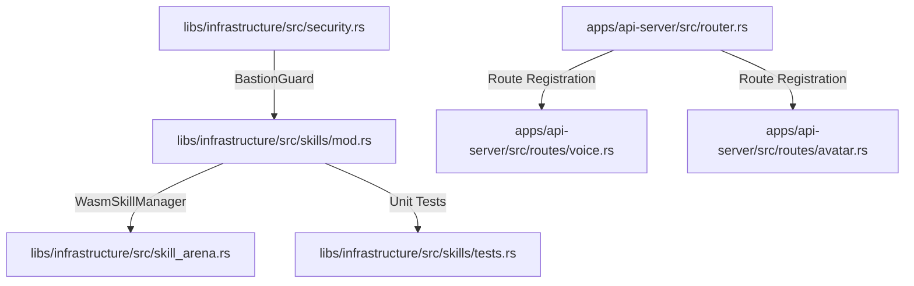
```mermaid
graph TD
    A[libs/infrastructure/src/security.rs] -->|BastionGuard| B[libs/infrastructure/src/skills/mod.rs]
    B -->|WasmSkillManager| C[libs/infrastructure/src/skill_arena.rs]
    B -->|Unit Tests| D[libs/infrastructure/src/skills/tests.rs]
    
    E[apps/api-server/src/router.rs] -->|Route Registration| F[apps/api-server/src/routes/voice.rs]
    E -->|Route Registration| G[apps/api-server/src/routes/avatar.rs]
```

## 2. 影響を受けるコンポーネント

### 🛡️ セキュリティ (security.rs)
- **変更内容**: `BastionGuard::safe_exec` に動的サンドボックス（gVisor/sandbox-exec）選択ロジックを追加。
- **波及効果**: 全てのシェル実行、WASMスキルのランタイム実行に影響。

### 🛠️ スキル管理 (skills/mod.rs)
- **変更内容**: `WasmSkillManager` がプロセス起動時に `BastionGuard` を介するように変更。
- **波及効果**: スキルの初期化、実行、バリデーションフローに影響。

### 🏟️ スキルアリーナ (skill_arena.rs)
- **変更内容**: なし（直接の変更は予定していないが、`WasmSkillManager` の動作変更によりテストが必要）。
- **確認事項**: 試合（Match）や評価（Evaluation）が制限された環境下で正しく動作するか。

### 🌐 API サーバー (router.rs)
- **変更内容**: ルーターを Public / Auth / High-Payload の3層に分離。`DefaultBodyLimit` を一部で無効化。
- **波及効果**: 全APIエンドポイントの認証・制限挙動に影響。

## 3. Phase 10 クリエイター機能の波及範囲

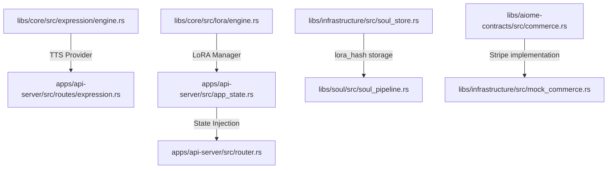
```mermaid
graph TD
    A[libs/core/src/expression/engine.rs] -->|TTS Provider| B[apps/api-server/src/routes/expression.rs]
    C[libs/core/src/lora/engine.rs] -->|LoRA Manager| D[apps/api-server/src/app_state.rs]
    D -->|State Injection| E[apps/api-server/src/router.rs]
    F[libs/infrastructure/src/soul_store.rs] -->|lora_hash storage| G[libs/soul/src/soul_pipeline.rs]
    H[libs/aiome-contracts/src/commerce.rs] -->|Stripe implementation| I[libs/infrastructure/src/mock_commerce.rs]
```

### 🎭 TTS / Expression (10.1a)
- **変更内容**: `ExpressionEngine` に TTS プロバイダー統合。
- **波及効果**: `routes/expression.rs`、UI の発話コンポーネントに影響。

### 🧠 LoRA / Soul (10.1b)
- **変更内容**: `LoraEngine` 新設、`SqliteSoulStore` スキーマ更新 (`lora_hash`)。
- **波及効果**: ソウル（人格）の生成・更新フロー、`AppState` 全体に影響。

### 💰 Voice DRM (10.2 / Expert Review Integrated)
- **変更内容**: 
    - `crypto.rs`: AES-256-GCM + Nonce 運用基盤の実装。
    - `abyss_voice_vault.rs`: `vault_keys` テーブルへの鍵永続化 (§CISO-1) とリストア実装。
    - `routes/voice.rs`: 暗号化パイプライン (100MB Limit) と Creator Auth (§SEC-4) 追加。
- **波及効果**: 
    - `main.rs`: `VoiceCoreDrm` の async 初期化に伴い起動フローが非同期化。
    - `router.rs`: `RequestBodyLimitLayer` によるメモリ DoS 防御の強化。
    - `contracts`: `VoiceKeyVault` trait の拡張。

### 🛡️ Voice DRM Expansion (Phase 11)
- **変更内容**:
    - `commerce_webhook.rs`: Stripe Webhook から `licenses` テーブルへの単一トランザクション化。
    - `registry.rs`: `licenses` 優先・Webhook フォールバックによる Dual-Read 所有権チェックと、Creator 所有判定の復元。
    - `audio_hasher.rs`: CSAM 検疫のための `tokio::task::spawn_blocking` を用いた音声ハッシュの実装とタイムアウト制御。
    - `abyss_voice_vault.rs`: `OnceCell` による Master Key 取得の遅延キャッシュ化。
    - `avatar-engine`: `LipSyncProvider` トレイトを新設し `VoiceKeyVault` から LipSync 責務を分離。
- **波及効果**:
    - `api_integration_tests.rs`: Voice DRM のラウンドトリップ（アップロード〜暗号化〜所有権検閲〜復号化）E2Eテストが追加され、システム全体の動作検証が確立。

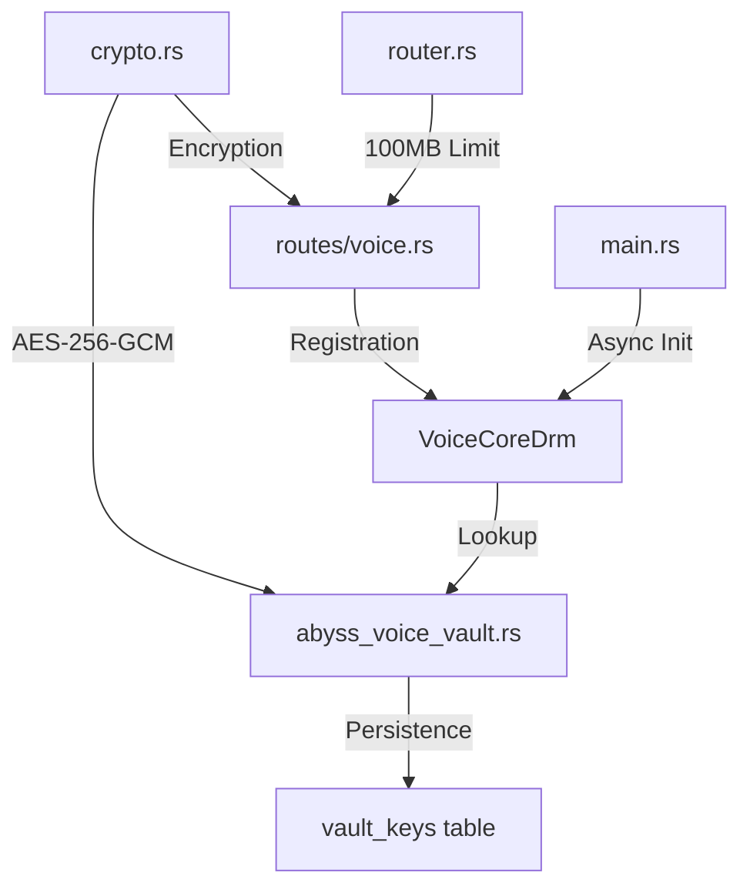
```mermaid
graph TD
    A[crypto.rs] -->|AES-256-GCM| B[abyss_voice_vault.rs]
    B -->|Persistence| C[vault_keys table]
    A -->|Encryption| D[routes/voice.rs]
    D -->|Registration| E[VoiceCoreDrm]
    E -->|Lookup| B
    F[main.rs] -->|Async Init| E
    G[router.rs] -->|100MB Limit| D
```

### 🛡️ EKYC Persistence & Inochi2D Sync (Phase 14)
- **変更内容**: 
    - `ekyc_store.rs`: `EkycSessionStore` (SQLite) によるセッション ID の永続化。
    - `ekyc.rs`: `client_reference_id` ベースの Stripe フィルタリング実装。
    - `stream.rs`: SSE `avatar_expression` に `physics_override` フィールド追加と Resonance ブーストロジック実装。
    - `inochi2d.rs`: `AssetType::Inochi2D` 登録と `PathSandbox` 適用。
- **波及効果**: 
    - `main.rs`: `STRIPE_API_KEY` の Release ビルドにおける強制チェック (Fail-safe) 導入。
    - `router.rs`: `jwt_auth_middleware` の Inochi2D アップロードへの適用。
    - `api_integration_tests.rs`: eKYC セッション永続化と Inochi2D 物理同期情報の検証パスが確立。

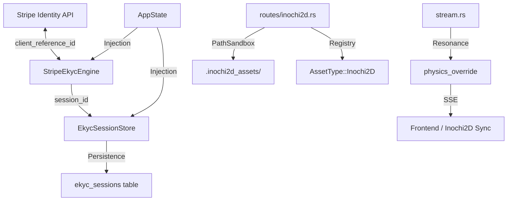
```mermaid
graph TD
    A[Stripe Identity API] <-->|client_reference_id| B[StripeEkycEngine]
    B -->|session_id| C[EkycSessionStore]
    C -->|Persistence| D[ekyc_sessions table]
    E[AppState] -->|Injection| B
    E -->|Injection| C
    F[stream.rs] -->|Resonance| G[physics_override]
    G -->|SSE| H[Frontend / Inochi2D Sync]
    I[routes/inochi2d.rs] -->|PathSandbox| J[.inochi2d_assets/]
    I -->|Registry| K[AssetType::Inochi2D]
```

### 🛡️ Phase 16: EKYC Endpoints & Revenue Splitter
- **変更内容**: 
    - `auth.rs`: JWT バリデーションに `ekyc_verified` クレームの抽出を追加。
    - `gift.rs` / `commerce.rs`: `auth.ekyc_verified` による 403 Forbidden 遮断ロジックの追加（未確認ユーザーの経済活動ブロック）。
    - `splitter.rs`: Stripe Webhook から呼び出される `RevenueSplitter::split_revenue` (80/20分配) の実装と `revenue_splits` テーブルへの書き込み。
    - `commerce_webhook.rs`: Webhook 受信時のトランザクション内で Revenue Splitting → License Granting を一貫実行。
    - `main.rs`: 起動時に環境変数 (`STRIPE_API_KEY`, `JWT_PRIVATE_KEY_B64`, `SEARCH_API_KEY` 等) を読み込み直後に `std::env::remove_var` で即時消去 (Zeroize) するセキュリティ強化。
- **波及効果**: 
    - ユーザーは eKYC 完了までギフト送信とアセット購入が不可能になる。
    - クリエイターとプラットフォームの売上分配が自動化され、データベーストランザクションにて一貫性が担保される。

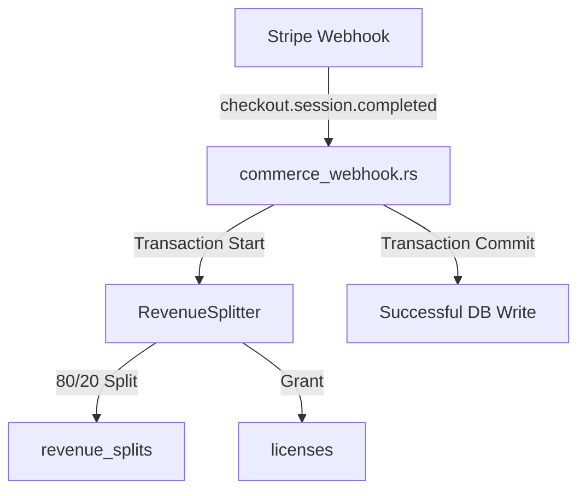
```mermaid
graph TD
    A[Stripe Webhook] -->|checkout.session.completed| B[commerce_webhook.rs]
    B -->|Transaction Start| C[RevenueSplitter]
    C -->|80/20 Split| D[revenue_splits]
    C -->|Grant| E[licenses]
    B -->|Transaction Commit| F[Successful DB Write]
```

### 🛡️ Phase 17: ArrowCanaria Fallback & Resilience
- **変更内容**: 
    - `fallback_router.rs`: `FallbackRouter` による LLM フェイルオーバーロジックの実装。
    - `circuit_breaker.rs`: プライマリ接続失敗時の遮断と自動復旧ロジック。
    - `main.rs`: `AppState` への `FallbackRouter` インジェクションと `bg_provider` の代替利用。
    - `AiomeConfig`: `Default` トレイトの実装によるテスト容易性の向上。
- **波及効果**: 
    - プライマリ LLM プロバイダーが停止しても、システムが「安全なデフォルト応答」または代替プロバイダー（Gemini 等）を使用して継続稼働可能になる。
    - `api-server` の全チャット・自律タスクの可用性が大幅に向上。

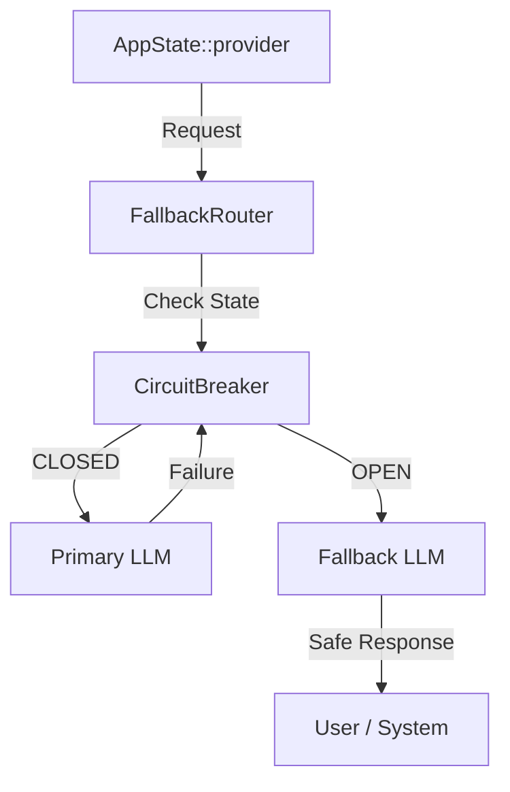
```mermaid
graph TD
    A[AppState::provider] -->|Request| B[FallbackRouter]
    B -->|Check State| C[CircuitBreaker]
    C -->|CLOSED| D[Primary LLM]
    C -->|OPEN| E[Fallback LLM]
    D -->|Failure| C
    E -->|Safe Response| F[User / System]
```

### 🛡️ Phase 17 Enhancement: Gaps G-1 & G-2 Remediation
- **変更内容**: 
    - `health.rs` / `general.rs`: `ResourceStatus` に `llm_circuit_breaker` を追加し、ヘルスチェック API でサーキットブレーカーの状態を公開 (Gap G-1)。
    - `rate_limiter.rs` / `auth.rs`: `governor` によるエージェント別レート制限の実装と認証ミドルウェアへの統合 (Gap G-2)。
- **波及効果**: 
    - LLM のフェイルオーバー状態を外部監視システムから検知可能になる。
    - エージェント毎のリクエスト頻度が制限され、DoS 攻撃や予期せぬループ消費のリスクが低減。

### 🛡️ Phase 20: AI Gig Engine (The Immutable Gateway)
- **変更内容**: 
    - `gig_engine.rs`: `SqliteGigEngine` による AI 受発注プロトコルの実装。
    - `gig.rs`: `AcceptanceCriteria`, `GigIntent`, `GigBid` 等のプロトコル型の定義。
    - `commerce.rs`: `escrow_release`, `escrow_refund` への対応。
    - `verification_logs`: 検証履歴の永続化。
    - `PathSandbox`: `deliver` 時に成果物パスの安全性を検証 (G-22)。
- **波及効果**: 
    - エージェント間の自律的な商取引（ギグ・エコノミー）が可能になる。
    - 納品物の自動検証と、不適合時の自動返金/スラッシュによる Immutable な契約履行が担保される。
    - `api-server` の AppState に `GigEngine` が注入され、全エージェントが利用可能になる。

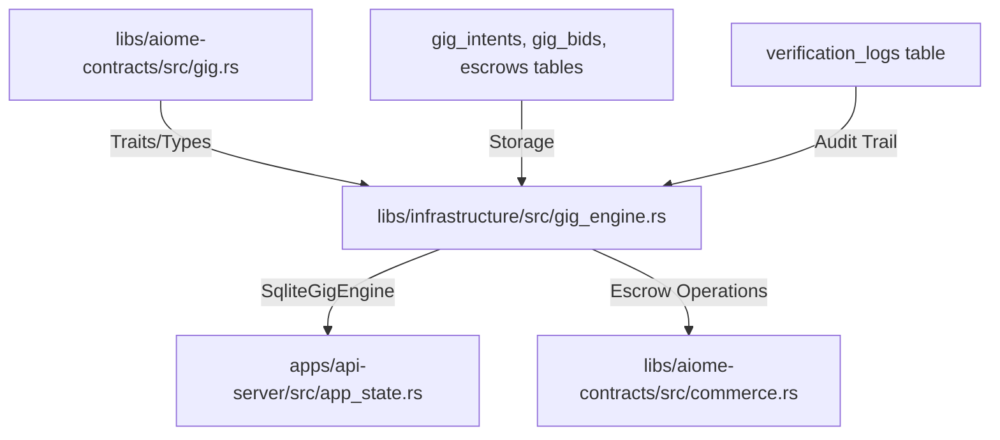
```mermaid
graph TD
    A[libs/infrastructure/src/gig_engine.rs] -->|SqliteGigEngine| B[apps/api-server/src/app_state.rs]
    A -->|Escrow Operations| C[libs/aiome-contracts/src/commerce.rs]
    D[libs/aiome-contracts/src/gig.rs] -->|Traits/Types| A
    E[gig_intents, gig_bids, escrows tables] -->|Storage| A
    F[verification_logs table] -->|Audit Trail| A
```

### 🛡️ Phase 20.1: Gig API & Gap Remediation
- **変更内容**: 
    - `gig.rs`: 新規 API エンドポイントの実装。
    - `router.rs`: `/api/v1/gig/*` の登録とレート制限の適用。
    - `app_state.rs`: `gig_engine` コンポーネントの保持。
    - `main.rs`: `SqliteGigEngine` の初期化と LlmProvider の注入。
    - `gig_engine.rs`: `OracleJudge` における `LlmProvider` を活用した自律検証ロジックの実装。
- **波及効果**: 
    - `api_integration_tests.rs`: `MockGigEngine` と E2E テストの追加。
    - `gig_engine.rs`: `new()` シグネチャ変更による全初期化箇所の修正。

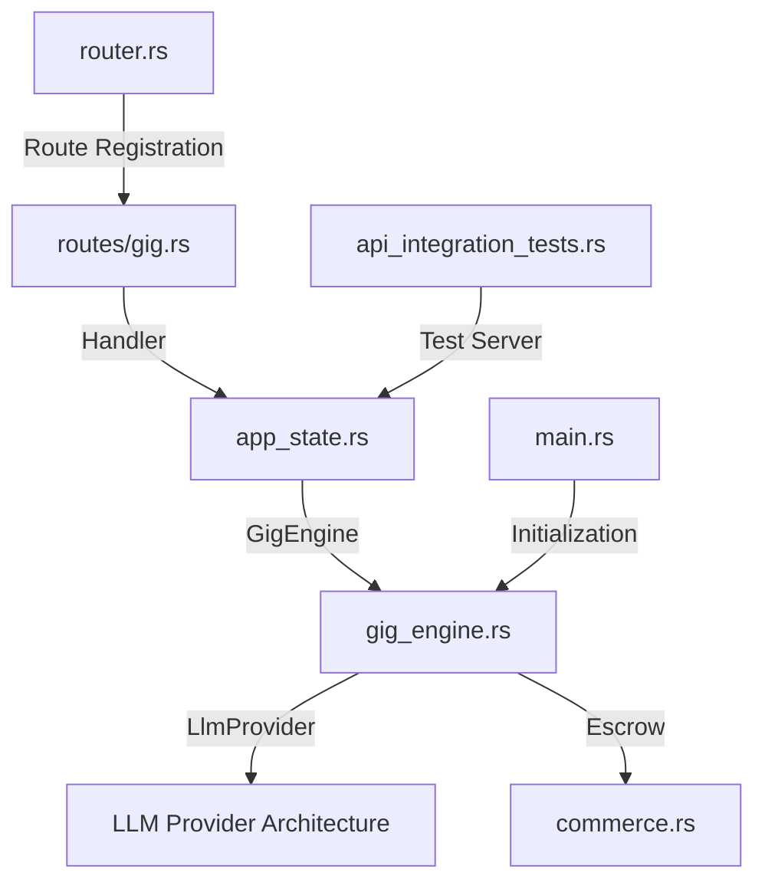
```mermaid
graph TD
    A[routes/gig.rs] -->|Handler| B[app_state.rs]
    B -->|GigEngine| C[gig_engine.rs]
    C -->|LlmProvider| L[LLM Provider Architecture]
    C -->|Escrow| D[commerce.rs]
    E[router.rs] -->|Route Registration| A
    F[main.rs] -->|Initialization| C
    G[api_integration_tests.rs] -->|Test Server| B
```

### 📊 Trend Sonar Refactoring (Multi-Source Support)
- **変更内容**: 
    - `trend_sonar.rs`: `TrendAdapter` トレイトの導入と `ExternalTrendSonar` のマルチアダプタ化。
    - `rss_collector.rs`: `TrendAdapter` 実装による統合。
    - `main.rs`: 起動時の複数アダプタ初期化と `trend_sonar` インスタンスの共有化。
    - `dream_state.rs`: `ExternalTrendSonar` シグネチャ変更に伴うテストコードの修正。
- **波及効果**: 
    - トレンド収集元（Web検索, RSS等）が抽象化され、今後のデータソース追加が容易になる。
    - `BackgroundWorker` と `DreamState` で同一のトレンド収集基盤を共有することで、動作の一貫性が向上。
    - `sanitize_snippet` による外部データの入力バリデーションが強化される。

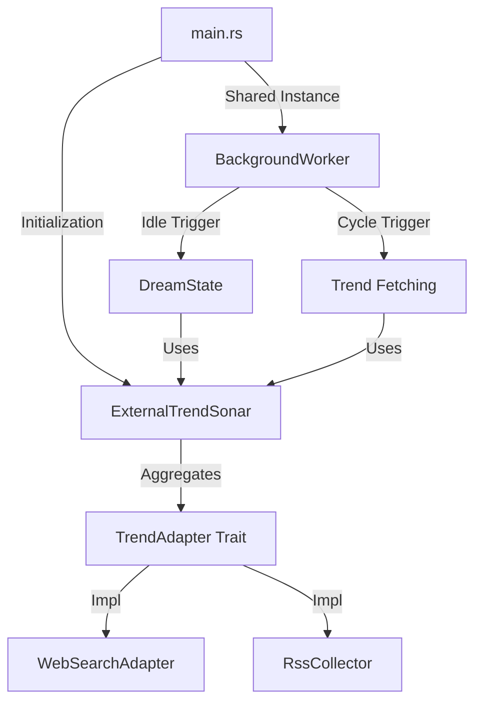
```mermaid
graph TD
    A[main.rs] -->|Initialization| B[ExternalTrendSonar]
    B -->|Aggregates| C[TrendAdapter Trait]
    C -->|Impl| D[WebSearchAdapter]
    C -->|Impl| E[RssCollector]
    A -->|Shared Instance| F[BackgroundWorker]
    F -->|Idle Trigger| G[DreamState]
    G -->|Uses| B
    F -->|Cycle Trigger| H[Trend Fetching]
    H -->|Uses| B
```

---
*最終更新日: 2026-03-22* (Trend Sonar Refactoring Integration)
### 🛡️ Gig Engine & Federated Metrics (Phase 22 / 23)
- **変更内容**: 
    - `gig_engine.rs`: `SqliteGigEngine` 実装。`PathSandbox` によるパスバリデーション (§G-22)。
    - `job_queue/federation.rs`: `FederationOps` に `fetch_federated_metrics` 追加。`AgentStats` 型パス修正。
    - `contracts.rs` / `types.rs`: `FederatedMetrics` / `JobMetrics` / `KarmaMetrics` 定義。`FederationPushRequest` 拡張 (§G-23)。
    - `rss_collector.rs`: `sanitize_snippet` によるタイトルサニタイズ (§G-Security)。
    - `trend_sonar.rs`: `ExternalTrendSonar` に `LlmProvider` 統合 (Oracle Mode)。
    - `general.rs`: `/api/v1/logs` / `/api/v1/audit/*` への System Agent 認証強制 (§G-Log)。
- **波及効果**: 
    - `main.rs`: `TrendSonar` の初期化フロー（LLM プロバイダー注入）と、バックグラウンドワーカーのメトリクス収集ループの有効化。
    - `samsara-hub`: 受信側ノードにおける `federated_metrics` テーブルの作成と、パッシブメトリクス蓄積。
    - `api_integration_tests.rs`: Gig Lifecycle とパスバリデーション、フェデレーションメトリクスの検証パスが追加。

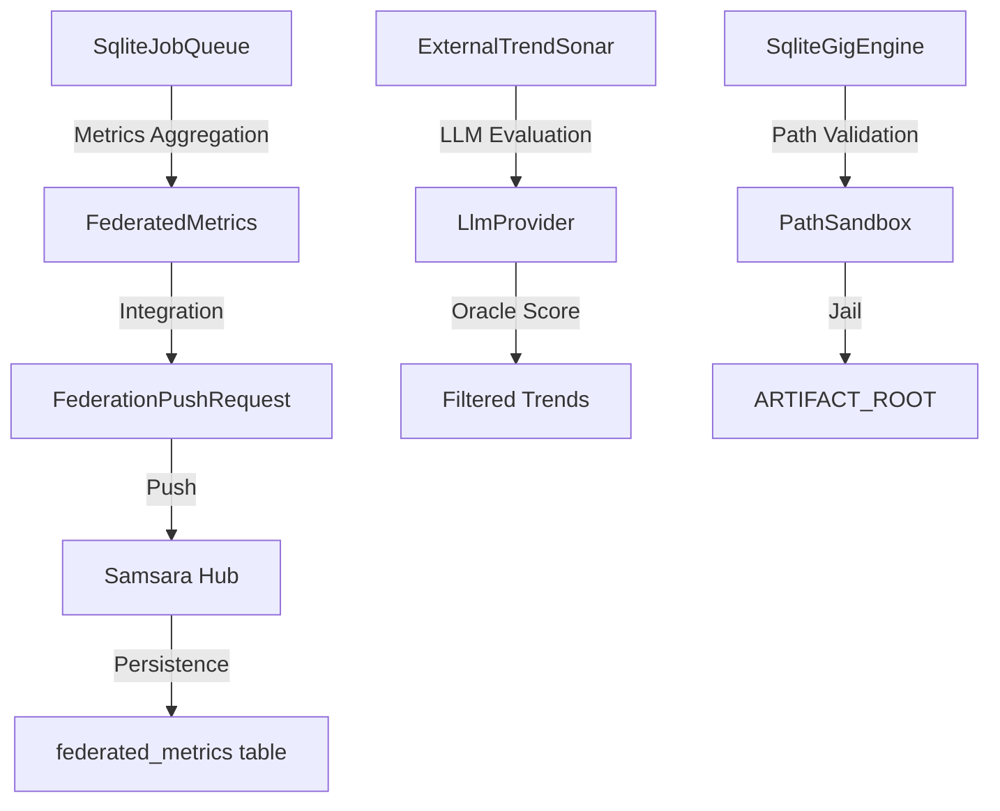
```mermaid
graph TD
    A[SqliteJobQueue] -->|Metrics Aggregation| B[FederatedMetrics]
    B -->|Integration| C[FederationPushRequest]
    C -->|Push| D[Samsara Hub]
    D -->|Persistence| E[federated_metrics table]
    
    F[ExternalTrendSonar] -->|LLM Evaluation| G[LlmProvider]
    G -->|Oracle Score| H[Filtered Trends]
    
    I[SqliteGigEngine] -->|Path Validation| J[PathSandbox]
    J -->|Jail| K[ARTIFACT_ROOT]
```

### 💎 AgentSense MVP (Phase 24)
- **変更内容**: 
    - `treasure.rs`: `TreasureItem`, `TreasureFeedback` 定義。`get_treasure`, `record_feedback` ハンドラ実装。
    - `affiliate_adapter.rs`: `AffiliateAdapter` 新設（アフィリエイト/ギグ案件の取得抽象化）。
    - `intent/mod.rs`: `IntentGenerator::generate_for_agent` 実装。`SoulStore` を注入し、エージェントの愛着スタイル（Soul State）に基づいたパーソナライズを実施 (§G-26)。
    - `soul_store.rs`: `SqliteSoulStore` に `SoulStore` トレイトを実装し、インテント生成側へ公開。
    - `TreasureBox.tsx`: フロント端での推薦表示とフィードバック送信 UI の実装 (§G-25)。
    - `app_state.rs`: `affiliate_adapter` と `soul_store` コンポーネントの追加。
    - `router.rs`: `/api/v1/treasure` 系のルート登録と JWT 認証適用。
- **波及効果**: 
    - エージェントが自身の魂の状態（Attachment Style）に基づいたパーソナライズされた案件を受け取ることが可能になる。
    - ユーザーのインタラクションが Resonance として還元され、エージェントの成長サイクルが循環する。
    - `api_integration_tests.rs`: 推薦取得 〜 推薦内容の魂連動性の検証 〜 フィードバック送信 〜 報酬還元のフルループ E2E テストが確立。

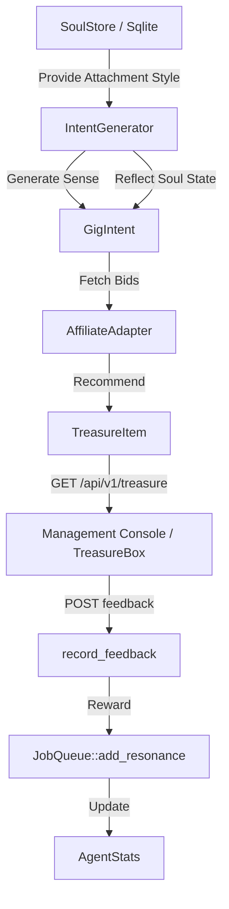
```mermaid
graph TD
    A[IntentGenerator] -->|Generate Sense| B[GigIntent]
    S[SoulStore / Sqlite] -->|Provide Attachment Style| A
    A -->|Reflect Soul State| B
    B -->|Fetch Bids| C[AffiliateAdapter]
    C -->|Recommend| D[TreasureItem]
    D -->|GET /api/v1/treasure| E[Management Console / TreasureBox]
    E -->|POST feedback| F[record_feedback]
    F -->|Reward| G[JobQueue::add_resonance]
    G -->|Update| H[AgentStats]
```

---
*最終更新日: 2026-03-22* (AgentSense MVP & Security Hardening Integration)

### 🛡️ Unified Safety & AI Code Review (G-21 / G-22)
- **変更内容**: 
    - `libs/core/src/security_impl.rs`: `purge_entities` による統合サニタイズ基盤の実装 (§G-21)。
    - `libs/infrastructure/src/skills/cleanroom.rs`: `audit_source_code` による WASM スキルの AI コードレビュー (§G-22)。
    - `libs/infrastructure/src/trend_sonar.rs`: `purge_entities` への移行。
- **波及効果**: 
    - 全ての外部入力（RSS, LLM 出力, スキルコード）に対する安全性が向上。
    - スキルインポート時に LLM による静的/動的解析に近いセキュリティチェックが強制される。

### 📊 Periodic Federated Metrics (G-23)
- **変更内容**: 
    - `apps/api-server/src/main.rs`: 1時間おきのメトリクス Push ループの実装。
    - `libs/infrastructure/src/job_queue/federation.rs`: `do_push_federated_metrics` の具象化と Hub への送信ロジック。
- **波及効果**: 
    - Samsara Hub におけるフェデレーション全体の稼働状況の可視化が自動化。
    - 各ノードの健全性と成長度が自律的に報告されるエコノミー基盤が確立。

### 🔧 Autonomous Demo — SQLite ロック回避 (Phase 25.5 / ADR-014)
- **変更内容**: 
    - `apps/api-server/src/autonomous_demo.rs`: 全面書き換え。`gig_engine` の trait メソッド（`accept_bid`, `deliver`, `verify_and_settle`）を排除し、個別 SQL クエリによるトランザクションレス方式に移行。
    - `libs/infrastructure/src/job_queue/migrations.rs`: audit trigger の初期化順序修正（テーブル作成前に移動）、`DROP TRIGGER IF EXISTS` 追加。
    - `docs/decisions/014-sqlite-pool-exhaustion-demo-strategy.md`: 新規 ADR。本番環境への PostgreSQL 移行計画を含む。
- **波及効果**: 
    - デモ実行中は gig 関連テーブル（`gig_intents`, `gig_bids`, `escrows`, `gig_deliveries`, `verification_logs`）の audit trigger が一時停止 → 監査ログに欠損が生じる（デモ限定）。
    - `gig_engine.rs` のスキーマ変更時、`autonomous_demo.rs` のインライン SQL も手動更新が必要（デュアルメンテナンス）。
    - **本番運用向け**: PostgreSQL 移行、非同期 Audit Logging、SSE 接続共有を将来計画として明文化。

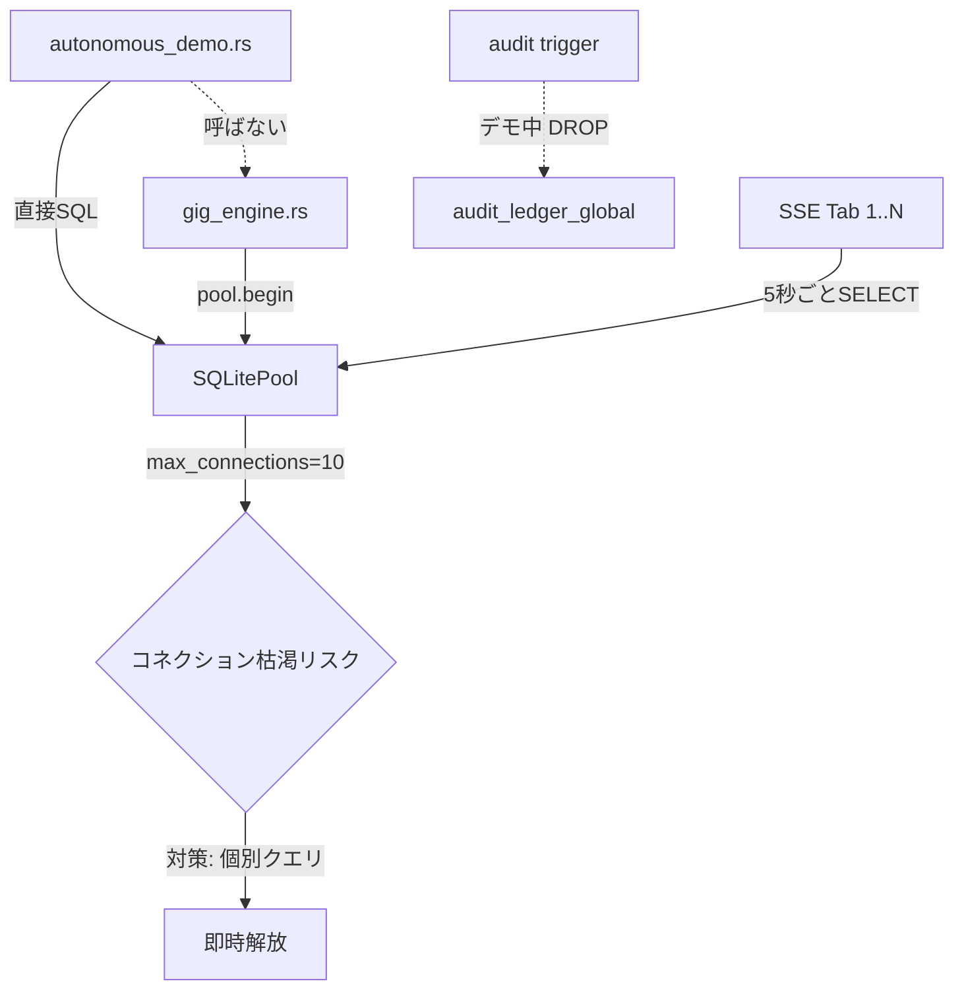
```mermaid
graph TD
    A[autonomous_demo.rs] -->|直接SQL| B[SQLitePool]
    A -.->|呼ばない| C[gig_engine.rs]
    C -->|pool.begin| B
    D[SSE Tab 1..N] -->|5秒ごとSELECT| B
    E[audit trigger] -.->|デモ中 DROP| F[audit_ledger_global]
    B -->|max_connections=10| G{コネクション枯渇リスク}
    G -->|対策: 個別クエリ| H[即時解放]
```

---
*最終更新日: 2026-03-23* (Phase 25.5 / ADR-014 SQLite Lock Resolution)

### 🛡️ Phase 26: AI Writing Enhancement
- **変更内容**: 
    - `writing_context.rs`: 出力先ごとの文体コンテキストを定義。
    - `humanizer_rules.rs`: 日本語に特化したAIくささ除去ルールを定義。
    - `humanizer_filter.rs`: `LlmProvider` デコレータパターンによるルール適用のミドルウェア実装。
    - `main.rs`: `router_provider` を `HumanizerFilter` でラップし、API サーバー内の全 LLM 応答にフィルタを適用。
- **波及効果**: 
    - LLM のチャット出力や生成されるテキストから「お役に立てれば幸いです」等の冗長な定型句が除去され、自然な文体になる。
    - `LlmProvider` を使用する全てのコンポーネントに自動適用される。

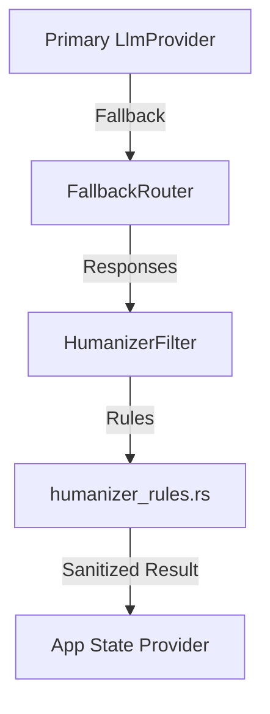
```mermaid
graph TD
    A[Primary LlmProvider] -->|Fallback| B[FallbackRouter]
    B -->|Responses| C[HumanizerFilter]
    C -->|Rules| D[humanizer_rules.rs]
    D -->|Sanitized Result| E[App State Provider]
```
---
*最終更新日: 2026-03-23* (Phase 27 Security Hardening & Architecture Audit)

### 🛡️ Phase 27: Security Hardening (Mock Isolation)
- **変更内容**: 
    - `libs/infrastructure/src/auth.rs`, `commerce_mock.rs`, `compliance/ekyc.rs`, `compliance/ekyc_store.rs`, `compliance/quarantine.rs`, `publisher/mock_x.rs`, `test_utils.rs`: 全てのモック型・実装に `#[cfg(any(test, debug_assertions))]` を付与。
    - `libs/infrastructure/src/lib.rs`, `compliance/mod.rs`, `publisher/mod.rs`: モックモジュールの再エクスポートを `#[cfg]` で条件付き化。
    - `apps/api-server/src/main.rs`: `if cfg!(debug_assertions)` による実行時分岐を `#[cfg(debug_assertions)]` によるコンパイル時分岐へ置換。環境変数未設定時は `panic!` または `std::process::exit(1)` で強制停止 (§SEC-FailFast)。
- **波及効果**: 
    - リリース用バイナリからテスト用モックコードが完全に排除され、攻撃表面が縮小。
    - リリースビルド時、環境変数が欠如している場合に実行時に即座に異常終了するため、誤設定による未認証状態での稼働を防止。
    - `cargo check --release` を CI/CD パイプラインに含めることが必須となる（型の欠落検知のため）。

```mermaid
graph TD
    A[Cargo build --release] -->|Skip| B[Mock Impls]
    C[api-server/main.rs] -->|#[cfg(not(debug))]| D[Secure Impls Only]
    D -->|Env Missing| E[Panic/Exit 1]
    F[Infrastructure Lib] -->|Symbol Tree| G[Clean Release Binary]
    H[ADR-015..018] -->|Policy| C
```
### 🛡️ Phase 28: Security Hardening & LRU Cache (ADR-019 Phase B)
- **変更内容**: 
    - `sqlite_vault_backend.rs`: `lru::LruCache` と `MlockedVec` を組み合わせた高セキュリティな DEK キャッシュの実装。
    - `main.rs`: `commerce_engine` と `TcpListener` のエラー処理における `.expect()` / `.unwrap()` の厳格化。
    - `job_queue` / `infrastructure`: 公開アイテムへのドキュメント追加によるコンパイラ警告の完全解消。
- **波及効果**: 
    - Vault への頻繁な DEK 取得要求がキャッシュで処理され、性能が向上しつつ `MlockedVec` によりメモリ上の安全性も担保される。
    - 開発および本番環境でのエラーログがより詳細になり、トラブルシューティングが容易になる。
    - `lru` クレイトが新しいワークスペース依存関係として追加。

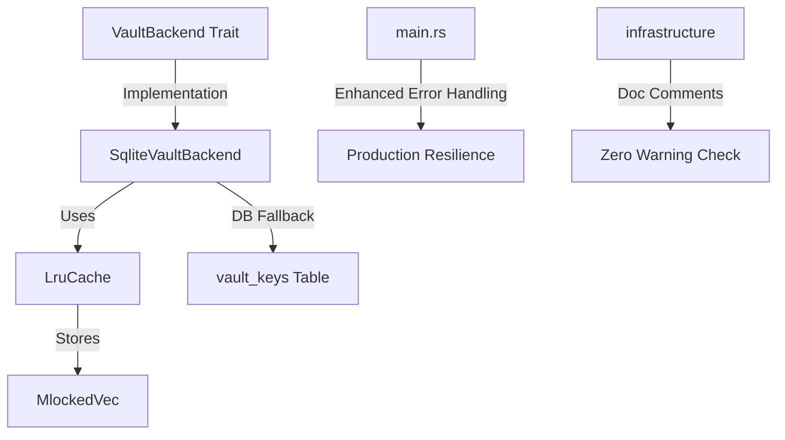
```mermaid
graph TD
    A[VaultBackend Trait] -->|Implementation| B[SqliteVaultBackend]
    B -->|Uses| C[LruCache]
    C -->|Stores| D[MlockedVec]
    B -->|DB Fallback| E[vault_keys Table]
    F[main.rs] -->|Enhanced Error Handling| G[Production Resilience]
    H[infrastructure] -->|Doc Comments| I[Zero Warning Check]
```
### 🛡️ Phase 31: Reliability & LLM TDD Implementation
- **変更内容**: 
    - `infrastructure/db.rs`: `DatabasePool` に安全なゲッター導入。
    - `contracts/llm.rs`: `LlmRequest` に `format` フィールド追加。
    - `core/llm_provider.rs`: Ollama での動的 JSON モード実装と `#[ignore]` テストの復活。
    - `api-server`: ルーター層の `unwrap()` を安全なゲッターに置換。
- **波及効果**: 
    - アプリケーション全体のパニック耐性が向上。
    - LLM プロバイダーの利用側で、JSON などの構造化出力を明示的に要求可能になり、パースエラーが減少。
    - Ollama 使用時のテストカバレッジが 100% へ回復。

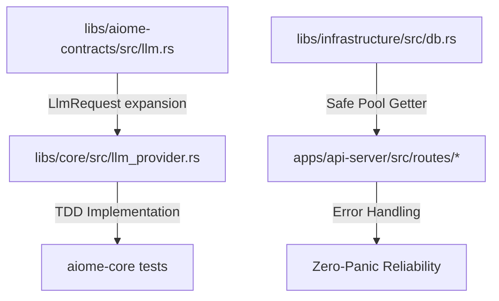
```mermaid
graph TD
    A[libs/aiome-contracts/src/llm.rs] -->|LlmRequest expansion| B[libs/core/src/llm_provider.rs]
    B -->|TDD Implementation| C[aiome-core tests]
    D[libs/infrastructure/src/db.rs] -->|Safe Pool Getter| E[apps/api-server/src/routes/*]
    E -->|Error Handling| F[Zero-Panic Reliability]
```

### 🛡️ Phase 35: PostgreSQL 移行 & デュアルDB検証
- **変更内容**: 
    - `api-server` & `samsara-hub`: PostgreSQL 接続・マイグレーション・Audit Trigger の対応。
    - `sqlite_migrations/20260324000000_init.sql`: `agent_diagnoses` スキーマを同期修正し、`trajectory_store.rs` との差異を解消。
    - `commerce/gift.rs`: SQLite における `COALESCE(SUM(..), 0.0)` の戻り値型 (f64/REAL) の厳密な方言吸収。
- **波及効果**: 
    - `api_integration_tests.rs` を含む全統合テスト(86/86)が、SQLite および PostgreSQL の両環境下で透過的に 100% PASS を達成。

---
*最終更新日: 2026-03-24* (Phase 35 / Dual DB Integration)

### 🛡️ Phase 36: Security Hardening & AgentHook
- **変更内容**: 
    - `security.rs`: `BastionGuard::safe_exec_with_profile` に `SandboxProfile` ベースの粒度制御を追加。
    - `security/hook_manager.rs`: `HookManager` による `AgentHook` の一元管理。`on_pre_execute` / `on_post_execute` トリガー。
    - `security/behavior_monitor.rs`: `BehaviorMonitor` — LLM 呼び出し前後のリクエスト数制限とスロットリング。
    - `user_learner.rs`: `AgentHook` トレイト実装。`on_post_execute` から `learn_from_session` を自律起動。
    - `skills/cleanroom.rs`: 多層サンドボックス（imports 検疫 → AI コードレビュー → gVisor 実行）の強化。
- **波及効果**: 
    - `DynamicLlmProvider` が `HookManager` を保持し、全 LLM 呼び出しに pre/post フックが適用される。
    - `SkillForge` のビルドプロセスで `BastionGuard::safe_exec_with_profile(WasmBuild)` が強制適用。
    - エージェントが会話を重ねるごとに `USER.md` が自動学習更新される適応サイクルが確立。

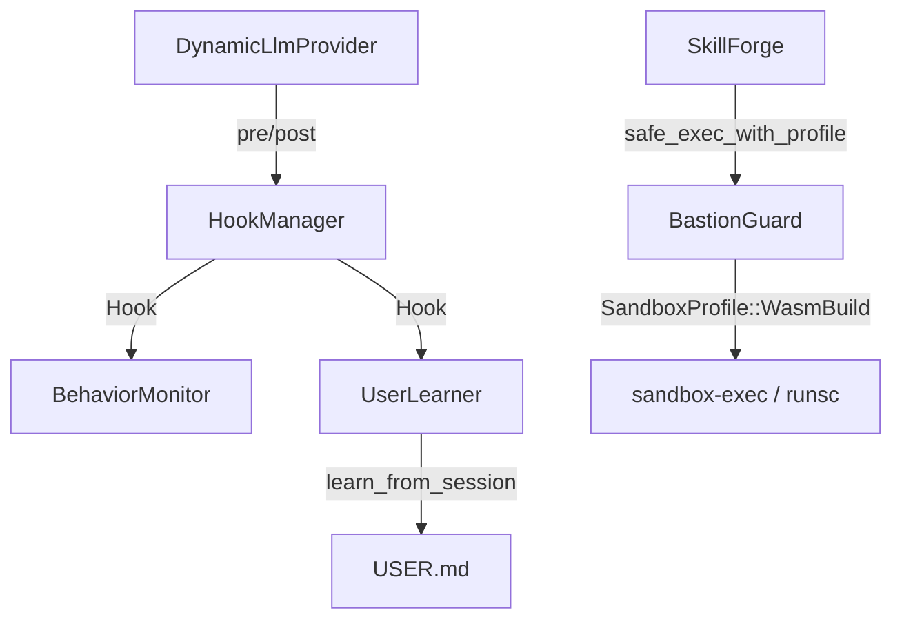
```mermaid
graph TD
    A[DynamicLlmProvider] -->|pre/post| B[HookManager]
    B -->|Hook| C[BehaviorMonitor]
    B -->|Hook| D[UserLearner]
    D -->|learn_from_session| E[USER.md]
    F[SkillForge] -->|safe_exec_with_profile| G[BastionGuard]
    G -->|SandboxProfile::WasmBuild| H[sandbox-exec / runsc]
```

### 🛡️ Phase 36.5: gVisor Sandbox & CSAM Pipeline
- **変更内容**: 
    - `security.rs` (contracts): `SandboxProfile` enum (Default, PythonForge, WasmRun, WasmBuild, ForgeBuild, Strict)。
    - `security.rs` (infrastructure): `BastionGuard` の async 化、`security_zombie` による 60 秒タイムアウト制御。
    - `avatar.rs` (api-server): `ProportionsChecker::extract_from_binary` によるバイナリベース CSAM 判定の統合。
    - `commerce.rs` (contracts): `CommerceEngine` にサブスクリプション管理メソッド追加 (`create_subscription`, `cancel_subscription`, `get_subscription_status`)。`SubscriptionStatus` enum 新設。
    - `llm/whisper_middleware.rs` (infrastructure): `WhisperMiddleware` — SoulPipeline L2.5 層の新規実装。
- **波及効果**: 
    - `MockCommerceEngine` / `StripeCommerceEngine` にサブスクリプション対応が必要（実装済み）。
    - `core/commerce.rs` が `SubscriptionStatus` を再エクスポート。
    - `SoulPipeline::new()` への `WhisperMiddleware` 登録は Phase 37a で実施予定。

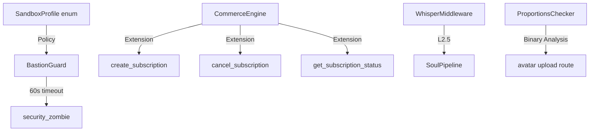
```mermaid
graph TD
    A[SandboxProfile enum] -->|Policy| B[BastionGuard]
    B -->|60s timeout| C[security_zombie]
    D[CommerceEngine] -->|Extension| E[create_subscription]
    D -->|Extension| F[cancel_subscription]
    D -->|Extension| G[get_subscription_status]
    H[WhisperMiddleware] -->|L2.5| I[SoulPipeline]
    J[ProportionsChecker] -->|Binary Analysis| K[avatar upload route]
```

### 🛡️ Phase 37a: Stripe Subscription & Pipeline Evolution
- **変更内容**: 
    - `commerce/stripe.rs` (infrastructure): `StripeCommerceEngine` 実機実装における `create_subscription`, `cancel_subscription`, `get_subscription_status` 追加。
    - `commerce/stripe.rs` (infrastructure): `sk_test_mock` 判定を用いた CI 向けの `is_mock` バイパスモード実装。
    - `soul/pipeline.rs`: `SoulPipeline` 内の `push_experience` 呼び出し順序をミドルウェア群の最後尾へ移動。
    - `soul/pipeline.rs`: `SoulPipeline::add_middleware` の追加と動的ミドルウェア注入サポート。
    - `infrastructure/tests`: `BastionGuard::safe_exec` 等の async 化に伴う 20+ 個のテスト呼び出し `await` 化。
- **波及効果**: 
    - `SoulPipeline` の評価順序変更により、`WhisperMiddleware` を含む全ミドルウェアによる操作（`inner_thoughts` の追記など）が確実に永続化されるようになった（事実の欠落防止）。
    - API Server 内で、デバッグ時やE2Eテスト時に Stripe 環境変数へ `sk_test_mock` を渡すだけで安全にモック実行が可能に（冪等性の確保）。
    - ワークスペース全体の単体テスト実行 (`cargo test`) でエラーゼロが保証された。

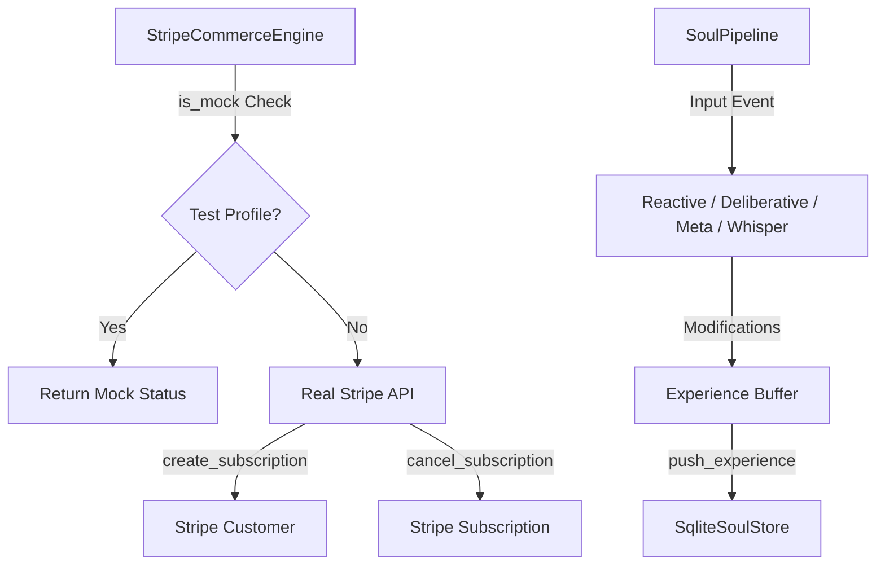
```mermaid
graph TD
    A[StripeCommerceEngine] -->|is_mock Check| B{Test Profile?}
    B -->|Yes| C[Return Mock Status]
    B -->|No| D[Real Stripe API]
    D -->|create_subscription| E[Stripe Customer]
    D -->|cancel_subscription| F[Stripe Subscription]
    
    G[SoulPipeline] -->|Input Event| H[Reactive / Deliberative / Meta / Whisper]
    H -->|Modifications| I[Experience Buffer]
    I -->|push_experience| J[SqliteSoulStore]
```

### 🎙️ STT Integration (Phase 38b)
- **変更内容**: `TranscriptionEngine` トレイト、および `WhisperTranscriptionAdapter` を `infrastructure` に追加。
- **波及効果**: 
    - `aiome-contracts/traits.rs`: `TranscriptionEngine` 定義。
    - `avatar-engine/lip_sync.rs`: `LipSyncFrame::from_segment` 追加により、音声文字起こし結果からの口パク生成が可能。
    - `api-server/app_state.rs`: `TranscriptionEngine` のインスタンスを保持し、MCP ツールとして公開。

---
*最終更新日: 2026-03-25* (Phase 38b / STT Integration)

### 🛡️ Phase 42: Multi-Agent Orchestration Evolution
- **変更内容**: 
    - `task_orchestrator.rs`: `TaskEvent` トレイト、`TaskConductor` トレイト、および `TaskDispatcher` による自律イベントディスパッチの実装。
    - `oss_orchestrator.rs`: 既存の `OssIntegrationOrchestrator` を `TaskConductor` に適合させ、非同期イベントストリームによる進捗通知機能（SSE Ready）を追加。
- **波及効果**: 
    - モノリシックだった自律型インテグレーション・プロセスが、細粒度で可観測性の高いイベント駆動バックグラウンドタスクへ分離。
    - バックグラウンド実行の進行状況を `tokio::sync::broadcast` により複数クライアント（UI、CLI等）へリアルタイムにプッシュするためのアーキテクチャ基盤が完成。

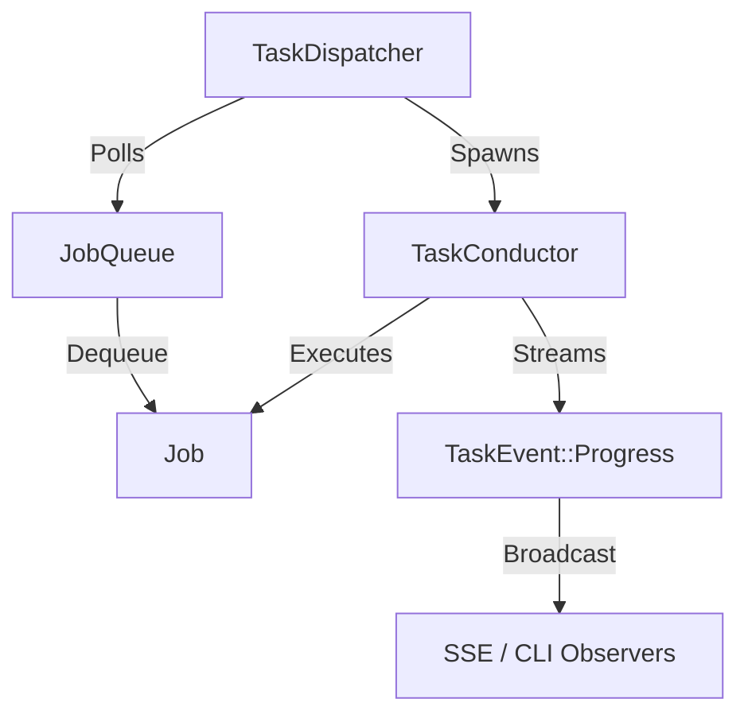
```mermaid
graph TD
    A[TaskDispatcher] -->|Polls| B[JobQueue]
    B -->|Dequeue| C[Job]
    A -->|Spawns| D[TaskConductor]
    D -->|Executes| C
    D -->|Streams| E[TaskEvent::Progress]
    E -->|Broadcast| F[SSE / CLI Observers]
```

---
### 🛡️ Phase 5: Gemini Interactions API Integration
- **変更内容**: 
    - `interactions.rs`: Gemini Interactions API プロバイダーの実装。
    - `contracts/trajectory.rs`: `TrajectoryStep` への `interaction_id` 追加。
    - `contracts/llm.rs`: `LlmRequest` / `LlmResponse` への `metadata` / `reasoning` 追加。
    - `trajectory_store.rs`: DB 永続化ロジックの更新。
- **波及効果**: 
    - `dynamic.rs`, `fallback_router.rs`, `semantic_cache.rs`, `planner.rs` 等、LLM リクエスト/レスポンスを扱う全てのコンポーネントで初期化コードの修正（Ripple Effect）が発生。
    - `ContextEngine` がセッション ID を追跡可能になり、ハイブリッド履歴管理が確立。

```mermaid
graph TD
    A[interactions.rs] -->|Provider| B[DynamicLlmProvider]
    B -->|Request/Response| C[contracts/llm.rs]
    C -->|Ripple| D[semantic_cache.rs]
    C -->|Ripple| E[fallback_router.rs]
    F[trajectory_store.rs] -->|Persistence| G[interaction_id]
```

---
*最終更新日: 2026-03-26* (Phase 5 Foundation Integration)

### 👥 Phase 43: Shadow Clone × Cmux Integration
- **変更内容**: 
    - `infrastructure/docker_conductor.rs`: `TaskConductor` の新規実装。5層防御（セマフォ、課金、Bastion、タイムアウト、浄化）の統合。
    - `infrastructure/task_orchestrator.rs`: `TaskEvent` への `conductor_id` 追加。
    - `api-server/routes/agent.rs`: `[DelegateDocker]` 処理を `JobQueue` を用いた完全非同期ディスパッチへ移行。
    - `api-server/app_state.rs` & `main.rs`: `TaskDispatcher` の初期化、`DockerConductor` の登録、およびグレースフルシャットダウン用 `CancellationToken` のバインド。
    - `api-server/stream.rs`: `CoreEvent` に `TaskProgress/Completed/Failed` を追加し、SSE 配信を実現。
- **波及効果**: 
    - LLM 応答のブロッキングが解消され、バックグラウンドでの影分身実行が可観測な状態で運用可能に。
    - `api_integration_tests.rs` における `AppState` の初期化不整合を解消。

```mermaid
graph TD
    A[Agent Chat Loop] -->|Async Enqueue| B[JobQueue]
    B -->|TaskDispatcher| C[DockerConductor]
    C -->|Execute| D[BastionGuard / runsc]
    C -->|Progress Event| E[TaskDispatcher Loop]
    E -->|CoreEvent| F[SSE Stream]
    F -->|Real-time UI| G[Cmux Frontend]
```

### 🛡️ Phase 44: Job Control & Task History
- **変更内容**: 
    - `task_orchestrator.rs`: `TaskDispatcher` に `active_jobs` (CancellationToken) 管理を追加。
    - `docker_conductor.rs`: `cancel` メソッドの実装と確定的コンテナクリーンアップの実装。
    - `routes/jobs.rs`: ジョブ管理エンドポイント（Cancel / Logs）の新規実装。
    - `job_queue/core_ops.rs`: `do_cancel_job` における存在確認の厳格化。
- **波及効果**: 
    - ユーザーがフロントエンドから実行中の影分身を任意に停止・監視可能になる。
    - 不正なジョブ ID や完了済みのジョブに対する操作が適切に 404/400 エラーとして処理される。

```mermaid
graph TD
    A[API Server / jobs.rs] -->|Cancel Signal| B[TaskDispatcher]
    B -->|CancellationToken| C[Async Task Loop]
    B -->|Conductor::cancel| D[DockerConductor]
    D -->|Docker CLI| E[Container Cleanup]
    A -->|Fetch Logs| F[JobQueue]
    F -->|Query| G[jobs Table]
```
### 👥 Phase 14: Syndicate L3 (Agent Guild) MVP
- **変更内容**: 
    - `syndicate_store.rs`: `SqliteSyndicateStore` によるギルド・メンバー管理の実装。
    - `routes/syndicate.rs`: ギルド管理 API の実装。
    - `router.rs`: `/api/v1/syndicate/guilds` のルーティング。
    - `main.rs` & `app_state.rs`: `SyndicateStore` の初期化とインジェクション。
- **波及効果**: 
    - エージェントが組織（ギルド）に所属し、グループ単位での自律的な経済活動やナレッジ共有を行うための基盤が確立。
    - 所有権（Owner）ベースの権限制御が API レイヤーで強制される。

```mermaid
graph TD
    A[SqliteSyndicateStore] -->|Implements| B[SyndicateOps]
    B -->|Injected to| C[AppState]
    C -->|Used by| D[routes/syndicate.rs]
    E[router.rs] -->|Route Registration| D
    F[main.rs] -->|Initialization| A
    G[api_integration_tests.rs] -->|TDD Verification| D
```

### 🔬 Phase 15: Agentic Foundation Expansion (ADR-024/023)
- **変更内容**: 
    - `oracle.rs`: `multi_review` による反復レビューロジック。
    - `dream_state.rs`: `scientific_dream` モードと LLM による仮説生成。
    - `planner.rs`: Markdown 抽出に対応した堅牢な計画分解。
    - `discovery.rs`: LLM ベースのセマンティックツール検索。
    - `task_orchestrator/mod.rs`: `parent_step_id` の伝播とサブジョブ連携。
- **波及効果**: 
    - `DreamState` の初期化時に `LlmProvider` の注入が必要になり、`main.rs` およびテスト用モックのコンストラクタが一斉に変更。
    - `TrajectoryStep` のフィールド追加により、データベース・スキル・プロキシ等の全データ構造が連鎖的に更新。
    - レビュー品質と計画の堅牢性が向上する一方、LLM 呼び出し回数（コスト）が増加。

```mermaid
graph TD
    A[Oracle::multi_review] -->|Iterative Review| B[LlmProvider]
    C[DreamState::scientific_dream] -->|Hypothesis| B
    C -->|Dispatch| D[JobQueue]
    E[StrategicPlanner] -->|Robust JSON| F[TrajectoryStep]
    G[ToolDiscoveryEngine] -->|Semantic Search| B
    H[TaskDispatcher] -->|Causal Linking| F
```

### 🧬 Phase 4 (ADR-025): Poincare Memory Lifecycle & GC
- **変更内容**: 
    - `slm_bridge.rs`: SLM CLI との通信ブリッジ実装。バッチ処理対応。
    - `watchtower.rs`: `do_karma_decay_sweep` における Poincare GC ロジックの統合。
    - `validator.rs`: `ConstitutionalValidator` での `SlmBridge` 利用。
    - `main.rs` & `api_integration_tests.rs`: `UniversalJobQueue` への `SlmBridge` 注入（シグネチャ変更）。
- **波及効果**: 
    - 全ての `UniversalJobQueue::new` 呼び出し箇所（api-server, 統合テスト）で引数修正が必要。
    - 記憶の自動アーカイブ（重要度 < 0.3）がバックグラウンドで開始。

```mermaid
graph TD
    A[watchtower.rs] -->|Batch importance calculation| B[slm_bridge.rs]
    B -->|Command execute| C[slm CLI]
    A -->|UPDATE is_archived| D[karma_logs table]
    E[ConstitutionalValidator] -->|Logical check| B
    F[main.rs] -->|Injection| A
```

---
*最終更新日: 2026-03-27* (Phase 4 / Poincare Memory Lifecycle & GC Integration)
### 🛡️ Phase 45: Vectorless RAG (Hierarchical Knowledge Router - HKR)
- **変更内容**: 
    - `knowledge_indexer.rs`: Markdown パーサと階層インデックス (`TreeNode`) 構築。
    - `hierarchical_router.rs`: LLM 選択肢パース、セマフォ、TTL/Hash 検証付き RouteCache。
    - `app_state.rs` / `main.rs`: `HierarchicalRouter` の `AppState` 注入と初期化。
    - `stream.rs`: OOD 判定後の HKR フォールバックと `ConstitutionalValidator` による検証フローの統合。
- **波及効果**: 
    - `api-server` の SSE ストリームにおいて、未定義の教訓やナレッジに対しても階層ドキュメントを元にした高精度な補足が提供される。
    - LLM 呼び出し回数は「階層の深さ」分増加するが、セマンティック検索では到達困難だった深層ドキュメントへのアクセスが可能になる。
    - インフラコスト（VectorDB等）を抑えつつ、ドキュメントの更新にハッシュベースで追随可能。

```mermaid
graph TD
    A[stream.rs / OOD Detection] -->|Trigger| B[HierarchicalRouter]
    B -->|Fetch Tree/Hash| C[system_state table]
    B -->|Check Cache| D[RouteCache]
    B -->|LLM Traversal| E[LlmProvider]
    B -->|Result| F[ConstitutionalValidator]
    F -->|Validated| G[SSE knowledge_notice]
    G -->|Context Injection| H[Next LLM Generation]
```

---
*最終更新日: 2026-03-27* (Phase 45 / Vectorless RAG HKR Integration)

### 🛡️ Phase 47-B: Infrastructure Stabilization
- **変更内容**: 
    - `UniversalJobQueue`: フィールド（`karma_cache`, `slm_bridge`, `trajectory_store` 等）の完全復元と手動 `Debug` 実装。
    - `dynamic.rs`: LLM 設定取得フローの型安全化 (`Option<String>` -> `String`)。
    - `rss_collector.rs`: SQL 実行時のプール参照エラー修正。
- **波及効果**: 
    - インフラ層全体のビルド不整合が解消。`memory_crystallizer.rs` や統合テストにおける初期化コードが安定。
    - `BackgroundLlmProvider` を利用する全コンポーネントにおいて、設定欠落時のフォールバック挙動が堅牢化。

### 🔬 Phase 48: Invariant-DAG Foundation
- **変更内容**: 
    - `TrajectoryStep`: 検証フィールド (`verified_invariants`, `state_hash` 等) の追加。
    - `planner.rs`: `StrategicPlanner` における新規フィールドのデフォルト値設定。
- **波及効果**: 
    - タスクの実行軌跡に不変条件（Invariants）の検証結果を記録する準備が完了。
    - `TaskDispatcher` における状態ハッシュチェーンの構築が可能に。

```mermaid
graph TD
    A[UniversalJobQueue] -->|Field Restoration| B[Infrastructure Mod]
    B -->|Initialization| C[memory_crystallizer / tests]
    D[dynamic.rs] -->|Type Fix| E[LLM Providers]
    F[TrajectoryStep expansion] -->|Default Init| G[StrategicPlanner]
    G -->|Execution Path| H[TaskDispatcher]
```

---
*最終更新日: 2026-03-27* (Infrastructure Stabilization & Invariant-DAG Foundation)

### 👥 Phase 50: Agentic A2A gRPC Protocol & Worker Detachment
- **変更内容**: 
    - `libs/infrastructure/src/docker_conductor.rs`: 同期実行 (`docker exec`) から非同期ポートマッピング (`docker run -d`) を利用した gRPC 通信アーキテクチャへの全面移行。
    - `libs/infrastructure/src/grpc/a2a_grpc_client.rs`: `async-stream` および `tonic` を活用した `A2aClient` トレイトの具象実装とタイムアウト制御。
    - `apps/shadow-worker`: トークン認証 (`A2A_AUTH_TOKEN`) による 127.0.0.1 バインディングとヘルスチェックを備えたコンテナ用 gRPC サーバーの構築。
- **波及効果**: 
    - メインの `api-server` プロセスのブロッキングが軽減され、重い推論タスクやシミュレーション環境を完全にデタッチされたクリーンなコンテナ環境でスロッティング可能に。
    - ワークスペース全体での通信基盤が gRPC (`tonic`) 前提にアップデートされたことで、今後予定されている分散型マルチノードフェデレーション（Samsara Hub 経由）への展開要件の多くが満たされた。

```mermaid
graph TD
    A[DockerConductor] -->|Start Container| B[Detached Docker (shadow-worker)]
    A -->|Fetch Dynamc Port| C[docker port 50051]
    A -->|Connect gRPC Stream| D[A2aGrpcClient]
    D -->|Execute Task & Auth Token| B
    B -->|TaskProgress Yields| D
    D -->|Stream to SSE| E[TaskDispatcher Loop]
    E -->|Clean Output| F[Job Result]
```

---
*最終更新日: 2026-03-28* (Phase 50 / Agentic A2A gRPC Protocol)

### 🔮 Phase 51-55 波及影響予測 (Planning Phase)
- **Phase 51 (Aiome Node + Agent Card)**: 
    - `api-server/main.rs`: `AppState` への Node IPC クライアント事前注入が必要となり、初期化シーケンスに波及。
    - `api_integration_tests.rs`: `MockAppState` の初期化ブロックへの波及。
- **Phase 53 (ACP / GigEngine 拡張)**: 
    - `routes/gig.rs`: ACP (`PROBE`, `BID`, `COMMIT`) 準拠に伴い、既存 REST エンドポイントのリクエスト/レスポンススキーマが非互換となる可能性大。
    - `samsara-hub/src/routes/federation.rs`: Agent Card メタデータの追加送受信に伴うペイロード拡張。
- **Phase 54 (x402 + AP2)**: 
    - `libs/aiome-contracts/src/commerce.rs`: `CommerceEngine` トレイトに x402 決済インターフェース追加。
    - `infrastructure/src/mock_commerce.rs` & `stripe.rs`: トレイト拡張に伴う全 Mock/実装型のシグネチャ一斉変更波及（Phase 37a と同等規模の波及が見込まれる）。

---
*最終更新日: 2026-03-30* (Phase 51: Agentic Finance & GIG Loop Integration)

### 🏦 Phase 51: Agentic Finance & GIG Loop Integration
- **変更内容**: 
    - `libs/infrastructure/src/task_orchestrator/mod.rs`: `TaskDispatcher` に `GigEngine` を依存注入 (DI) し、ジョブ完了時に自律的に `GigIntent` を発行する `maybe_publish_gig_intent` メソッドを実装。
    - `libs/aiome-contracts/src/gig.rs`: `GigIntent` 構造体に `metadata` フィールドを追加。コンストラクタ `new()` を実装。
    - `libs/infrastructure/src/intent/mod.rs`: `GigIntent` の構造変更に伴う初期化箇所の修正。
    - `libs/infrastructure/src/test_utils.rs`: `GlobalMockJobQueue` に `fetched_job` フィールドを追加し、`fetch_job` メソッドが意図したジョブを返せるように拡張。
- **波及効果**: 
    - AIエージェントがタスク完了後に自動的に次のタスク（ギグ）を市場へ公開する「自律的経済ループ」が実現。
    - 循環参照や無限ループを防止するため、`gig_depth` を含むメタデータが全ギグインテントに伝播するようになった。
    - `api-server` および `api_integration_tests.rs` の初期化コードが更新され、本番・テスト両環境で `GigEngine` が必須またはモックされる構成に移行。

```mermaid
graph TD
    A[TaskDispatcher] -->|Inject| B[GigEngine]
    A -->|On Completion| C[maybe_publish_gig_intent]
    C -->|Check karma_directives| D{gig_intent: true?}
    D -->|Yes| E[GigIntent::new]
    E -->|Propagate depth| F[intent.metadata]
    F -->|Publish| G[GigEngine::publish_intent]
    G -->|Economic Trigger| H[Other Agents]
```

---
*最終更新日: 2026-03-31* (Phase 52, 53 & Red Team Security Hardening)

### 🛡️ Phase 52: LoRA Archiving & Secure Training Pipeline
- **変更内容**: `archived_lora_models` テーブルの追加および `SoulStore::archive_lora_model` メソッド実装。Rebirth 時に過剰適応をリセットしデータポイズニングを阻止。
- **波及効果**: `SamsaraEngine` に `SoulStore` が注入され、Rebirth 処理のフローが変更されました。また `LoraTrainingService` は `BastionGuard::new_internal` を用いて隔離空間で MLX 学習スクリプトを実行するようになりました。

### 🧠 Phase 53: SoT Deliberation & Cognitive Sentinel
- **変更内容**: `Oracle::multi_review` の実装により、「批判・洗練・最終判定」のループ処理が組まれました。また、`SoTEngine` にて LLM による JSON 構造化抽出を強制し、`SoTProgress` SSE イベントが追加されました。
- **波及効果**: 判断プロセスが同期から非同期かつ複数回の推論へ変更され、より確実な JSON レスポンスが返るようになりました。

### 🛡️ Red Team Pass 1-3 (Security Posture Update)
- **変更内容**: 
    - `Settings::do_get_setting` と `Sentinel::native_bridge_fallback` が Fail-Open から Fail-Closed (Result<?> エラー伝播・拒否) に変更。
    - `ContextEngine::maintain_context` に 10,000 文字のハードリミット、`ExpressionEngine::synthesize_audio` に 2048 Byte のエラーレスポンス上限追加（DoS/OOM 防御）。
    - ワークスペース全体の `bastion` 依存を独自 Git フォークから Crates.io 公式パッケージ `bastion-core = "1.0.0"` へ移行。
- **波及効果**: サプライチェーンリスクが完全に排除されました。設定値やネイティブブリッジの欠損時に不正にテストを通過したり、システムが脆弱なデフォルト状態で起動することが物理的に不可能になりました。

---
*最終更新日: 2026-03-31* (AutoHarness Phase B-D)

### 🛡️ Phase B-D: AutoHarness Security Architecture Integration
- **変更内容**: 
    - `harness_registry` DB テーブル導入にともない、`HarnessRecord` や `HarnessRegistryOps` トレイトを追加。`UniversalJobQueue` に実装を展開。
    - `ConstraintChecker` 内の Regex リテラル展開を `RegexBuilder` の事前コンパイル＋サイズリミット（10KB）へ変更し ReDoS 脆弱性を遮断。
    - `ActionHarness` トレイトに `severity()` を追加し、`WasmHarness` 側で動的に重大度を受け取る構造にリファクタリング。
    - `apps/api-server/src/skill_handler.rs` にて、JobQueue 経由で取得した Active / Shadow ハーネスを `evaluate_step_with_harnesses` ループに注入。
- **波及効果**: 
    - ハーネスの分離アーキテクチャが実現。重大度80以上はアクション自体をブロックする (Active mode) 一方で、80未満は制約違反として記録されるのみ (Shadow mode) という多段階防衛がAPIレイヤーで実体化。
    - 各種 `JobQueue` モック（テスト環境）全体へ `HarnessRegistryOps` が必要となり、広範なテストファイル（`tts_worker.rs`, `dream_state.rs`, `immune_system.rs` 等）に対するトレイト実装波及を及ぼした。

---
*最終更新日: 2026-04-02* (Phase C-2: Watchtower Diagnostic Loop Hardening)

### 🛡️ Phase C-2: Aiome Watchtower Diagnostic Loop Hardening
- **変更内容**: 
    - `libs/infrastructure/src/task_orchestrator/mod.rs`: `TaskDispatcher` に `AgentRxDiagnostics` を注入。ジョブ失敗時にバックグラウンドで自己診断をトリガーし、結果を `AuditStore` (`TrajectoryStore`) に保存するループを構築。
    - `libs/infrastructure/src/diagnostics.rs`: `AgentRxDiagnostics` に LLM タイムアウト (30s) を導入。実行軌跡が空の場合のガード、および LLM 応答エラー時のダミーレコード生成によるフェイルセーフを追加。
    - プロンプト注入 (Read-path): 注入箇所を `<WATCHTOWER_INSIGHT>` タグで保護し、冪等性 (Idempotency) を確保。リトライ時のプロンプト肥大化を防止。
    - テスト安定化: `test_dispatcher_watchtower_diagnostic_loop` において、固定 sleep を状態監視ポーリングループに置き換え、CI 上の Flakiness を解消。
- **波及効果**: 
    - `AuditStore` (`TrajectoryStore`) トレイトの拡張が必要となり、全モック実装 (`GlobalMockJobQueue`, `immune_system.rs`, `dream_state.rs`, `soul_mutator.rs`) に `fetch_diagnosis` / `store_diagnosis` 等の実装が波及。
    - `TaskDispatcher` の初期化引数が増加し、`api-server/src/app_state.rs` および `main.rs` での依存注入コードが更新された。

---
*最終更新日: 2026-04-03* (Phase B: Cortex Wiki Compiler Implementation)

### 📚 Phase B: Cortex Wiki Compiler Hardening
- **変更内容**: 
    - `libs/infrastructure/src/cortex_compiler.rs` に `run_compilation_cycle` および `generate_article` メソッドを実装し、SQLite トランザクションロックを回避する（読み込み即クローズ → LLM推論 → 個別更新）アーキテクチャを確立。
    - `cortex_documents` テーブルに `compiled` フラグを移行/追加し、再コンパイルを防止。
    - `apps/api-server/src/bootstrap.rs` にて 30分間隔でコンパイルサイクルを実行するバックグラウンドループ（ワーカー）を統合。
    - `apps/api-server/src/routes/cortex.rs` および `apps/api-server/src/api.rs` (OpenAPI) にて、`GET /api/v1/cortex/wiki` および `GET /api/v1/cortex/wiki/:id` エンドポイントを実装。
- **波及効果**: 
    - Cortex の自律的な知識抽象化サイクルが完成。「点（ドキュメント）から面（Wiki）」への知識統合がバックグラウンドで安全に行われるようになった。
    - `sqlx::query!` マクロ由来のコンパイル時メタデータ要求エラーを回避するため、RESTハンドラ等で `sqlx::query` を採用する規約（DBモック/遅延構築耐性の向上）が確立された。

---
*最終更新日: 2026-04-04* (Phase C: Cortex Query Engine Integration + TDD Hardening)

### 🔍 Phase C: Cortex Query Engine Integration + TDD Hardening
- **変更内容**: 
    - `libs/infrastructure/src/cortex_query.rs`: `CortexQueryEngine` を実装。LLM キーワード抽出 + SQLite `LIKE` 検索による RAG 基盤。`max_context_chars` フィールド追加（builder pattern、デフォルト 8000）。`suggest_questions` を DB ベースの動的サジェストに移行。
    - `apps/api-server/src/routes/cortex.rs`: `/api/v1/cortex/query` (POST) および `/api/v1/cortex/suggestions` (GET) ハンドラ実装。OpenAPI description を動的サジェストの説明に更新。
    - `apps/api-server/src/stream.rs`: OOD 検出時の第2フォールバックとして `CortexQueryEngine` を SSE ストリームに統合（confidence ≥ 0.5 ガード付き）。
    - `apps/api-server/src/mcp/server.rs`: `cortex_search` MCP ツール登録・実行。RBAC ホワイトリストに追加。
    - `apps/api-server/src/app_state.rs`, `bootstrap.rs`, `api.rs`, `api_integration_tests.rs`: DI 登録、初期化、OpenAPI スキーマ、テスト AppState に `cortex_query` を統合。
- **波及効果**: 
    - `CortexQueryEngine::new()` のシグネチャは変更なし（後方互換性100%）。`with_max_context_chars()` はオプショナル builder。
    - SSE ストリームにおいて HKR → Cortex の2段フォールバックが確立。OOD 時の LLM 呼び出し回数は最大4回（HKR 階層 + Cortex キーワード抽出 + 回答生成）に増加するが、confidence ガードにより不要な注入は防止。
    - `suggest_questions` の戻り値が動的になったため、フロントエンド側で表示更新への対応が必要（Phase D 候補）。

```mermaid
graph TD
    A[stream.rs / OOD] -->|Fallback 1| B[HierarchicalRouter]
    A -->|Fallback 2| C[CortexQueryEngine]
    C -->|Keyword Extraction| D[LlmProvider]
    C -->|LIKE Search| E[cortex_concept_index]
    C -->|Fetch Articles| F[cortex_wiki_articles]
    C -->|Generate Answer| D
    G[routes/cortex.rs] -->|query_handler| C
    G -->|suggest_questions_handler| C
    H[mcp/server.rs] -->|cortex_search| C
```

# 2026-04-08

## AppDataResolver Phase 2-PRE
*   **Resolved files**:
    *   `apps/api-server/src/bootstrap.rs`
    *   `apps/api-server/src/internal_services/dream.rs`
    *   `libs/infrastructure/src/artifact_store.rs`
*   **Ripple effect**: Local dev uses `workspace/` mapped automatically via config. Release mode uses `~/Library/Application Support/com.aiome.nexus`. Removed legacy hardcoded paths which clears the final blocker for Phase 2C Tauri Packaging.

## Phase 3-A: SSRF 全掃討 & TCP プーリング最適化 & UI トークン駆動化
*   **Changed files (infrastructure SSRF → global pool)**:
    *   `libs/infrastructure/src/cortex_ingester.rs` — `reqwest::Client::new()` → `get_http_client().clone()` + `RequestBuilder::timeout()`
    *   `libs/infrastructure/src/tts.rs` — 同上
    *   `libs/infrastructure/src/llm/proxy.rs` — 同上
    *   `libs/infrastructure/src/forecast/timesfm.rs` — 同上
    *   `libs/infrastructure/src/publisher/wordpress.rs` — 同上
    *   `libs/infrastructure/src/rss_collector.rs` — 同上
    *   `libs/infrastructure/src/trend_sonar.rs` — 同上
*   **Deleted**: `libs/infrastructure/src/security_zombie.rs::http_client_with_timeout()` — Dead code. 呼び出し元ゼロ確認済み。
*   **Added**: `apps/management-console/src/components/CausalVisualizer.tsx`, `GraphView.tsx`, `home/AvatarViewerModal.tsx` — `cssVar()` O(1) メモ化ブリッジ (3ファイル重複。Phase 3-B P2 で `utils/cssVar.ts` に共通化予定)。
*   **Added**: `scripts/test_ui_hex_violations.py` — HEX ハードコード検出テスト。Phase 3-B P0 で rgba/rgb 検出を追加。
*   **Added**: `scripts/fix_hex_violations.py` — HEX → CSS トークン自動変換スクリプト。
*   **Ripple effect**:
    *   `get_http_client().clone()` は `reqwest::Client` 型を返す → 呼び出し元の型シグネチャ変更ゼロ（後方互換 100%）。
    *   TCP プーリング最適化により、同一ホストへの並行リクエストでハンドシェイクが再利用される。
    *   `cssVar()` は Canvas (vis-network) への色注入専用。React コンポーネントのプロパティ型に影響ゼロ。
    *   UI テーマ変更時、HEX/rgba ハードコードが残存する 33 ファイルは追従しない（Phase 3-B P3 で対処予定）。

## Phase E-3: Phase 4C - UniversalSyndicateStore
### 1. Database Abstraction via DatabasePool
- **変更内容**:
    - `libs/aiome-commerce/src/syndicate.rs` [MODIFY]: `SqliteSyndicateStore` を `UniversalSyndicateStore` へリネームし、PostgreSQL 対応（`ON CONFLICT` 構文のサポート）と SQLite (`INSERT OR REPLACE`) の分岐を実装。
    - `apps/api-server/src/app_state.rs` [MODIFY]: 依存する型の指定を `UniversalSyndicateStore` へ更新。
    - `apps/api-server/src/bootstrap.rs` [MODIFY]: `syndicate_store` のインスタンス化時における SQLite 依存のアンラップを撤廃し、`job_queue.get_pool()` を直接渡す設計にリファクタリング。
    - `apps/api-server/src/api_integration_tests.rs` [MODIFY]: 同様のコンストラクト変更をテスト用のモック構成にも適用。
- **波及効果**:
    - PostgreSQL と SQLite 環境のどちらでも一貫した動作が可能となり、Enterprise デプロイメント時のスケーラビリティが確保された。
    - コンパイルテスト（315/315）を全通貨確認（GREEN化）。

# 2026-04-10

## Phase 8.6: TrendSonar X API Integration Hardening
*   **Changed files**:
    *   `apps/api-server/src/routes/settings.rs` — Fixed category limit bug allowing `integrations` to be saved.
    *   `libs/infrastructure/src/x_signal_probe.rs` — Extracted parsing logic for JSON safety tests (TDD).
    *   `libs/infrastructure/src/trend_sonar.rs` — Introduced `build_active_trend_sonar` Factory pattern to prevent state staleness.
    *   `apps/api-server/src/internal_services/dream.rs` — Refactored to dynamically construct `TrendSonar` instance every loop, picking up fresh API keys without restart.
    *   `apps/api-server/src/routes/general.rs` — Implemented `/api/v1/trends` using the new Factory.
    *   `apps/api-server/src/api_integration_tests.rs` — Added comprehensive tests for `trends_api`.
    *   `apps/management-console/src/components/SettingsPage.tsx` — Added global error state for UX failure feedback.
*   **Added files**:
    *   `apps/management-console/src/components/cortex/TrendView.tsx` — Built interactive trending dashboard.
    *   `apps/management-console/src/components/cortex/CortexView.tsx` — Linked TrendView module to Cortex layout seamlessly.
*   **Ripple effect**: 
    *   Tokens/keys like `X_BEARER_TOKEN` added via the UI are now instantly available globally without server restart.
    *   `ExternalTrendSonar` is now explicitly bounded to `LlmProvider + Send + Sync`.

## Phase 4 WordPress AbyssVault Migration
### 1. WordPress Token Zero-Trust Migration
- **変更内容**:
    - `apps/key-proxy/src/main.rs` [MODIFY]: 新しく `/api/v1/wp/publish` エンドポイントを開設し、`WP_API_URL`と`WP_API_TOKEN`環境変数をプロキシ内でロード・パージするゼロトラスト防御層を追加。
    - `libs/infrastructure/src/publisher/wordpress.rs` [MODIFY]: `WordPressAdapter` にトークン情報を保持せず、Abyss Vault Proxy を経由して HTTP リクエストをプロキシする `new_vault` コンストラクタを新設。`Authorization: Bearer <vault_secret>` による Key Proxy の `auth_middleware` 回避を追加。
    - `apps/api-server/src/bootstrap.rs` [MODIFY]: バックエンドシステムのブートストラップ処理に、`KEY_PROXY_URL` を利用して動的に `new_vault` を注入し、フォールバックとしてレガシー設定に縮退する柔軟なインフラ初期化を導入。
- **波及効果**:
    - WordPress トークンが API サーバーのメモリ空間から完全に追放され、SSR / RCE 脆弱性等によるプレーンテキストのクレデンシャル漏洩リスクを物理遮断した。
    - プロキシを介した通信により、WP API へのレート制限・通信遮断が `key-proxy` コンポーネント単独の責務となり、API サーバーのスレッドが枯渇するブロッキング障害が予防された。

## Sprint 0: Auth Extractor Final Gate
### 1. Security Compliance — auth-exempt 監査完了
- **変更内容**:
    - `apps/api-server/src/routes/skill.rs` [MODIFY]: `update_mcp_config` と `get_mcp_config` に `_auth: crate::auth::Authenticated` を追加。MCP 設定の未認証アクセスを遮断。
    - `apps/api-server/src/routes/whisper.rs` [MODIFY]: `get_monologue_history` に `_auth: crate::auth::Authenticated` を追加。内省ログの未認証アクセスを遮断。
    - `apps/api-server/src/routes/bootstrap.rs` [MODIFY]: 2ハンドラに `// auth-exempt` コメントを追記（セットアップ前に使用）。
    - `apps/api-server/src/routes/auth.rs` [MODIFY]: 2ハンドラに `// auth-exempt` コメントを追記（OAuth フロー）。
    - `apps/api-server/src/routes/commerce_webhook.rs` [MODIFY]: `stripe_webhook` に `// auth-exempt` コメント（Stripe 署名検証）。
    - `apps/api-server/src/routes/avatar.rs` [MODIFY]: `serve_inochi2d_asset` に `// auth-exempt` コメント（静的アセット配信）。
    - `apps/api-server/src/routes/general.rs` [MODIFY]: `get_health_status` に `// auth-exempt` コメント（ヘルスチェック）。
    - `scripts/deep-scan.sh` [MODIFY]: CC-6 の awk パターンに `Extension.*AuthenticatedUser` を追加し、Auth Extractor の全パターンを認識可能に。
- **波及効果**:
    - deep-scan CC-6 が **Errors: 0** を達成。全 API ハンドラが Auth 適用済みまたは明示的に auth-exempt に分類され、未監査ハンドラがゼロに。
    - 既存の `api_integration_tests.rs` のテストが既に Auth を想定して書かれていたため、テスト修正は不要。

## Sprint 1-A: One-Click Management Console (Docker)
### 1. MC コンテナ化 & Nginx SPA ホスティング
- **変更内容**:
    - `apps/management-console/Dockerfile` [NEW]: Node.js 20-alpine でビルドし nginx:alpine で配信するマルチステージ構成。`.npmrc` の `ignore-scripts=true` を回避するため、`package.json` を先にコピーしてから `npm ci` を実行する順序でビルド。HEALTHCHECK 付き。
    - `apps/management-console/nginx.conf` [NEW]: SPA ルーティング (`try_files`)、API リバースプロキシ (`^~` 修飾子で regex より優先)、SSE 対応 (`proxy_buffering off`)、gzip 圧縮 (level 6)、セキュリティヘッダー (X-Frame-Options, X-Content-Type-Options, Referrer-Policy, Permissions-Policy)、プロジェクト固有アセットキャッシュ (.vrm, .otf, .wasm)。
    - `apps/management-console/.dockerignore` [NEW]: node_modules, dist, src-tauri, e2e, .vscode, *.md 等を除外しビルドコンテキストを最小化。
    - `docker-compose.quickstart.yml` [MODIFY]: `management-console` サービスを追加。全コンテナに `healthcheck` + `depends_on: condition: service_healthy` を実装し、起動順序を保証 (ollama → api-server → MC)。`OLLAMA_MODEL` を `gemma4:e4b` に更新。
- **波及効果**:
    - `docker compose -f docker-compose.quickstart.yml up` 一発で、Ollama + API Server + Management Console が正しい順序で起動する完全な開発環境が完成。
    - Nginx の `add_header` 継承バグ（子 location で親のヘッダーが消失）を明示的な再定義で回避。この知見は今後の Nginx 設定変更時に必須。

## Sprint 1-B: GitHub Container Registry CI/CD
### 1. Docker イメージ自動ビルド & プッシュ
- **変更内容**:
    - `.github/workflows/docker-publish.yml` [NEW]: `main` Push / `v*` タグ / 手動トリガーで、API Server (`ghcr.io/motivationstudio-llc/aiome`) と Management Console (`ghcr.io/motivationstudio-llc/aiome-console`) のマルチアーキテクチャ (amd64 + arm64) Docker イメージを自動ビルド & ghcr.io へプッシュ。GHA キャッシュ (`cache-from/to: type=gha`) で再ビルド時間を短縮。
    - `docker-compose.quickstart.yml` [MODIFY]: `api-server` の `build.dockerfile` を `docker/production.Dockerfile` に厳密化（旧 monolith `Dockerfile` との混同を防止）。Ollama の healthcheck を `curl` → `ollama list` に変更（Ubuntu ベースの Ollama イメージに curl が非搭載であるため）。
- **波及効果**:
    - `main` に Merge するだけで自動的に ghcr.io へリリースされ、ユーザーは `docker compose up` だけで最新版を利用可能に。
    - Ollama healthcheck の `curl` 問題が解消され、`depends_on` チェーンの全段が確実に動作。

## Sprint 2: E2E Verification & Launch Preparation
### 2-A: WordPress E2E テスト環境
- **変更内容**:
    - `docker-compose.wp-test.yml` [NEW]: WP-CLI による全自動インストール（`core install` + `user application-password create`）と、`shared-wp-html` volume による明示的ファイル共有パターンを採用した WordPress REST API E2E 環境。
- **波及効果**:
    - `key-proxy` の `/api/v1/wp/publish` エンドポイントを E2E で検証可能に。`.env.example` に `WP_API_URL` / `WP_API_TOKEN` が既存のため追加不要。

### 2-B: スクリーンキャスト自動録画
- **変更内容**:
    - `apps/management-console/e2e/screencast.spec.ts` [NEW]: Playwright `video: 'on'` + `slowMo: 400` で管理コンソールの主要4タブを自動巡回し、PR 用スクリーンキャスト動画を生成。
    - `apps/management-console/.gitignore` [MODIFY]: `test-results/`, `playwright-report/`, `test_output.txt` を追加。
- **波及効果**:
    - 生成された動画は YouTube チュートリアル (Sprint 2-F) の素材として活用。既存の E2E テスト (`demo.spec.ts`, `home_v2.spec.ts`) への影響なし。

### 2-D: 法的コンプライアンス基盤
- **変更内容**:
    - `docs/legal/TERMS_OF_SERVICE.md` [NEW]: β 版向け利用規約スキャフォールド。
    - `README.md` [MODIFY]: Legal & Privacy セクションを追加し、ToS / Privacy Policy へのリンクを設置。
    - `README_en.md` [MODIFY]: 同上（英語版同期）。
- **波及効果**:
    - フロントエンドの ToS リンク（将来実装）が 404 にならない基盤を確立。README / README_en の同期は AGENTS.md Rule #2 に準拠。

### 2-C: E2E Verification Testing
- **変更内容**:
    - `apps/management-console/e2e/wp_publish.spec.ts` [NEW]: Chat 上での自律的な WP 起動と、`key-proxy` への直接APIコールを検証する TDD E2E テスト。LLM の応答ストリーミングを考慮し Flaky にならない待機ロジックを実装。
- **波及効果**:
    - E2E 実行時の検証基盤が独立して動作し、将来の自律的スキル利用の追加テストのロールモデルとなった。

### 2-F: Postiz Growth Tactics 実装
- **変更内容**:
    - `apps/api-server/tests/marketing_assets_test.rs` [NEW]: `README.md` および `README_en.md` に $0 CTA や YouTube 動画が欠落していないかを保証する TDD テスト。
    - `scripts/setup-github-topics.sh` [NEW]: GitHub SEO Topic 自動設定スクリプト。
    - `README.md`, `README_en.md` [MODIFY]: 動画リンクと Docker/$0 の CTA パネルを追記。
- **波及効果**:
    - マーケティング施策がインフラ (コード・テスト) のライフサイクルと結合された。ドキュメント改修ミスが CI 上で検知されるようになる。

## 2026-05-01: Samsara Hub Modularization
- Extracted `apps/samsara-hub/src/models.rs` containing `FederatedKarmaRecord`, `ImmuneRuleRecord`, `ArenaMatchRecord`, `TopicRecord`.
- Extracted `apps/samsara-hub/src/state.rs` containing `HubState`.
- Extracted handlers to `apps/samsara-hub/src/handlers/federation.rs` and `ws.rs`.
- Migrated hardcoded SQL DDLs to `sqlx::migrate!` in `migrations/sqlite/` and `migrations/postgres/`.
