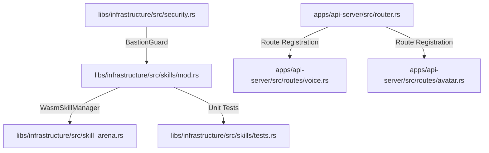
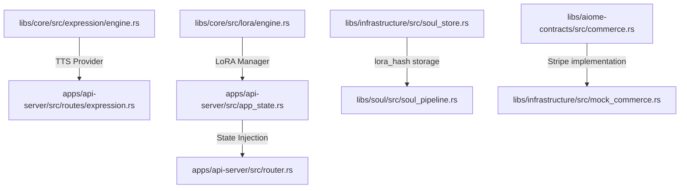

# 🌊 Aiome Ripple Map (Phase 9)

このドキュメントは、Phase 9「サンドボックス強化」におけるコード変更の影響範囲（リップル効果）を追跡するためのものです。

## 1. コア依存チェーン

## 2. 影響を受けるコンポーネント

### 🛡️ セキュリティ (security.rs)
- **変更内容**: `BastionGuard::safe_exec` に動的サンドボックス（gVisor/sandbox-exec）選択ロジックを追加。
- **波及効果**: 全てのシェル実行、WASMスキルのランタイム実行に影響。

### 🛠️ スキル管理 (skills/mod.rs)
- **変更内容**: `WasmSkillManager` がプロセス起動時に `BastionGuard` を介するように変更。
- **波及効果**: スキルの初期化、実行、バリデーションフローに影響。

### 🏟️ スキルアリーナ (skill_arena.rs)
- **変更内容**: なし（直接の変更は予定していないが、`WasmSkillManager` の動作変更によりテストが必要）。
- **確認事項**: 試合（Match）や評価（Evaluation）が制限された環境下で正しく動作するか。

### 🌐 API サーバー (router.rs)
- **変更内容**: ルーターを Public / Auth / High-Payload の3層に分離。`DefaultBodyLimit` を一部で無効化。
- **波及効果**: 全APIエンドポイントの認証・制限挙動に影響。

## 3. Phase 10 クリエイター機能の波及範囲

### 🎭 TTS / Expression (10.1a)
- **変更内容**: `ExpressionEngine` に TTS プロバイダー統合。
- **波及効果**: `routes/expression.rs`、UI の発話コンポーネントに影響。

### 🧠 LoRA / Soul (10.1b)
- **変更内容**: `LoraEngine` 新設、`SqliteSoulStore` スキーマ更新 (`lora_hash`)。
- **波及効果**: ソウル（人格）の生成・更新フロー、`AppState` 全体に影響。

### 💰 Commerce / DRM (10.2)
- **変更内容**: `VoiceKeyVault` 定義、`MockCommerceEngine` → `Stripe` 移行、`VoiceCoreDrm` 実体化。
- **波及効果**: 購入・認証・ボイス再生の全パスに影響。

---
*最終更新日: 2026-03-21*
