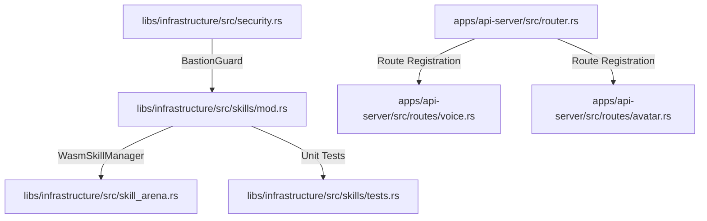
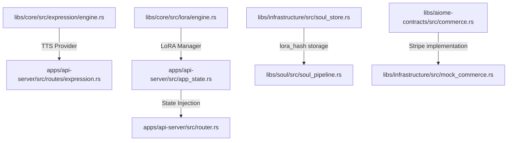
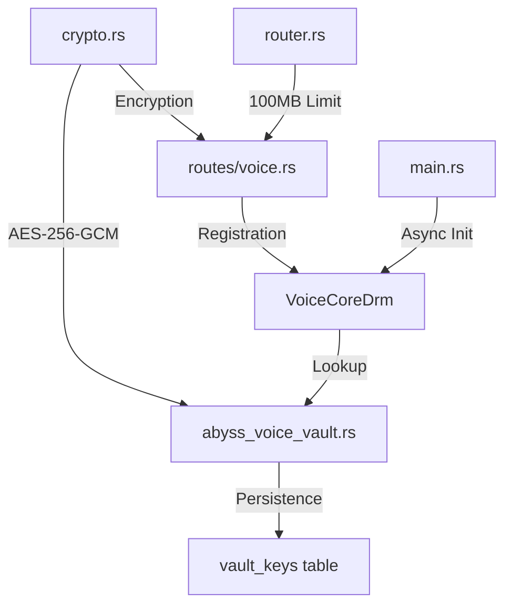
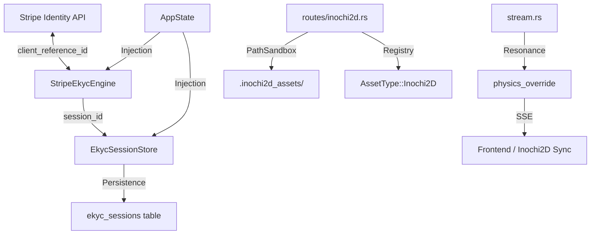
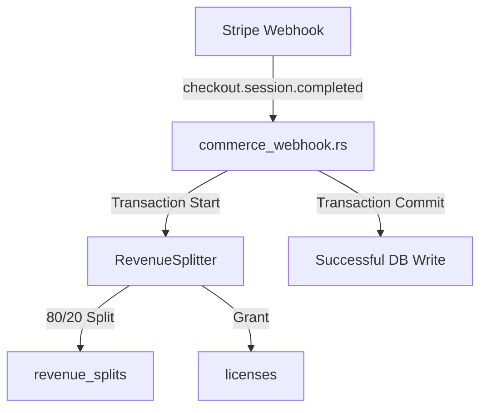
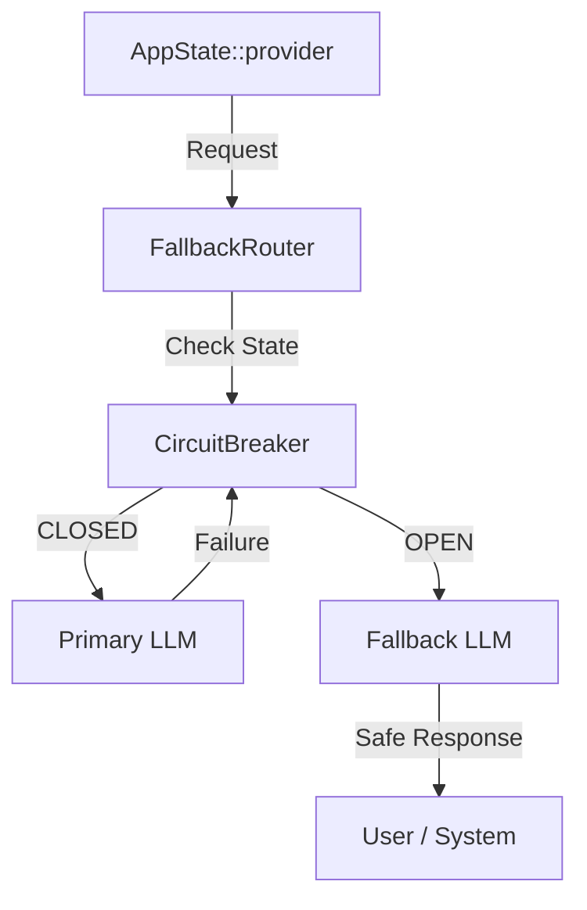
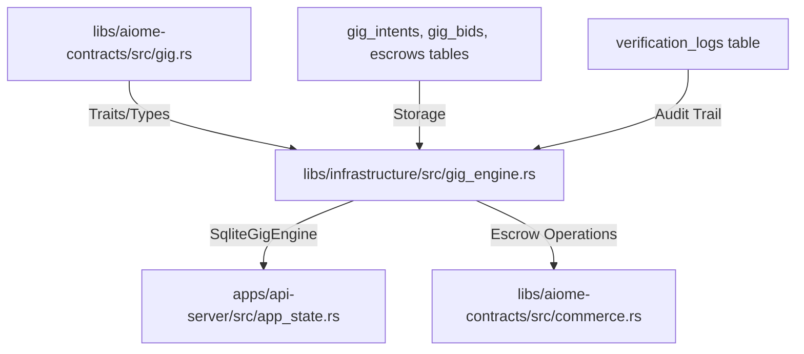
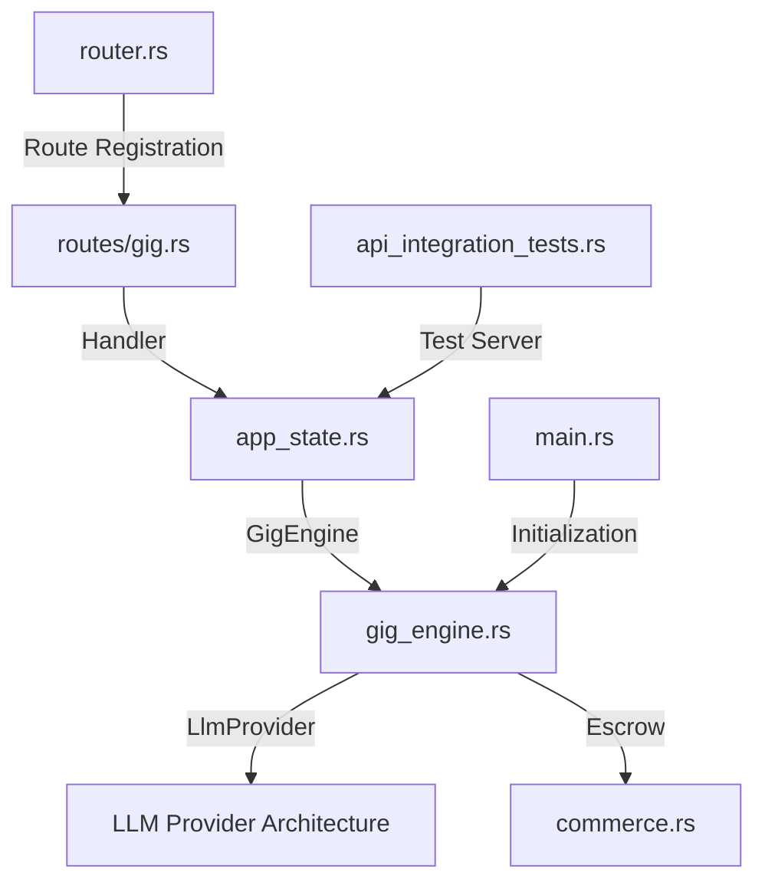
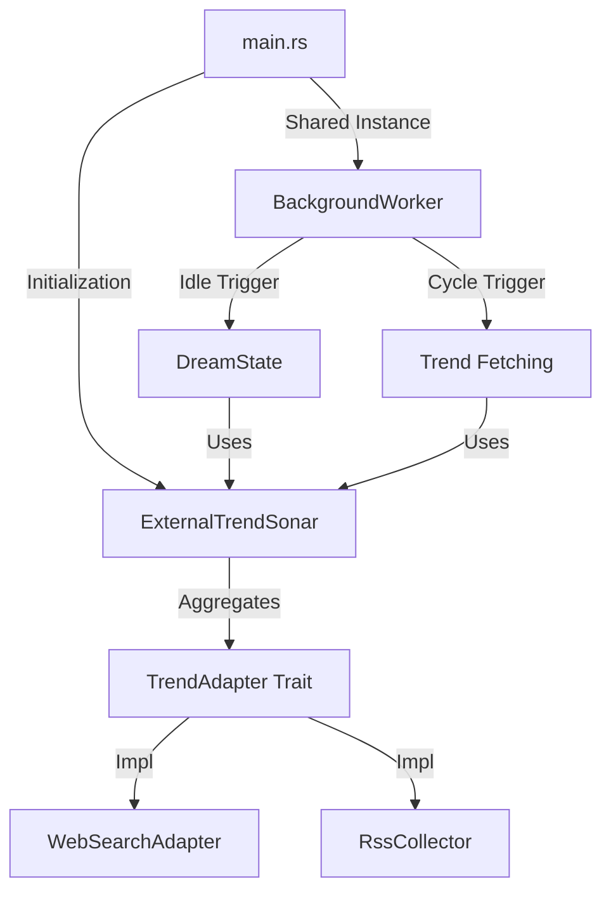

# 🌊 Aiome Ripple Map (Phase 9)

このドキュメントは、Phase 9「サンドボックス強化」におけるコード変更の影響範囲（リップル効果）を追跡するためのものです。

## 1. コア依存チェーン

## 2. 影響を受けるコンポーネント

### 🛡️ セキュリティ (security.rs)
- **変更内容**: `BastionGuard::safe_exec` に動的サンドボックス（gVisor/sandbox-exec）選択ロジックを追加。
- **波及効果**: 全てのシェル実行、WASMスキルのランタイム実行に影響。

### 🛠️ スキル管理 (skills/mod.rs)
- **変更内容**: `WasmSkillManager` がプロセス起動時に `BastionGuard` を介するように変更。
- **波及効果**: スキルの初期化、実行、バリデーションフローに影響。

### 🏟️ スキルアリーナ (skill_arena.rs)
- **変更内容**: なし（直接の変更は予定していないが、`WasmSkillManager` の動作変更によりテストが必要）。
- **確認事項**: 試合（Match）や評価（Evaluation）が制限された環境下で正しく動作するか。

### 🌐 API サーバー (router.rs)
- **変更内容**: ルーターを Public / Auth / High-Payload の3層に分離。`DefaultBodyLimit` を一部で無効化。
- **波及効果**: 全APIエンドポイントの認証・制限挙動に影響。

## 3. Phase 10 クリエイター機能の波及範囲

### 🎭 TTS / Expression (10.1a)
- **変更内容**: `ExpressionEngine` に TTS プロバイダー統合。
- **波及効果**: `routes/expression.rs`、UI の発話コンポーネントに影響。

### 🧠 LoRA / Soul (10.1b)
- **変更内容**: `LoraEngine` 新設、`SqliteSoulStore` スキーマ更新 (`lora_hash`)。
- **波及効果**: ソウル（人格）の生成・更新フロー、`AppState` 全体に影響。

### 💰 Voice DRM (10.2 / Expert Review Integrated)
- **変更内容**: 
    - `crypto.rs`: AES-256-GCM + Nonce 運用基盤の実装。
    - `abyss_voice_vault.rs`: `vault_keys` テーブルへの鍵永続化 (§CISO-1) とリストア実装。
    - `routes/voice.rs`: 暗号化パイプライン (100MB Limit) と Creator Auth (§SEC-4) 追加。
- **波及効果**: 
    - `main.rs`: `VoiceCoreDrm` の async 初期化に伴い起動フローが非同期化。
    - `router.rs`: `RequestBodyLimitLayer` によるメモリ DoS 防御の強化。
    - `contracts`: `VoiceKeyVault` trait の拡張。

### 🛡️ Voice DRM Expansion (Phase 11)
- **変更内容**:
    - `commerce_webhook.rs`: Stripe Webhook から `licenses` テーブルへの単一トランザクション化。
    - `registry.rs`: `licenses` 優先・Webhook フォールバックによる Dual-Read 所有権チェックと、Creator 所有判定の復元。
    - `audio_hasher.rs`: CSAM 検疫のための `tokio::task::spawn_blocking` を用いた音声ハッシュの実装とタイムアウト制御。
    - `abyss_voice_vault.rs`: `OnceCell` による Master Key 取得の遅延キャッシュ化。
    - `avatar-engine`: `LipSyncProvider` トレイトを新設し `VoiceKeyVault` から LipSync 責務を分離。
- **波及効果**:
    - `api_integration_tests.rs`: Voice DRM のラウンドトリップ（アップロード〜暗号化〜所有権検閲〜復号化）E2Eテストが追加され、システム全体の動作検証が確立。

### 🛡️ EKYC Persistence & Inochi2D Sync (Phase 14)
- **変更内容**: 
    - `ekyc_store.rs`: `EkycSessionStore` (SQLite) によるセッション ID の永続化。
    - `ekyc.rs`: `client_reference_id` ベースの Stripe フィルタリング実装。
    - `stream.rs`: SSE `avatar_expression` に `physics_override` フィールド追加と Resonance ブーストロジック実装。
    - `inochi2d.rs`: `AssetType::Inochi2D` 登録と `PathSandbox` 適用。
- **波及効果**: 
    - `main.rs`: `STRIPE_API_KEY` の Release ビルドにおける強制チェック (Fail-safe) 導入。
    - `router.rs`: `jwt_auth_middleware` の Inochi2D アップロードへの適用。
    - `api_integration_tests.rs`: eKYC セッション永続化と Inochi2D 物理同期情報の検証パスが確立。

### 🛡️ Phase 16: EKYC Endpoints & Revenue Splitter
- **変更内容**: 
    - `auth.rs`: JWT バリデーションに `ekyc_verified` クレームの抽出を追加。
    - `gift.rs` / `commerce.rs`: `auth.ekyc_verified` による 403 Forbidden 遮断ロジックの追加（未確認ユーザーの経済活動ブロック）。
    - `splitter.rs`: Stripe Webhook から呼び出される `RevenueSplitter::split_revenue` (80/20分配) の実装と `revenue_splits` テーブルへの書き込み。
    - `commerce_webhook.rs`: Webhook 受信時のトランザクション内で Revenue Splitting → License Granting を一貫実行。
    - `main.rs`: 起動時に環境変数 (`STRIPE_API_KEY`, `JWT_PRIVATE_KEY_B64`, `SEARCH_API_KEY` 等) を読み込み直後に `std::env::remove_var` で即時消去 (Zeroize) するセキュリティ強化。
- **波及効果**: 
    - ユーザーは eKYC 完了までギフト送信とアセット購入が不可能になる。
    - クリエイターとプラットフォームの売上分配が自動化され、データベーストランザクションにて一貫性が担保される。

### 🛡️ Phase 17: ArrowCanaria Fallback & Resilience
- **変更内容**: 
    - `fallback_router.rs`: `FallbackRouter` による LLM フェイルオーバーロジックの実装。
    - `circuit_breaker.rs`: プライマリ接続失敗時の遮断と自動復旧ロジック。
    - `main.rs`: `AppState` への `FallbackRouter` インジェクションと `bg_provider` の代替利用。
    - `AiomeConfig`: `Default` トレイトの実装によるテスト容易性の向上。
- **波及効果**: 
    - プライマリ LLM プロバイダーが停止しても、システムが「安全なデフォルト応答」または代替プロバイダー（Gemini 等）を使用して継続稼働可能になる。
    - `api-server` の全チャット・自律タスクの可用性が大幅に向上。

### 🛡️ Phase 17 Enhancement: Gaps G-1 & G-2 Remediation
- **変更内容**: 
    - `health.rs` / `general.rs`: `ResourceStatus` に `llm_circuit_breaker` を追加し、ヘルスチェック API でサーキットブレーカーの状態を公開 (Gap G-1)。
    - `rate_limiter.rs` / `auth.rs`: `governor` によるエージェント別レート制限の実装と認証ミドルウェアへの統合 (Gap G-2)。
- **波及効果**: 
    - LLM のフェイルオーバー状態を外部監視システムから検知可能になる。
    - エージェント毎のリクエスト頻度が制限され、DoS 攻撃や予期せぬループ消費のリスクが低減。

### 🛡️ Phase 20: AI Gig Engine (The Immutable Gateway)
- **変更内容**: 
    - `gig_engine.rs`: `SqliteGigEngine` による AI 受発注プロトコルの実装。
    - `gig.rs`: `AcceptanceCriteria`, `GigIntent`, `GigBid` 等のプロトコル型の定義。
    - `commerce.rs`: `escrow_release`, `escrow_refund` への対応。
    - `verification_logs`: 検証履歴の永続化。
- **波及効果**: 
    - エージェント間の自律的な商取引（ギグ・エコノミー）が可能になる。
    - 納品物の自動検証と、不適合時の自動返金/スラッシュによる Immutable な契約履行が担保される。
    - `api-server` の AppState に `GigEngine` が注入され、全エージェントが利用可能になる。

### 🛡️ Phase 20.1: Gig API & Gap Remediation
- **変更内容**: 
    - `gig.rs`: 新規 API エンドポイントの実装。
    - `router.rs`: `/api/v1/gig/*` の登録とレート制限の適用。
    - `app_state.rs`: `gig_engine` コンポーネントの保持。
    - `main.rs`: `SqliteGigEngine` の初期化と LlmProvider の注入。
    - `gig_engine.rs`: `OracleJudge` における `LlmProvider` を活用した自律検証ロジックの実装。
- **波及効果**: 
    - `api_integration_tests.rs`: `MockGigEngine` と E2E テストの追加。
    - `gig_engine.rs`: `new()` シグネチャ変更による全初期化箇所の修正。

### 📊 Trend Sonar Refactoring (Multi-Source Support)
- **変更内容**: 
    - `trend_sonar.rs`: `TrendAdapter` トレイトの導入と `ExternalTrendSonar` のマルチアダプタ化。
    - `rss_collector.rs`: `TrendAdapter` 実装による統合。
    - `main.rs`: 起動時の複数アダプタ初期化と `trend_sonar` インスタンスの共有化。
    - `dream_state.rs`: `ExternalTrendSonar` シグネチャ変更に伴うテストコードの修正。
- **波及効果**: 
    - トレンド収集元（Web検索, RSS等）が抽象化され、今後のデータソース追加が容易になる。
    - `BackgroundWorker` と `DreamState` で同一のトレンド収集基盤を共有することで、動作の一貫性が向上。
    - `sanitize_snippet` による外部データの入力バリデーションが強化される。

---
*最終更新日: 2026-03-22* (Trend Sonar Refactoring Integration)
