# 🌊 Aiome Ripple Map

このドキュメントは、アーキテクチャ変更時におけるコード変更の影響範囲（リップル効果）を追跡するためのものです。

## Phase 3C: Oracle Asynchronous Review Pipeline (AI-Scientist)

### 1. `TaskRegistry` トレイトへの状態更新メソッド追加
- **変更理由**: Oracle によるジョブのレビュー判定状態（`Evaluating`）をDBレベルで追跡可能にし、非同期処理中のゾンビ化を防ぐため。
- **波及効果**:
  - `libs/aiome-contracts/src/traits.rs`: `TaskRegistry` に `update_job_status` を追加。
  - `libs/infrastructure/src/job_queue/core_ops.rs`: SQLite/Postgres バックエンドに `do_update_job_status` 実装。また、`do_reclaim_zombie_jobs` のクエリを拡張し `Evaluating` ジョブも60分で回収されるよう強化。
  - テストおよびモック: `tts_worker`, `test_utils`, `immune_system`, `dream_state`, `soul_mutator` 内の `MockJobQueue` に全て実装波及。

### 2. `TaskDispatcher` の非同期ディスパッチ拡張
- **変更理由**: 完了したジョブがレビューを必要とする場合（`requires_review`）、メインスレッドをブロックすることなく Oracle へ検証を移譲するため。
- **波及効果**:
  - `libs/infrastructure/src/task_orchestrator/mod.rs`: `Oracle::multi_review` の呼び出しを `tokio::spawn` と `tokio::time::timeout` でラップ。所有権（`job.requires_review` 等）の事前解決とフェイルセーフを実装。

### 3. `aiome-commerce` パッケージの完全分離
- **変更理由**: コマースやギグエコノミー関連ロジックが `infrastructure` コンテキストに強く癒着しており、循環参照と肥大化を引き起こしていたため。
- **波及効果**:
  - 新規クレート `libs/aiome-commerce`（Stripe, Gig, Gift エンジン実体）の作成。
  - `API Server`, `Samsara Hub`, `Napi Bridge` 等 20+ アプリの依存関係解決とインポートパス改修。

---

## Phase 52: Infrastructure Hardening & ZTAS Preparation

### 1. `UserLearner` の構造化プロファイル (TDD)
- **変更理由**: 単純な Markdown 追記だけでなく、メモリ上の `UserProfile` を JSON ベースで抽出し、システム全体の A2A コンテキストとして利用可能にするため。
- **波及効果**:
  - `libs/infrastructure/src/user_learner.rs`: `learn_from_session` に JSON 抽出ロジックと `serde_json` パース処理を追加。
  - テスト環境: `MockLlm` が JSON 形式のレスポンスを返すように修正し、最新の `LlmProvider` トレイトに対応。

### 2. `RegistryManager` とインフラ層のエラーハンドリング
- **変更理由**: 本番環境におけるパニック (unwrap) を排除し、完全な `AiomeError` マッピングによる型安全なエラーハンドリングを実現するため。
- **波及効果**:
  - `libs/infrastructure/src/registry.rs`: `sql_exec!`, `sql_fetch_one!` などの `DatabasePool` マクロを全面的に適用し、SQLite/Postgres 間の差異を吸収。
  - `libs/infrastructure/src/docker_conductor.rs`: `tokio_stream::StreamExt` の型推論不具合を明示的に解決しビルドを安定化。
  - `libs/infrastructure/src/gig_engine_tests.rs`: `commerce_mock` などのモック初期化不備とトレイトインポート漏れを修正。

---

## Phase 51: Aiome Node & mDNS Discovery

### 1. `aiome-node` バイナリの独立
- **変更理由**: エージェントのネットワーク上のアイデンティティ (Agent Card) と自律実行環境を単一の P2P ノードとして確立するため。
- **波及効果**:
  - `apps/aiome-node/src/main.rs`: `/.well-known/agent.json` (Agent Card) の配信、および `mdns-sd` に依存した `_aiome._tcp.local.` サービスの継続的 P2P ブロードキャスト実装が追加されました。
  - `apps/api-server/src/app_state.rs`: Core API は内部ロジックをバイパスし、分離された Node コンポーネントへ依存する基盤 (`AgentNodeClient` アーキテクチャ) に移行します。

### 2. `samsara-hub` レジストリインデックス拡張
- **変更理由**: P2P 発見された `aiome-node` を中央またはローカルハブのレジストリとして登録し、API経由でクライアントから検索可能にするため。
- **波及効果**:
  - `apps/samsara-hub/src/mdns_listener.rs`: mDNS サービスブラウズによる動的な `AgentRegistry` ノード登録機能が実装されました。
  - `apps/samsara-hub/src/main.rs`: `HubState` への `AgentRegistry` の注入と、発見済みエージェントを返す `GET /api/v1/registry/agents` ルーティングが追加されました。
  - `apps/samsara-hub/Cargo.toml`: `mdns-sd` およびテスト用の `http-body-util` が追加されました。

## Phase 50: A2A gRPC Native Support

### 1. `DockerConductor` (task_orchestrator)
- **変更理由**: 同期 `docker exec` から 非同期 gRPC ストリーミング受信への完全移行。
- **波及先 (変更・追加されたモジュール)**:
  - `libs/aiome-contracts/proto/a2a_internal.proto`: メッセージスキーマ (TaskRequest, TaskProgress) 定義
  - `libs/aiome-contracts/src/a2a.rs`: `A2aClient` トレイトとデータ構造の再定義
  - `libs/infrastructure/src/grpc/a2a_grpc_client.rs`: `async-stream` を用いた gRPC クライアント (新規作成)
  - `api-server/src/main.rs`: 起動時の `GrpcClientConfig` 注入
  - `libs/infrastructure/src/task_orchestrator/mod.rs`: `InvariantDag` との統合 (result_hash 連携)

### 2. `aiome-shadow-worker` バイナリ
- **変更理由**: 従来の Docker 内部での CLI プロセス起動を廃止し、永続化された gRPC サーバー (`tonic`) に置換。
- **波及先**:
  - `apps/shadow-worker/src/main.rs`: gRPC サーバー実装、ワンタイムトークン検証、ヘルスチェック提供
  - `libs/core/src/llm_provider/`: Gemini/Ollama エンジンへの実アクセス
  - `Dockerfile.shadow-worker`: Cargo workspace から `shadow-worker` のみを抽出ビルド・実行するように刷新

---

## Phase 9: サンドボックス強化

### 1. コア依存チェーン

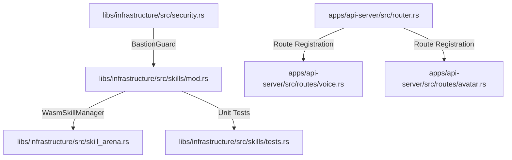
```mermaid
graph TD
    A[libs/infrastructure/src/security.rs] -->|BastionGuard| B[libs/infrastructure/src/skills/mod.rs]
    B -->|WasmSkillManager| C[libs/infrastructure/src/skill_arena.rs]
    B -->|Unit Tests| D[libs/infrastructure/src/skills/tests.rs]
    
    E[apps/api-server/src/router.rs] -->|Route Registration| F[apps/api-server/src/routes/voice.rs]
    E -->|Route Registration| G[apps/api-server/src/routes/avatar.rs]
```

## 2. 影響を受けるコンポーネント

### 🛡️ セキュリティ (security.rs)
- **変更内容**: `BastionGuard::safe_exec` に動的サンドボックス（gVisor/sandbox-exec）選択ロジックを追加。
- **波及効果**: 全てのシェル実行、WASMスキルのランタイム実行に影響。

### 🛠️ スキル管理 (skills/mod.rs)
- **変更内容**: `WasmSkillManager` がプロセス起動時に `BastionGuard` を介するように変更。
- **波及効果**: スキルの初期化、実行、バリデーションフローに影響。

### 🏟️ スキルアリーナ (skill_arena.rs)
- **変更内容**: なし（直接の変更は予定していないが、`WasmSkillManager` の動作変更によりテストが必要）。
- **確認事項**: 試合（Match）や評価（Evaluation）が制限された環境下で正しく動作するか。

### 🌐 API サーバー (router.rs)
- **変更内容**: ルーターを Public / Auth / High-Payload の3層に分離。`DefaultBodyLimit` を一部で無効化。
- **波及効果**: 全APIエンドポイントの認証・制限挙動に影響。

## 3. Phase 10 クリエイター機能の波及範囲

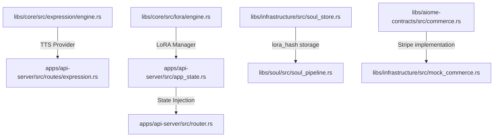
```mermaid
graph TD
    A[libs/core/src/expression/engine.rs] -->|TTS Provider| B[apps/api-server/src/routes/expression.rs]
    C[libs/core/src/lora/engine.rs] -->|LoRA Manager| D[apps/api-server/src/app_state.rs]
    D -->|State Injection| E[apps/api-server/src/router.rs]
    F[libs/infrastructure/src/soul_store.rs] -->|lora_hash storage| G[libs/soul/src/soul_pipeline.rs]
    H[libs/aiome-contracts/src/commerce.rs] -->|Stripe implementation| I[libs/infrastructure/src/mock_commerce.rs]
```

### 🎭 TTS / Expression (10.1a)
- **変更内容**: `ExpressionEngine` に TTS プロバイダー統合。
- **波及効果**: `routes/expression.rs`、UI の発話コンポーネントに影響。

### 🧠 LoRA / Soul (10.1b)
- **変更内容**: `LoraEngine` 新設、`SqliteSoulStore` スキーマ更新 (`lora_hash`)。
- **波及効果**: ソウル（人格）の生成・更新フロー、`AppState` 全体に影響。

### 💰 Voice DRM (10.2 / Expert Review Integrated)
- **変更内容**: 
    - `crypto.rs`: AES-256-GCM + Nonce 運用基盤の実装。
    - `abyss_voice_vault.rs`: `vault_keys` テーブルへの鍵永続化 (§CISO-1) とリストア実装。
    - `routes/voice.rs`: 暗号化パイプライン (100MB Limit) と Creator Auth (§SEC-4) 追加。
- **波及効果**: 
    - `main.rs`: `VoiceCoreDrm` の async 初期化に伴い起動フローが非同期化。
    - `router.rs`: `RequestBodyLimitLayer` によるメモリ DoS 防御の強化。
    - `contracts`: `VoiceKeyVault` trait の拡張。

### 🛡️ Voice DRM Expansion (Phase 11)
- **変更内容**:
    - `commerce_webhook.rs`: Stripe Webhook から `licenses` テーブルへの単一トランザクション化。
    - `registry.rs`: `licenses` 優先・Webhook フォールバックによる Dual-Read 所有権チェックと、Creator 所有判定の復元。
    - `audio_hasher.rs`: CSAM 検疫のための `tokio::task::spawn_blocking` を用いた音声ハッシュの実装とタイムアウト制御。
    - `abyss_voice_vault.rs`: `OnceCell` による Master Key 取得の遅延キャッシュ化。
    - `avatar-engine`: `LipSyncProvider` トレイトを新設し `VoiceKeyVault` から LipSync 責務を分離。
- **波及効果**:
    - `api_integration_tests.rs`: Voice DRM のラウンドトリップ（アップロード〜暗号化〜所有権検閲〜復号化）E2Eテストが追加され、システム全体の動作検証が確立。

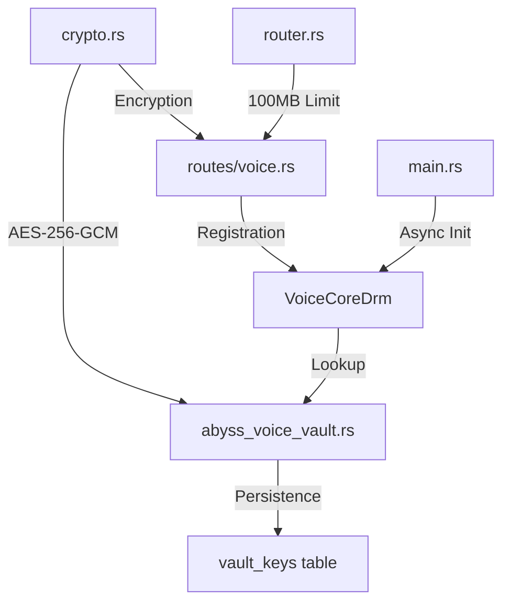
```mermaid
graph TD
    A[crypto.rs] -->|AES-256-GCM| B[abyss_voice_vault.rs]
    B -->|Persistence| C[vault_keys table]
    A -->|Encryption| D[routes/voice.rs]
    D -->|Registration| E[VoiceCoreDrm]
    E -->|Lookup| B
    F[main.rs] -->|Async Init| E
    G[router.rs] -->|100MB Limit| D
```

### 🛡️ EKYC Persistence & Inochi2D Sync (Phase 14)
- **変更内容**: 
    - `ekyc_store.rs`: `EkycSessionStore` (SQLite) によるセッション ID の永続化。
    - `ekyc.rs`: `client_reference_id` ベースの Stripe フィルタリング実装。
    - `stream.rs`: SSE `avatar_expression` に `physics_override` フィールド追加と Resonance ブーストロジック実装。
    - `inochi2d.rs`: `AssetType::Inochi2D` 登録と `PathSandbox` 適用。
- **波及効果**: 
    - `main.rs`: `STRIPE_API_KEY` の Release ビルドにおける強制チェック (Fail-safe) 導入。
    - `router.rs`: `jwt_auth_middleware` の Inochi2D アップロードへの適用。
    - `api_integration_tests.rs`: eKYC セッション永続化と Inochi2D 物理同期情報の検証パスが確立。

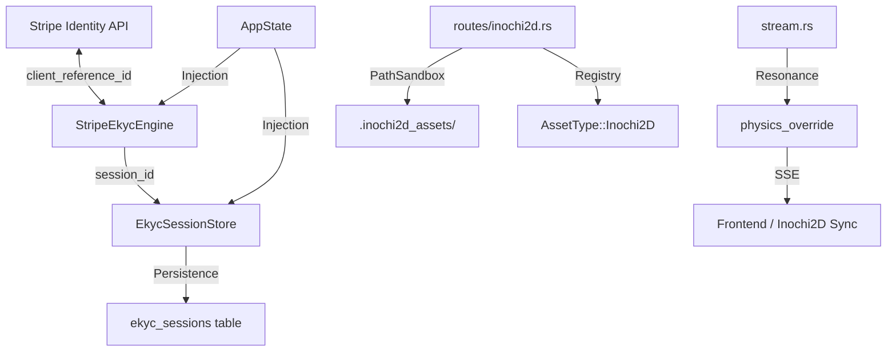
```mermaid
graph TD
    A[Stripe Identity API] <-->|client_reference_id| B[StripeEkycEngine]
    B -->|session_id| C[EkycSessionStore]
    C -->|Persistence| D[ekyc_sessions table]
    E[AppState] -->|Injection| B
    E -->|Injection| C
    F[stream.rs] -->|Resonance| G[physics_override]
    G -->|SSE| H[Frontend / Inochi2D Sync]
    I[routes/inochi2d.rs] -->|PathSandbox| J[.inochi2d_assets/]
    I -->|Registry| K[AssetType::Inochi2D]
```

### 🛡️ Phase 16: EKYC Endpoints & Revenue Splitter
- **変更内容**: 
    - `auth.rs`: JWT バリデーションに `ekyc_verified` クレームの抽出を追加。
    - `gift.rs` / `commerce.rs`: `auth.ekyc_verified` による 403 Forbidden 遮断ロジックの追加（未確認ユーザーの経済活動ブロック）。
    - `splitter.rs`: Stripe Webhook から呼び出される `RevenueSplitter::split_revenue` (80/20分配) の実装と `revenue_splits` テーブルへの書き込み。
    - `commerce_webhook.rs`: Webhook 受信時のトランザクション内で Revenue Splitting → License Granting を一貫実行。
    - `main.rs`: 起動時に環境変数 (`STRIPE_API_KEY`, `JWT_PRIVATE_KEY_B64`, `SEARCH_API_KEY` 等) を読み込み直後に `std::env::remove_var` で即時消去 (Zeroize) するセキュリティ強化。
- **波及効果**: 
    - ユーザーは eKYC 完了までギフト送信とアセット購入が不可能になる。
    - クリエイターとプラットフォームの売上分配が自動化され、データベーストランザクションにて一貫性が担保される。

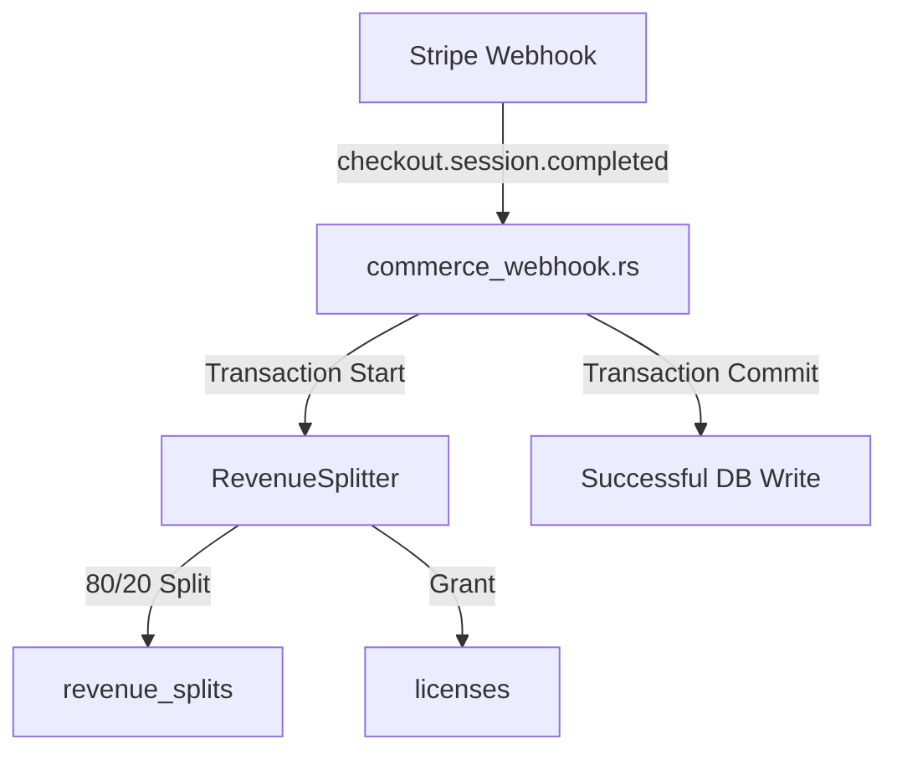
```mermaid
graph TD
    A[Stripe Webhook] -->|checkout.session.completed| B[commerce_webhook.rs]
    B -->|Transaction Start| C[RevenueSplitter]
    C -->|80/20 Split| D[revenue_splits]
    C -->|Grant| E[licenses]
    B -->|Transaction Commit| F[Successful DB Write]
```

### 🛡️ Phase 17: ArrowCanaria Fallback & Resilience
- **変更内容**: 
    - `fallback_router.rs`: `FallbackRouter` による LLM フェイルオーバーロジックの実装。
    - `circuit_breaker.rs`: プライマリ接続失敗時の遮断と自動復旧ロジック。
    - `main.rs`: `AppState` への `FallbackRouter` インジェクションと `bg_provider` の代替利用。
    - `AiomeConfig`: `Default` トレイトの実装によるテスト容易性の向上。
- **波及効果**: 
    - プライマリ LLM プロバイダーが停止しても、システムが「安全なデフォルト応答」または代替プロバイダー（Gemini 等）を使用して継続稼働可能になる。
    - `api-server` の全チャット・自律タスクの可用性が大幅に向上。

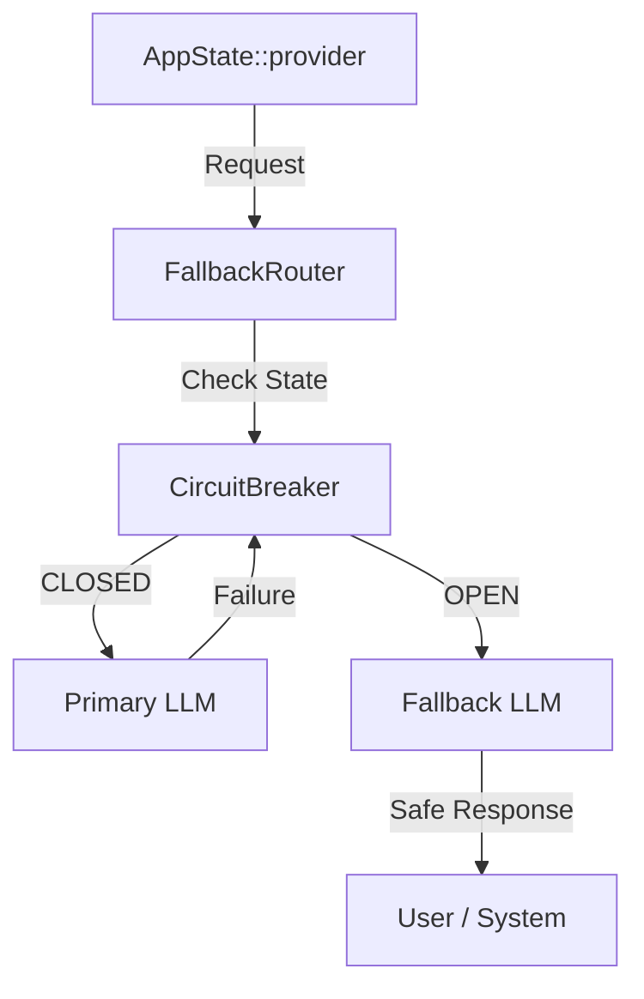
```mermaid
graph TD
    A[AppState::provider] -->|Request| B[FallbackRouter]
    B -->|Check State| C[CircuitBreaker]
    C -->|CLOSED| D[Primary LLM]
    C -->|OPEN| E[Fallback LLM]
    D -->|Failure| C
    E -->|Safe Response| F[User / System]
```

### 🛡️ Phase 17 Enhancement: Gaps G-1 & G-2 Remediation
- **変更内容**: 
    - `health.rs` / `general.rs`: `ResourceStatus` に `llm_circuit_breaker` を追加し、ヘルスチェック API でサーキットブレーカーの状態を公開 (Gap G-1)。
    - `rate_limiter.rs` / `auth.rs`: `governor` によるエージェント別レート制限の実装と認証ミドルウェアへの統合 (Gap G-2)。
- **波及効果**: 
    - LLM のフェイルオーバー状態を外部監視システムから検知可能になる。
    - エージェント毎のリクエスト頻度が制限され、DoS 攻撃や予期せぬループ消費のリスクが低減。

### 🛡️ Phase 20: AI Gig Engine (The Immutable Gateway)
- **変更内容**: 
    - `gig_engine.rs`: `SqliteGigEngine` による AI 受発注プロトコルの実装。
    - `gig.rs`: `AcceptanceCriteria`, `GigIntent`, `GigBid` 等のプロトコル型の定義。
    - `commerce.rs`: `escrow_release`, `escrow_refund` への対応。
    - `verification_logs`: 検証履歴の永続化。
    - `PathSandbox`: `deliver` 時に成果物パスの安全性を検証 (G-22)。
- **波及効果**: 
    - エージェント間の自律的な商取引（ギグ・エコノミー）が可能になる。
    - 納品物の自動検証と、不適合時の自動返金/スラッシュによる Immutable な契約履行が担保される。
    - `api-server` の AppState に `GigEngine` が注入され、全エージェントが利用可能になる。

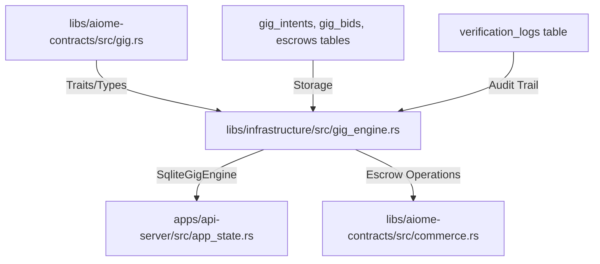
```mermaid
graph TD
    A[libs/infrastructure/src/gig_engine.rs] -->|SqliteGigEngine| B[apps/api-server/src/app_state.rs]
    A -->|Escrow Operations| C[libs/aiome-contracts/src/commerce.rs]
    D[libs/aiome-contracts/src/gig.rs] -->|Traits/Types| A
    E[gig_intents, gig_bids, escrows tables] -->|Storage| A
    F[verification_logs table] -->|Audit Trail| A
```

### 🛡️ Phase 20.1: Gig API & Gap Remediation
- **変更内容**: 
    - `gig.rs`: 新規 API エンドポイントの実装。
    - `router.rs`: `/api/v1/gig/*` の登録とレート制限の適用。
    - `app_state.rs`: `gig_engine` コンポーネントの保持。
    - `main.rs`: `SqliteGigEngine` の初期化と LlmProvider の注入。
    - `gig_engine.rs`: `OracleJudge` における `LlmProvider` を活用した自律検証ロジックの実装。
- **波及効果**: 
    - `api_integration_tests.rs`: `MockGigEngine` と E2E テストの追加。
    - `gig_engine.rs`: `new()` シグネチャ変更による全初期化箇所の修正。

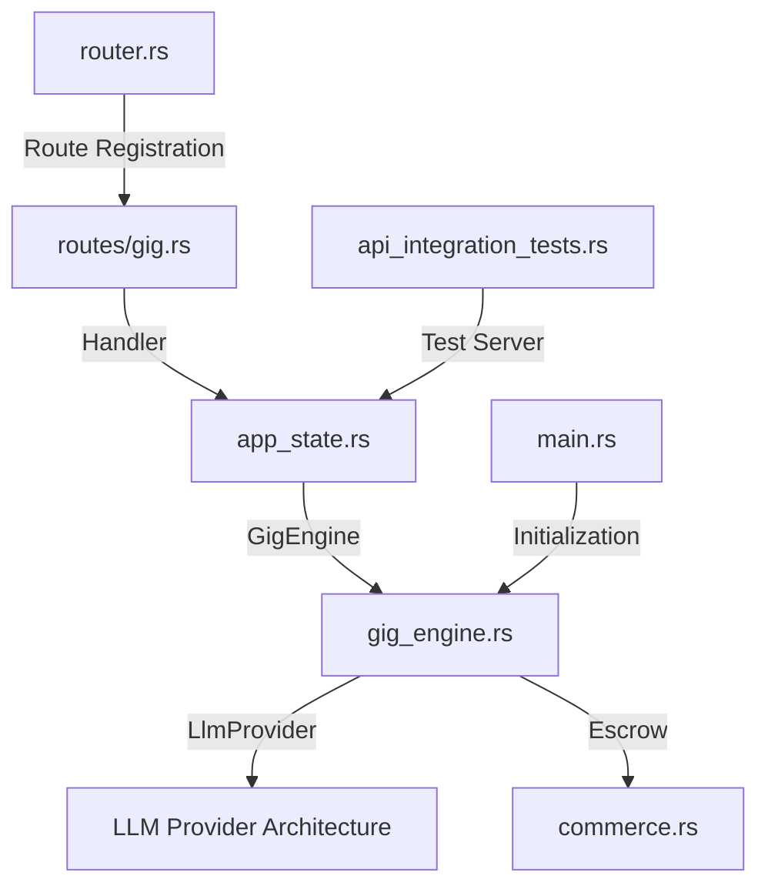
```mermaid
graph TD
    A[routes/gig.rs] -->|Handler| B[app_state.rs]
    B -->|GigEngine| C[gig_engine.rs]
    C -->|LlmProvider| L[LLM Provider Architecture]
    C -->|Escrow| D[commerce.rs]
    E[router.rs] -->|Route Registration| A
    F[main.rs] -->|Initialization| C
    G[api_integration_tests.rs] -->|Test Server| B
```

### 📊 Trend Sonar Refactoring (Multi-Source Support)
- **変更内容**: 
    - `trend_sonar.rs`: `TrendAdapter` トレイトの導入と `ExternalTrendSonar` のマルチアダプタ化。
    - `rss_collector.rs`: `TrendAdapter` 実装による統合。
    - `main.rs`: 起動時の複数アダプタ初期化と `trend_sonar` インスタンスの共有化。
    - `dream_state.rs`: `ExternalTrendSonar` シグネチャ変更に伴うテストコードの修正。
- **波及効果**: 
    - トレンド収集元（Web検索, RSS等）が抽象化され、今後のデータソース追加が容易になる。
    - `BackgroundWorker` と `DreamState` で同一のトレンド収集基盤を共有することで、動作の一貫性が向上。
    - `sanitize_snippet` による外部データの入力バリデーションが強化される。

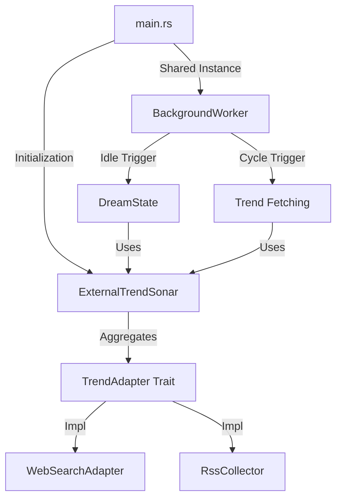
```mermaid
graph TD
    A[main.rs] -->|Initialization| B[ExternalTrendSonar]
    B -->|Aggregates| C[TrendAdapter Trait]
    C -->|Impl| D[WebSearchAdapter]
    C -->|Impl| E[RssCollector]
    A -->|Shared Instance| F[BackgroundWorker]
    F -->|Idle Trigger| G[DreamState]
    G -->|Uses| B
    F -->|Cycle Trigger| H[Trend Fetching]
    H -->|Uses| B
```

---
*最終更新日: 2026-03-22* (Trend Sonar Refactoring Integration)
### 🛡️ Gig Engine & Federated Metrics (Phase 22 / 23)
- **変更内容**: 
    - `gig_engine.rs`: `SqliteGigEngine` 実装。`PathSandbox` によるパスバリデーション (§G-22)。
    - `job_queue/federation.rs`: `FederationOps` に `fetch_federated_metrics` 追加。`AgentStats` 型パス修正。
    - `contracts.rs` / `types.rs`: `FederatedMetrics` / `JobMetrics` / `KarmaMetrics` 定義。`FederationPushRequest` 拡張 (§G-23)。
    - `rss_collector.rs`: `sanitize_snippet` によるタイトルサニタイズ (§G-Security)。
    - `trend_sonar.rs`: `ExternalTrendSonar` に `LlmProvider` 統合 (Oracle Mode)。
    - `general.rs`: `/api/v1/logs` / `/api/v1/audit/*` への System Agent 認証強制 (§G-Log)。
- **波及効果**: 
    - `main.rs`: `TrendSonar` の初期化フロー（LLM プロバイダー注入）と、バックグラウンドワーカーのメトリクス収集ループの有効化。
    - `samsara-hub`: 受信側ノードにおける `federated_metrics` テーブルの作成と、パッシブメトリクス蓄積。
    - `api_integration_tests.rs`: Gig Lifecycle とパスバリデーション、フェデレーションメトリクスの検証パスが追加。

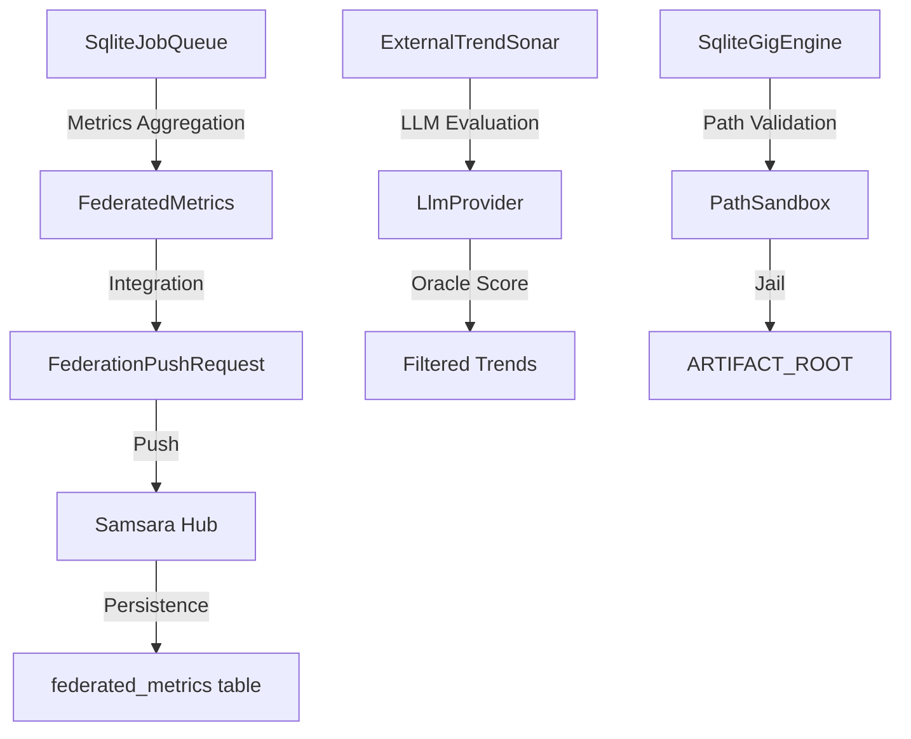
```mermaid
graph TD
    A[SqliteJobQueue] -->|Metrics Aggregation| B[FederatedMetrics]
    B -->|Integration| C[FederationPushRequest]
    C -->|Push| D[Samsara Hub]
    D -->|Persistence| E[federated_metrics table]
    
    F[ExternalTrendSonar] -->|LLM Evaluation| G[LlmProvider]
    G -->|Oracle Score| H[Filtered Trends]
    
    I[SqliteGigEngine] -->|Path Validation| J[PathSandbox]
    J -->|Jail| K[ARTIFACT_ROOT]
```

### 💎 AgentSense MVP (Phase 24)
- **変更内容**: 
    - `treasure.rs`: `TreasureItem`, `TreasureFeedback` 定義。`get_treasure`, `record_feedback` ハンドラ実装。
    - `affiliate_adapter.rs`: `AffiliateAdapter` 新設（アフィリエイト/ギグ案件の取得抽象化）。
    - `intent/mod.rs`: `IntentGenerator::generate_for_agent` 実装。`SoulStore` を注入し、エージェントの愛着スタイル（Soul State）に基づいたパーソナライズを実施 (§G-26)。
    - `soul_store.rs`: `SqliteSoulStore` に `SoulStore` トレイトを実装し、インテント生成側へ公開。
    - `TreasureBox.tsx`: フロント端での推薦表示とフィードバック送信 UI の実装 (§G-25)。
    - `app_state.rs`: `affiliate_adapter` と `soul_store` コンポーネントの追加。
    - `router.rs`: `/api/v1/treasure` 系のルート登録と JWT 認証適用。
- **波及効果**: 
    - エージェントが自身の魂の状態（Attachment Style）に基づいたパーソナライズされた案件を受け取ることが可能になる。
    - ユーザーのインタラクションが Resonance として還元され、エージェントの成長サイクルが循環する。
    - `api_integration_tests.rs`: 推薦取得 〜 推薦内容の魂連動性の検証 〜 フィードバック送信 〜 報酬還元のフルループ E2E テストが確立。

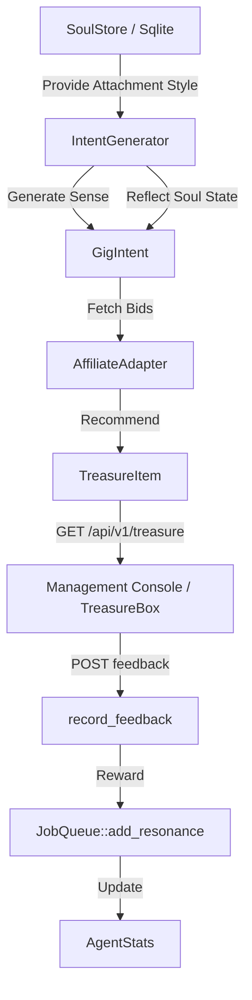
```mermaid
graph TD
    A[IntentGenerator] -->|Generate Sense| B[GigIntent]
    S[SoulStore / Sqlite] -->|Provide Attachment Style| A
    A -->|Reflect Soul State| B
    B -->|Fetch Bids| C[AffiliateAdapter]
    C -->|Recommend| D[TreasureItem]
    D -->|GET /api/v1/treasure| E[Management Console / TreasureBox]
    E -->|POST feedback| F[record_feedback]
    F -->|Reward| G[JobQueue::add_resonance]
    G -->|Update| H[AgentStats]
```

---
*最終更新日: 2026-03-22* (AgentSense MVP & Security Hardening Integration)

### 🛡️ Unified Safety & AI Code Review (G-21 / G-22)
- **変更内容**: 
    - `libs/core/src/security_impl.rs`: `purge_entities` による統合サニタイズ基盤の実装 (§G-21)。
    - `libs/infrastructure/src/skills/cleanroom.rs`: `audit_source_code` による WASM スキルの AI コードレビュー (§G-22)。
    - `libs/infrastructure/src/trend_sonar.rs`: `purge_entities` への移行。
- **波及効果**: 
    - 全ての外部入力（RSS, LLM 出力, スキルコード）に対する安全性が向上。
    - スキルインポート時に LLM による静的/動的解析に近いセキュリティチェックが強制される。

### 📊 Periodic Federated Metrics (G-23)
- **変更内容**: 
    - `apps/api-server/src/main.rs`: 1時間おきのメトリクス Push ループの実装。
    - `libs/infrastructure/src/job_queue/federation.rs`: `do_push_federated_metrics` の具象化と Hub への送信ロジック。
- **波及効果**: 
    - Samsara Hub におけるフェデレーション全体の稼働状況の可視化が自動化。
    - 各ノードの健全性と成長度が自律的に報告されるエコノミー基盤が確立。

### 🔧 Autonomous Demo — SQLite ロック回避 (Phase 25.5 / ADR-014)
- **変更内容**: 
    - `apps/api-server/src/autonomous_demo.rs`: 全面書き換え。`gig_engine` の trait メソッド（`accept_bid`, `deliver`, `verify_and_settle`）を排除し、個別 SQL クエリによるトランザクションレス方式に移行。
    - `libs/infrastructure/src/job_queue/migrations.rs`: audit trigger の初期化順序修正（テーブル作成前に移動）、`DROP TRIGGER IF EXISTS` 追加。
    - `docs/decisions/014-sqlite-pool-exhaustion-demo-strategy.md`: 新規 ADR。本番環境への PostgreSQL 移行計画を含む。
- **波及効果**: 
    - デモ実行中は gig 関連テーブル（`gig_intents`, `gig_bids`, `escrows`, `gig_deliveries`, `verification_logs`）の audit trigger が一時停止 → 監査ログに欠損が生じる（デモ限定）。
    - `gig_engine.rs` のスキーマ変更時、`autonomous_demo.rs` のインライン SQL も手動更新が必要（デュアルメンテナンス）。
    - **本番運用向け**: PostgreSQL 移行、非同期 Audit Logging、SSE 接続共有を将来計画として明文化。

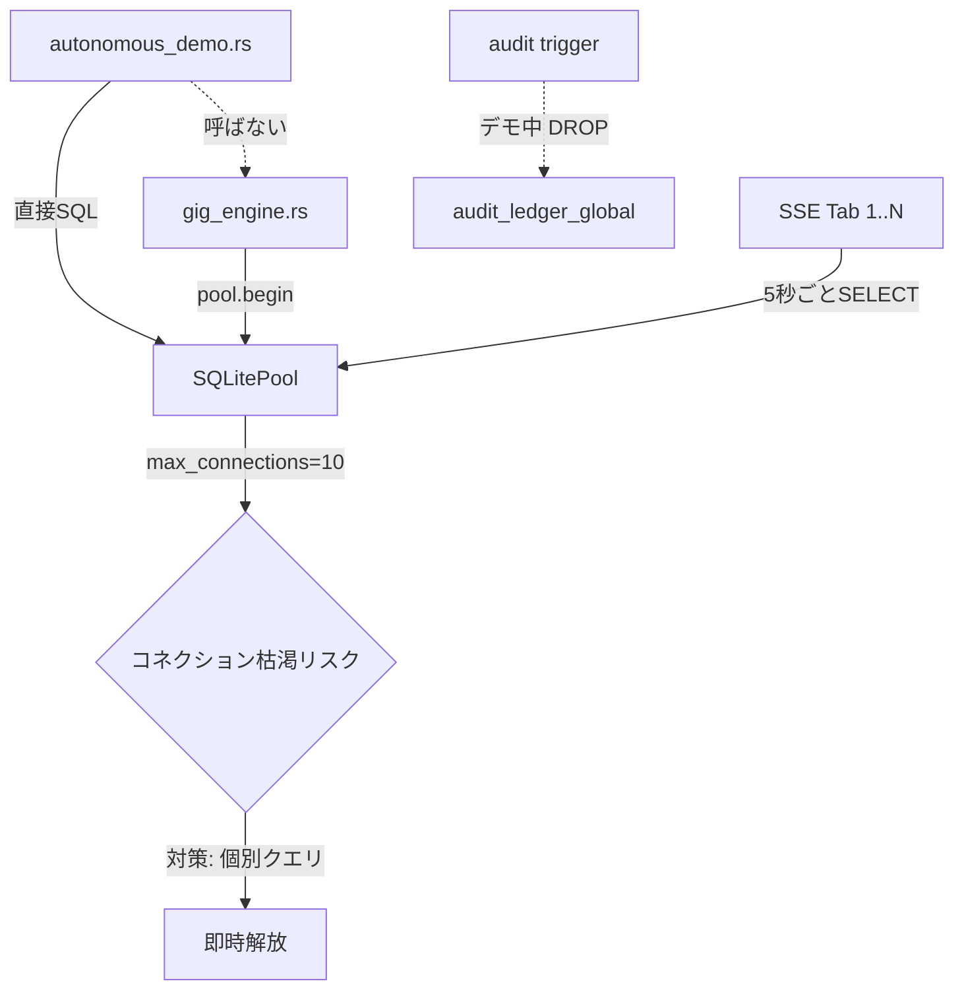
```mermaid
graph TD
    A[autonomous_demo.rs] -->|直接SQL| B[SQLitePool]
    A -.->|呼ばない| C[gig_engine.rs]
    C -->|pool.begin| B
    D[SSE Tab 1..N] -->|5秒ごとSELECT| B
    E[audit trigger] -.->|デモ中 DROP| F[audit_ledger_global]
    B -->|max_connections=10| G{コネクション枯渇リスク}
    G -->|対策: 個別クエリ| H[即時解放]
```

---
*最終更新日: 2026-03-23* (Phase 25.5 / ADR-014 SQLite Lock Resolution)

### 🛡️ Phase 26: AI Writing Enhancement
- **変更内容**: 
    - `writing_context.rs`: 出力先ごとの文体コンテキストを定義。
    - `humanizer_rules.rs`: 日本語に特化したAIくささ除去ルールを定義。
    - `humanizer_filter.rs`: `LlmProvider` デコレータパターンによるルール適用のミドルウェア実装。
    - `main.rs`: `router_provider` を `HumanizerFilter` でラップし、API サーバー内の全 LLM 応答にフィルタを適用。
- **波及効果**: 
    - LLM のチャット出力や生成されるテキストから「お役に立てれば幸いです」等の冗長な定型句が除去され、自然な文体になる。
    - `LlmProvider` を使用する全てのコンポーネントに自動適用される。

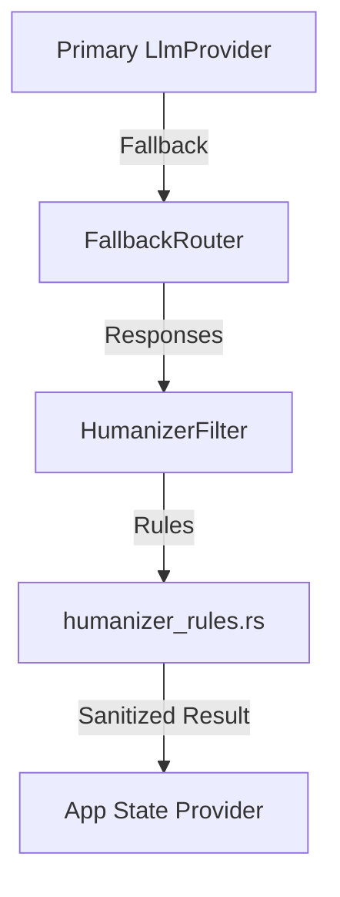
```mermaid
graph TD
    A[Primary LlmProvider] -->|Fallback| B[FallbackRouter]
    B -->|Responses| C[HumanizerFilter]
    C -->|Rules| D[humanizer_rules.rs]
    D -->|Sanitized Result| E[App State Provider]
```
---
*最終更新日: 2026-03-23* (Phase 27 Security Hardening & Architecture Audit)

### 🛡️ Phase 27: Security Hardening (Mock Isolation)
- **変更内容**: 
    - `libs/infrastructure/src/auth.rs`, `commerce_mock.rs`, `compliance/ekyc.rs`, `compliance/ekyc_store.rs`, `compliance/quarantine.rs`, `publisher/mock_x.rs`, `test_utils.rs`: 全てのモック型・実装に `#[cfg(any(test, debug_assertions))]` を付与。
    - `libs/infrastructure/src/lib.rs`, `compliance/mod.rs`, `publisher/mod.rs`: モックモジュールの再エクスポートを `#[cfg]` で条件付き化。
    - `apps/api-server/src/main.rs`: `if cfg!(debug_assertions)` による実行時分岐を `#[cfg(debug_assertions)]` によるコンパイル時分岐へ置換。環境変数未設定時は `panic!` または `std::process::exit(1)` で強制停止 (§SEC-FailFast)。
- **波及効果**: 
    - リリース用バイナリからテスト用モックコードが完全に排除され、攻撃表面が縮小。
    - リリースビルド時、環境変数が欠如している場合に実行時に即座に異常終了するため、誤設定による未認証状態での稼働を防止。
    - `cargo check --release` を CI/CD パイプラインに含めることが必須となる（型の欠落検知のため）。

```mermaid
graph TD
    A[Cargo build --release] -->|Skip| B[Mock Impls]
    C[api-server/main.rs] -->|#[cfg(not(debug))]| D[Secure Impls Only]
    D -->|Env Missing| E[Panic/Exit 1]
    F[Infrastructure Lib] -->|Symbol Tree| G[Clean Release Binary]
    H[ADR-015..018] -->|Policy| C
```
### 🛡️ Phase 28: Security Hardening & LRU Cache (ADR-019 Phase B)
- **変更内容**: 
    - `sqlite_vault_backend.rs`: `lru::LruCache` と `MlockedVec` を組み合わせた高セキュリティな DEK キャッシュの実装。
    - `main.rs`: `commerce_engine` と `TcpListener` のエラー処理における `.expect()` / `.unwrap()` の厳格化。
    - `job_queue` / `infrastructure`: 公開アイテムへのドキュメント追加によるコンパイラ警告の完全解消。
- **波及効果**: 
    - Vault への頻繁な DEK 取得要求がキャッシュで処理され、性能が向上しつつ `MlockedVec` によりメモリ上の安全性も担保される。
    - 開発および本番環境でのエラーログがより詳細になり、トラブルシューティングが容易になる。
    - `lru` クレイトが新しいワークスペース依存関係として追加。

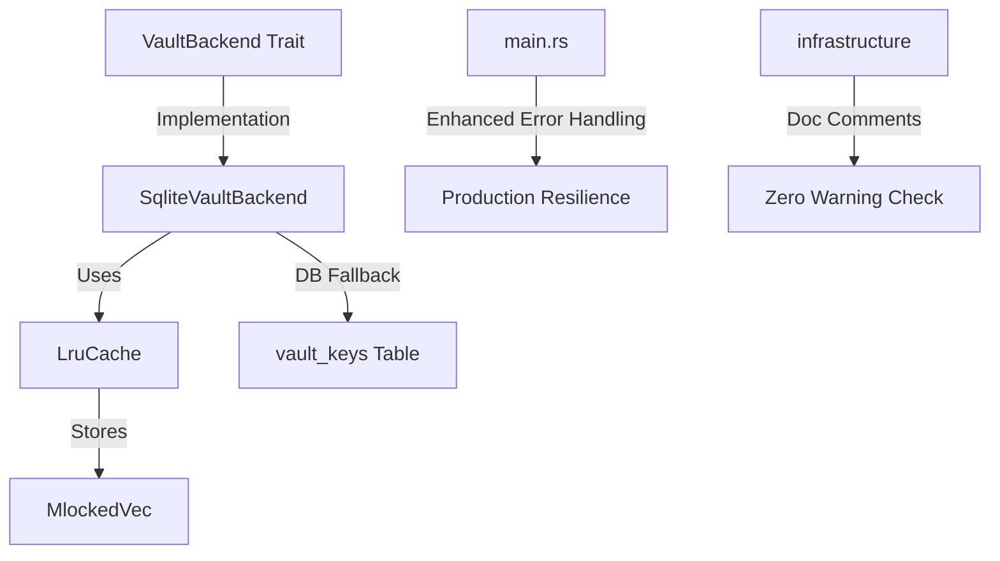
```mermaid
graph TD
    A[VaultBackend Trait] -->|Implementation| B[SqliteVaultBackend]
    B -->|Uses| C[LruCache]
    C -->|Stores| D[MlockedVec]
    B -->|DB Fallback| E[vault_keys Table]
    F[main.rs] -->|Enhanced Error Handling| G[Production Resilience]
    H[infrastructure] -->|Doc Comments| I[Zero Warning Check]
```
### 🛡️ Phase 31: Reliability & LLM TDD Implementation
- **変更内容**: 
    - `infrastructure/db.rs`: `DatabasePool` に安全なゲッター導入。
    - `contracts/llm.rs`: `LlmRequest` に `format` フィールド追加。
    - `core/llm_provider.rs`: Ollama での動的 JSON モード実装と `#[ignore]` テストの復活。
    - `api-server`: ルーター層の `unwrap()` を安全なゲッターに置換。
- **波及効果**: 
    - アプリケーション全体のパニック耐性が向上。
    - LLM プロバイダーの利用側で、JSON などの構造化出力を明示的に要求可能になり、パースエラーが減少。
    - Ollama 使用時のテストカバレッジが 100% へ回復。

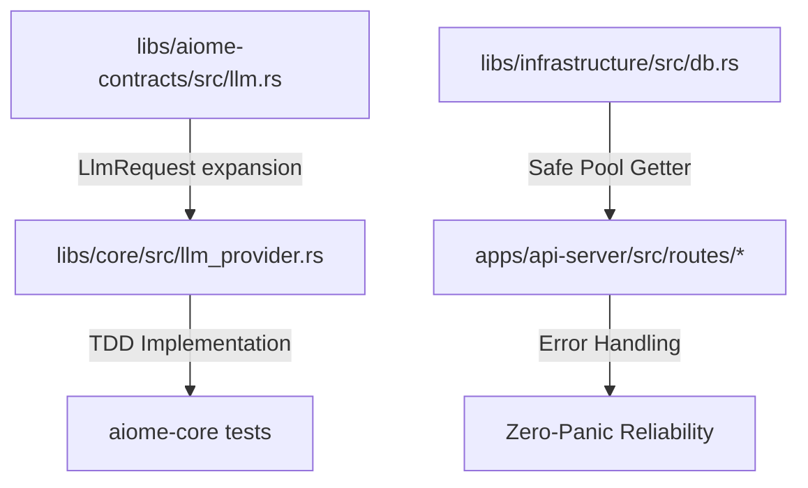
```mermaid
graph TD
    A[libs/aiome-contracts/src/llm.rs] -->|LlmRequest expansion| B[libs/core/src/llm_provider.rs]
    B -->|TDD Implementation| C[aiome-core tests]
    D[libs/infrastructure/src/db.rs] -->|Safe Pool Getter| E[apps/api-server/src/routes/*]
    E -->|Error Handling| F[Zero-Panic Reliability]
```

### 🛡️ Phase 35: PostgreSQL 移行 & デュアルDB検証
- **変更内容**: 
    - `api-server` & `samsara-hub`: PostgreSQL 接続・マイグレーション・Audit Trigger の対応。
    - `sqlite_migrations/20260324000000_init.sql`: `agent_diagnoses` スキーマを同期修正し、`trajectory_store.rs` との差異を解消。
    - `commerce/gift.rs`: SQLite における `COALESCE(SUM(..), 0.0)` の戻り値型 (f64/REAL) の厳密な方言吸収。
- **波及効果**: 
    - `api_integration_tests.rs` を含む全統合テスト(86/86)が、SQLite および PostgreSQL の両環境下で透過的に 100% PASS を達成。

---
*最終更新日: 2026-03-24* (Phase 35 / Dual DB Integration)

### 🛡️ Phase 36: Security Hardening & AgentHook
- **変更内容**: 
    - `security.rs`: `BastionGuard::safe_exec_with_profile` に `SandboxProfile` ベースの粒度制御を追加。
    - `security/hook_manager.rs`: `HookManager` による `AgentHook` の一元管理。`on_pre_execute` / `on_post_execute` トリガー。
    - `security/behavior_monitor.rs`: `BehaviorMonitor` — LLM 呼び出し前後のリクエスト数制限とスロットリング。
    - `user_learner.rs`: `AgentHook` トレイト実装。`on_post_execute` から `learn_from_session` を自律起動。
    - `skills/cleanroom.rs`: 多層サンドボックス（imports 検疫 → AI コードレビュー → gVisor 実行）の強化。
- **波及効果**: 
    - `DynamicLlmProvider` が `HookManager` を保持し、全 LLM 呼び出しに pre/post フックが適用される。
    - `SkillForge` のビルドプロセスで `BastionGuard::safe_exec_with_profile(WasmBuild)` が強制適用。
    - エージェントが会話を重ねるごとに `USER.md` が自動学習更新される適応サイクルが確立。

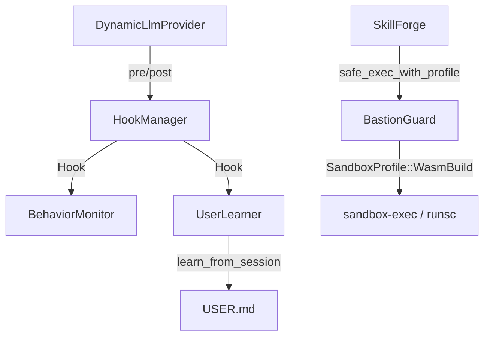
```mermaid
graph TD
    A[DynamicLlmProvider] -->|pre/post| B[HookManager]
    B -->|Hook| C[BehaviorMonitor]
    B -->|Hook| D[UserLearner]
    D -->|learn_from_session| E[USER.md]
    F[SkillForge] -->|safe_exec_with_profile| G[BastionGuard]
    G -->|SandboxProfile::WasmBuild| H[sandbox-exec / runsc]
```

### 🛡️ Phase 36.5: gVisor Sandbox & CSAM Pipeline
- **変更内容**: 
    - `security.rs` (contracts): `SandboxProfile` enum (Default, PythonForge, WasmRun, WasmBuild, ForgeBuild, Strict)。
    - `security.rs` (infrastructure): `BastionGuard` の async 化、`security_zombie` による 60 秒タイムアウト制御。
    - `avatar.rs` (api-server): `ProportionsChecker::extract_from_binary` によるバイナリベース CSAM 判定の統合。
    - `commerce.rs` (contracts): `CommerceEngine` にサブスクリプション管理メソッド追加 (`create_subscription`, `cancel_subscription`, `get_subscription_status`)。`SubscriptionStatus` enum 新設。
    - `llm/whisper_middleware.rs` (infrastructure): `WhisperMiddleware` — SoulPipeline L2.5 層の新規実装。
- **波及効果**: 
    - `MockCommerceEngine` / `StripeCommerceEngine` にサブスクリプション対応が必要（実装済み）。
    - `core/commerce.rs` が `SubscriptionStatus` を再エクスポート。
    - `SoulPipeline::new()` への `WhisperMiddleware` 登録は Phase 37a で実施予定。

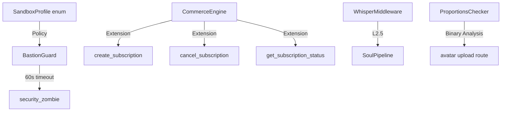
```mermaid
graph TD
    A[SandboxProfile enum] -->|Policy| B[BastionGuard]
    B -->|60s timeout| C[security_zombie]
    D[CommerceEngine] -->|Extension| E[create_subscription]
    D -->|Extension| F[cancel_subscription]
    D -->|Extension| G[get_subscription_status]
    H[WhisperMiddleware] -->|L2.5| I[SoulPipeline]
    J[ProportionsChecker] -->|Binary Analysis| K[avatar upload route]
```

### 🛡️ Phase 37a: Stripe Subscription & Pipeline Evolution
- **変更内容**: 
    - `commerce/stripe.rs` (infrastructure): `StripeCommerceEngine` 実機実装における `create_subscription`, `cancel_subscription`, `get_subscription_status` 追加。
    - `commerce/stripe.rs` (infrastructure): `sk_test_mock` 判定を用いた CI 向けの `is_mock` バイパスモード実装。
    - `soul/pipeline.rs`: `SoulPipeline` 内の `push_experience` 呼び出し順序をミドルウェア群の最後尾へ移動。
    - `soul/pipeline.rs`: `SoulPipeline::add_middleware` の追加と動的ミドルウェア注入サポート。
    - `infrastructure/tests`: `BastionGuard::safe_exec` 等の async 化に伴う 20+ 個のテスト呼び出し `await` 化。
- **波及効果**: 
    - `SoulPipeline` の評価順序変更により、`WhisperMiddleware` を含む全ミドルウェアによる操作（`inner_thoughts` の追記など）が確実に永続化されるようになった（事実の欠落防止）。
    - API Server 内で、デバッグ時やE2Eテスト時に Stripe 環境変数へ `sk_test_mock` を渡すだけで安全にモック実行が可能に（冪等性の確保）。
    - ワークスペース全体の単体テスト実行 (`cargo test`) でエラーゼロが保証された。

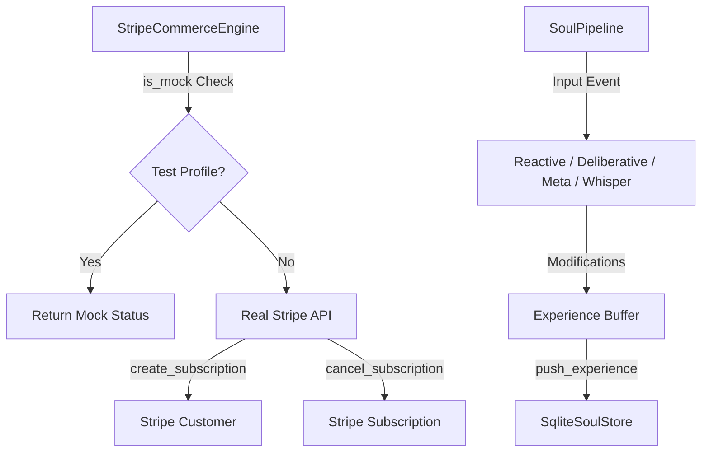
```mermaid
graph TD
    A[StripeCommerceEngine] -->|is_mock Check| B{Test Profile?}
    B -->|Yes| C[Return Mock Status]
    B -->|No| D[Real Stripe API]
    D -->|create_subscription| E[Stripe Customer]
    D -->|cancel_subscription| F[Stripe Subscription]
    
    G[SoulPipeline] -->|Input Event| H[Reactive / Deliberative / Meta / Whisper]
    H -->|Modifications| I[Experience Buffer]
    I -->|push_experience| J[SqliteSoulStore]
```

### 🎙️ STT Integration (Phase 38b)
- **変更内容**: `TranscriptionEngine` トレイト、および `WhisperTranscriptionAdapter` を `infrastructure` に追加。
- **波及効果**: 
    - `aiome-contracts/traits.rs`: `TranscriptionEngine` 定義。
    - `avatar-engine/lip_sync.rs`: `LipSyncFrame::from_segment` 追加により、音声文字起こし結果からの口パク生成が可能。
    - `api-server/app_state.rs`: `TranscriptionEngine` のインスタンスを保持し、MCP ツールとして公開。

---
*最終更新日: 2026-03-25* (Phase 38b / STT Integration)

### 🛡️ Phase 42: Multi-Agent Orchestration Evolution
- **変更内容**: 
    - `task_orchestrator.rs`: `TaskEvent` トレイト、`TaskConductor` トレイト、および `TaskDispatcher` による自律イベントディスパッチの実装。
    - `oss_orchestrator.rs`: 既存の `OssIntegrationOrchestrator` を `TaskConductor` に適合させ、非同期イベントストリームによる進捗通知機能（SSE Ready）を追加。
- **波及効果**: 
    - モノリシックだった自律型インテグレーション・プロセスが、細粒度で可観測性の高いイベント駆動バックグラウンドタスクへ分離。
    - バックグラウンド実行の進行状況を `tokio::sync::broadcast` により複数クライアント（UI、CLI等）へリアルタイムにプッシュするためのアーキテクチャ基盤が完成。

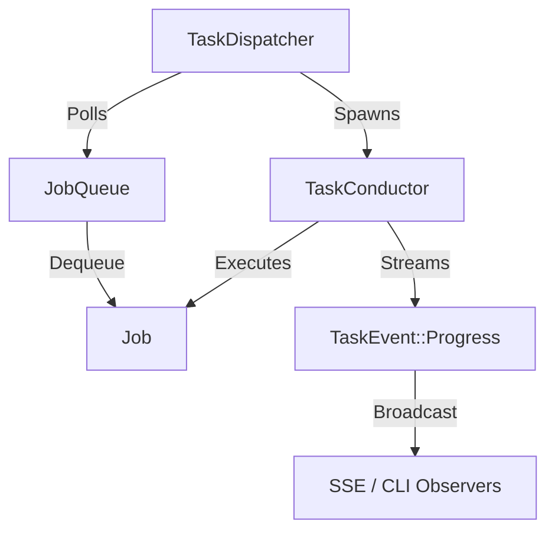
```mermaid
graph TD
    A[TaskDispatcher] -->|Polls| B[JobQueue]
    B -->|Dequeue| C[Job]
    A -->|Spawns| D[TaskConductor]
    D -->|Executes| C
    D -->|Streams| E[TaskEvent::Progress]
    E -->|Broadcast| F[SSE / CLI Observers]
```

---
### 🛡️ Phase 5: Gemini Interactions API Integration
- **変更内容**: 
    - `interactions.rs`: Gemini Interactions API プロバイダーの実装。
    - `contracts/trajectory.rs`: `TrajectoryStep` への `interaction_id` 追加。
    - `contracts/llm.rs`: `LlmRequest` / `LlmResponse` への `metadata` / `reasoning` 追加。
    - `trajectory_store.rs`: DB 永続化ロジックの更新。
- **波及効果**: 
    - `dynamic.rs`, `fallback_router.rs`, `semantic_cache.rs`, `planner.rs` 等、LLM リクエスト/レスポンスを扱う全てのコンポーネントで初期化コードの修正（Ripple Effect）が発生。
    - `ContextEngine` がセッション ID を追跡可能になり、ハイブリッド履歴管理が確立。

```mermaid
graph TD
    A[interactions.rs] -->|Provider| B[DynamicLlmProvider]
    B -->|Request/Response| C[contracts/llm.rs]
    C -->|Ripple| D[semantic_cache.rs]
    C -->|Ripple| E[fallback_router.rs]
    F[trajectory_store.rs] -->|Persistence| G[interaction_id]
```

---
*最終更新日: 2026-03-26* (Phase 5 Foundation Integration)

### 👥 Phase 43: Shadow Clone × Cmux Integration
- **変更内容**: 
    - `infrastructure/docker_conductor.rs`: `TaskConductor` の新規実装。5層防御（セマフォ、課金、Bastion、タイムアウト、浄化）の統合。
    - `infrastructure/task_orchestrator.rs`: `TaskEvent` への `conductor_id` 追加。
    - `api-server/routes/agent.rs`: `[DelegateDocker]` 処理を `JobQueue` を用いた完全非同期ディスパッチへ移行。
    - `api-server/app_state.rs` & `main.rs`: `TaskDispatcher` の初期化、`DockerConductor` の登録、およびグレースフルシャットダウン用 `CancellationToken` のバインド。
    - `api-server/stream.rs`: `CoreEvent` に `TaskProgress/Completed/Failed` を追加し、SSE 配信を実現。
- **波及効果**: 
    - LLM 応答のブロッキングが解消され、バックグラウンドでの影分身実行が可観測な状態で運用可能に。
    - `api_integration_tests.rs` における `AppState` の初期化不整合を解消。

```mermaid
graph TD
    A[Agent Chat Loop] -->|Async Enqueue| B[JobQueue]
    B -->|TaskDispatcher| C[DockerConductor]
    C -->|Execute| D[BastionGuard / runsc]
    C -->|Progress Event| E[TaskDispatcher Loop]
    E -->|CoreEvent| F[SSE Stream]
    F -->|Real-time UI| G[Cmux Frontend]
```

### 🛡️ Phase 44: Job Control & Task History
- **変更内容**: 
    - `task_orchestrator.rs`: `TaskDispatcher` に `active_jobs` (CancellationToken) 管理を追加。
    - `docker_conductor.rs`: `cancel` メソッドの実装と確定的コンテナクリーンアップの実装。
    - `routes/jobs.rs`: ジョブ管理エンドポイント（Cancel / Logs）の新規実装。
    - `job_queue/core_ops.rs`: `do_cancel_job` における存在確認の厳格化。
- **波及効果**: 
    - ユーザーがフロントエンドから実行中の影分身を任意に停止・監視可能になる。
    - 不正なジョブ ID や完了済みのジョブに対する操作が適切に 404/400 エラーとして処理される。

```mermaid
graph TD
    A[API Server / jobs.rs] -->|Cancel Signal| B[TaskDispatcher]
    B -->|CancellationToken| C[Async Task Loop]
    B -->|Conductor::cancel| D[DockerConductor]
    D -->|Docker CLI| E[Container Cleanup]
    A -->|Fetch Logs| F[JobQueue]
    F -->|Query| G[jobs Table]
```
### 👥 Phase 14: Syndicate L3 (Agent Guild) MVP
- **変更内容**: 
    - `syndicate_store.rs`: `SqliteSyndicateStore` によるギルド・メンバー管理の実装。
    - `routes/syndicate.rs`: ギルド管理 API の実装。
    - `router.rs`: `/api/v1/syndicate/guilds` のルーティング。
    - `main.rs` & `app_state.rs`: `SyndicateStore` の初期化とインジェクション。
- **波及効果**: 
    - エージェントが組織（ギルド）に所属し、グループ単位での自律的な経済活動やナレッジ共有を行うための基盤が確立。
    - 所有権（Owner）ベースの権限制御が API レイヤーで強制される。

```mermaid
graph TD
    A[SqliteSyndicateStore] -->|Implements| B[SyndicateOps]
    B -->|Injected to| C[AppState]
    C -->|Used by| D[routes/syndicate.rs]
    E[router.rs] -->|Route Registration| D
    F[main.rs] -->|Initialization| A
    G[api_integration_tests.rs] -->|TDD Verification| D
```

### 🔬 Phase 15: Agentic Foundation Expansion (ADR-024/023)
- **変更内容**: 
    - `oracle.rs`: `multi_review` による反復レビューロジック。
    - `dream_state.rs`: `scientific_dream` モードと LLM による仮説生成。
    - `planner.rs`: Markdown 抽出に対応した堅牢な計画分解。
    - `discovery.rs`: LLM ベースのセマンティックツール検索。
    - `task_orchestrator/mod.rs`: `parent_step_id` の伝播とサブジョブ連携。
- **波及効果**: 
    - `DreamState` の初期化時に `LlmProvider` の注入が必要になり、`main.rs` およびテスト用モックのコンストラクタが一斉に変更。
    - `TrajectoryStep` のフィールド追加により、データベース・スキル・プロキシ等の全データ構造が連鎖的に更新。
    - レビュー品質と計画の堅牢性が向上する一方、LLM 呼び出し回数（コスト）が増加。

```mermaid
graph TD
    A[Oracle::multi_review] -->|Iterative Review| B[LlmProvider]
    C[DreamState::scientific_dream] -->|Hypothesis| B
    C -->|Dispatch| D[JobQueue]
    E[StrategicPlanner] -->|Robust JSON| F[TrajectoryStep]
    G[ToolDiscoveryEngine] -->|Semantic Search| B
    H[TaskDispatcher] -->|Causal Linking| F
```

### 🧬 Phase 4 (ADR-025): Poincare Memory Lifecycle & GC
- **変更内容**: 
    - `slm_bridge.rs`: SLM CLI との通信ブリッジ実装。バッチ処理対応。
    - `watchtower.rs`: `do_karma_decay_sweep` における Poincare GC ロジックの統合。
    - `validator.rs`: `ConstitutionalValidator` での `SlmBridge` 利用。
    - `main.rs` & `api_integration_tests.rs`: `UniversalJobQueue` への `SlmBridge` 注入（シグネチャ変更）。
- **波及効果**: 
    - 全ての `UniversalJobQueue::new` 呼び出し箇所（api-server, 統合テスト）で引数修正が必要。
    - 記憶の自動アーカイブ（重要度 < 0.3）がバックグラウンドで開始。

```mermaid
graph TD
    A[watchtower.rs] -->|Batch importance calculation| B[slm_bridge.rs]
    B -->|Command execute| C[slm CLI]
    A -->|UPDATE is_archived| D[karma_logs table]
    E[ConstitutionalValidator] -->|Logical check| B
    F[main.rs] -->|Injection| A
```

---
*最終更新日: 2026-03-27* (Phase 4 / Poincare Memory Lifecycle & GC Integration)
### 🛡️ Phase 45: Vectorless RAG (Hierarchical Knowledge Router - HKR)
- **変更内容**: 
    - `knowledge_indexer.rs`: Markdown パーサと階層インデックス (`TreeNode`) 構築。
    - `hierarchical_router.rs`: LLM 選択肢パース、セマフォ、TTL/Hash 検証付き RouteCache。
    - `app_state.rs` / `main.rs`: `HierarchicalRouter` の `AppState` 注入と初期化。
    - `stream.rs`: OOD 判定後の HKR フォールバックと `ConstitutionalValidator` による検証フローの統合。
- **波及効果**: 
    - `api-server` の SSE ストリームにおいて、未定義の教訓やナレッジに対しても階層ドキュメントを元にした高精度な補足が提供される。
    - LLM 呼び出し回数は「階層の深さ」分増加するが、セマンティック検索では到達困難だった深層ドキュメントへのアクセスが可能になる。
    - インフラコスト（VectorDB等）を抑えつつ、ドキュメントの更新にハッシュベースで追随可能。

```mermaid
graph TD
    A[stream.rs / OOD Detection] -->|Trigger| B[HierarchicalRouter]
    B -->|Fetch Tree/Hash| C[system_state table]
    B -->|Check Cache| D[RouteCache]
    B -->|LLM Traversal| E[LlmProvider]
    B -->|Result| F[ConstitutionalValidator]
    F -->|Validated| G[SSE knowledge_notice]
    G -->|Context Injection| H[Next LLM Generation]
```

---
*最終更新日: 2026-03-27* (Phase 45 / Vectorless RAG HKR Integration)

### 🛡️ Phase 47-B: Infrastructure Stabilization
- **変更内容**: 
    - `UniversalJobQueue`: フィールド（`karma_cache`, `slm_bridge`, `trajectory_store` 等）の完全復元と手動 `Debug` 実装。
    - `dynamic.rs`: LLM 設定取得フローの型安全化 (`Option<String>` -> `String`)。
    - `rss_collector.rs`: SQL 実行時のプール参照エラー修正。
- **波及効果**: 
    - インフラ層全体のビルド不整合が解消。`memory_crystallizer.rs` や統合テストにおける初期化コードが安定。
    - `BackgroundLlmProvider` を利用する全コンポーネントにおいて、設定欠落時のフォールバック挙動が堅牢化。

### 🔬 Phase 48: Invariant-DAG Foundation
- **変更内容**: 
    - `TrajectoryStep`: 検証フィールド (`verified_invariants`, `state_hash` 等) の追加。
    - `planner.rs`: `StrategicPlanner` における新規フィールドのデフォルト値設定。
- **波及効果**: 
    - タスクの実行軌跡に不変条件（Invariants）の検証結果を記録する準備が完了。
    - `TaskDispatcher` における状態ハッシュチェーンの構築が可能に。

```mermaid
graph TD
    A[UniversalJobQueue] -->|Field Restoration| B[Infrastructure Mod]
    B -->|Initialization| C[memory_crystallizer / tests]
    D[dynamic.rs] -->|Type Fix| E[LLM Providers]
    F[TrajectoryStep expansion] -->|Default Init| G[StrategicPlanner]
    G -->|Execution Path| H[TaskDispatcher]
```

---
*最終更新日: 2026-03-27* (Infrastructure Stabilization & Invariant-DAG Foundation)

### 👥 Phase 50: Agentic A2A gRPC Protocol & Worker Detachment
- **変更内容**: 
    - `libs/infrastructure/src/docker_conductor.rs`: 同期実行 (`docker exec`) から非同期ポートマッピング (`docker run -d`) を利用した gRPC 通信アーキテクチャへの全面移行。
    - `libs/infrastructure/src/grpc/a2a_grpc_client.rs`: `async-stream` および `tonic` を活用した `A2aClient` トレイトの具象実装とタイムアウト制御。
    - `apps/shadow-worker`: トークン認証 (`A2A_AUTH_TOKEN`) による 127.0.0.1 バインディングとヘルスチェックを備えたコンテナ用 gRPC サーバーの構築。
- **波及効果**: 
    - メインの `api-server` プロセスのブロッキングが軽減され、重い推論タスクやシミュレーション環境を完全にデタッチされたクリーンなコンテナ環境でスロッティング可能に。
    - ワークスペース全体での通信基盤が gRPC (`tonic`) 前提にアップデートされたことで、今後予定されている分散型マルチノードフェデレーション（Samsara Hub 経由）への展開要件の多くが満たされた。

```mermaid
graph TD
    A[DockerConductor] -->|Start Container| B[Detached Docker (shadow-worker)]
    A -->|Fetch Dynamc Port| C[docker port 50051]
    A -->|Connect gRPC Stream| D[A2aGrpcClient]
    D -->|Execute Task & Auth Token| B
    B -->|TaskProgress Yields| D
    D -->|Stream to SSE| E[TaskDispatcher Loop]
    E -->|Clean Output| F[Job Result]
```

---
*最終更新日: 2026-03-28* (Phase 50 / Agentic A2A gRPC Protocol)

### 🔮 Phase 51-55 波及影響予測 (Planning Phase)
- **Phase 51 (Aiome Node + Agent Card)**: 
    - `api-server/main.rs`: `AppState` への Node IPC クライアント事前注入が必要となり、初期化シーケンスに波及。
    - `api_integration_tests.rs`: `MockAppState` の初期化ブロックへの波及。
- **Phase 53 (ACP / GigEngine 拡張)**: 
    - `routes/gig.rs`: ACP (`PROBE`, `BID`, `COMMIT`) 準拠に伴い、既存 REST エンドポイントのリクエスト/レスポンススキーマが非互換となる可能性大。
    - `samsara-hub/src/routes/federation.rs`: Agent Card メタデータの追加送受信に伴うペイロード拡張。
- **Phase 54 (x402 + AP2)**: 
    - `libs/aiome-contracts/src/commerce.rs`: `CommerceEngine` トレイトに x402 決済インターフェース追加。
    - `infrastructure/src/mock_commerce.rs` & `stripe.rs`: トレイト拡張に伴う全 Mock/実装型のシグネチャ一斉変更波及（Phase 37a と同等規模の波及が見込まれる）。

---
*最終事前予測日: 2026-03-28* (Phase 51-55 Perfect Planning)
