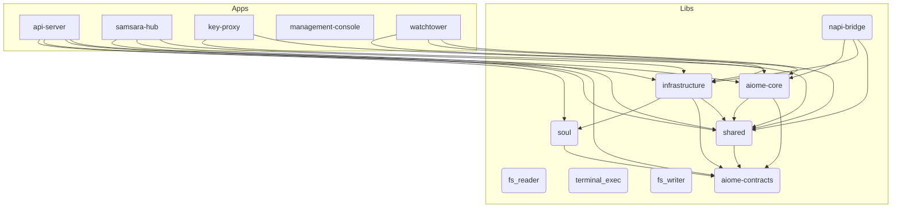

# 📐 Aiome Architecture Map (AI-First)

> This file is automatically generated by `scripts/generate_architecture.py` to provide a concise project structure overview for AI agents.

## 1. Core Paradigms
<!-- MANUAL_PARADIGM_START -->
- **Pattern B Architecture**: Front-end uses Gemini Cloud (`gemini-2.5-flash`), Background tasks use Ollama Local (`qwen3.5:9b`).
- **Abyss Vault**: Physical isolation of API keys in `key-proxy` process. Main AI engine holds no keys.
- **WASM/Docker Sandboxing**: Strict isolation for executing dynamic AI skills.
- **Context Management**: コード変更時は必ず影響範囲をまとめた [RIPPLE_MAP.md](file:///Users/motista/Desktop/antigravity/aiome/.context/RIPPLE_MAP.md) を参照し、重要な判断は `docs/decisions/` (ADR) に記録すること。
<!-- MANUAL_PARADIGM_END -->

## 2. Key Data Flow
<!-- MANUAL_FLOW_START -->
1. **User Interaction**: User inputs prompt in Management Console (Tauri/React).
2. **Routing**: `api-server` receives request, verifies auth.
3. **LLM Chain**: Context Engine injects UI state & KIs -> Request sent to LLM.
4. **Background**: `watchtower` loop runs every 5 mins, processes async skills via JobQueue.
<!-- MANUAL_FLOW_END -->

## 3. System Topology (Internal Dependencies)



## 4. Directory Map (Crates)

| Crate | Path | Description |
|---|---|---|
| `api-server` | `apps/api-server` | (Core Module) |
| `samsara-hub` | `apps/samsara-hub` | (Core Module) |
| `key-proxy` | `apps/key-proxy` | (Core Module) |
| `aiome-core` | `libs/core` | (Core Module) |
| `infrastructure` | `libs/infrastructure` | (Core Module) |
| `shared` | `libs/shared` | (Core Module) |
| `fs_reader` | `libs/wasm-skills/fs_reader` | (Core Module) |
| `terminal_exec` | `libs/wasm-skills/terminal_exec` | (Core Module) |
| `fs_writer` | `libs/wasm-skills/fs_writer` | (Core Module) |
| `napi-bridge` | `libs/napi-bridge` | (Core Module) |
| `management-console` | `apps/management-console/src-tauri` | A Tauri App |
| `watchtower` | `apps/watchtower` | (Core Module) |
| `aiome-contracts` | `libs/aiome-contracts` | (Core Module) |
| `soul` | `libs/soul` | (Core Module) |

## 5. Critical Environment Variables
*(Auto-extracted from `.env.example`)*
```text
AIOME_DB_PATH, WORKSPACE_DIR, DATABASE_URL, PORT, ALLOWED_ORIGINS, BIND_ALL, API_WS_URL, OLLAMA_HOST, OLLAMA_MODEL, BG_LLM_PROVIDER, BG_LLM_MODEL, EMBEDDING_PROVIDER, GEMINI_API_KEY, GEMINI_MODEL, GEMINI_EMBED_MODEL, OPENAI_API_KEY, ANTHROPIC_API_KEY, API_SERVER_SECRET, VAULT_SECRET, FEDERATION_SECRET, KEY_PROXY_URL, KEY_PROXY_PORT, QUOTA_DB_PATH, SAMSARA_HUB_URL, SAMSARA_HUB_REST, SAMSARA_HUB_WS, SEARCH_API_ENDPOINT, SEARCH_API_KEY, SKILL_FORGE_ENABLED, RURI_EMBED_URL, DISCORD_TOKEN, DISCORD_CHAT_CHANNEL_ID, DISCORD_COMMAND_CHANNEL_ID, DISCORD_LOG_CHANNEL_ID, TELEGRAM_TOKEN, TELEGRAM_CHAT_ID, NODE_ID, FEDERATION_PEERS, LOG_LEVEL, JSON_LOGS, ENFORCE_GUARDRAIL, ADVANCED_EXPERIENCE_MODE, OLLAMA_BASE_URL
```

---
*Last Auto-Generated: 2026-03-19 03:44:12 UTC*
