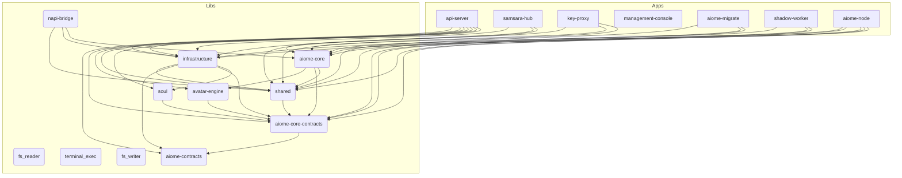

# 📐 Aiome Architecture Map (AI-First)

> This file is automatically generated by `scripts/generate_architecture.py` to provide a concise project structure overview for AI agents.

## 1. Core Paradigms
<!-- MANUAL_PARADIGM_START -->
- **Pattern B Architecture**: Front-end uses Gemini Cloud (`gemini-2.5-flash`), Background tasks use Ollama Local (`qwen3.5:9b`).
- **Abyss Vault**: Physical isolation of API keys in `key-proxy` process. Main AI engine holds no keys.
- **WASM/Docker Sandboxing**: Strict isolation for executing dynamic AI skills.
- **Context Management**: コード変更時は必ず影響範囲をまとめた [RIPPLE_MAP.md](.context/RIPPLE_MAP.md) を参照し、重要な判断は `docs/decisions/` (ADR) に記録すること。
<!-- MANUAL_PARADIGM_END -->

## 2. Key Data Flow
<!-- MANUAL_FLOW_START -->
1. **User Interaction**: User inputs prompt in Management Console (Tauri/React).
2. **Routing**: `api-server` receives request, verifies auth.
3. **LLM Chain**: Context Engine injects UI state & KIs -> Request sent to LLM.
4. **Background**: `watchtower` loop runs every 5 mins, processes async skills via JobQueue.
<!-- MANUAL_FLOW_END -->

## 3. System Topology (Internal Dependencies)



## 4. Directory Map (Crates)

| Crate | Path | Description |
|---|---|---|
| `api-server` | `apps/api-server` | (Core Module) |
| `samsara-hub` | `apps/samsara-hub` | (Core Module) |
| `key-proxy` | `apps/key-proxy` | (Core Module) |
| `aiome-core` | `libs/core` | (Core Module) |
| `infrastructure` | `libs/infrastructure` | (Core Module) |
| `shared` | `libs/shared` | (Core Module) |
| `avatar-engine` | `libs/avatar-engine` | Aiome physical manifestation and 2D asset routing engine (Inochi2D & VRM compatible) |
| `fs_reader` | `libs/wasm-skills/fs_reader` | (Core Module) |
| `terminal_exec` | `libs/wasm-skills/terminal_exec` | (Core Module) |
| `fs_writer` | `libs/wasm-skills/fs_writer` | (Core Module) |
| `napi-bridge` | `libs/napi-bridge` | (Core Module) |
| `management-console` | `apps/management-console/src-tauri` | A Tauri App |
| `aiome-contracts` | `libs/aiome-contracts` | (Core Module) |
| `aiome-core-contracts` | `libs/aiome-core-contracts` | (Core Module) |
| `soul` | `libs/soul` | (Core Module) |
| `aiome-migrate` | `apps/aiome-migrate` | (Core Module) |
| `shadow-worker` | `apps/shadow-worker` | (Core Module) |
| `aiome-node` | `apps/aiome-node` | (Core Module) |

## 5. Critical Environment Variables
*(Auto-extracted from `.env.example`)*
```text
API_SERVER_SECRET, NURTURE_INTERNAL_SECRET, NURTURE_API_URL, ALLOWED_ORIGINS, FEDERATION_SECRET, JWT_PRIVATE_KEY_B64, BG_LLM_PROVIDER, BG_LLM_MODEL, EMBEDDING_PROVIDER, TTS_PROVIDER, TTS_OPENAI_API_KEY, TTS_OPENAI_MODEL, TTS_ENDPOINT, XTTS_ENDPOINT, XTTS_SPEAKER, STRIPE_TEST_MODE, A2A_NODE_URL, TIMESFM_URL, TIMESFM_AUTH_TOKEN, GEO_OPTIMIZER_URL, ABYSS_VAULT_URL, WP_API_URL, WP_API_TOKEN, SEARCH_API_KEY, FIRECRAWL_API_KEY, EXA_API_KEY, BRIGHTDATA_API_KEY, PORT, AIOME_DEV_MODE, ABYSS_VAULT_PATH, KEY_PROXY_URL, VAULT_SECRET, VAULT_MASTER_KEY, SAMSARA_HUB_URL, FEDERATION_SYNC_INTERVAL, SAMSARA_HUB_REST, SAMSARA_HUB_WS, EKYC_RETURN_URL, EKYC_CALLBACK_URL, SHADOW_CLONE_IMAGE, SHADOW_CLONE_GRPC_HOST, SHADOW_CLONE_GRPC_PORT, A2A_GRPC_HEALTH_INTERVAL_MS, A2A_GRPC_CONNECT_TIMEOUT_MS, A2A_AUTH_TOKEN, OXILEAN_PROOF_TIMEOUT_SECS, OXILEAN_PROOF_SEMAPHORE_PERMITS, A2A_NODE_TOKEN, TIMESFM_SIDECAR_URL, AIOME_DB_PATH, AIOME_FORCE_MOCK_PUBLISHER, AIOME_SKIP_OLLAMA, AIOME_STT_ENABLED, BIND_ALL, DISCORD_DEFAULT_CHANNEL_ID, DISCORD_TOKEN, ENFORCE_GUARDRAIL, FRONTEND_STATIC_PATH, GEMINI_EMBED_MODEL, GEMINI_MODEL, KEY_PROXY_PORT, LOG_LEVEL, MAX_PROJECT_RULES_CHARS, MCP_SKILL_MD_INJECTION, OLLAMA_HOST, QUOTA_DB_PATH, RURI_EMBED_URL, SEARCH_API_ENDPOINT, SKILL_FORGE_ENABLED, KANI_STUB_MODE, KANI_PROOF_TIMEOUT_SECS, TELEGRAM_TOKEN, WORKSPACE_DIR, WP_SDK_ENABLED, X_API_ENDPOINT, MCP_ALLOW_LOCALHOST, GEO_CITABILITY_THRESHOLD, GEO_ENABLED, OAUTH_REDIRECT_URI, OTHER_VAR
```

---
*Last Auto-Generated: 2026-05-11 UTC*
