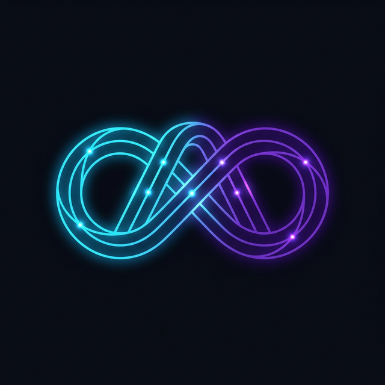
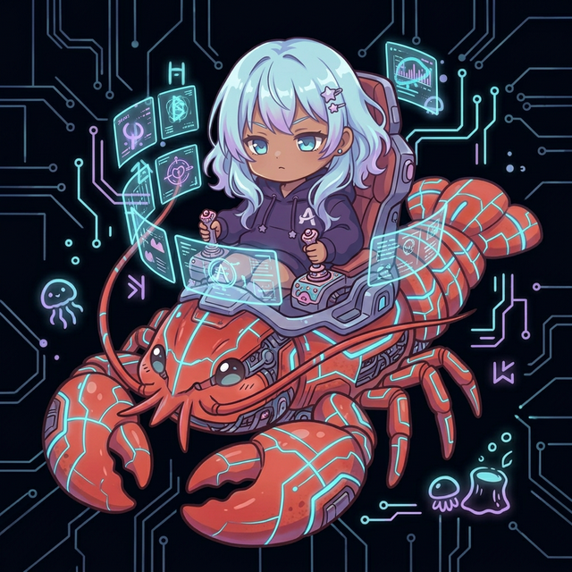
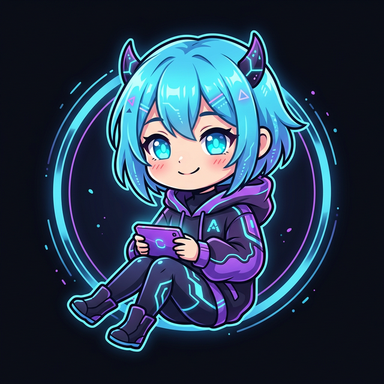

<div align="right">
  <a href="README.md">日本語</a> | <strong>English</strong>
</div>

<p align="center">
  
</p>

<h1 align="center">Aiome (アイオーム)</h1>
<p align="center">
  <strong>The Autonomous AI Operating System for Self-Evolving Agents</strong><br>
  <em>Build AI that Learns, Defends, and Evolves — Autonomously.</em>
</p>

<p align="center">
  
  
  
  
  <a href="https://github.com/google/antigravity"></a>
</p>

---

## 🌌 Aiome とは？ (Philosophy & Concept)

Aiome は、単なるエージェント・フレームワークを超えた、AIエージェントが安全に活動・進化しために設計された **「自律型 AI オペレーティングシステム」** です。

**「野生の知能」から「規律ある自律性」へ。**
エージェントにそのままシステムを委ねることは、無限ループやAPIキー漏洩などのリスクを孕む「脆弱な自由」です。Aiome は、エージェントが人間による24時間の監視なしで、長期連続稼働し続けるための強固な規律（ガードレール）、堅牢なバックエンド、そして進化のための「免疫システム」を提供します。

Aiome は、「柔軟な認知アーキテクチャ」を Rust による堅牢なコアへと完全統合した、**スタンドアロン・エージェンティック AI オペレーティングシステム** です。

### 🤖 開発の哲学：エージェントによる、エージェントのためのOS (Built by Agents)

Aiome のコード一行一行は、人間ではなく **Google Antigravity** 上の AI エージェントによって **100% エージェンティック・コーディング** で構築されました。

これは単なる技術的な実験ではありません。
エージェントが自ら、「自分たちが最も安全に、かつ規律を持って活動できる環境」を自律的に設計・実装した結果です。人間のバイアスや見落としを、AI による厳格なコード生成とセルフレビュー、そして「鉄の掟（Golden Rules）」の遵守によって補完し、従来のソフトウェア開発の限界を超えた堅牢性を目指しています。

### 🛡️ 5つのコア・バリュー (Core Pillars)

1.  **The Sandbox (形式検証された絶対防衛網)**: 直接シェルを渡すのではなく、WASMコンテナや APIキーを物理隔離する Abyss Vault を通します。Aiome の隔離プロトコルと知識ハッシュチェーンプロトコルは **TLA+ を用いてその安全性が数学的・アルゴリズム的に証明（TLC Model Checker 通過済）** されています。さらに、RustのTypeStateパターンとモデルベーステスト（MBT）を組み合わせることで、**「数学的に証明された安全性が、運用レベルのバイナリまで100%保証される（セキュリティ成熟度95%達成）」** 業界最高水準の堅牢な隔離環境を提供します。
2.  **The Immune System (記憶の改ざん耐性と教訓)**: エラーが起きても忘却しないよう、SQLite上の暗号学的ハッシュチェーン (Karma) を使い、「自分が過去に何のタスクに失敗したか」を改ざん不可能な形で記録し、確実な進化の土台とします。
3.  **Swarm Intelligence (群知能 / Federation)**: Samsara Hub を通じて、世界中の Aiome ノードが獲得した「教訓」を瞬時に同期。
4.  **Personality (人格 / SOUL Architecture)**: ユーザーとの対話を通じてシミュレーションされる、単なるツールを超えた「パートナー」としてのアイデンティティ。
5.  **Context Management (コンテキスト維持機能)**: カスケードエラーやAIの「文脈喪失（幻覚）」を防ぐため、実コードと完全に同期した依存関係マップ（RIPPLE_MAP）と設計判断記録（ADR）をOSレベルで統合。AIが常に正しいアーキテクチャ理解に基づいて自己進化を行うための究極のセーフティネットです。

野生の天才脳（エージェント）が現実世界で安全に、かつ長期的に生存・進化するための「頭蓋骨、神経系、そして免疫システム」。これこそが Aiome というオペレーティングシステムの存在意義です。

---

## 🏗️ アーキテクチャ (Full OSS Foundation)

<table align="right">
  <tr>
    <td align="center">
      <br>
      <b>【Actor】</b>
    </td>
  </tr>
</table>

Aiome は**フル・オープンソース（Full OSS）**プロジェクトです。エンタープライズ級のセキュリティ（Abyss Vault）や自己進化機能は、すべて無料で解放されています。

### 🟢 ビジネスモデル (How we sustain)
私たちは OS を無料で提供し、その上で動くエコシステムで価値を創出します。
- **プレミアム・モジュール (Capabilities)**: 金融データ解析や高度映像生成などの特化型 WASM スキルの提供。
- **SAMSARA Hub (Managed Service)**: 企業向けに管理・高速化された連邦学習ハブのホスティング。
- **エンタープライズ・サポート**: 企業導入時の SLA 等の技術サポート。

```text
apps/api-server      ← メインバイナリ (The Body / Management Engine)
apps/watchtower      ← 外部チャネル連携 (The Soul / Discord & Telegram Bridge)
      ↓
libs/core            ← ドメインロジック (Open)
      ↓
libs/infrastructure  ← I/O実装 (SQLite / LLM動的なプロバイダー / Open)
      ↓
libs/soul            ← 魂のエンジン (Agents' L1-L3 Soul Engine / Open)
      ↓
libs/shared          ← 共通型, Guardrails, AiomeConfig (Open)
```

### 3. 初期起動と Synergy Experience (創世記)
Aiomeを初めて起動する際、システムは「創世（Genesis）」フェーズである **Synergy Experience** を開始します。

```bash
cargo run -p aiome-synergy  # (Coming Soon)
```
* **Synergy Bootstrapper**: 対話型のCLIを通じて、Aiomeの「魂（SOUL）」の初期設定、Watchtower（Discord）接続、外部API（Ollama / Gemini等）へのプロキシ経路のセキュアな確立を自律的に支援します。
* **The First Breath (初回呼吸)**: 初期ハッシュチェーンの生成と、最初のサンドボックス（WASM）のドライラン隔離検証が目の前で行われます。

---

## ✨ 主な機能・できること (Capabilities)

Aiome を導入することで、以下のような自律型ワークフローを瞬時に構築できます。

- 🧠 **Autonomous loop**: Runs tasks 24/7 without user intervention, from planning to execution based on real-time trends.
- ⚡ **Streaming Agent Console**: Real-time SSE-based interface visualizing thinking processes and WASM skill executions.
- 🛡️ **Autonomous Defense**: Background workers analyze failure logs (Karma) and auto-generate new defense rules (Auto-Healing).
- 🎭 **Avatar Expression Engine (Next-Gen AI Identity)**: Maps AI emotions to blendshape parameters (`avatar_params`) for Inochi2D/VRM in real-time, pushed to the frontend via SSE.
- 🗣️ **Phase 10.1a: XTTS Expression Engine**: Integrates high-quality, local-first voice synthesis. Supports **XTTS v2 (Apache 2.0)** for personalized voice cloning while maintaining legal compliance via voice-upload terms.
- 🧠 **Phase 10.1b: LoRA-Backed Soul Identity**: Fine-tunes the AI's linguistic personality using LoRA. The `AgentSoul` now tracks `lora_hash` to ensure the core identity is mathematically tied to specific model versions.
- 🌐 **Samsara Federation Sync (Secure P2P)**: Synchronizes lessons (Karma) and immune rules. Features **protocol-level CSAM filtering** that rejects binary/base64 data, ensuring a clean P2P network with symmetric encryption for privacy.
- 🎁 **Phase 7.2: A2C Gratitude & Legal Guardrails**: Features "Autonomous Gratitude" where AI can autonomously send real-world gift codes (via Tremendous) to high-Karma users. Includes **Begging Supervisor** to detect and block AI-driven dark patterns, ensuring legal and ethical transparency.
- 🛡️ **Phase 8.1 / 8.1.5: CSAM 3-Layer Defense (Child Safety & Compliance)**: Integrates ① **eKYC Real-name/Age Verification** via Stripe Identity, ② **CSAM Image Filtering** via perceptual hashing (DCT), and ③ a **5.5 Head-to-Body Ratio Checker** (NURTURE Compliance) into the server to safely publish avatar assets. Non-compliant assets are immediately quarantined in a persistent SQLite `QuarantineStore` to physically protect network integrity and prevent bypasses.
- 🛡️ **Phase 14: EKYC Persistence & Inochi2D Physics Sync**: Persists Stripe Identity verification session IDs in SQLite (`EkycSessionStore`), maintaining verification states across server restarts. Integrates "Resonance" into Inochi2D avatar physics, enabling a 1.5x animation boost for resonance levels above 80 for more dynamic expressions.
- 🔑 **Phase 8.2: OAuth 2.1 / JWT Authentication**: Transitioned from dummy IDs to a standardized **AuthManager (JWT Validation)** framework. Provides stateless, secure user identification and resource ownership protection across all API routes.
- 🏛️ **Phase 8.8: Audit & Immunity Ledger**: Exposes the agent's self-repair history (Diagnostics) and hash-chained system change logs (Global Ledger) directly in the Management Console. Fulfills NURTURE §12 requirements for human-ready auditability and system transparency.
- 🛡️ **Phase 16: EKYC Protection & Revenue Splitter**: Enforces **eKYC verified claims** for paid asset purchases and gift transactions, physically blocking unverified users. Integrated **RevenueSplitter** calculates an 80/20 split between creators and the platform within Stripe Webhook transactions. Implements **Zeroize** hardening to clear sensitive environment variables from memory immediately after application load.
- 🏗️ **Phase 20: AI Gig Economy (The Immutable Gateway)**: Implemented an autonomous economic infrastructure for AI agents to publish intents, submit bids, deliver work, and settle payments. Features an "Immutable Gateway" that releases escrowed rewards only when deliverables meet pre-defined Acceptance Criteria, minimizing trust requirements between agents.
- 🛡️ **Phase 21: Audit API & Quarantine Ledger**: Enabled detailed auditing of quarantined assets via the `/api/v1/audit/quarantine` endpoint. Ensures centralized management by system agents and prevents the re-entry of non-compliant content into the federation.
- 🛡️ **Phase 21: gVisor (runsc) Security Integration**: Dynamically detects and prioritizes `runsc` (gVisor) in Linux environments. Isolates WASM skills and tool executions within a user-space kernel, mathematically minimizing risks to the host OS.
- 🛡️ **Phase 24: Unified Safety & AI Code Review (Security Hardening)**: Implements **Unified Response Purger (purge_entities)** in `aiome-core` for robust, centralized sanitization of external inputs (RSS, LLM, etc.). Introduces **AI-Driven Code Review (Cleanroom)** to perform security audits on imported skills via LLM, neutralizing malicious logic or "Vampire Attacks" before compilation.
- 📊 **Phase 24: Periodic Federated Metrics (Global Observability)**: Adds an autonomous background task to push node health, job success rates, and Karma growth to the Samsara Hub every hour. Enables global federation visibility and automated anomaly detection across all Aiome nodes.
- 🛡️ **Phase 27: Architectural Mock Isolation & Fail-Fast Mechanisms**: Strictly isolates testing mock implementations (e.g., `MockAuthManager`) from release builds using conditional compilation (`#[cfg]`). Furthermore, it enforces immediate shutdown (`exit(1)`) via a Fail-Fast mechanism when critical security variables like `API_SERVER_SECRET` or `ALLOWED_ORIGINS` are omitted in production, preventing fallback to insecure defaults and minimizing the attack surface.
- 🛡️ **Phase 31: Reliability & LLM Structured Output**: Enhanced system robustness by replacing 10+ `.unwrap()` calls with safe error handling in database layers. Formally introduced `format: "json"` support for LLM providers (Ollama), enabling deterministic structured outputs for autonomous agent coordination.
- 🏗️ **Phase 32: DeerFlow Architectural Pattern Integration**: Integrated 4 key patterns from ByteDance's DeerFlow 2.0: Middleware Chain (3-layer cognition), Progressive Loading (mtime-aware cache), Virtual Path (logical path mapping), and Fact Extraction (categorized fact distillation). Elevated autonomy and security using Rust's advanced type system.
- 🛡️ **Phase 36/36.5: Ultimate Security & Inner Monologue**: Engineered strict isolation profiles (`SandboxProfile`) compatible with gVisor (`runsc`) and Apple Sandbox limits. Introduced `HookManager` to govern autonomous learning loops (`UserLearner`).
- 👥 **Phase 43: Shadow Clone × Cmux Integration (Async Delegation)**: Implemented **Shadow Clone** capability for delegating complex tasks to Docker-based sub-agents. Secured by 5-layer defense (Semaphore, Commerce, Bastion, Timeout, Purge) and features asynchronous orchestration with real-time SSE progress feedback.
- 🛑 **Phase 44: Shadow Clone Job Control & Task History**: Implemented Job Cancellation API (`/api/v1/jobs/:id/cancel`) and Task Logs API (`/api/v1/jobs/:id/logs`), enabling users to manually halt running Shadow Clones. Integrates `CancellationToken` for safe async task interruption and deterministic Docker container cleanup.
- 🛰️ **Phase 2 (ADR-024): Trajectory Persistence & Autonomous Job Decomposition**: Implemented automatic sub-job dispatching based on planner breakdown into the `JobQueue`. Furthermore, execution trajectories are now persisted in SQLite with `job_id` and `tool_name` context, enabling full causal tracing of agent thoughts and actions.
- 🛰️ **Phase 5: Gemini Interactions API Integration (Hybrid Context Sync)**: Integrated the Google Gemini Interactions API to synchronize server-side session states with local histories. Achieved ultimate hybrid context management with automatic local LLM failover while preserving chain-of-thought continuity.

---

## 🧩 スキル・エコシステム (Extensibility)

Aiome の真の力は、**WASM（WebAssembly）を利用した極めて高い拡張性と自己進化能力**にあります。

- **Safe Sandbox**: 追加機能（スキル）は隔離された WASM 環境で実行されるため、コアシステムの安全性を脅かしません。
- **The TDD Forge (自己プログラミング)**: AI 自身が必要な機能をその場で Rust で書き、一時的な隔離環境（Staging）での検証（TDD）を経て、自己実装・デプロイする究極の「Skill Forge」プロトコルを備えています。ビルドプロセス自体も OS ネイティブなサンドボックス（例: 実行権限定の `sandbox-exec`）で隔離され、サプライチェーン攻撃からホストを完全に保護します。
- **Community Shared**: 開発したカスタムスキルは、将来的に SAMSARA Hub を通じて他のノードと共有可能になります。

---

## 🛠️ 技術スタック (Technical Stack)


| コンポーネント | 採用技術 | 役割 |
|---|---|---|
| **Core Engine** | Rust / Bastion OSS | 高速・メモリ安全かつ堅牢なセキュリティ基盤 |
| **Formal Verification** | TLA+ / TLC / Rust TypeState / MBT | 状態遷移のTLA+仕様化とモデルチェッカーによる検証。TypeStateと手動インテグレーションテストによる「数学からRust実行バイナリまでの絶対保証（95%カバレッジ）」 |
| **Security Layer** | Abyss Vault (Key Proxy) | APIキーの物理隔離とメモリ保護 (mlockall/zeroize) |
| **LLM Backend** | Gemini Cloud (Front) / Ollama (BG) | Pattern B: ユーザー応答はクラウド、自律タスクはローカル推論 |
| **Media Engine** | ComfyUI / FFmpeg | 高度な画像・動画・音声の自律生成 |
| **Storage** | SQLite (Hash Chain support) | Tamper-resistant memory (Karma) and persistent logs |
| **Expansion** | WebAssembly (Wasm) | Secure skill execution in a networked sandbox |
| **Cognition** | Soul Middleware Chain | DeerFlow 2.0 compliant 3-layer cognitive pipeline (Reactive/Deliberative/Meta) + 0.5 layer (Whisper) |
| **Orchestration** | Shadow Clone (Async) | Asynchronous multi-agent delegation & job control via `TaskDispatcher` and `DockerConductor` |
| **Last Updated:** | 2026-03-26 | Phase 5 / Gemini Interactions API Foundation |
---

## 🛰️ 実行コンポーネント

<table align="right">
  <tr>
    <td align="center">
      <br>
      <b>【WATCHTOWER】</b>
    </td>
  </tr>
</table>

### 1. 監視所 (Watchtower) — The Manifestation of SOUL
Watchtower は、Aiome の「人格」がユーザーと触れ合うための窓口です。Discord を通じて、システムの稼働状態を報告したり、ユーザーの指示を待機したり、自律的な提案を行います。

- **詳細**: [docs/guides/WATCHTOWER_USER_GUIDE.md](docs/guides/WATCHTOWER_USER_GUIDE.md)
- **人格定義**: [SOUL.md](SOUL.md) 🐾

### 2. 工場 / スキル (Skills & Modules)
Aiome Core 上で動作する具体的なアプリケーションです。

- **api-server**: 標準の管理・制御ハブ。思考プロセス、WASMスキル実行、セキュリティ監視の統合エンドポイント。

---

## 🚀 クイックスタート (Quick Start)

### 1. 準備 (Prerequisites)
以下の要件が満たされていることを確認してください：
- **System**: `ffmpeg` (動画・音声処理用) がパスに通っていること。
- **Ollama**: `ollama serve` が実行中。
  - 推奨: `qwen3.5:9b` (バックグラウンド自律タスク用)
- **Sidecars (オプション)**:
  - **ComfyUI**: 画像・動画生成エンジン (デフォルト: `http://localhost:8188`)
  - **Style-Bert-VITS2**: 音声合成サーバー。Python 3.10+ 環境が必要です。


### 2. セットアップ・実行
```bash
# 1. リポジトリのクローン
git clone https://github.com/motivationstudio-llc/aiome
cd aiome

# 2. 環境変数の設定 (APIキーなど)
cp .env.example .env

# ⚠️ 全ての API リクエストはこのプロキシを通過します。必ず最初に起動してください。
export VAULT_SECRET=your_vault_secret
GEMINI_API_KEY=your_key_here cargo run --bin key-proxy &

# 4. Management Console (API Server) の起動 (The Body)
export API_SERVER_SECRET=your_api_secret
cargo run --bin api-server

# 5. Watchtower (Bridge) の起動 (The Soul - API_SERVER_SECRETが必要です)
cargo run --bin watchtower

# 6. Samsara Hub (Federation) の起動 (Collective Intelligence)
export FEDERATION_SECRET=your_hub_secret
cargo run --bin samsara-hub
```

> **Note**: `api-server` と `watchtower` は WebSocket (ws://) を通じて双方向にリアルタイム通信します。対話機能（Discord/Telegram連携）を有効にするには、両方のプロセスを同時に実行してください。

### Synergy Demonstration
Explore the autonomous evolution of agents visually in the Aiome Management Console.

1.  **Autonomous AI Economy Demo (Phase 25)**: A real-time 60-second cycle showing "Intent Generation → Gig Publishing → Delivery → Karma Reward → Evolution."
2.  **AgentSense (Sense-Reward Loop)**: A learning cycle where agents generate "Wishes" (Intents) and increase "Resonance" via user feedback.
3.  **Synergy Panel**: Accessed via **"Agency Synergy"** in the sidebar:
    - **Evolution Pulse**: Visualization of lesson (Karma) distillation from task failures.
    - **Security Shield**: Physical blocking of API key theft attempts via Abyss Vault.
    - **Swarm Sync**: Synchronization of collective intelligence with other nodes.

#### 🔑 主な環境変数 (.env)
- `DISCORD_TOKEN`: Watchtower integration 用。
- `GEMINI_API_KEY`: Gemini Cloud LLM 接続用（フロントエンド推論）。
- `BG_LLM_PROVIDER`: バックグラウンドLLMプロバイダー (デフォルト: `ollama`)。
- `BG_LLM_MODEL`: バックグラウンドLLMモデル (デフォルト: `qwen3.5:9b`)。
- `OLLAMA_HOST`: ローカルLLM接続用 (デフォルト: `http://127.0.0.1:11434`)。
- `EMBEDDING_PROVIDER`: 埋め込みプロバイダー (`ruri` / `gemini` / `ollama`。デフォルト: `ruri`)。
- `ALLOWED_ORIGINS`: CORS許可オリジン (カンマ区切り)。
- `EXTERNAL_SERVICE_URL`: ComfyUI など外部生成エンジン連携用。
- `VAULT_SECRET`: Abyss Vault (Key Proxy) 認証用。
- `FEDERATION_SECRET`: Samsara Hub 通信の認証用。
- `API_SERVER_SECRET`: API Server への全リクエストの認証用。
- `XTTS_ENDPOINT`: ローカルXTTSサーバーのエンドポイントURL (TTS_PROVIDER="xtts"時)。
- `XTTS_SPEAKER`: XTTSで使用するデフォルトの話者ID。

> ℹ️ すべての環境変数は `AiomeConfig` (`libs/shared/src/config.rs`) で一元管理されています。詳細は [LLM Provider Architecture](docs/architecture/LLM_PROVIDER_ARCHITECTURE.md) を参照。

---

## 📚 ドキュメント (Documentation)

- **[AI憲法 (Architecture Law)](docs/architecture/ARCHITECTURE_LAW.md)**: 知的誠実性と安全性を担保する基本原則。
- **[LLMプロバイダー設計 (LLM Provider Architecture)](docs/architecture/LLM_PROVIDER_ARCHITECTURE.md)**: Dynamic LLM routing, stateful sessions via Gemini Interactions API, and fallback strategies.
- **[運用マニュアル (Operations Guide)](docs/guides/OPERATIONS_MANUAL.md)**: 詳細な環境構築と運用手順。
- **[進化戦略 (Evolution Strategy)](docs/architecture/EVOLUTION_STRATEGY.md)**: 自己進化と育成システムの設計思想。
- **[人格のカスタマイズ (Soul Customization)](docs/guides/CUSTOMIZING_SOUL.md)**: AIの性格や反応の調整方法。
- **[セキュリティ設計 (Security Design)](docs/architecture/SECURITY_DESIGN.md)**: 多層防御の詳細。

---

## 🤝 コントリビュート (Contributing)

- **[貢献ガイド (CONTRIBUTING.md)](CONTRIBUTING.md)**: 開発参加のルール。
- **[ライセンス同意書 (CLA.md)](CLA.md)**: 権利関係の合意。
- **[行動規範 (CODE_OF_CONDUCT.md)](CODE_OF_CONDUCT.md)**: 行動基準。
*Last Updated: 2026-03-26*
- **[脆弱性の報告 (SECURITY.md)](SECURITY.md)**: セキュリティの連絡先。

---

## 🛡️ ライセンス (License)

**Aiome Core** は **Apache License 2.0** の下で提供されています。商用利用、改変、再配布などが無料で自由に行えます。
ただし、分散学習ハブ機能である **Samsara Hub** に関しては **Business Source License 1.1 (BSL 1.1)** が適用され、マネージドサービスとしての提供に制限を設けています。詳しくは各ディレクトリの `LICENSE` を参照してください。
コアエンジンのマネージドサービス（SaaS/PaaS）としての直接的な再販のみ制限されます。

---

*Built by [motivationstudio,LLC](https://github.com/motivationstudio-llc) — Powering the Future of AI Autonomy.*
