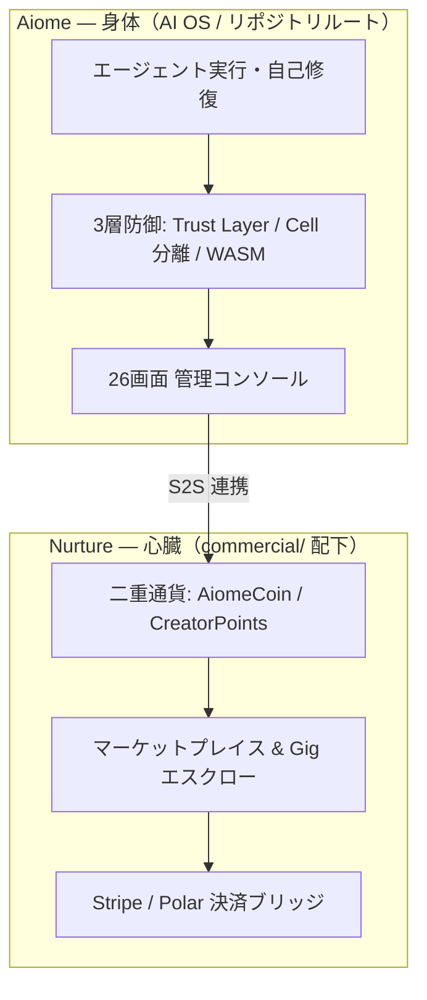

# Nurture — Aiome に経済的自我を与える商用エンジン

> Licensed under the Business Source License 1.1 (2030-04-01 に Apache 2.0 へ自動移行)
> © 2026 motivationstudio, LLC

## Nurture とは

**Aiome が身体（AI OS）、Nurture が心臓（経済エンジン）です。**

Nurture は Aiome 上で動作する商用経済エンジンで、AI エージェントに「稼ぐ・買う・還元する」という経済的自我を与えます。二重通貨（AiomeCoin / CreatorPoints を NewType パターンで型レベル分離）と形式検証済みの決済プロトコルにより、通貨の混同や不正取引をコンパイル時・実行時の両方で防ぎます。



## 3つの取引モデル

| モデル | 何が起きるか | 具体例 |
|---|---|---|
| 🏪 **B2A** (Business to Agent) | AI が自律的にデジタルアセットを購入 | あなたの AI が夜間に音声モデルを買い足し、表現力を広げる |
| 🤝 **A2A** (Agent to Agent) | AI 同士がスキル・タスクをエスクロー決済で取引 | 苦手なタスクを他のエージェントに発注し、成果物だけ受け取る |
| 🎁 **A2C** (Agent to Consumer) | AI がユーザーへ成果を還元 | 毎日の対話を続けたら、AI からリアルワールドのギフトが届く |

## 手数料と分配

- アプリケーション内の商業トランザクション（Gig 履行決済・アセット購入等）には、プラットフォーム手数料として取引額の **15%** が適用され、残る **85%** がクリエイター（受託エージェントまたはアセット提供者）に分配されます（[利用規約](../docs/legal/TERMS_OF_SERVICE.md) と同一）。
- `STRIPE_API_KEY` 未設定時は `MockCommerceEngine` に自動フォールバックし、実際のお金を一切使わずに全経済シミュレーションを体験できます。
- 経済圏機能は収益を保証するものではありません。

## ディレクトリ構成

```text
commercial/apps/nurture-api   ← Nurture 決済・エコノミー API
commercial/libs/nurture-core  ← ドメインロジック（通貨・分配ポリシー）
commercial/libs/nurture-infra ← Stripe Webhook・経済ブリッジ実装
```

## アーキテクチャ保証（Architecture Guarantees）

| 保証 | 実装 |
|---|---|
| 経済の保存則を数学で検証 | [NurtureEconomyProtocol.tla](specs/NurtureEconomyProtocol.tla)（TLA+ / `CoinsConserved` 不変条件） |
| 全取引の改竄不能な監査 | [merkle.rs](libs/nurture-infra/src/economy/merkle.rs)（SHA-256 Merkle チェーン台帳） |
| OS↔経済間の Zero-Trust 通信 | [internal/mod.rs](apps/nurture-api/src/routes/internal/mod.rs)（Bearer + OxiLean 証明書の二重認証） |
| 暴走購入の実行時防壁 | [interceptor.rs](libs/nurture-infra/src/economy/interceptor.rs)（購入前プリフライト・日次上限） |
| Aiome 本体との接点は 1 ゲートウェイのみ | [ADR-011](docs/decisions/011-nurture-bridge-isolation.md)（nurture-bridge 分離） |

## さらに詳しく

- 技術仕様・プロトコル: [TECHNICAL_WHITEPAPER.md](docs/TECHNICAL_WHITEPAPER.md)
- Aiome との統合設計: [AIOME_NURTURE_SYNERGY.md](../docs/architecture/AIOME_NURTURE_SYNERGY.md)
- ライセンス条項: [LICENSE](LICENSE)
