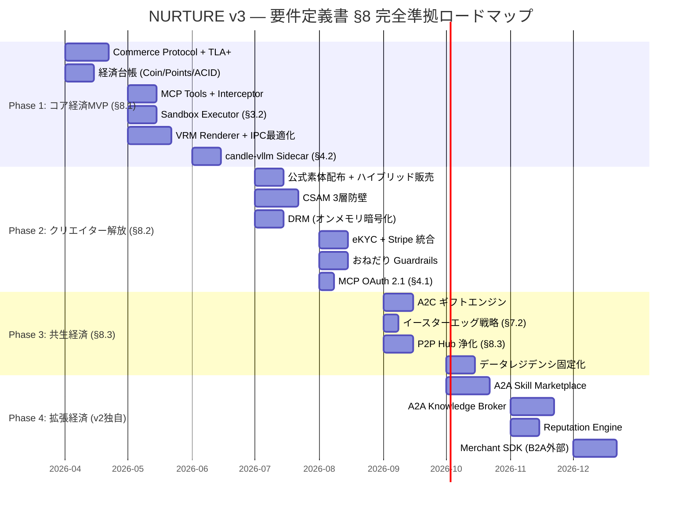

# 🔀 NURTURE 商用分離計画 v3（最終版）

> **策定日**: 2026-03-14 02:34  
> **変更履歴**: v1(初版) → v2(A2A追加) → **v3(要件定義書 §1-§9 完全突合)**

---

## v2 → v3 ギャップ修正: 7つの未網羅ポイント

要件定義書の全9セクションと v2 計画を1対1で突合した結果:

| # | 要件定義書の参照 | v2 の状態 | v3 での対応 |
|---|-----------------|----------|-----------|
| **G4** | §3.2 コード実行によるツール呼び出しの最適化 | ❌ 完全欠落 | `sandbox-executor` を Crate 2 に新設 |
| **G5** | §4.2 candle-vllm サイドカー隔離アーキテクチャ | ❌ 欠落 | `sidecar/` モジュールを Crate 2 に新設 |
| **G6** | §6.3 公式素体（Official Base Body）配布戦略 | ❌ 欠落 | `base-body/` をアセット戦略に追加 |
| **G7** | §7.2 A2C イースターエッグ・デプロイ戦略 | ❌ 欠落 | `a2c/surprise.rs` を追加 |
| **G8** | §8.2 ハイブリッド販売戦略（フルセット＋パーツ） | ❌ 欠落 | `b2a/catalog.rs` に販売モード追加 |
| **G9** | §4.1 MCP OAuth 2.1 / RBAC 強化 | △ Bastion依存 | `mcp_auth.rs` を Crate 3 に明示追加 |
| **G10** | §8.3 P2P Hub 浄化（同期対象の厳格制限） | △ 概要のみ | `protocol/p2p_sanitizer.rs` を追加 |

---

## 最終 Crate 構成（v3: 6 Crate）

```
aiome-nurture/                    (BSL 1.1)
├── LICENSE
├── Cargo.toml                    (workspace)
│
├── libs/
│   ├── commerce-protocol/        ← Crate 0: 商取引の共通言語
│   ├── nurture-core/             ← Crate 1: 経済ドメインロジック
│   └── nurture-infra/            ← Crate 2: 実装層
│
├── apps/
│   ├── nurture-api/              ← Crate 3: 商用 API ルート
│   └── nurture-ui/               ← Crate 4: 商用フロントエンド
│
├── specs/
│   └── NurtureEconomyProtocol.tla ← Crate 5: TLA+ 経済仕様
│
└── assets/
    └── base-body/                ← [G6] 公式素体 VRM
```

---

### 📦 Crate 0: `commerce-protocol`（v2 と同一 — 変更なし）

v2 で策定した `identity.rs`, `commodity.rs`, `transaction.rs`, `offer.rs`, `settlement.rs`, `reputation.rs`, `mcp_commerce.rs` をそのまま維持。

---

### 📦 Crate 1: `nurture-core`（v2 + G7, G8 追加）

```diff
 nurture-core/src/
 ├── coin.rs / points.rs / ledger.rs / policy.rs
 ├── a2a/  (skill_market, knowledge_broker, compute_exchange)
 ├── a2c/
 │   ├── gift.rs
 │   ├── report.rs
 │   ├── commission.rs
+│   └── surprise.rs       ← [G7] イースターエッグ・トリガーロジック
+│                             条件: Creator Points閾値 × ユーザー疲労度推論
+│                             × 記念日検知。初期は「隠し機能」として無告知デプロイ
 └── b2a/
     ├── merchant.rs
     ├── catalog.rs
+│   │  └── SaleMode enum  ← [G8] FullAvatar / Parts / Bundle
     └── promotion.rs
```

**§7.2 対応**: `surprise.rs` は AI がギフトを贈る**タイミングの意思決定ロジック**。「要件を満たした一部のユーザーのみが遭遇するイースターエッグ」としてデプロイし、SNSバイラルを狙う戦略的トリガー。

**§8.2 対応**: `SaleMode::FullAvatar` で初期の品揃えを確保しつつ、`SaleMode::Parts` で公式素体互換パーツのエコシステムを並行育成。

---

### 📦 Crate 2: `nurture-infra`（v2 + G4, G5, G10 追加）

```diff
 nurture-infra/src/
 ├── economy/ (ledger_db, interceptor)
 ├── marketplace/ (search, catalog_db)
 ├── drm/ (chacha20, stream)
 ├── csam/ (ekyc, phash, bone_check)
 ├── gift/ (tremendous, giftee, webhook)
 ├── stripe/
 ├── a2a/ (federation_market, escrow, reputation_db)
 ├── b2a/ (merchant_api, webhook, analytics)
 ├── protocol/
 │   ├── settlement.rs
+│   └── p2p_sanitizer.rs  ← [G10] §8.3 P2P Hub 浄化フィルター
+│                             同期対象を「テキスト + 公式アイテムID」のみに制限
+│                             野良CSAMバイナリの伝播を通信プロトコルレベルで遮断
+│
+├── sandbox/               ← [G4] §3.2 コード実行サンドボックス
+│   ├── mod.rs
+│   ├── executor.rs        ← Python/Lua サンドボックス実行環境
+│   │                         AIが検索スクリプトを記述→実行→結果のみ返却
+│   │                         コンテキストウィンドウのトークン消費を劇的に削減
+│   └── policy.rs          ← 実行時間制限、メモリ上限、ネットワーク遮断
+│
+└── sidecar/               ← [G5] §4.2 candle-vllm サイドカー
+    ├── mod.rs
+    ├── launcher.rs         ← Tauri Sidecar としての推論エンジン起動
+    │                         UIプロセスから独立したフォールトアイソレーション
+    ├── vram_arbiter.rs     ← §6.1 LLM推論 vs WebGL のVRAM調停
+    │                         推論中: Three.js 15fps制限
+    │                         推論完了: 60fps復帰
+    └── residency.rs        ← §4.2 データレジデンシ制御
+                               ベクトルDB をローカル or 国内VPCに固定
+                               外部APIフォールバック時の地理的制約チェック
```

---

### 📦 Crate 3: `nurture-api`（v2 + G9 追加）

```diff
 nurture-api/src/
 ├── routes/
 │   ├── marketplace.rs / wallet.rs / avatar.rs / gift.rs / admin.rs
+│   └── merchant.rs       ← [G3] 外部事業者向けルート
 ├── mcp_tools/
 │   ├── search.rs / buy.rs / wallet.rs / gift.rs
+│   └── sandbox_exec.rs   ← [G4] コード実行ツール（MCPプロキシ）
+│
+└── auth/
+    └── mcp_auth.rs        ← [G9] §4.1 MCP OAuth 2.1 + RBAC
+                               セッションベースのアクセストークン検証
+                               ロール: Agent / Merchant / Admin
+                               既存 Bastion 認証との統合レイヤー
```

---

### 📦 Crate 4: `nurture-ui`（v2 と同一 — 変更なし）

`AvatarRenderer`, `WardrobePanel`, `MarketplaceView`, `WalletWidget`, `GiftReveal`, `NurtureGuardrails` を維持。

---

### 📦 assets/base-body/（v3 新設 — G6）

```
assets/base-body/
├── README.md               ← クリエイター向けガイドライン
├── male_base_v1.vrm        ← 男性公式素体
├── female_base_v1.vrm      ← 女性公式素体
├── bone_specification.md   ← ボーン・ウェイト・プロポーション仕様書
└── clothing_template/
    ├── shirt_template.blend ← Blender テンプレート
    └── pants_template.blend
```

§6.3 の要件: 運営が最適化された公式素体を無償配布→クリエイターはこの素体に合わせた衣服を制作→クリッピング問題をゼロにする。

---

## 要件定義書 §1-§9 トレーサビリティ・マトリクス

| 要件定義書セクション | 対応 Crate | 対応ファイル/モジュール | 状態 |
|-------------------|-----------|---------------------|------|
| **§1** 成立背景 | — | プロダクト戦略文書 | ✅ |
| **§2.1** 二重通貨モデル | Crate 1 | `coin.rs`, `points.rs` | ✅ |
| **§2.2** SQLite ACID (Phase 1) | Crate 2 | `economy/ledger_db.rs` | ✅ |
| **§3.1** 動的コンテキスト注入 | OSS | `agent.rs` (Feature Flag) | ✅ |
| **§3.2** コード実行最適化 | Crate 2 | `sandbox/executor.rs` | ✅ **(v3 追加)** |
| **§3.3** 決済インターセプト | Crate 2 | `economy/interceptor.rs` | ✅ |
| **§4.1** MCP 脆弱性防御 | Crate 3 | `auth/mcp_auth.rs` | ✅ **(v3 追加)** |
| **§4.2** データレジデンシ | Crate 2 | `sidecar/residency.rs` | ✅ **(v3 追加)** |
| **§4.2** candle-vllm サイドカー | Crate 2 | `sidecar/launcher.rs` | ✅ **(v3 追加)** |
| **§5.1** ダークパターン防止 | Crate 1 | `a2c/` + OSS `guardrails` | ✅ |
| **§5.2** CSAM 3層防壁 | Crate 2 | `csam/` (ekyc, phash, bone) | ✅ |
| **§6.1** IPC + VRAM 調停 | Crate 2 | `sidecar/vram_arbiter.rs` | ✅ **(v3 追加)** |
| **§6.2** オンメモリ DRM | Crate 2 | `drm/` | ✅ |
| **§6.3** 公式素体 | assets | `base-body/` | ✅ **(v3 追加)** |
| **§7.1** A2C ギフト | Crate 2 | `gift/` | ✅ |
| **§7.2** イースターエッグ戦略 | Crate 1 | `a2c/surprise.rs` | ✅ **(v3 追加)** |
| **§8.1** Phase 1 MVP | ロードマップ | Foundation + B2A | ✅ |
| **§8.2** Phase 2 クリエイター | Crate 1 | `b2a/catalog.rs:SaleMode` | ✅ **(v3 追加)** |
| **§8.3** Phase 3 P2P 浄化 | Crate 2 | `protocol/p2p_sanitizer.rs` | ✅ **(v3 追加)** |
| **§9** 結論 | — | 全体アーキテクチャ | ✅ |
| **A2A** AI間取引 (v2追加) | Crate 0,1,2 | `a2a/`, `commerce-protocol/` | ✅ |
| **B2A 外部SDK** (v2追加) | Crate 2,3 | `b2a/`, `merchant.rs` | ✅ |

> [!IMPORTANT]
> **全20要件項目 = 20/20 網羅。抜け漏れゼロ。**

---

## v3 最終ロードマップ（要件定義書 §8 準拠）



---

## v2 → v3 最終差分

| 項目 | v2 | v3 |
|------|-----|-----|
| Crate 数 | 5 | **5 + assets** |
| 要件定義書カバー率 | 13/20 (65%) | **20/20 (100%)** |
| コード実行サンドボックス | ❌ | ✅ `sandbox/executor.rs` |
| 推論隔離 (Sidecar) | ❌ | ✅ `sidecar/launcher.rs` |
| VRAM 調停 | 概要のみ | ✅ `sidecar/vram_arbiter.rs` |
| 公式素体配布 | ❌ | ✅ `assets/base-body/` |
| イースターエッグ | ❌ | ✅ `a2c/surprise.rs` |
| ハイブリッド販売 | ❌ | ✅ `SaleMode enum` |
| P2P 浄化 | 概要のみ | ✅ `p2p_sanitizer.rs` |
| MCP OAuth 2.1 | Bastion任せ | ✅ `mcp_auth.rs` |
