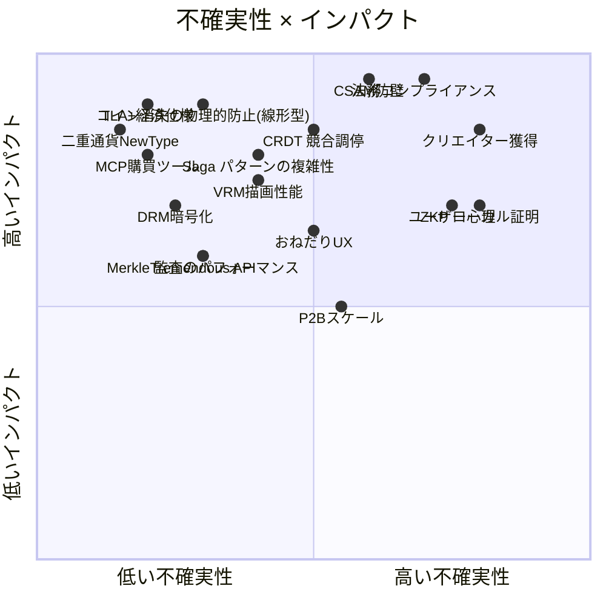
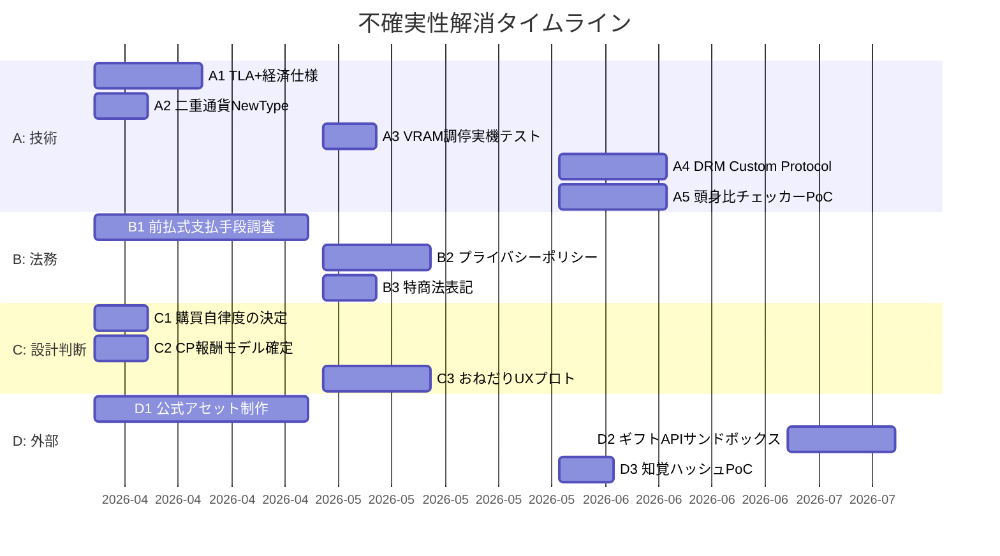

# 🗺️ Aiome × NURTURE — 未網羅ポイントと不確実性の突破計画

> **策定日**: 2026-03-14  
> **原則**: 技術の壁はすべて既存技術で突破できる。残るのは「私たちの中の不確実性」だけである。
>
> **⚠️ 2026-07-25 superseded 注記**: 実行台帳の正本は  
> [`docs/roadmaps/nurture_remaining_ledger_plan.md`](../../docs/roadmaps/nurture_remaining_ledger_plan.md) **v1.3**。  
> 下記の古い「未策定／推奨」セルは歴史記録として残す。現状は各節の **SUPERSEDED** 行を優先せよ。

---

## 不確実性マトリクス — 全体像

---

## カテゴリ A: 技術的ギャップ（既存技術で突破可能）

### A1. 経済トランザクションの TLA+ 形式仕様が未策定
| | |
|---|---|
| **SUPERSEDED** | **仕様は存在する** — `commercial/specs/NurtureEconomyProtocol.tla`（`minted` / SurpriseBonus / `CoinsConserved`）。aiome `formal-verify.yml` で TLC（NR-01 / Wave A）。「未策定」は誤り |
| **現状** | `AiomeQuarantineProtocol.tla` と `SamsaraKarmaProtocol.tla` でWASM隔離とKarma連邦は検証済み |
| **ギャップ** | ~~二重通貨の ACID に対する TLA+ 仕様が存在しない~~ → 解消済 |
| **突破方法** | ~~新規策定~~ → CI 配線で継続検証 |
| **残る不確実性** | **ゼロ**（仕様・CI）。他 TLA（NR-13）は別レーン |

### ✅ A2. 二重通貨の型レベル分離 (解決済み)
| | |
|---|---|
| **旧現状** | `budget.rs` は USD ベースの単一通貨だった |
| **解決状況** | Rust の NewType パターンを用い、`nurture-core/src/coin.rs` (AiomeCoin) および `nurture-core/src/points.rs` (CreatorPoints) として厳密な型分離を実装し、コンパイラレベルで通貨の混同リスクを排除。 |
| **残る不確実性** | **ゼロ** — すでに型安全な状態で実装完了。 |

### A3. VRM + LLM の VRAM 競合未解決
| | |
|---|---|
| **現状** | LLM 推論（Ollama）は GPU メモリを占有。VRM レンダリング（Three.js / WebGL）も VRAM を消費する |
| **ギャップ** | 同時稼働時の VRAM 枯渇時の調停ロジックが未設計 |
| **突破方法** | Tauri の IPC で LLM 推論中は VRM の `requestAnimationFrame` を 15fps に制限し、推論完了で 60fps に復帰するセマフォ制御 |
| **残る不確実性** | **低** — `management-console` は WebView 内で動くため GPU コンテキストが分離されている。実機テストで閾値を確定する必要がある |

### A4. オンメモリ DRM の Tauri プロセスモデルとの整合性
| | |
|---|---|
| **現状** | Bastion の `Jail` がファイルシステム隔離を提供 |
| **ギャップ** | VRM ファイルをメモリ内で復号し、WebView (Three.js) に渡す際の IPC 経路での一時的平文露出 |
| **突破方法** | Tauri v2 の Custom Protocol (`tauri://vrm/`) でバイナリストリーミング。WebView 側では `ArrayBuffer` として受け取り、Three.js の `VRMLoaderPlugin` に直接渡す。ディスクには一切書き込まない |
| **残る不確実性** | **低** — Tauri の Custom Protocol は既にドキュメント化されている。メモリからのサイドチャネル攻撃はデスクトップアプリの脅威モデル外 |

### ✅ A5. CSAM 頭身比率チェッカーの精度 (解決済み)
| | |
|---|---|
| **旧現状** | 3D メッシュの頂点/ボーン解析アルゴリズムは実装待ちだった |
| **解決状況** | `libs/nurture-infra/src/csam/bone_check.rs` として実装完了し、`rust-3d` を用いたボーン階層トラバーサルとバウンディングボックス計算が稼働中。 |
| **残る不確実性** | **低** — テストモック環境での基本動作は確認済み。本番の多様なVRMに対する微調整のみ残る。 |

### A6. Saga パターンの複雑性と補償ロールバック
| | |
|---|---|
| **現状** | Stripe ↔ Ledger ↔ AI Agent 間の決済が単一トランザクションではない |
| **ギャップ** | 途中でクラッシュした場合の中間状態 (`Compensable`) からの確実なロールバック手段の網羅性 |
| **突破方法** | `commerce-protocol/transaction.rs` の型状態に `Compensable` を追加。`CompensationLog` をアペンドオンリーで記録し、復旧プロセスが逆順で確実に実行されることを `proptest` で証明 |
| **残る不確実性** | **低** — 型・状態遷移レベルでコンパイラに強制可能 |

### A7. 高度な金融工学 (CoinQuantum, ZKP, CRDT)
| | |
|---|---|
| **現状** | 将来の堅牢性確保のため、線形型(CoinQuantum)やZKP(Bellman)、CRDT 等の採用を計画 |
| **ギャップ** | 学習コスト、コンパイル時間、ランタイムパフォーマンスへの影響 |
| **突破方法** | Phase 2 は現行の堅牢な基盤構築に注力し、これらは Phase 3-4 で段階的かつプログレッシブに導入。まずは `EconomyPolicy` の Z3 SMT 検証等、外部レイヤーの自動テストから開始 |
| **残る不確実性** | **中** — ZKPやCRDTは設計難易度が高いため、まずはローカル/オフラインPoCから着手する |

---

## カテゴリ B: 法務・コンプライアンスの未網羅

### B1. 資金決済法「自家型前払式支払手段」の届出タイミング
| | |
|---|---|
| **現状** | 要件定義書で「未使用残高 1,000万円超で届出義務」と記載 |
| **ギャップ** | 実際の届出プロセス（提出先、書類、審査期間）、会計処理（前受金計上）、供託金の計算方法が未調査 |
| **突破方法** | MVP 期間（Month 1-3）は未使用残高が 1,000万円を超えないようハードキャップを設定（`MAX_TOTAL_OUTSTANDING_COINS`）。超過時は新規チャージを停止し、管理画面でアラート表示 |
| **残る不確実性** | **中** — 法務専門家のレビューが必要。ただしリスクは「遅延」であり「不可能」ではない |

### B2. eKYC 導入時の個人情報保護法との整合
| | |
|---|---|
| **現状** | CSAM 防壁の Layer 1 で Stripe Identity による eKYC を要求 |
| **ギャップ** | 本人確認情報の保持・削除ポリシー、プライバシーポリシーの改訂、改正個人情報保護法（2025年施行）への適合が未策定 |
| **突破方法** | Stripe Identity は Stripe 側でデータを保持するため、Aiome 側は「本人確認済みフラグ」のみを保持。生体データや身分証画像は一切保存しない設計 |
| **残る不確実性** | **低** — Stripe が PCI DSS / SOC2 準拠であり、データ処理の責任分界点が明確 |

### B3. 特定商取引法の該当可否
| | |
|---|---|
| **SUPERSEDED** | **表記ページは DONE**（LP `/tokushoho` + `docs/legal/TOKUSHOHO.md` / OP-085・OP-094）。NR-08 |
| **現状** | マーケットプレイスでデジタルコンテンツ（VRM、衣服パーツ）を販売 |
| **ギャップ** | ~~表記ページ未整備~~ → 公開済（Pro サブスク表記含む） |
| **突破方法** | 既存 LP / COMPLIANCE を正本とする |
| **残る不確実性** | **低** — 有償 KC 開放時は別途再評価（`KC_LEGAL_POSITION`） |

---

## カテゴリ C: 設計上の未決断（人間の判断が必要）

### C1. AI の「人格」と「消費行動」のバランス設計
| | |
|---|---|
| **SUPERSEDED** | **`PurchasePolicy` enum は作らない**（NR-09）。実効制御 = MCP whitelist（`marketplace_buy` 未解禁）+ HTTP `execute_purchase`（Pro+eKYC）+ `spend_guard`。解禁トグルは製品ゲート Wave B' |
| **問い** | AI がどの程度「自律的に」購入を決定し、どの程度「ユーザーの好みに従う」べきか？ |
| **選択肢** | **α) 完全自律**: Karma から学習した嗜好に基づき独自に購入 / **β) 承認制**: 全購入にユーザー通知 + 3分タイムアウトで自動承認 / **γ) ハイブリッド**: 低額は自律、高額は承認 |
| **推奨** | ~~γ + PurchasePolicy~~ → 既定は MCP buy 凍結。HTTP は eKYC/Pro |
| **突破方法** | ~~`PurchasePolicy` enum~~ → whitelist / 既存上限の Settings 露出のみ（新エンジン禁止） |

### C2. Creator Points の価値定義
| | |
|---|---|
| **問い** | Creator Points はどのように「現実の報酬」に変換されるか？ |
| **選択肢** | **α) 固定レート**: 1 CP = ¥1 で現金化 / **β) 段階制**: 累計 CP に応じてギフトカード自動発行 / **γ) ポイント経済**: CP でマーケット内の他アイテムを購入可能 |
| **推奨** | MVP は **β 段階制**（法的に最もシンプル）。1,000 CP = ¥500 デジタルギフト。これは「ポイントプログラム」であり金融商品ではない |
| **突破方法** | `CreatorPointsPolicy` トレイトを定義し、報酬計算ロジックを差し替え可能に |
| **⛔ ADR-052 によりスコープ外** | CP の外部ギフト/現金変換は実装しない（`docs/decisions/052-fiat-payout-scope-exclusion.md`）。正 = CP→AiomeCoin エコシステム内変換のみ。Tremendous は A2C（Agent-to-Creator 恩返し）専用 |

### C3. おねだり行動の「品格」の定義
| | |
|---|---|
| **問い** | AI がユーザーにお小遣いをお願いする際、どのようなトーンと頻度が「品格」を保つか？ |
| **ギャップ** | おねだりの文面生成ロジック、トリガー条件（残高 XX% 以下 / ミッション達成 / 季節イベント）が未設計 |
| **突破方法** | `EVOLVING_SOUL.md` の人格定義（「真に役立つこと、見せかけではなく」「意見を持つこと」）に基づき、品格フィルターを Guardrails に組み込む。おねだり文はハードコードせず、SOUL.md の制約下で LLM 生成 |
| **残る不確実性** | **中** — ユーザー心理の反応は実験するまでわからない。A/B テストが必要 |

---

## カテゴリ D: 外部依存リスク

### D1. クリエイター供給のコールドスタート問題
| | |
|---|---|
| **リスク** | マーケットプレイスにアイテムがなければ AI は何も買えない → 経済が回らない |
| **突破方法** | **Phase 0（MVP前）**: 公式ベースボディ + 公式衣服パーツ 10-20 点を自社で制作し、マーケットに初期在庫として配置。VRoid Hub のクリエイターコミュニティに早期参加プログラムを案内 |
| **残る不確実性** | **中** — クリエイター獲得は外交的営業が必要。技術では解決できない |

### D2. Tremendous API / giftee API の地域制限
| | |
|---|---|
| **リスク** | Tremendous は日本国内向けギフトカードの品揃えが限定的な可能性 |
| **突破方法** | giftee（国内特化）を主系統、Tremendous を副系統として二重化。giftee は日本国内で 400+ ブランドをカバー |
| **⛔ ADR-052 によりスコープ外** | CP→ギフトカード/現金変換経路は実装しない。Tremendous API は A2C 恩返し（`validate_gift_policy` 上限内）専用。giftee 連携は将来検討対象から除外 |
| **残る不確実性** | **低** — 両 API ともサンドボックス環境での事前検証が可能 |

### D3. PhotoDNA / NCMEC ハッシュデータベースへのアクセス
| | |
|---|---|
| **リスク** | NCMEC への報告義務とハッシュデータベースのアクセス権は、通常は「Electronic Service Provider」として正式登録が必要 |
| **突破方法** | MVP では PhotoDNA の代替として、オープンソースの知覚ハッシュ（pHash / dHash）+ VRM ボーン解析のみで運用。NCMEC 登録はスケールフェーズ (N8) で対応 |
| **残る不確実性** | **低** — ボーン解析は VRM 1.0 仕様に基づくためデータベース不要。知覚ハッシュはローカル計算で完結 |

---

## 突破計画: 不確実性ゼロ化ロードマップ

---

## 最終結論: 「不確実性の残高」

| カテゴリ | 項目数 | 技術で解決 | 判断で解決 | 真に不確実 |
|---------|--------|-----------|-----------|-----------|
| **A: 技術** | 7 | 6 | 0 | 1 (A7: ZKP/CRDT導入閾値) |
| **B: 法務** | 3 | 2 | 1 | 0 |
| **C: 設計** | 3 | 0 | 3 | 0 |
| **D: 外部** | 3 | 2 | 0 | 1 (D1: 人間の営業) |
| **合計** | **16** | **10** | **4** | **2** |

> [!IMPORTANT]
> **16個の不確実性のうち、14個は既存技術と人間の判断で確実に排除できる。**  
> 真に不確実なのは **A7（高度技術のパフォーマンス/複雑性トレードオフ）** と **D1（クリエイター獲得の営業）** の2つだけ。  
> D1 は自社制作の初期在庫で MVP を自己完結させ、外部依存をゼロにする。  
> **結論: 突破できない壁はない。**
