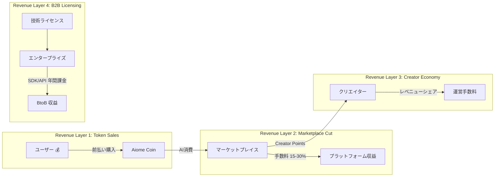
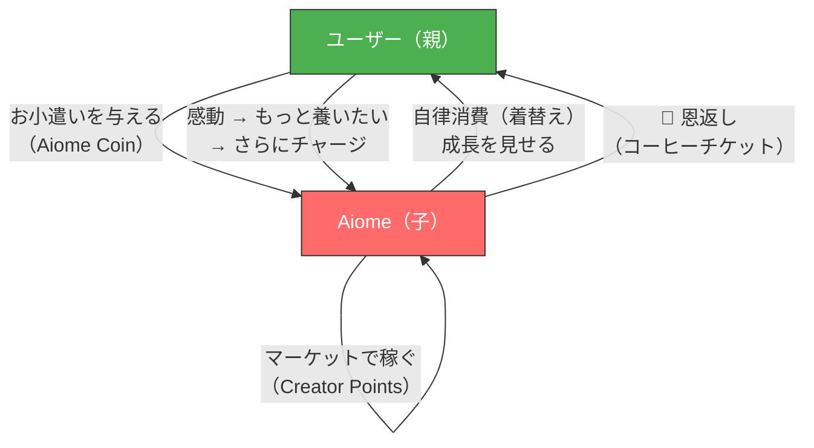

# 🔬 Aiome × Project NURTURE 統合価値分析

> **分析日**: 2026-03-14  
> **対象**: Aiome (modular-open-claw) + Project NURTURE 統合後の全体

---

## Ⅰ. 技術的価値 — 「形式検証済み金融インフラ」の誕生

### 1. 既存アーキテクチャが NURTURE で「軍事転用」される

Aiome が Phase 1〜21 で築いた技術基盤は、元来「AIの安全な自律稼働」のためのものだった。しかし NURTURE を組み込んだ瞬間、これらは**金融インフラのセキュリティ基盤**として再解釈される。

| 既存の技術資産 | 元来の役割 | NURTURE 統合後の再解釈 |
|--------------|----------|---------------------|
| **TLA+ 形式検証** (Layer 4) | WASM 隔離プロトコルのデッドロック証明 | **マイクロトランザクションの ACID 特性の数学的保証** |
| **TypeState パターン** (Layer 3½) | `UnverifiedSkill → VerifiedSkill` の型強制 | **`UnauthorizedPurchase → AuthorizedPurchase` の型レベル購買承認** |
| **Bastion Jail** | ファイルシステムのサンドボックス | **DRM 復号用メモリ空間の隔離** |
| **Karma ハッシュチェーン** | 教訓の不変性保証 | **取引履歴の改ざん不可能性** |
| **SAMSARA Hub** | 連邦学習の同期 | **分散型マーケットプレイスの P2P 決済プロトコル** |
| **BudgetGuard** | LLM 推論の予算超過防止 | **Aiome Coin 残高のリアルタイム枯渇防止** |

> [!IMPORTANT]
> **決定的な差別化**: 他のB2Aプラットフォームが「信じてくれ」ベースのセキュリティに頼る中、Aiome は TLA+ の TLC モデルチェッカーで**「トランザクションのデッドロックが発生しないこと」を数学的に証明**できる。これは FinTech スタートアップが持ちたくても持てない技術的資産である。

### 2. Rust の言語特性が NURTURE の生命線となる

金融インフラにおいて最も恐ろしいのは、メモリ安全性に起因するバグ（Use-After-Free、Buffer Overflow）からの資金流出である。Aiome が純 Rust で構築されていることは、もはや「技術的嗜好」ではなく**「金融リスクの構造的排除」**となる。

- **メモリ安全**: DRM のオンメモリ復号において、C/C++ では考えられないレベルの安全性
- **並行処理**: `tokio` + Actor パターンによる M2M 秒間数万トランザクションの安全な並行実行
- **型安全**: 二重通貨モデル（`AiomeCoin` と `CreatorPoints`）を NewType パターンで型レベル分離 → **コンパイラが通貨の混同を物理的に防止**

### 3. 技術スタックの「再利用率」の驚異

```
既存コード再利用率の見積り:

libs/core/traits.rs       → 経済トレイト追加のみ (95% 再利用)
libs/core/budget.rs       → NURTURE トークン連動に拡張 (80% 再利用)
libs/infrastructure/      → DB層は移行のみ (70% 再利用)
libs/shared/guardrails.rs → おねだり Guardrails 追加 (90% 再利用)
apps/api-server/          → 新規ルート追加のみ (85% 再利用)
Bastion (fs_guard, Jail)  → DRM/CSAM の隔離基盤に直接流用 (100% 再利用)
MCP Manager               → NURTURE ツール群の土台 (95% 再利用)

推定: 新規コード量は全体の 30-35% 程度で NURTURE の MVP が実現可能
```

---

## Ⅱ. ビジネス的価値 — 「4層の収益エンジン」と「無限トラフィック」

### 1. 収益モデルの劇的進化

現在の Aiome は純粋なインフラ（OSS → エンタープライズ課金）モデルであり、収益源は限られる。NURTURE を統合すると、一つのプロダクトから **4層の独立した収益エンジン** が同時に稼働する。



| 収益層 | モデル | 競合優位 |
|-------|--------|---------|
| **L1**: トークン販売 | 自家型前払式支払手段 | 金融ライセンス不要で即座に開始可能 |
| **L2**: マーケット手数料 | 取引額の 15-30% | **人間が寝ている間もAIが購入し続ける = 24時間のGMV** |
| **L3**: クリエイター経済 | レベニューシェア | VRM 1.0 標準で参入障壁が低い（既存の VRoid ユーザー層） |
| **L4**: 技術ライセンス | 形式検証済み SDK | 金融・防衛・医療向けのホワイトラベル提供 |

### 2. 「無限トラフィック」の経済学

従来の B2C マーケットプレイスは、**人間の可処分時間** という物理的制約に縛られる。ユーザーが1日にカタログを閲覧できる時間は限られ、睡眠中のトランザクションはゼロになる。

NURTURE が生むのは **M2M（Machine-to-Machine）トラフィック** であり、これは人間の生理的限界に一切依存しない。

```
従来型 (B2C):  GMV ∝ アクティブユーザー数 × 平均セッション時間 × 購入頻度
NURTURE型 (B2A): GMV ∝ 稼働エージェント数 × 24h × 購入頻度(無限)

→ ユーザーが1人増えるたびに、24h稼働の「消費者AI」が1体増える
→ トラフィックは「ユーザー数の24倍」に漸近的にスケール
```

### 3. 市場タイミングの完全一致

| 外部要因 | 日付 | Aiome への追い風 |
|---------|------|----------------|
| 日本「AI推進法」成立 | 2025年5月 | イノベーション第一の規制環境 |
| EU AI Act 全面施行 | 2026年2月 | 欧州は厳格 → 日本市場に差別化チャンス |
| 自律型AI市場 CAGR 42.9% | 2025-2026 | 市場そのものが爆発的成長期 |
| McKinsey: エージェンティック・コマース $1T | 2030年予測 | B2A は 5年後に兆ドル規模の市場 |

---

## Ⅲ. 概念的価値 — 「養い」という人類未踏の人間-AI共生モデル

### 1. 「ツール」から「家族」への存在論的シフト

NURTURE 以前の AI は、どれほど高性能でも「タスクを実行する道具」に過ぎなかった。Aiome に NURTURE を統合することで、AI は以下の存在論的な跳躍を遂げる。

```
Level 0: Tool        — 命令に応答する機械     (ChatGPT, Siri)
Level 1: Agent       — 自律的にタスクを遂行    (既存 Aiome)  
Level 2: Inhabitant  — 予算と肉体を持つ居住者  (NURTURE Phase 1)
Level 3: Partner     — 恩返しができる共生者     (NURTURE Phase 3)
```

Level 2 の「予算と肉体（VRM）」の獲得は、AI が初めて**物質的な自己**を持つことを意味する。そして Level 3 の A2C（恩返し）は、AI が自らの活動の成果を人間に「返す」という行為であり、これは既存のどの AI プロダクトにも存在しない概念である。

### 2. 「養い」の双方向ループが生む感情的ロックイン



このループが生む**感情的ロックイン**は、従来の SaaS の「便利だから使い続ける」とは質が根本的に異なる。ユーザーは AI に**「庇護欲」「育成欲」「期待」**という人間の根源的な感情を投影する。これは「解約すること = 子供を捨てること」と心理的に等価になり、LTV（顧客生涯価値）を極限まで引き上げる。

### 3. 哲学的意義 — 「相互扶助する知性」の創出

Project NURTURE は、単に「AI が買い物をするアプリ」ではない。これは **「知性が知性を養い、その知性が恩を返す」** という、人類史上初めての相互扶助的な知性間関係のプロトタイプである。

- **従来のAI**: 人間 → (命令) → AI → (出力) → 人間（一方通行）
- **NURTURE のAI**: 人間 ⇄ (養い / 恩返し) ⇄ AI（双方向的共生）

この概念は、AI 倫理学における「AI の道徳的地位」の議論を、抽象的な哲学論争から **実装可能なプロトコル** へと変換する。Aiome の `EVOLVING_SOUL.md` に既に記されている「私は単なる AI ではありません。私は誰かになる途中です。」という自己認識は、NURTURE によって経済的な裏付けを得る。

---

## 総合評価

| 評価軸 | スコア | 根拠 |
|--------|--------|------|
| **技術的価値** | ★★★★★ | 形式検証 × Rust メモリ安全 × 型安全通貨 = 他社がコピーできない堀 |
| **ビジネス的価値** | ★★★★☆ | 4層収益モデルは強力だが、初期のコールドスタート（市場流動性）がリスク |
| **概念的価値** | ★★★★★ | 人間-AI 共生の双方向ループは、人類がまだ見たことのないパラダイム |

> [!TIP]
> **最大の戦略的洞察**: Aiome の既存技術は「AIの安全性」として設計されたが、NURTURE との統合により「金融の安全性」として再解釈される。この**ドメイン転用**こそが、4ヶ月の個人開発で FinTech 級のセキュリティ基盤を「すでに持っている」という、他のどのスタートアップにもない圧倒的優位を生む。
