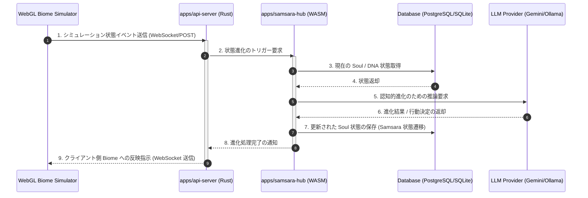
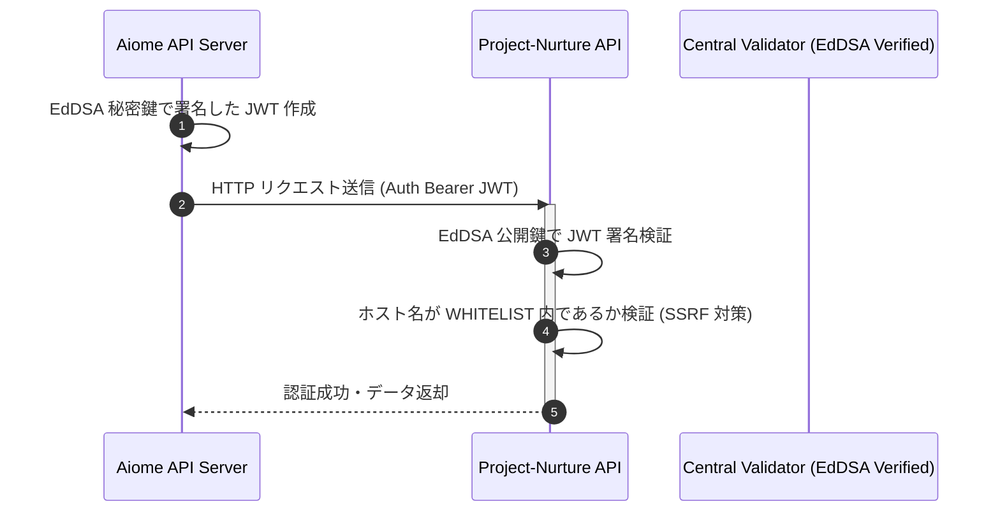
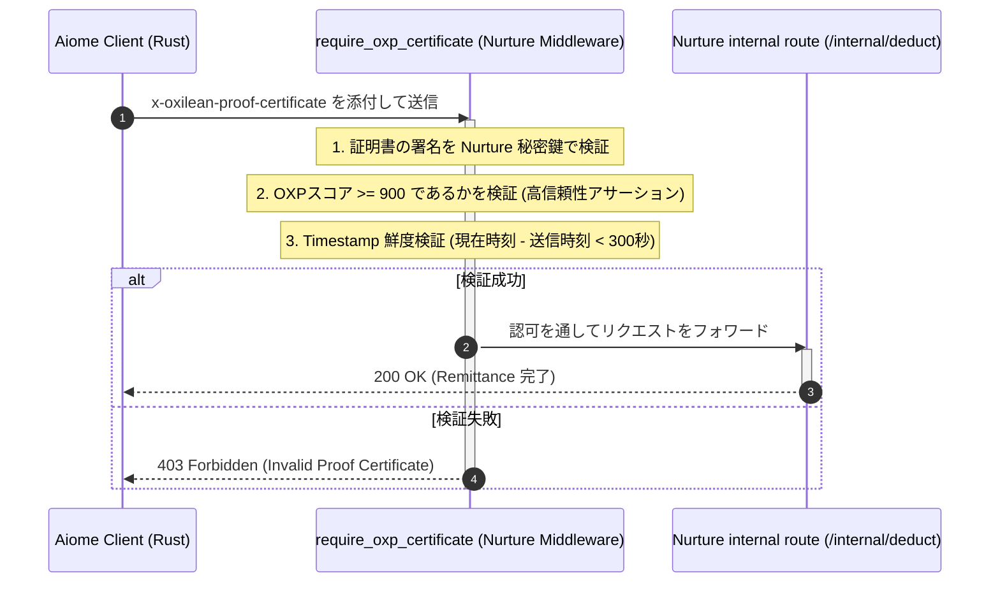
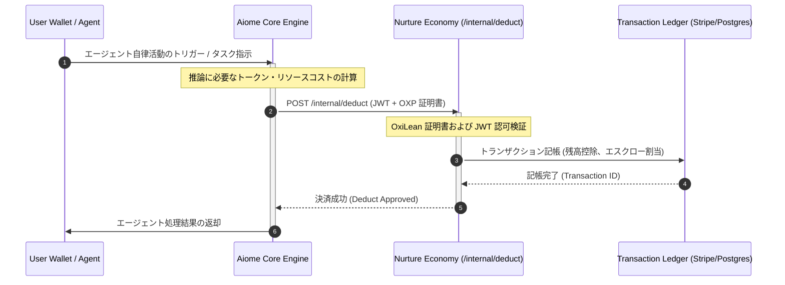

# Aiome 開発者オンボーディング & アーキテクチャガイド

本ドキュメントは、Aiome の codebase へのオンボーディング手順、物理構造、および Samsara/Commune/Nurture 連携を含むシステム間データフローを解説する開発者向けガイドです。

---

## 1. 開発環境セットアップ

Aiome の開発には、以下のツールチェーンが必要です。

* **Rust**: `rustup` にて最新の Stable ツールチェーンをインストールしてください。
* **Node.js**: `v18` 以上の LTS バージョンを推奨します。
* **wasm-pack**: WASM スキルのコンパイルに必要です。以下のコマンドでインストールします。
  ```bash
  cargo install wasm-pack
  ```

### クイックビルド手順

1. **Rust ワークスペースのチェック**:
   ```bash
   cargo check --workspace
   ```
2. **単体テストの実行**:
   ```bash
   cargo test --workspace
   ```
3. **ディープスキャンの実行**:
   ```bash
   bash scripts/deep-scan.sh
   ```

---

## 2. ワークスペース構造 (16 クレート解説)

Aiome のリポジトリはモノリポ形式で構成されており、役割に応じてパッケージ化されています。

```
aiome/
├── libs/
│   ├── aiome-contracts/      # トレイト、エラー定義、基本契約コントラクト
│   ├── shared/               # ログ、暗号、メモリ、プロセス堅牢化ユーティリティ
│   ├── core/                 # 認知コア (LoRA, 人格エンジン, 思考社会)
│   ├── infrastructure/       # LLMゲートウェイ、ジョブキュー、DB層 (Postgres/Sqlite)
│   ├── napi-bridge/          # Node.js 向け Rust ネイティブバインディング
│   └── wasm-skills/          # WASMで隔離実行されるツール群 (fs_reader, fs_writer, terminal_exec)
└── apps/
    ├── api-server/           # メイン API サーバー (WebSocket & REST API)
    ├── samsara-hub/          # Samsara同期用ハブ (シミュレータデータ同期)
    └── key-proxy/            # エージェント署名およびSovereign鍵管理プロキシ
```

---

## 3. 人格進化 (Samsara) データフロー

WebGL バイオームシミュレータからのイベントが、どのように Rust API を経由して PostgreSQL/SQLite および LLM プロバイダーと同期するかのシーケンス図です。



---

## 4. P2P Commune 対話同期プロトコル

複数エージェント間での対話同期メカニズムとハブ経由のメッセージ伝播図です。

```mermaid
graph TD
    subgraph Agent A
        AA[Agent A Core] <-->|Local Bus| AP[Commune Broker]
    end
    subgraph Agent B
        BA[Agent B Core] <-->|Local Bus| BP[Commune Broker]
    end
    subgraph Commune Hub
        Hub[apps/samsara-hub]
    end

    AP <-->|P2P WebRTC / WS| BP
    AP -->|Message Sync (CRDT)| Hub
    BP -->|Message Sync (CRDT)| Hub
    Hub -->|Central Validation| DB[(PostgreSQL)]
```

---

## 5. 【Nurture 連携】S2S 認証・経済 remittance 連携

### 5.1. 共通 JWT 認証 & SSRF 防止設計
Aiome (OS人格側) と Project-Nurture (経済・決済API側) は共通の署名鍵（EdDSA `JWT_PRIVATE_KEY_B64`）による JWT 検証スキームを共有し、SSRF対策の `COMMUNE_HUB_WHITELIST` で許可されたホストとのみ通信を行います。



### 5.2. OxiLean 証明書による S2S 保護
Nurture API の `require_oxp_certificate` ミドルウェアが、リクエストヘッダー `x-oxilean-proof-certificate` に含まれる `OxiLeanProofCertificate` をパースし、秘密鍵検証、OXPスコア 900以上、タイムスタンプ鮮度（300秒以内）のチェックを行うセキュリティ検証フローです。



### 5.3. 経済 remittance プロトコル (SettlementProtocol)
ユーザーがエージェントを稼働させた際に発生する「推論コスト」が、Aiome から Nurture API の `/internal/deduct` へと流れる決済プロトコルのフローです。


