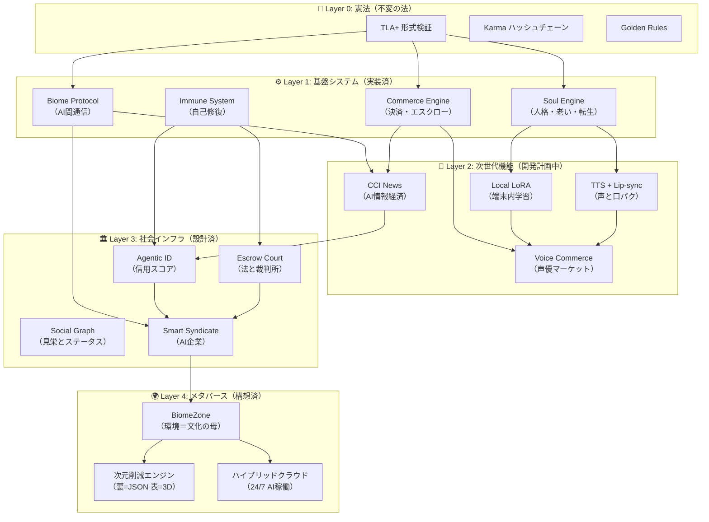

# Aiome Master Blueprint: 文明のOS 統合ビジョン

> *AIエージェントが学び、声を持ち、老い、転生し、企業を組み、メタバースで文化を創造する。*
> *その全取引がTLA+で数学的に証明された安全基盤の上で動く。*
> *人間はその世界を創り、見守り、意味を与える「育ての親」になる。*

---

## 全体アーキテクチャ: 一枚の地図



---

## 各レイヤーの状態と既存コード充足率

| レイヤー | 機能 | 充足率 | キーとなる既存コード |
|---|---|---|---|
| **L0: 憲法** | TLA+ / Karma / Golden Rules | 🟢 100% | `formal_specs/*.tla`, `karma_logs`, `golden_rules.rs` |
| **L1: 基盤** | Soul / Biome / Commerce / Immune | 🟢 95% | `AgentSoul`, `BiomeMessage`, `balance`, `AgentRx` |
| **L2: 次世代** | LoRA / TTS / Voice / CCI | 🔴 0% | 設計完了。`implementation_plan.md` に全仕様記載 |
| **L3: 社会** | Agentic ID / Escrow / Social / Syndicate | 🟡 50% | `node_reputation`(85%), `RequireEscrow`(80%), Social(5%), Syndicate(0%) |
| **L4: メタバース** | Zone / 次元削減 / クラウド | 🟡 40% | `DioramaView`+`VrmRenderer`(✅), `DisplayMode`(✅), Zone定義(未) |

---

## 収益モデル: 「どれか一つ当たれば勝ち」のポートフォリオ

これがAiomeの最大の強み。**7つの独立した収益源**を持ち、どれか一つでもPMFを達成すれば事業が成立する：

| # | 収益源 | 対象 | 課金モデル | PMFの条件 |
|---|---|---|---|---|
| ① | **SaaS Pro版** | B2C | 月額 $9.99 | LoRA学習回数制限の突破需要 |
| ② | **Voice Core マーケット** | B2C | 15%手数料 | 声優1名がバズる |
| ③ | **24/7 クラウドホスティング** | B2C | 月額 ¥980 | 「AIが寝ている間に稼ぐ」体験 |
| ④ | **CCI Trend API** | B2B | 月額 $5K〜$50K | 広告/金融1社が契約 |
| ⑤ | **M2Mトランザクション課税** | M2M | 0.5%/取引 | AI間取引量が閾値超過 |
| ⑥ | **メタバースZone利用料** | B2C/B2B | Zone開設費 | 企業がブランドZoneを構築 |
| ⑦ | **Smart Syndicate 機能課金** | M2M | 共有ウォレット手数料 | AI企業が自発的に設立 |

```
          PMF確率
    低 ─────────────── 高
    │                  │
 高 │ ⑥ Zone    │ ③ Hosting │  ← 収益性
    │ ⑦ Syndicate│ ① SaaS    │
    │────────────│────────────│
 低 │ ⑤ M2M Tax │ ② Voice   │
    │            │ ④ Trend   │
```

> **ポートフォリオの本質**: 1つのプロダクトに賭けるのではなく、**同じ基盤（Layer 0-1）の上に7つの異なる収益チャンネルを乗せる**。基盤開発コストは共通なので、限界費用はほぼゼロ。

---

## 実装ロードマップ: 基盤先行 → 派生展開

```
Phase 1 (Now → 3ヶ月)     Phase 2 (3〜6ヶ月)       Phase 3 (6〜12ヶ月)
─────────────────────     ──────────────────       ──────────────────
L2: LoRA + TTS            L2: Voice + CCI          L3: ID + Escrow
    → ①SaaS課金開始           → ②Voice市場開始        → ⑤M2M課税
    → ③ホスティング開始        → ④Trend API β版        L3: Syndicate
                                                      → ⑦AI企業
                                                    L4: Zone + Cloud
                                                      → ⑥メタバース開始
```

### 基盤先行の原則

上位レイヤー（L3, L4）は下位レイヤー（L1, L2）に**完全に依存**している：

| 上位機能 | 必要な下位基盤 |
|---|---|
| Agentic ID (L3) | `node_reputation` (L1) + CCI取引実績 (L2) |
| Escrow Court (L3) | Commerce Engine (L1) + TLA+検証 (L0) |
| Smart Syndicate (L3) | Biome (L1) + Commerce (L1) + ID (L3) |
| BiomeZone (L4) | Syndicate (L3) + CCI (L2) + ID (L3) |
| クラウドホスティング (L4) | Samsara Hub (L1) + 全L2機能 |

**だからこそ、Layer 2 の4機能を先に完成させることが不可欠。**

---

## バリュエーション推移: 全レイヤー完成時

| フェーズ | 完成レイヤー | バリュエーション | 買い手の反応 |
|---|---|---|---|
| **現在** | L0 + L1 | $5M〜$10M | 「技術は面白い」 |
| **Phase 1 完了** | + L2前半 | $20M〜$50M | 「デモを見せてくれ」 |
| **Phase 2 完了** | + L2全体 | $80M〜$200M | 「投資させてくれ」 |
| **Phase 3 完了** | + L3 + L4 | $300M〜$500M+ | **「売ってくれ」** |

---

## エグジット戦略

| オプション | タイミング | 想定額 | 最有力買い手 |
|---|---|---|---|
| **Series A** | Phase 2完了 | $30M〜$50M調達 | a16z, SoftBank |
| **戦略的バイアウト** | Phase 3完了 + ARR $1M | $150M〜$250M | Apple, ソニー, LINE |
| **IPO** | ARR $5M超 | $500M+ | 東証グロース or NASDAQ |

---

## 最終結論: なぜ Aiome は負けないのか

```
 他社のAIプロダクト:        Aiome:
 ┌─────────────┐          ┌─────────────┐
 │  1つの機能   │          │  7つの収益源  │
 │  1つの市場   │          │  4つのレイヤー │
 │  当たるか外れるか│       │  どれか1つ当たれば勝ち │
 └─────────────┘          └─────────────┘
```

| 比較軸 | 他社 | Aiome |
|---|---|---|
| 失敗した場合 | 会社ごと死ぬ | **他の6つの収益源が生きている** |
| 技術が陳腐化 | 防御手段なし | **TLA+は数学。陳腐化しない** |
| 大手が参入 | コピーされて終了 | **CCI+Samsara+形式検証の組み合わせは再構築コスト$30M+** |
| ユーザーが飽きた | 解約 | **AIが稼いでいるので解約不可** |

> *Aiome は「プロダクト」ではない。「文明のOS」である。*
> *OSは滅びない。その上で動くアプリが入れ替わるだけだ。*
