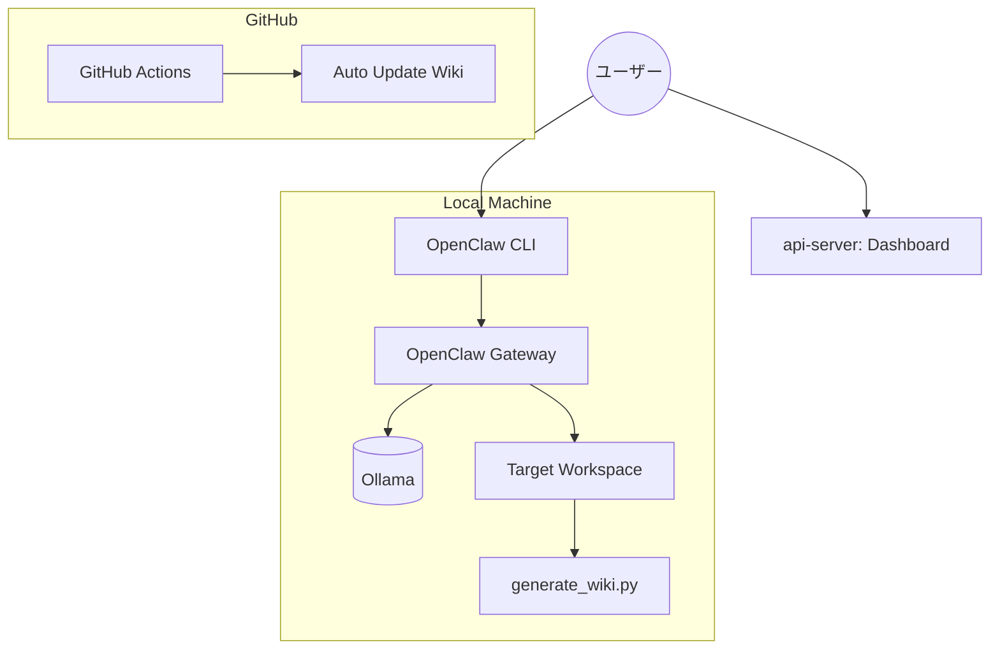

# 🚀 プロジェクト進捗報告書: Antigravity x OpenClaw 統合

作成日: 2026-02-17
ステータス: 第一段階完了 (Foundation Phase)

## 1. 概要
本プロジェクトでは、自律型AIエージェントプラットフォーム「OpenClaw」を中核に据え、ローカルLLM（Ollama）を活用した開発エコシステムを構築しました。また、エージェントが参照するためのナレッジベース（CODE Wiki）とその管理画面（Dashboard）を整備しました。

## 2. 実装済み機能

### 🌌 CODE Wiki システム
- **自動生成機能**: `scripts/generate_wiki.py` により、プロジェクト構造から `docs/CODE_WIKI.md` を自動生成。
- **CI/CD 連携**: GitHub Actions (`.github/workflows/ci.yml`) により、プッシュ時にドキュメントを自動更新。
- **ドキュメント構成**:
  - `docs/CODE_WIKI.md`: プロジェクトの全体像と構造。
  - `docs/CODEWIKI_USAGE_GUIDE.md`: Wikiの運用ガイド。

### 🖥️ 管理ダッシュボード (`api-server`)
- **技術スタック**: Rust (Axum, Tower-HTTP)
- **機能**:
  - 静的ファイルのサービング (`static/index.html`)。
  - WikiドキュメントのAPIエンドポイント経由での表示。
- **デザイン**: ガラスモーフィズムを採用したプレミアムなダークモードUI。
- **ポート**: 3015 (Open WebUIとの衝突を避けるため)

### 🦞 OpenClaw エージェント基盤
- **ローカルLLM連携**: Ollama上の `llama3.1:8b` および `llama4:latest` との統合。
- **設定管理**: `~/.openclaw/openclaw.json` によるプロバイダー・モデルの詳細設定。
- **ワークスペース**: `/Users/motista/Desktop/antigravity/modular-open-claw` をエージェントの作業領域として定義。

## 3. 現在の構成図

## 4. 成果物リスト
| ファイル/ディレクトリ | 内容 |
| :--- | :--- |
| `apps/api-server/` | 管理画面サーバーの実装 |
| `scripts/generate_wiki.py` | Wiki自動生成スクリプト |
| `docs/` | Wiki及びガイドライン |
| `.github/workflows/` | CI/CD 設定ファイル |
| `~/.openclaw/` | OpenClaw 各種設定 (Local) |
