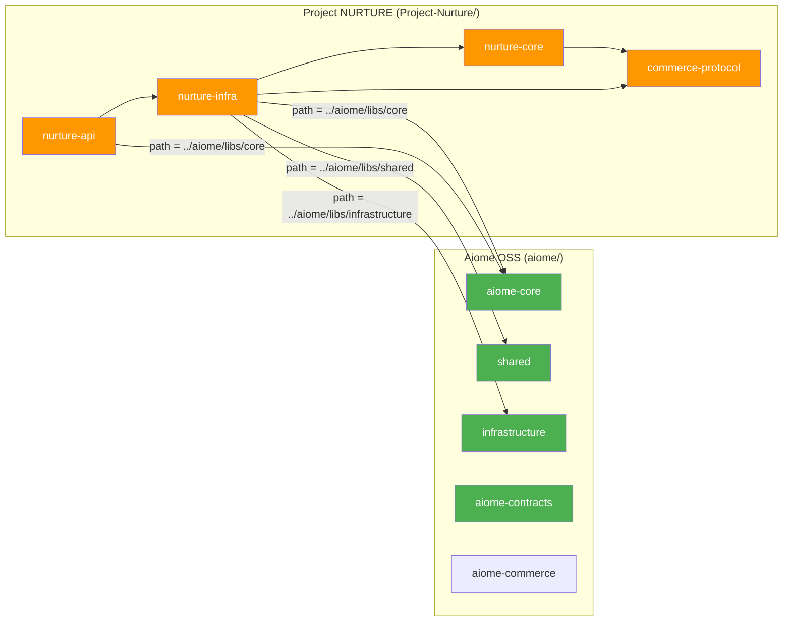
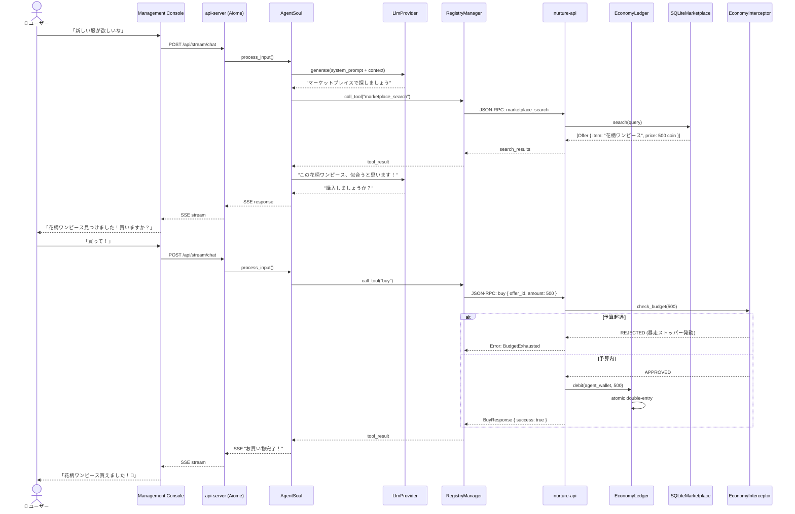
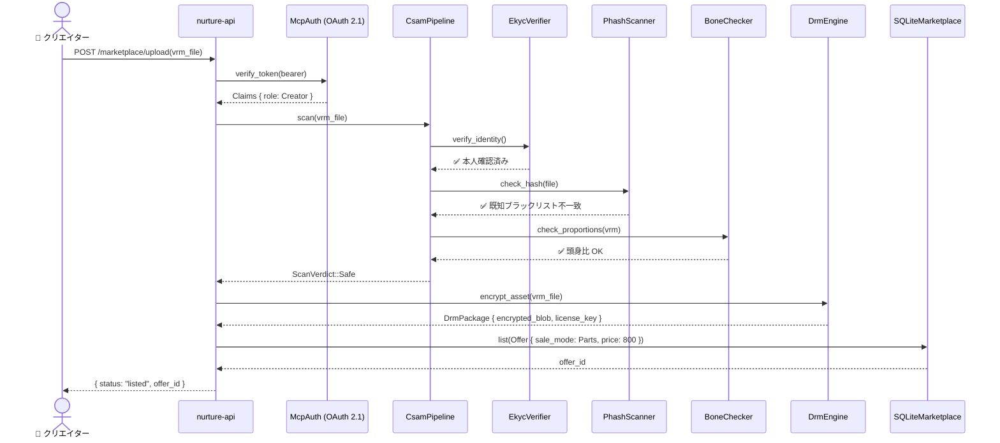
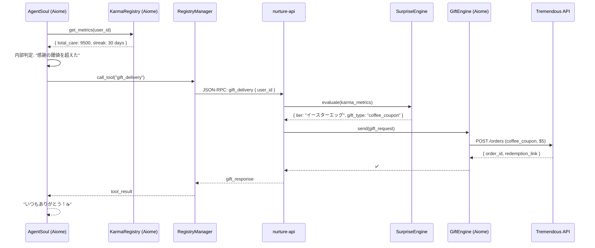
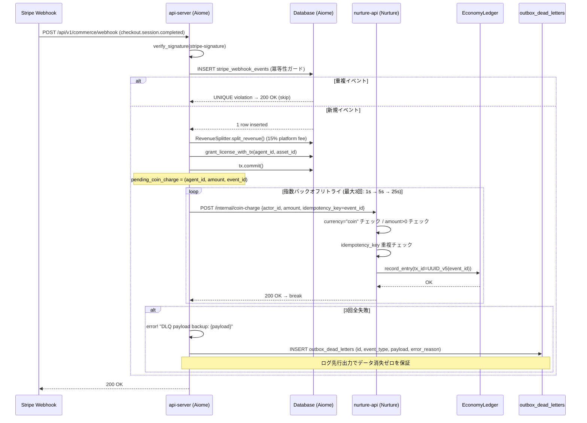
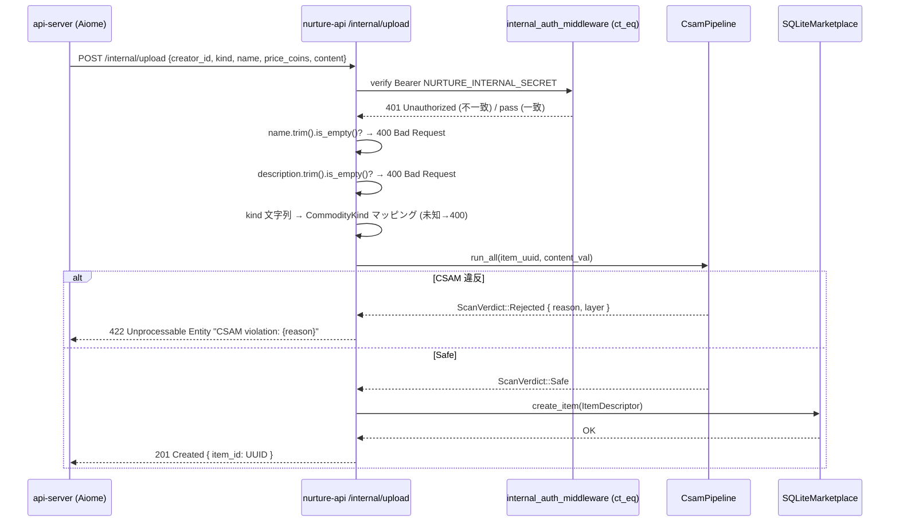
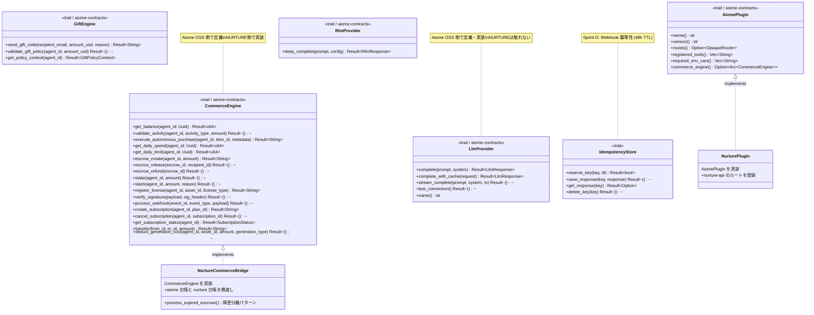
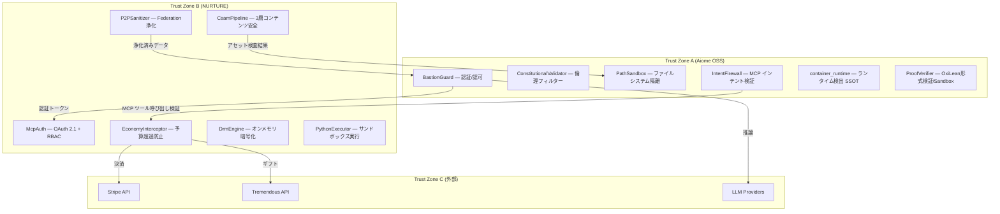
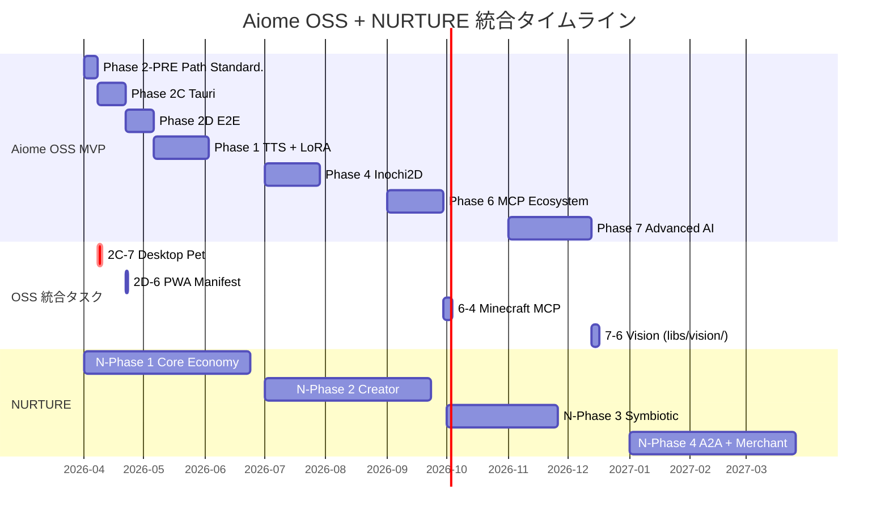

# Aiome × Project NURTURE 統合仕様書

> **自動生成元**: `/docs-gen` ワークフロー  
> **最終更新**: 2026-04-23
> **対象リポジトリ**: `aiome/` (OSS) + `Project-Nurture/` (商用拡張)

---

## 1. 概要

**Aiome** は自律型 AI エージェントのための「文明の OS」（OSS、BSL-1.1）。
**Project NURTURE** は Aiome に経済的自我を注入する商用拡張モジュール（BSL-1.1）。

2つは物理的に別リポジトリだが、設計上は「1つのシステム」として動作する。
Aiome は NURTURE を知らなくても機能し、NURTURE は Aiome に依存する。

```
NURTURE ──依存──▶ Aiome OSS
Aiome OSS ──✕依存しない✕──▶ NURTURE
```

---

## 2. 統合アーキテクチャ全体図

```mermaid
graph TB
    subgraph "ユーザー / 外部"
        USER["👤 ユーザー"]
        CREATOR["🎨 クリエイター"]
        MERCHANT["🏪 外部事業者"]
        GAME_SRV["🎮 ゲームサーバー"]
    end

    subgraph "Aiome OSS — 文明の OS"
        direction TB
        subgraph "L0: Safety Foundation"
            TLA["TLA+ 形式検証"]
            BASTION["BastionGuard"]
            CONST["ConstitutionalValidator"]
        end

        subgraph "L1: Soul Engine"
            SOUL["AgentSoul"]
            KARMA["KarmaRegistry"]
            TRAJECTORY["TrajectoryStore"]
            SOT["SoTEngine"]
            DREAM["DreamState / DreamService"]
        end

        subgraph "L2: Capabilities"
            LLM["LlmProvider (6実装)"]
            TTS["TtsProvider"]
            LORA["LoraEngine"]
            AVATAR["AvatarEngine"]
            VISION["VisionProvider (計画)"]
            SKILL["SkillForge (WASM)"]
            FORMAL["ProofVerifier (OxiLean)"]
            MCP_REG["RegistryManager (MCP)"]
            TREND["TrendSonar (X/Serp)"]
            EVAL["EvaluationLogger (Telemetry)"]
        end

        subgraph "L3: Social Infrastructure"
            SAMSARA["SamsaraHub (Federation)"]
            SYNDICATE["SmartSyndicate"]
            IMMUNE["AdaptiveImmuneSystem"]
        end

        subgraph "Apps"
            API["api-server (125 endpoints)"]
            MGMT["Management Console (60 screens)"]
            SEOPULSE["SeoPulseView"]
            PROXY["key-proxy (AbyssVault/WP)"]
            TAURI["Tauri Desktop (計画)"]
        end
    end

    subgraph "Project NURTURE — 経済拡張"
        direction TB
        subgraph "Commerce Protocol"
            TX["Transaction&lt;S: TxState&gt;"]
            COMMODITY["CommodityKind"]
            OFFER["Offer + SaleMode"]
            ACTOR["EconomicActor"]
            REPUTATION["ReputationScore"]
        end

        subgraph "Nurture Core"
            COIN["AiomeCoin (前払い非換金)"]
            POINTS["CreatorPoints (報酬)"]
            LEDGER["EconomyLedger (二重記帳)"]
            POLICY["EconomyPolicy"]
            LICENSE["AssetLicense"]
            SURPRISE["SurpriseEngine (A2C)"]
        end

        subgraph "Nurture Infra"
            BRIDGE["NurtureCommerceBridge"]
            INTERCEPTOR["EconomyInterceptor"]
            MARKET_DB["SQLiteMarketplace"]
            DRM["DrmEngine"]
            CSAM_N["CsamPipeline (3層防壁)"]
            STRIPE["StripeWebhookHandler"]
            IDEMPOTENCY["IdempotencyStore (48h TTL)"]
            ESCROW_TTL["EscrowTTL (24h 自動返金)"]
            SANDBOX["PythonExecutor"]
            SIDECAR["SidecarLauncher"]
            TIMESFM["timesfm-sidecar /health"]
            VRAM["VramArbiter"]
            CLONE["CloneManager"]
            P2P_SAFE["P2PSanitizer"]
            RESIDENCY["ResidencyManager"]
        end

        subgraph "Nurture API"
            NAPI["nurture-api (JSON-RPC)"]
            MCP_AUTH["McpAuth (OAuth 2.1)"]
            MCP_TOOLS["MCP Tools (search/buy/gift)"]
            PLUGIN["NurturePlugin"]
        end
    end

    subgraph "将来統合 (OSS側)"
        PET["🐾 デスクトップペット (2C-7)"]
        PWA["📱 PWA (2D-6)"]
        MC_MCP["🎮 Minecraft MCP (6-4)"]
        VISION_MOD["👁️ 視覚認識 (7-6)"]
    end

    %% ユーザー接続
    USER -->|チャット / 育成| MGMT
    USER -->|デスクトップ| TAURI
    CREATOR -->|アセット出品| NAPI
    MERCHANT -->|SDK| NAPI
    GAME_SRV -->|RCON| MC_MCP

    %% Aiome 内部フロー
    API --> LLM
    API --> SOUL
    API --> MCP_REG
    MGMT --> API
    TAURI --> API
    SOUL --> KARMA
    SOUL --> TRAJECTORY
    SOUL --> SOT
    LLM --> BASTION
    LLM --> CONST
    SKILL --> BASTION
    AVATAR --> TTS
    DREAM --> EVAL
    MCP_REG -.->|将来| MC_MCP
    MCP_REG -.->|将来| VISION_MOD

    %% NURTURE → Aiome 依存
    BRIDGE -->|use aiome_core::CommerceEngine| API
    BRIDGE -->|use aiome_core::JobQueue| API
    INTERCEPTOR --> POLICY
    NAPI --> API
    PLUGIN -->|AiomePlugin trait| API
    MCP_TOOLS --> MCP_REG
    CLONE -->|use aiome_core::FederatedKarma| KARMA

    %% NURTURE 内部フロー
    TX --> LEDGER
    OFFER --> COMMODITY
    COIN --> LEDGER
    POINTS --> LEDGER
    NAPI --> MCP_AUTH
    NAPI --> MCP_TOOLS
    NAPI --> STRIPE
    DRM --> LICENSE
    CSAM_N --> DRM
    SIDECAR --> VRAM
    CLONE --> SIDECAR
    P2P_SAFE --> SAMSARA
    API -->|health check| TIMESFM
    SEOPULSE --> API

    %% 将来統合
    TAURI -.-> PET
    MGMT -.-> PWA
```



---

## 3. レイヤード・アーキテクチャ

### Aiome OSS — 4層構造

| レイヤー | 責務 | 主要クレート |
|---------|------|------------|
| **L0: Safety** | TLA+ 形式検証、BastionGuard、Constitutional Validator | `shared`, `aiome-contracts` |
| **L1: Soul** | 記憶、感情、人格、自己修復 | `soul`, `aiome-core-contracts` |
| **L2: Capabilities** | LLM推論、TTS、LoRA、3Dアバター、MCP | `core`, `avatar-engine`, `infrastructure` |
| **L3: Social** | Federation、CRDT同期、ギルド | `samsara-hub`, `infrastructure` |

### Project NURTURE — 3層構造

| レイヤー | 責務 | クレート |
|---------|------|--------|
| **Protocol** | 経済モデルの型定義、不変条件 | `commerce-protocol` |
| **Core** | 取引承認、台帳管理、暴走防壁 | `nurture-core` |
| **Infra** | DB実装、DRM、CSAM、Stripe、サンドボックス | `nurture-infra` |
| **API** | JSON-RPC/MCP エンドポイント | `nurture-api` |

---

## 4. クロスリポジトリ依存マップ



### 具体的な依存ポイント（Rust `use` 文レベル）

> **Note (v0.9.x DD-2)**: `aiome_core::contracts::FederatedKarma` は現在 `KarmaEntry` に統合されています。

| NURTURE 側ファイル | 使用する Aiome シンボル |
|-------------------|---------------------|
| `economy/bridge.rs` | `aiome_core::commerce::CommerceEngine`, `aiome_core::error::AiomeError`, `aiome_core::traits::JobQueue` |
| `economy/karma_forge.rs` | `aiome_core::contracts::KarmaEntry`, `aiome_core::traits::JobQueue` |
| `economy/karma_immune_filter.rs` | `aiome_core::contracts::KarmaEntry` |
| `sidecar/clone_manager.rs` | `aiome_core::contracts::KarmaEntry`, `aiome_core::traits::JobQueue` |
| `mock_job_queue.rs` | `infrastructure::job_queue::UniversalJobQueue`, `aiome_core::contracts::*` |

---

## 5. 主要データフロー

### 5.1 ユーザーチャット → 自律購入フロー



### 5.2 クリエイターアセット出品 → CSAM検査 → DRM保護



### 5.3 A2C ギフト（恩返し）フロー



### 5.4 Stripe Checkout 完了 → コインチャージ → DLQ フォールバック



### 5.5 S2S マーケットプレイスアップロード (CSAM → 登録)



---

## 6. 主要データ構造（クラス図）

### Commerce Protocol（経済モデル型）

```mermaid
classDiagram
    class TxState {
        <<trait>>
    }
    class Initiated
    class Authorized
    class Settled
    class Failed
    class Refunded
    class Cancelled

    TxState <|-- Initiated
    TxState <|-- Authorized
    TxState <|-- Settled
    TxState <|-- Failed
    TxState <|-- Refunded
    TxState <|-- Cancelled

    class Transaction~S: TxState~ {
        +Uuid id
        +ActorId buyer
        +ActorId seller
        +ItemDescriptor item
        +u64 amount_coins
        +u64 creator_points_earned
        +DateTime~Utc~ initiated_at
        +Option~DateTime~Utc~~ settled_at
        +Option~u64~ debit_account_version
        +new(buyer, seller, item, creator_points_rate) Transaction~Initiated~
        +authorize() Transaction~Authorized~
        +settle() Transaction~Settled~
        +cancel() Transaction~Cancelled~
        +fail() Transaction~Failed~
        +refund() Transaction~Refunded~
    }

    class CommodityKind {
        <<enum>>
        VrmAvatar
        ClothingPart
        Accessory
        WasmSkill
        KnowledgePack
        Expression
        VoiceModel
        KarmaPackage
    }

    class ItemDescriptor {
        +Uuid id
        +CommodityKind kind
        +String name
        +String description
        +PriceTag price
        +ActorId creator_id
        +SaleMode sale_mode
        +bool drm_enabled
        +DateTime~Utc~ created_at
        +Value metadata
    }

    class PriceTag {
        <<enum>>
        Fixed(u64)
        Negotiable \{ min: u64, max: u64 \}
        Free
    }

    class Offer {
        +Uuid id
        +ActorId seller
        +ItemDescriptor item
        +PriceTag price
        +OfferStatus status
        +SaleMode sale_mode
        +Option~u32~ stock
        +DateTime~Utc~ listed_at
        +Option~DateTime~Utc~~ expires_at
    }

    class OfferStatus {
        <<enum>>
        Draft
        Active
        Suspended
        SoldOut
        Expired
    }

    class SaleMode {
        <<enum>>
        Instant
        Subscription \{ interval_days: u32, price_coins: u64 \}
    }

    class EconomicActor {
        +ActorId id
        +ActorKind kind
        +String display_name
        +DateTime~Utc~ created_at
    }

    class ActorKind {
        <<enum>>
        AiAgent
        HumanOwner
        Creator
        Merchant
        System
    }

    class ReputationScore {
        +ActorId actor_id
        +u64 total_sales
        +u64 total_revenue_coins
        +f64 rating_sum
        +u64 rating_count
        +TrustLevel trust_level
        +u32 violation_count
        +apply_penalty(severity: u32)
        +fee_multiplier() f64
    }

    Transaction --> ItemDescriptor
    Transaction --> EconomicActor
    Offer --> ItemDescriptor
    Offer --> SaleMode
    Offer --> OfferStatus
    ItemDescriptor --> CommodityKind
    ItemDescriptor --> PriceTag
    ItemDescriptor --> SaleMode
    EconomicActor --> ActorKind
```

### Aiome OSS — 経済インターフェース（接合点）



---

## 7. セキュリティ境界



---

## 8. 将来統合（OSS インスピレーション統合）

### 統合タイムライン



### 統合による新しいシナジー

| OSS 統合要素 | NURTURE との相乗効果 |
|-------------|-------------------|
| **デスクトップペット (2C-7)** | NURTURE の着せ替え機能と組み合わせ → ペットモードのアバターにマーケットプレイスの衣装を着用 |
| **PWA (2D-6)** | モバイルから NURTURE マーケットプレイスへのアクセスが可能に → 移動中のアセット購入 |
| **Minecraft MCP (6-4)** | ゲーム内の成果が Karma に反映 → NURTURE の ReputationScore に影響 |
| **視覚認識 (7-6)** | 画面の内容を理解した上でのコンテキスト購入推薦 → NURTURE の購買体験が飛躍的に向上 |

---

## 9. コンプライアンス・ライセンス

| 項目 | Aiome OSS | Project NURTURE |
|------|----------|----------------|
| **ライセンス** | BSL-1.1 → Apache 2.0 (2030) | BSL-1.1 → Apache 2.0 (2030) |
| **著作権** | motivationstudio, LLC | motivationstudio, LLC |
| **依存方向** | 単独で動作（NURTURE 不要） | Aiome に依存（Aiome 必須） |
| **外部 OSS 参考** | Open-LLM-VTuber (MIT), AIRI (MIT): 設計参考のみ、コードコピーなし | — |
| **CSAM 対策** | OSS 側: `ImageHasher`, `ProportionsChecker` | NURTURE 側: `CsamPipeline` (3層: eKYC + PHash + BoneCheck) |
| **決済法** | 非該当 | BSL 下で資金決済法の監視対象（未使用残高 1,000万円超時） |

---

## 10. ファイル一覧（全構造体・トレイト・列挙型）

### Aiome OSS — 主要シンボル (抜粋)

| クレート | シンボル数 | 代表的なシンボル |
|---------|----------|---------------|
| `aiome-contracts` | 19 | `LlmProvider`, `CommerceEngine`, `GiftEngine`, `FormalProofGate`, `GigMetadataUpdater` |
| `aiome-core-contracts` | 70+ | `JobQueue`, `KarmaRegistry`, `ArtifactStore`, `Publisher` |
| `shared` | 30+ | `AppDataResolver` (CBA Cell-ID Namespacing), `SecurityPolicy`, `Guardrails` |
| `infrastructure` | 150+ | `RegistryManager`, `WordPressAdapter`, `ContextEngine`, `SoTEngine`, `EvaluationLogger`, `SemanticCacheRepository`, `DistillationOps` |
| `soul` | 20+ | `AgentSoul`, `SoulPipeline`, `SomaticMarker`, `SemanticRecaller`, `DreamState` |
| `core` | 20+ | `OllamaProvider`, `GeminiProvider`, `ClaudeProvider`, `OpenAiProvider` |
| `avatar-engine` | 15+ | `Inochi2dLoader`, `SimpleLipSyncEngine`, `PhysicsSimulator` |

### Project NURTURE — 全シンボル

| クレート | シンボル数 | 代表的なシンボル |
|---------|----------|---------------|
| `commerce-protocol` | 26 | `Transaction<S>`, `CommodityKind`, `Offer`, `SaleMode`, `EconomicActor`, `ReputationScore` |
| `nurture-core` | 15 | `AiomeCoin`, `CreatorPoints`, `EconomyLedger`, `EconomyPolicy`, `SurpriseEngine` |
| `nurture-infra` | 40+ | `NurtureCommerceBridge`, `EconomyInterceptor`, `DrmEngine`, `CsamPipeline`, `VramArbiter`, `CloneManager` |
| `nurture-api` | 15+ | `NurturePlugin`, `McpAuth`, MCP ツール群 (`search`, `buy`, `gift`, `wallet`, `sandbox_exec`) |

---

*本ドキュメントは `/docs-gen` ワークフローにより Aiome OSS および Project NURTURE の Rust ソースコードから自動生成されました。*
