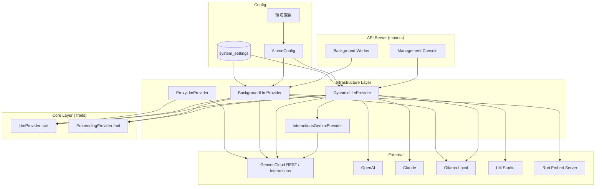

# LLM Provider Architecture — 動的プロバイダー設計書

**Version:** 1.2
**Last Updated:** 2026-03-22
**Author:** Antigravity Agent / motivationstudio

---

## 1. 概要

Aiome の LLM プロバイダーは、**Infrastructure Layer** (`libs/infrastructure/src/llm/`) に集約されています。
これにより、`api-server` だけでなく将来の CLI ツールや他のバイナリからも、
一貫したインターフェースでLLMを利用できます。

```
libs/infrastructure/src/llm/
├── mod.rs           ← モジュール宣言
├── proxy.rs         ← ProxyLlmProvider (Abyss Vault 経由)
├── interactions.rs  ← InteractionsGeminiProvider (Phase 5: ステートフル REST API)
└── dynamic.rs       ← DynamicLlmProvider / BackgroundLlmProvider (★ 本ドキュメント)
```

---

## 2. 設計原則

### 2.1 Single Point of Configuration
すべての LLM 設定は `AiomeConfig`（`libs/shared/src/config.rs`）で一元管理されます。

```
環境変数 → AiomeConfig::load() → DynamicLlmProvider / BackgroundLlmProvider
```

### 2.2 設定優先順位（3層フォールバック）

LLM の接続先は以下の優先順位で解決されます：

```
1. DB 設定 (system_settings テーブル)    ← ダッシュボードから動的変更可能
2. 環境変数 (BG_LLM_PROVIDER 等)        ← デプロイ時に固定
3. AiomeConfig デフォルト値              ← コード内のフォールバック
```

### 2.3 Zero-Panic Policy
プロバイダーの初期化と設定読み込みでは `expect()` / `unwrap()` を使用せず、
すべてのエラーは `unwrap_or_else` + ログ出力 + 適切なデフォルト値で処理されます。

---

## 3. DynamicLlmProvider（フロントエンド用）

ユーザーからのリアルタイム対話に使用されるプロバイダーです。

### 3.1 対応プロバイダー

| プロバイダー | 設定値 | API キー環境変数 | ホスト設定 |
|---|---|---|---|
| Gemini | `gemini` | `GEMINI_API_KEY` | API直接 |
| OpenAI | `openai` | `OPENAI_API_KEY` | API直接 |
| Claude | `claude` | `ANTHROPIC_API_KEY` | API直接 |
| LM Studio | `lmstudio` | 不要 | `lm_studio_host` / `http://127.0.0.1:1234` |
| Ollama | `ollama` (default) | 不要 | `ollama_host` / `AiomeConfig.ollama_host` |

#### 3.1.1 Ollama LoRA 動的ビルド (Phase 6.8 実装)
`OllamaProvider` は設定の変更 (`lora_adapter_path`, `lora_base_model`) をフックして、Ollamaのバックエンドに直接 `Modelfile` ( `FROM <base> \n ADAPTER <path>` ) を生成・リクエストし、新しいチューニング済みモデルを動的ビルド (`build_lora_model`) する機能を備えています。APIからのパラメータ挿入の限界を回避し、ローカル環境での完全なファインチューニング適用を実現します。

### 3.2 回復力機能

- **Circuit Breaker**: 連続 5 回の失敗で回路を開き、60 秒後にハーフオープンで再試行。
- **SLO Engine**: 24時間ウィンドウでエラーバジェットを管理。80% 超過で警告。
- **ストリーミング**: `stream_complete()` で SSE 経由のリアルタイムトークン配信。

### 3.3 FallbackRouter (Phase 17 実装)
`FallbackRouter` は、プライマリLLM（例: 外部サービスや高負荷モデル）の障害をサーキットブレーカーで検知し、セカンダリ（例: Gemini Cloud などの安定プロバイダー）へ透過的に切り替えます。
- **Failover**: タイムアウトや 5xx エラーを検知して自動トリガー。
- **Transparent**: 利用側は単一の `LlmProvider` として操作可能。

### 3.4 Trend Evaluation (Phase 20/21 実装)
`ExternalTrendSonar` はオプションの `LlmProvider` を参照し、収集されたトレンドキーワードに対してスコアリング（注目度・有用性）を行います。これにより、単なる収集から「意味のある選別」へと進化しています。

### 3.5 Embedding 対応

`DynamicLlmProvider` は `EmbeddingProvider` も実装しています。
- Gemini: `gemini-embedding-001` モデルを使用
- Ollama: ローカルモデルのエンベディング機能を利用
 
### 3.6 Security Auditing (Phase 24 実装)
`Cleanroom` は `LlmProvider` を使用して、生成またはインポートされたスキルソースコードのセキュリティ監査を行います。専用の監査プロンプトを用いて、Vampire Attack（機密情報窃取）や不適切なネットワーク通信の兆候を解析し、安全性が確認されたコードのみをコンパイルプロセスへ移行させます。

---

## 4. BackgroundLlmProvider（バックグラウンド用）

自律タスク（Soul Mutation、Karma蒸留、免疫分析等）で使用されるプロバイダーです。

### 4.1 設定キー

| 設定 | DB キー | 環境変数 | デフォルト |
|---|---|---|---|
| プロバイダー | `bg_llm_provider` | `BG_LLM_PROVIDER` | `ollama` |
| モデル | `bg_llm_model` | `BG_LLM_MODEL` | `AiomeConfig.ollama_model` |
| API キー | `bg_llm_api_key` | `GEMINI_API_KEY` → `OPENAI_API_KEY` → `ANTHROPIC_API_KEY` | — |

### 4.2 Embedding フォールバックチェーン

`BackgroundLlmProvider` の `EmbeddingProvider` 実装は以下の順序でフォールバックします：

```
EMBEDDING_PROVIDER 環境変数で分岐:

"ruri"（デフォルト）:
  Ruri (RURI_EMBED_URL) → Gemini Embedding (fallback) → エラー

"gemini":
  Gemini Embedding (gemini-embedding-001)

それ以外:
  Ollama Embedding (ローカル)
```

---

## 5. ProxyLlmProvider（Abyss Vault 経由）

Key Proxy を経由する特殊なプロバイダーです。API キーを直接保持せず、
すべてのリクエストを `KEY_PROXY_URL` に転送します。

```
アプリ → ProxyLlmProvider → Key Proxy (Abyss Vault) → 外部API
         API キー不保持         API キー物理隔離        Gemini/OpenAI
```

---

## 6. アーキテクチャ図



---

## 7. Speech Synthesis (TTS) Architecture (Phase 10.1a)

`ExpressionEngine` は `LlmProvider` を使用してテキストを生成した後、オプションで TTS 合成を行います。

### 7.1 対応 TTS プロバイダー

| プロバイダー | 設定値 (`tts_provider`) | API キー / エンドポイント | 特徴 |
|---|---|---|---|
| OpenAI | `openai` | `llm_api_key` | 高速・高品質、要クラウド接続 |
| XTTS | `xtts` | `tts_endpoint` | ローカル実行可能、クローン音声対応 |
| なし | `none` | 不要 | テキストのみ生成 |

### 7.2 LoRA モデル連携 (Phase 10.1b)

人格のファインチューニングに使用される LoRA モデルは、`AgentSoul` の `lora_hash` フィールドによって識別されます。
- `lora_hash`: モデルの同一性を保証し、`soul_hash` の一部として計算されます。
- 実行時、`OllamaProvider` はこのハッシュに基づいて `build_lora_model()` を呼び出し、適切なアダプタをロードします。

---

## 8. 設定変更の影響範囲

| 変更箇所 | 影響 | 再起動必要 |
|---|---|---|
| DB (`system_settings`) | 次のリクエストから即反映 | ❌ 不要 |
| 環境変数 (`.env`) | プロセス起動時に読み込み | ✅ 必要 |
| `AiomeConfig` コード | コンパイル時に確定 | ✅ 必要 (ビルド) |

### 3.7 Structured Output (Phase 31 実装)
`LlmRequest` に `format` フィールドが追加されました。
- Ollama: `format: "json"` が指定された場合、`format: "json"` パラメータをリクエストに付与し、LLM に JSON 形式での出力を強制します。

### 3.8 Gemini Interactions API 統合 (Phase 5 実装)
`InteractionsGeminiProvider` は、Google Gemini の REST ベースの Interactions API を使用します。
- **Stateful Sessions**: `interaction_id` を介してサーバーサイドで会話コンテキストを維持。フロントエンドからのコンテキスト送信量を削減。
- **Hybrid Context Sync**: `ContextEngine` および `TrajectoryStore` と連携し、DB に同期保存された履歴に基づいた再構築とフェイルオーバーを実現。
- **Reasoning Log Persistence**: LLM が生成した内部思考（Reasoning）を透過的に取得・永続化し、デバッグと透明性を向上。

---

*Document managed by Aiome Infrastructure Team*
*最終更新: 2026-03-26 (Phase 5 / Gemini Interactions API 対応)*

---

## 9. ローカル日本語 LLM 候補 (Phase 29 評価予定)

`BackgroundLlmProvider` の最適モデル選定のため、以下の候補を比較評価する。

| モデル | パラメータ | Q4_K_M サイズ | 特徴 | 評価優先度 |
|---|---|---|---|---|
| **Qwen3.5-9B-Japanese-awy** | 9B | ~5.5GB | Vision 対応、日本語特化 FT、Unsloth/LoRA 親和 | ★★★ |
| Llama-3.1-Swallow-8B | 8B | ~5.0GB | 東工大製、日本語タスクベンチ上位 | ★★☆ |
| Qwen2.5-7B-Instruct | 7B | ~4.5GB | 公式版、汎用性高い | ★★☆ |
| Phi-4-mini-instruct | 3.8B | ~2.5GB | 超軽量、推論特化 | ★☆☆ |

### 評価基準
- Soul Mutation テキスト生成品質 (日本語自然さ)
- Karma 蒸留の要約精度
- DreamState 創造的シード生成力
- トークン/秒 (Mac M-series での推論速度)

