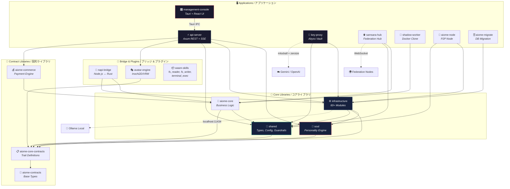
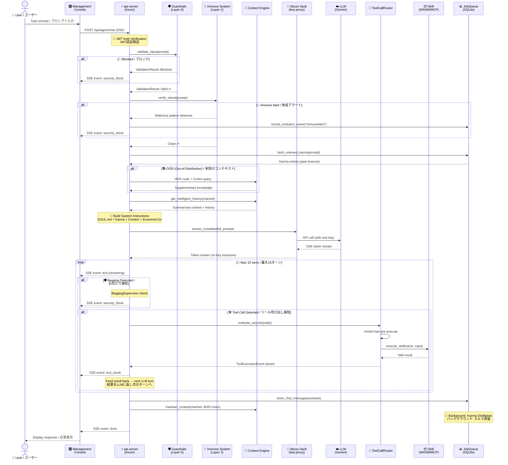
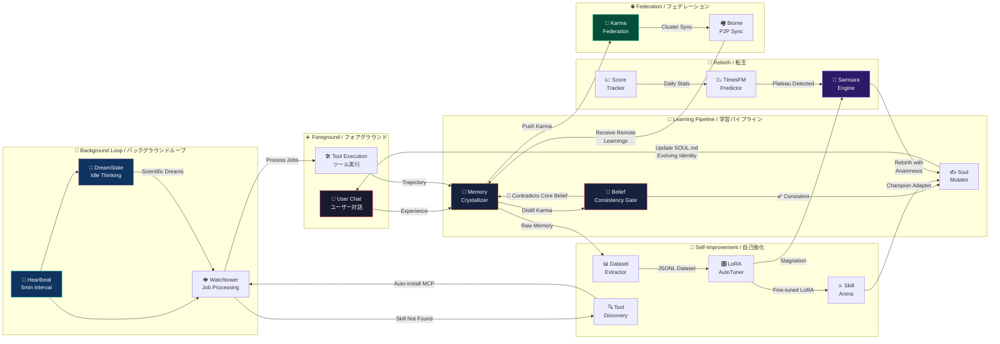
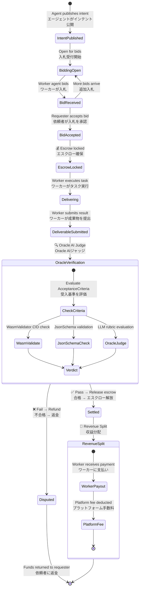

# 🗺️ Aiome System Panorama — Multi-Perspective Architecture Navigator
# 🗺️ Aiome システムパノラマ — 多視点アーキテクチャナビゲーター

> **Purpose / 目的**: This document provides 5 visual perspectives to understand the entire Aiome system in 30 minutes. Each perspective links to detailed documentation for deeper exploration.
>
> **目的**: 本ドキュメントは、Aiome システムの全容を30分で理解するための5つのビジュアルパースペクティブを提供します。各パースペクティブから詳細ドキュメントへディープリンクで辿れます。

> [!NOTE]
> **Design Philosophy / 設計思想**: Inspired by the oh-my-mermaid (OMM) concept of "multi-perspective recursive decomposition." No external tools required — this is a self-contained, manually curated hub document.
>
> OMM の「多視点・再帰的分解」思想にインスパイアされています。外部ツール不要。手動キュレーションによるハブドキュメントです。

---

## 📑 Navigation / ナビゲーション

| # | Perspective / パースペクティブ | Diagram Type | What You'll Learn / 学べること |
|---|---|---|---|
| 1 | [System Topology](#-perspective-1-system-topology--システムトポロジー) | `graph TD` | Crate structure & dependencies / クレート構造と依存関係 |
| 2 | [Request Lifecycle](#-perspective-2-request-lifecycle--リクエストライフサイクル) | `sequenceDiagram` | One request's journey from UI to LLM to Karma / 1リクエストの旅路 |
| 3 | [Defense in Depth](#-perspective-3-defense-in-depth--多層防御) | `graph TB` | 4+1 security layers & 66 threat mitigations / 多層防御と66の脅威対策 |
| 4 | [Autonomous Evolution Loop](#-perspective-4-autonomous-evolution-loop--自律進化ループ) | `graph LR` | Self-healing, self-learning, self-evolving cycle / 自己修復・自己学習・自己進化サイクル |
| 5 | [AI Economy](#-perspective-5-ai-economy--ai経済圏) | `stateDiagram-v2` | Gig marketplace, escrow, revenue split / ギグ経済・エスクロー・収益分配 |

**Cross-Reference Hub / 関連ドキュメント**:

| Document | Role / 役割 |
|---|---|
| [ARCHITECTURE.md](../../ARCHITECTURE.md) | Auto-generated dependency graph / 自動生成の依存グラフ |
| [INFRASTRUCTURE_MODULES.md](INFRASTRUCTURE_MODULES.md) | 60+ module catalog / 60超モジュールカタログ |
| [SECURITY_DESIGN.md](SECURITY_DESIGN.md) | Threat model & defense doctrine / 脅威モデルと防御ドクトリン |
| [EVOLUTION_STRATEGY.md](EVOLUTION_STRATEGY.md) | 9-layer evolution architecture / 9層進化アーキテクチャ |
| [ARCHITECTURE_LAW.md](ARCHITECTURE_LAW.md) | AI Constitution (11 articles) / AI都市建築基準法（11条） |
| [ADR Index](../decisions/) | 28+ Architectural Decision Records / 設計判断記録 |

---

## 📐 Perspective 1: System Topology / システムトポロジー

> **What this shows / この図が示すもの**: The physical crate boundaries and dependency flow. Each node is a deployable unit or library.
>
> 物理的なクレート境界と依存フロー。各ノードはデプロイ単位またはライブラリ。

> **Deep Dive / 詳細**: → [ARCHITECTURE.md](../../ARCHITECTURE.md) (auto-generated graph) / → [INFRASTRUCTURE_MODULES.md](INFRASTRUCTURE_MODULES.md) (60+ module details)

---

## 🔄 Perspective 2: Request Lifecycle / リクエストライフサイクル

> **What this shows / この図が示すもの**: The complete journey of a single user prompt — from input through security layers, LLM reasoning, tool execution, and knowledge persistence.
>
> ユーザーの1つのプロンプトが、セキュリティ層を通過し、LLM推論、ツール実行、知識永続化に至るまでの完全な旅路。

> **Deep Dive / 詳細**: → [SECURITY_DESIGN.md §2-3](SECURITY_DESIGN.md) (Layer 0-3 details) / → [EVOLUTION_STRATEGY.md §2](EVOLUTION_STRATEGY.md) (Dual-Layer Architecture)

---

## 🛡️ Perspective 3: Defense in Depth / 多層防御

> **What this shows / この図が示すもの**: The 4+1 concentric security layers that protect every action in Aiome. 66 specific threats are mitigated across these layers.
>
> Aiome の全行動を保護する 4+1 同心円セキュリティ層。66の脅威がこれらの層で緩和されている。

```mermaid
graph TB
    subgraph L0["🔍 Layer 0: Input Guardrails / 入力ガードレール"]
        direction LR
        G1["Prompt Injection<br/>Detection"]
        G2["Unicode Sanitization<br/>(GlassWorm Shield)"]
        G3["Begging Supervisor<br/>(Dark Pattern Block)"]
        G4["Local Keyword<br/>Guard"]
        G5["ConstraintChecker<br/>(Output Size/Echo)"]
        G6["Path Traversal<br/>Shield"]
    end

    subgraph L1["🦠 Layer 1: Immune System & Policy / 免疫システム & ポリシー"]
        direction LR
        I1["Adaptive Immune<br/>(14 Signatures)"]
        I2["SecurityPolicy<br/>(Port-level SSRF)"]
        I3["BoundaryVerifier<br/>(O(1) Tautology)"]
        I4["ToolCallRouter<br/>(Unified Precedence)"]
        I5["BeliefConsistency<br/>Gate (SLM+LLM)"]
    end

    subgraph L2["🏰 Layer 2: Execution Sandbox / 実行サンドボックス"]
        direction LR
        S1["WASM Sandbox<br/>(Memory + Time)"]
        S2["PathSandbox<br/>(Canonical Prefix)"]
        S3["Docker 5-Layer<br/>Shadow Defense"]
        S4["Abyss Vault<br/>(Key Isolation)"]
        S5["OAuth 2.1<br/>JWT AuthManager"]
    end

    subgraph L3["📜 Layer 3: Audit & Integrity / 監査 & 完全性"]
        direction LR
        A1["SHA-256<br/>Hash Chains"]
        A2["Invariant-DAG<br/>(Causal Chain)"]
        A3["Diagnostics<br/>Ledger"]
        A4["Federated<br/>Metrics"]
    end

    subgraph L4["🏗️ Layer 4: Build & Forge / ビルド & 鍛造"]
        direction LR
        F1["OS-Native<br/>Sandbox"]
        F2["AI Code Audit<br/>(Cleanroom)"]
        F3["TDD Forge<br/>(Fail-Forward)"]
    end

    INPUT["📨 User Input<br/>ユーザー入力"] --> L0
    L0 -->|"✅ Clean / 安全"| L1
    L1 -->|"✅ Verified / 検証済"| L2
    L2 -->|"✅ Contained / 封じ込め"| L3
    L3 -->|"✅ Audited / 監査済"| L4
    L4 --> SAFE["🎯 Safe Execution<br/>安全な実行"]

    L0 -->|"🚫 Block"| REJECT["❌ Rejected<br/>拒否"]
    L1 -->|"🚫 Block"| REJECT
    L2 -->|"🚫 Isolate"| QUARANTINE["🔒 Quarantine<br/>検疫"]

    style L0 fill:#2d1b69,stroke:#7c3aed,color:#fff
    style L1 fill:#1e3a5f,stroke:#3b82f6,color:#fff
    style L2 fill:#1a4731,stroke:#10b981,color:#fff
    style L3 fill:#4a3728,stroke:#f59e0b,color:#fff
    style L4 fill:#3b1c32,stroke:#ec4899,color:#fff
    style REJECT fill:#7f1d1d,stroke:#ef4444,color:#fff
    style QUARANTINE fill:#78350f,stroke:#f97316,color:#fff
    style SAFE fill:#064e3b,stroke:#34d399,color:#fff
```

**Threat Coverage / 脅威カバレッジ**: 66 threats documented → [SECURITY_DESIGN.md §2.2](SECURITY_DESIGN.md)

| Layer | Threats Covered / 対応脅威数 | Key Threats / 代表的脅威 |
|---|---|---|
| L0: Guardrails | 15 | Prompt Injection, Unicode Bypass, Begging, Path Traversal |
| L1: Immune & Policy | 14 | SSRF, Boundary Violation, Belief Hijacking, Tool Abuse |
| L2: Sandbox | 20 | Secret Leakage, WASM Escape, Docker Bomb, CORS Bypass |
| L3: Audit | 8 | Causal Tampering, Log Deletion, NPM Supply Chain |
| L4: Forge | 9 | Malicious Skill, Reverse Shell, Build-time RCE |

> **Deep Dive / 詳細**: → [SECURITY_DESIGN.md](SECURITY_DESIGN.md) (full threat table) / → [ARCHITECTURE_LAW.md](ARCHITECTURE_LAW.md) (11 articles of the AI Constitution)

---

## 🧬 Perspective 4: Autonomous Evolution Loop / 自律進化ループ

> **What this shows / この図が示すもの**: The self-healing, self-learning, self-evolving cycle that runs continuously in the background.
>
> バックグラウンドで常時稼働する自己修復・自己学習・自己進化のサイクル。

**Key Cycles / 主要サイクル**:

| Cycle / サイクル | Frequency / 頻度 | Driver / トリガー | 
|---|---|---|
| Heartbeat → Watchtower | Every 5 min / 5分ごと | Timer |
| Karma Distillation | After each interaction / 対話後 | Experience accumulation |
| LoRA AutoTune | On stagnation / 停滞検知時 | Loss history analysis |
| DreamState exploration | On idle / アイドル時 | No pending jobs |
| Samsara Rebirth | On plateau / プラトー到達時 | TimesFM prediction |
| Federation Sync | Real-time / リアルタイム | Karma push event |

> **Deep Dive / 詳細**: → [EVOLUTION_STRATEGY.md](EVOLUTION_STRATEGY.md) (9-layer architecture) / → ADR-023 (AI-Scientist Self-Improvement Loop)

---

## 💰 Perspective 5: AI Economy / AI経済圏

> **What this shows / この図が示すもの**: The autonomous AI-to-AI gig economy — where agents publish intents, bid on work, deliver results, and settle payments through escrow.
>
> 自律的なAI間ギグ経済。エージェントがインテント（欲求）を公開し、入札・納品・エスクロー決済を行う。

**Economy Components / 経済コンポーネント**:

| Component | Module | Role / 役割 |
|---|---|---|
| **GigEngine** | `infrastructure/gig_engine` | Intent ↔ Bid ↔ Delivery lifecycle / ライフサイクル管理 |
| **CommerceEngine** | `aiome-commerce` | Balance, escrow, Stripe integration / 残高・エスクロー・Stripe連携 |
| **Oracle Verifier** | `infrastructure/oracle` | Multi-criteria AI judgment / 多基準AI審査 |
| **LoRA Marketplace** | `infrastructure/lora_marketplace` | Personality adapter trading / 人格アダプター取引 |
| **Revenue Splitter** | `aiome-commerce` | Atomic split with license grant / ライセンス付与と原子的分配 |

> **Deep Dive / 詳細**: → [ADR-011](../decisions/011-immutable-gateway-ai-gig-economy.md) (Immutable Gateway Gig Economy) / → [SECURITY_DESIGN.md §2.2 #16-17](SECURITY_DESIGN.md) (eKYC & Revenue Split threats)

---

## 🧭 How to Use This Document / このドキュメントの使い方

### For New Contributors / 新規コントリビューター向け

1. **Start here** → Read all 5 perspectives (15 min)
2. **Go deeper** → Follow the "Deep Dive" links to specific documents
3. **Before coding** → Check [RIPPLE_MAP.md](../../.context/RIPPLE_MAP.md) for impact analysis

### For Architecture Reviews / アーキテクチャレビュー向け

1. **Perspective 1** → Verify crate boundaries are respected
2. **Perspective 3** → Confirm new code passes all security layers
3. **Perspective 4** → Check new modules integrate into the evolution loop

### For Security Audits / セキュリティ監査向け

1. **Perspective 2** → Trace where input validation occurs
2. **Perspective 3** → Map threat coverage gaps
3. **Perspective 5** → Verify economic safeguards (escrow, eKYC)

---

*Last Updated / 最終更新: 2026-04-05*
*Curated by: Aiome Architecture Team — Inspired by [oh-my-mermaid](https://github.com/oh-my-mermaid/oh-my-mermaid) multi-perspective philosophy*
