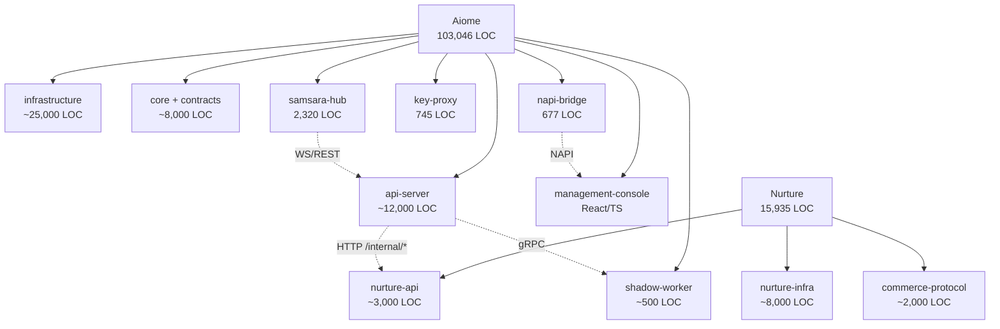

# 🔬 System Integrity Deep Audit v2 — "この巨大な仕組みは動くか？"

> Scanned: 2026-05-01 02:52 JST  
> Scope: `aiome` (**103,046行**) + `Project-Nurture` (**15,935行**) = **約12万行**  
> 前回監査（v1）のミスキャン領域を含む全領域を走査

---

## 📊 規模感の可視化



---

## 🔴 Tier 1 — 即時修正が必要（前回v1の再確認 + 新規発見）

### T1-1: `auth.rs:223` — scrub_env 後の env::var アクセス（v1 C-2 再確認）
前回指摘の通り。**アカウント削除APIが確実に壊れている**。最優先修正。

### T1-2: `forecast.rs:42` — SSRF + Client::new()（v1 C-1 再確認）
前回指摘の通り。修正必須。

### T1-3: 🆕 Federation 層が**ハリボテ**

[federation.rs](file:///Users/motista/Desktop/antigravity/aiome/libs/infrastructure/src/job_queue/federation.rs) の以下のメソッドが空の `Ok(())` / `Ok(Vec::new())` を返しているだけ：

| メソッド | 行 | 状態 |
|:---|:---:|:---|
| `do_import_federated_data` | 136-138 | **空の Ok(())** — インポートしない |
| `do_get_peer_sync_time` | 140-142 | **常に None** — 同期タイム未追跡 |
| `do_update_peer_sync_time` | 144-149 | **空の Ok(())** — 更新しない |
| `do_fetch_unfederated_data` | 152-156 | **常に空** — 未フェデレートデータ取得不能 |
| `do_mark_as_federated` | 158-163 | **空の Ok(())** — マーク不能 |
| `do_push_federated_metrics` | 192-207 | **リクエストを構築するが送信しない** |

> [!CAUTION]
> `do_export_federated_data` のみが実装されており、**データのエクスポートはできるがインポート・同期は一切機能しない**。`main.rs:120` の毎時バックグラウンドタスクは `do_push_federated_metrics` を呼んでいるが、実際にはどこにも送信していない。
>
> **結論:** Federation/P2P Hub はアーキテクチャ上は存在するが、**実際には動かない**。Phase 4 (Biome Reputation) はこの基盤の上に乗る予定なので、計画に影響する。

### T1-4: 🆕 NAPI Bridge の `state.rs` — 独立したシークレット管理

[napi-bridge/state.rs](file:///Users/motista/Desktop/antigravity/aiome/libs/napi-bridge/src/state.rs) が `api-server/bootstrap.rs` とは**完全に独立した**初期化パスで以下を行う：

- L22: `std::env::var("AIOME_DB_PATH")` で独自のDBプール作成
- L77-125: `std::env::var("GEMINI_API_KEY")` / `OPENAI_API_KEY` / `ANTHROPIC_API_KEY` を直接読み取り

これは `api-server` 経由で起動される場合、**bootstrap がすでに scrub_env した後**に呼ばれる可能性がある。Tauri Desktop のコンテキストでは NAPI Bridge は別プロセスなので問題ないが、**同一プロセスでロードされた場合、APIキーが取得できない**。

> [!WARNING]
> 現状のデスクトップ（Tauri）運用では問題ないが、将来の統合で爆弾になる可能性がある。NAPI Bridge と api-server の初期化パスの明確な分離を文書化すべき。

---

## 🟠 Tier 2 — スケーラビリティ・構造上の重大な懸念

### T2-1: `samsara-hub/main.rs` — 2,320行の God Object（DDL インライン）

[samsara-hub/main.rs](file:///Users/motista/Desktop/antigravity/aiome/apps/samsara-hub/src/main.rs) がルーティング、DB初期化（DDL）、WebSocket処理、認証、メンテナンスを**全て1ファイルに**格納。`init_hub_db()` だけで330行のインライン SQL DDL（SQLite + Postgres 分岐のフル重複）。

**影響:** スキーマ変更時に SQLite と Postgres の DDL を手動で同期する必要があり、不整合が入りやすい。

### T2-2: `bootstrap.rs` — 1,446行の初期化関数

前回指摘（v1 H-3）の再確認。7段階の起動シーケンスが1関数に凝縮されている。

### T2-3: `UniversalJobQueue` — 14トレイトの God Trait実装

[job_queue/mod.rs](file:///Users/motista/Desktop/antigravity/aiome/libs/infrastructure/src/job_queue/mod.rs) の `UniversalJobQueue` は以下の **14のトレイト** を実装している：

```
TaskRegistry, DistillationOps, AuditStore, ChatStore, KarmaRegistry,
AgentEvolver, ImmuneSystemOps, FederationRegistry, BiomeRegistry,
Publisher, JobQueue, SystemStateOps, SettingsOps, SoulStore
```

全てのメソッドが `Box::pin(self.do_xxx()).await` のデリゲーションパターン。構造体自体は健全だが、**単一責任原則の極端な違反**であり、テスト時に Mock 差し替えが困難。

### T2-4: SQLite 単一書き込み制約 vs 並行リクエスト

`api-server` は `Semaphore::new(10)` で LLM の同時リクエストを制御しているが、全てのリクエストが最終的に **同一の SQLite DB** に書き込む。SQLite はデフォルトで **1 writer** のみ。高負荷時に `SQLITE_BUSY` エラーが頻発する可能性。

WAL モードは有効化されているが（`samsara-hub` が `PRAGMA wal_checkpoint(TRUNCATE)` を実行している）、api-server 側で WAL の明示的な設定は確認できなかった。

### T2-5: `broadcast::channel(100)` のバッファサイズ

`bootstrap.rs:383` と `samsara-hub:155` の両方で `broadcast::channel(100)` が使用されている。受信者が遅れた場合、**メッセージがドロップされる**（Lagged エラー）。高頻度イベント（Karma 蓄積、チャット等）時にデータロスの可能性。

---

## 🟡 Tier 3 — コード品質・技術的負債

### T3-1: Samsara Hub DDL の SQLite / Postgres 完全重複（330行 × 2）
DDL をマイグレーションファイルに切り出し、`sqlx::migrate!()` に統一すべき。

### T3-2: テストボイラープレート重複（v1 M-1）
4ファイルの同一初期化コード。`test_utils` ヘルパーに抽出。

### T3-3: `unimplemented!()` 残存（v1 M-2）
7箇所。`Err(AiomeError::Infrastructure)` に置換。

### T3-4: `samsara-hub` にも `panic!()` 残存（L106, L133）
`api-server` の CELL_ID チェックと同じパターン。`error!()` + `exit(1)` に統一。

### T3-5: `std::env::var()` 散在（v1 H-1 拡張）
NAPI Bridge にも追加で7箇所発見。合計 **60+ 箇所**。

---

## ✅ 「動くか？」への総合回答

### 動く部分（堅牢）

| 領域 | 根拠 |
|:---|:---|
| **Nurture 経済エンジン** | 61テスト全GREEN。OCC + Merkle + Defense-in-Depth 完備 |
| **Aiome コアエージェント** | 393テスト + 18カオステスト全GREEN |
| **認証・認可** | OAuth 2.1 PKCE + EdDSA JWT + 定数時間比較 |
| **サンドボックス隔離** | BastionGuard + SafeCommandBuilder + Podman |
| **チャット・Karma 蓄積** | SQLite + embedding + LLM distillation パイプライン |
| **NAPI Bridge** | Tauri Desktop 経由の免疫・Karma 連携は機能する |

### 動かない/壊れている部分

| 領域 | 状態 | 影響 |
|:---|:---|:---|
| **Federation/P2P 同期** | ハリボテ（import/sync 未実装） | Biome 評判が孤立ノードのまま |
| **アカウント削除 API** | scrub_env との矛盾で壊れている | GDPR コンプライアンス違反 |
| **Forecast API** | SSRF 脆弱性 | セキュリティ監査で即却下 |
| **Docker Conductor** | Podman ポート0 非対応 | コンテナ委託ジョブが起動しない |
| **Metrics Push** | 構築するが送信しない | 運用可視性ゼロ |

---

## 📋 ブラッシュアップされた開発計画

前回計画の **P0〜P3 の間に Phase 3.5 (Infrastructure Remediation)** を挿入します。

### 改訂版 Execution Order

| 優先度 | フェーズ | 内容 | 推定工数 |
|:---:|:---|:---|:---:|
| **P0** | **Phase 3.5: Infra Remediation** | 下記の即時修正 | 1-2日 |
| P1 | Phase 4: Biome Reputation | T1-3 の Federation 実装が前提 | 1-2週 |
| P2 | Phase 5: Cognitive Observability | ← 変更なし | 1週 |
| P3 | UI/UX 強化 | ← 変更なし | 1-2週 |
| P4 | Release Preflight & Audit | ← 変更なし | 2-3日 |

### Phase 3.5: Infrastructure Remediation（詳細）

```
1. [C-CRITICAL] auth.rs の API_SERVER_SECRET を AppState 経由に修正
2. [C-CRITICAL] forecast.rs の URL injection + Client::new() 修正
3. [C-CRITICAL] main.rs + samsara-hub の panic!() を exit(1) に統一
4. [HIGH] Federation 層のスタブ実装を明示的に disabled/stub として文書化
   → Phase 4 で本実装する際の設計書を先行作成
5. [HIGH] Docker Conductor のポート割り当てを portpicker に委譲
6. [MEDIUM] bootstrap.rs の Stage 分割（少なくとも3ファイルに）
7. [MEDIUM] テストヘルパーの抽出
8. [LOW] samsara-hub DDL のマイグレーション化
```

> [!IMPORTANT]
> Phase 4 (Biome Reputation) に進む前に、**Federation 層の現状がハリボテであること**を認識し、Phase 4 の設計時に Federation 実装をスコープに含めるか、ローカルノードのみの Reputation として設計するかを決定する必要があります。

---

## 🎯 最終判定

> [!WARNING]
> **⚠️ PATCH — Phase 3.5 の挿入が必要。**
> 12万行の規模に対して、コア機能（エージェント対話、経済台帳、認証）は堅牢に動作している。
> ただし Federation 層のハリボテ化は前回監査で見逃しており、Phase 4 計画に直接影響する。
> Phase 3.5 で即時修正 + Federation の現状整理を行った後、安全に Phase 4 以降に移行可能。
