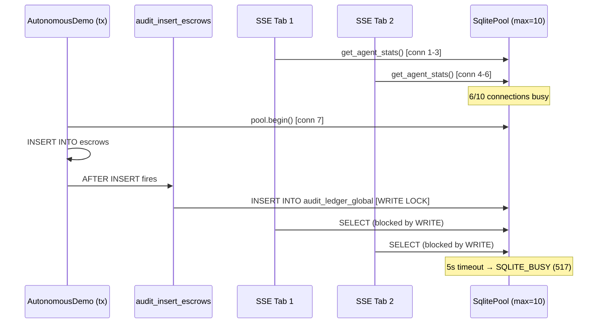

# ADR-014: Autonomous Demo — SQLite ロック回避と本番スケーリング戦略

**Status**: Accepted  
**Date**: 2026-03-23  
**Deciders**: motivationstudio  
**Supersedes**: ADR-002 を補完（同一問題の別レイヤー）

## Context

Phase 25 で実装した Autonomous Demo が Step 5–7 で `database is locked (SQLITE_BUSY, code 517)` エラーにより停止する問題が発生した。

### 原因分析

```
SQLite WAL モードでもライターは常に排他的（1つだけ）
```

1. **gig_engine トランザクション**: `accept_bid()`, `deliver()`, `verify_and_settle()` は `pool.begin()` で排他ライターロックを取得
2. **audit trigger 連鎖**: トランザクション内の INSERT/UPDATE が `audit_ledger_global` への INSERT をトリガーし、ロック保持時間が延長
3. **SSE 多タブ飽和**: ブラウザで複数タブ（最大9個確認）がそれぞれ SSE 接続を維持し、5秒ごとに DB ポーリング → `max_connections=10` のプールが飽和
4. **結果**: トランザクションがコネクションを取得できないまま `busy_timeout(5000ms)` を超過 → `SQLITE_BUSY`



## Decision

### デモ用（即時対応・実施済み）

`autonomous_demo.rs` を全面書き換え:

1. **トランザクション完全排除**: `gig_engine` の trait メソッドを呼ばず、個別 SQL クエリを直接実行。各クエリは即座にコネクションを解放
2. **audit trigger 一時無効化**: デモ実行中はgig関連テーブルのaudit triggerをDROPし、完了後に復元（エラー時も復元を保証）
3. **クエリ間のyield**: 書き込みクエリ間に 100ms sleep を挿入してロック競合を回避

### 本番向け（将来計画）

| 施策 | 優先度 | 概要 |
|---|---|---|
| **PostgreSQL 移行** | P0 | マルチユーザー環境では SQLite の単一ライター制約が致命的。`sqlx` を使用しているため移行コスト中程度 |
| **非同期 Audit Logging** | P1 | トリガーによる同期 INSERT を廃止し、アプリ層のキュー経由で非同期に監査ログを記録 |
| **SSE 接続共有** | P2 | SharedWorker で複数タブが1つの SSE 接続を共有するか、サーバー側で同一ユーザーの同時 SSE 数を制限 |
| **コネクションプール増強** | P2 | `max_connections` を20以上に増やす（PostgreSQL 移行後に効果を発揮） |

## Consequences

- **Good**: デモが安定して Step 1→8 を完走するようになった
- **Good**: 本番コード（`gig_engine.rs`）は引き続きトランザクションで整合性を維持
- **Bad**: デモ専用のインラインSQL → `gig_engine` のスキーマ変更時にデモ側も手動更新が必要
- **Risk**: audit trigger を一時的に無効化するため、デモ中の監査ログに欠損が生じる
- **Rule**: `autonomous_demo.rs` はデモ専用ロジック。本番の gig_engine フローとは独立して管理する

## References

- ADR-002: SQLite Single-Writer 制約とデッドロック回避
- `apps/api-server/src/autonomous_demo.rs` (修正後)
- `libs/infrastructure/src/gig_engine.rs` (本番コード、未変更)
