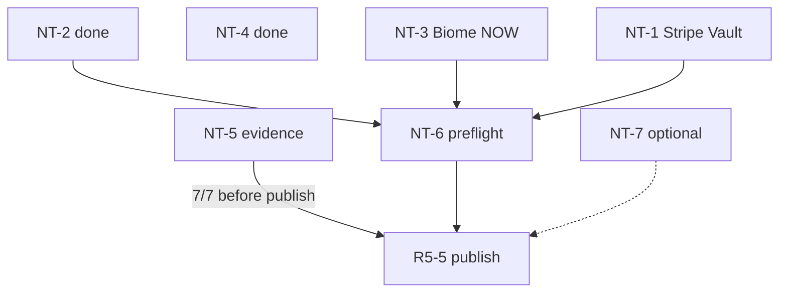

# Human Wave 実行計画（v1.2）

> **作成**: 2026-07-13 / **改訂**: 2026-07-14（**R5-5 / v1.2.0 公開完了**）  
> **目的**: 残 Human Public Beta タスク（NT-1 / 3 / 5 / 6 / 7）の**状態・依存・推奨順・DoD・Negative・完了記録**を一冊に集約する  
> **非目標**: ランブックの長コマンド再掲、コード変更、Agent による秘密入力・compose へのキー追加

---

## 0. 文書の役割分担

| 文書 | 役割 |
|------|------|
| **本計画** | 残タスクの状態・DAG・推奨順・DoD / Negative / 記録テンプレ・Agent 境界 |
| [`HUMAN_PUBLIC_BETA_RUNBOOK.md`](../guides/HUMAN_PUBLIC_BETA_RUNBOOK.md) v1.6 | **コピペ手順正本**（NT-1 Step 0 の SSH/build、NT-6 preflight コマンド全文） |
| [`remaining_work_foolproof_plan.md`](remaining_work_foolproof_plan.md) §2 | Wave H 要約・Agent 禁止 |
| [`OPEN.md`](../../OPEN.md) | ID 正本（本計画は手順を二重管理しない） |

**食い違い時**: ランブック > 本計画 > foolproof。

**進行支援**: `/nt-assist` + [`scripts/nt_gate.py`](../../scripts/nt_gate.py)（1 ステップ・秘密禁止）。

---

## 1. 現状スナップショット（2026-07-14）

| NT | OPEN | 状態 | 備考 |
|----|------|------|------|
| NT-1 | OP-057-R (1) / OP-070 R2-1 | **済**（2026-07-14） | 方針 A・distroless + Vault + Webhook + Pro。OPEN OP-057-R `[x]` |
| NT-2 | OP-078 等 | **済** | 再実行不要 |
| NT-3 | OP-002 / LL-C | **済**（2026-07-13） | Human PASS + Negative。OPEN OP-002 `[x]` |
| NT-4 | OP-013 | **済** | 回帰時のみ cargo |
| NT-5 | OP-063 | **済**（2026-07-14） | 7/7 + **R4-2 組込済**。OPEN OP-063 `[x]` |
| NT-6 | OP-070 R5 | **PASS**（2026-07-14） | preflight PASS。**R5-5 ✅ `v1.2.0` 公開済** |
| NT-7 | OP-064 | **任意・未** | 公開ブロッカー外 |
| LL-A | OP-080 | **済** | Pattern B 実機（Human 必須外） |

### 依存 DAG



### 推奨実行順（確定）

| 順 | NT | 所要目安 | 理由 |
|----|-----|----------|------|
| 1 | **NT-3** | 5–10 分 | ✅ 2026-07-13 PASS |
| 2 | **NT-1** | 30–60 分 | ✅ 2026-07-14 PASS |
| 3 | **NT-5** | 1–2 時間 | ✅ 2026-07-14 PASS（7/7・R4-2 待ち） |
| 4 | **NT-6** | 1–3 時間 | **いま**。Human が「NT-6 を実行しろ」後 |
| 5 | **NT-7** | 数日〜 | 任意 DEFER 可 |

---

## 2. Human 共通ルール

| ルール | 詳細 |
|--------|------|
| 秘密をチャットに貼らない | `sk_live_` / `whsec_` / Vault マスタパスワードは Agent 対話に出さない |
| compose に API キーを足さない | `docker-compose.production.yml` の api-server に `STRIPE_API_KEY=` **禁止** |
| コード変更禁止 | `commerce_webhook/` / `auth.rs` / `key-proxy` ロジックは触らない |
| Nurture 別系統 | `STRIPE_SECRET_KEY`（Nurture）は本 Wave の対象外 |
| cockpit 必須 | NT-3 / NT-5 — **まもる・整える → 設定 → インターフェース複雑度 →「コックピット」** |
| 課金導線 | NT-1 D3 合格根拠は **MC 内 Checkout + Webhook**。LP Payment Link は不可 |

---

## 3. NT-3 — Biome 目視（OP-002 / LL-C）【✅ 2026-07-13 PASS】

**コードは触らない。** 確認のみ。

### 3.1 アンカー（変更不要）

| ファイル | 行 | 内容 |
|----------|-----|------|
| [`BiomeCanvas.tsx`](../../apps/management-console/src/lib/biome/BiomeCanvas.tsx) | 99 | `alpha: false,` |
| [`BiomeRenderer.tsx`](../../apps/management-console/src/lib/biome/BiomeRenderer.tsx) | 187 | `alpha: false,` |

参考: `FluidBackground.tsx:43` も `alpha: false`（本 NT の主対象は上記 2 ファイル）。

### 3.2 前提

- [x] Management Console を開く（ローカル `http://localhost:3015` または NT-2 quickstart）
- [x] **コックピット**モード（「シンプル」では「ワールド」が出ない）
- [x] ログイン済み

### 3.3 Step（Positive）— ✅ PASS

### 3.4 Negative — ✅ 実施済（Human 報告）

### 3.5 完了記録

```
NT-3 / OP-002
日付: 2026-07-13
結果: PASS
ブラウザ: （Human 報告）
```

**PASS 後**: OPEN OP-002 `[x]` → **✅ クローズ済**。NT-1 ✅ / NT-5 ✅。次は **NT-6**。

---

## 4. NT-1 — Stripe 本番反映（OP-057-R / R2-1）【✅ 2026-07-14 PASS】

**コピペ手順正本**: ランブック [NT-1](../guides/HUMAN_PUBLIC_BETA_RUNBOOK.md#nt-1--stripe-本番反映op-057-r--r2-1)  
**技術正本**: [`stripe-production-setup.md`](../operations/stripe-production-setup.md)

**終わる状態**: 稼働 api-server が distroless（MC 配信可）＋ Vault に秘密 ＋ Webhook ＋ アプリ Checkout で Pro。compose に API キー代入なし。

### 4.1 実行順 — ✅ 全 Step PASS

| 順 | Step | 内容 | 結果 |
|----|------|------|------|
| **0** | Step 0 | distroless を本番に載せる | ✅ PASS（Labels `security.distroless=true` / User `65532`） |
| A | Step A | 秘密を Vault へ | ✅ key-proxy PUT（GUI はローカル制約あり） |
| B | Step B | 非秘密 env（TEST_MODE + Price） | ✅ 方針 A・Price 末尾 `pDj5` |
| C | Step C | Webhook 7 + whsec + **restart** | ✅ |
| D | Step D | Positive（Checkout → Pro） | ✅ PlanBadge Pro |
| N | Negative | キー削除 → 拒否 → 復元 | ✅ 復元後ログイン復旧 |

> **運用メモ**: compose の static bind-mount がイメージ内 dist を上書きし得る。フロント再ビルド後はホストへの `docker cp` 等で同期。`read -s` 後は `export` 必須。Negative で本番 Vault から `STRIPE_API_KEY` を消すと api が起動不能になり得る。

### 4.2 方針

選んだ方針: [x] **A** / [ ] B

### 4.3–4.5 DoD / Negative — ✅ 実施済（Human 報告）

### 4.6 完了記録

```
NT-1 / OP-057-R(1) / R2-1
日付: 2026-07-14
Step0 distroless: PASS
Vault: key-proxy / 方針: A / Price末尾4: pDj5
Webhook7 / Pro unlock / Negative復元
```

**PASS 後**: OPEN OP-057-R / OP-070 R2-1 **✅ クローズ済**。NT-5 ✅。次は **NT-6**。

### 4.7 Agent 禁止

- compose に `STRIPE_API_KEY` 追加  
- 秘密をチャットへ  
- webhook コードのついで修正  

---

## 5. NT-5 — 証拠ビジュアル（OP-063）【✅ 2026-07-14 PASS】

**正本**: [`MESSAGING.md`](../marketing/MESSAGING.md) §8  
**終わる状態**: 7 ファイル。秘密なし。**公開（R5-5）の直前に 7/7 必須**（NT-6 preflight 開始条件ではない）。

### 5.1–5.4 — ✅ 実施済（Human PASS）

パス: `docs/assets/evidence/2026-07-14/`（PNG 6 枚は 1920×1080。GIF は 960×540・Human 受理）。

### 5.5 完了記録

```
NT-5 / OP-063
日付: 2026-07-14
パス: docs/assets/evidence/2026-07-14/
結果: 7/7 PASS / 欠番: なし
```

→ OPEN OP-063 **✅ 撮影 + R4-2 組込完了**。次は **NT-6**（「NT-6 を実行しろ」）。

---

## 6. NT-6 — リリースゲート（R5 / OP-070）

**前提**: NT-1・2・3 PASS。**公開直前に NT-5=7/7。**  
**実行場所**: preflight は **開発マシンの clone**（本番 SSH ではない）。  
**Agent トリガ**: Human が **「NT-6 を実行しろ」** と明示するまで Agent は preflight を走らせない。

**コマンド正本**: ランブック [NT-6](../guides/HUMAN_PUBLIC_BETA_RUNBOOK.md#nt-6--リリースゲートr5) / [`.agent/workflows/release-preflight.md`](../../.agent/workflows/release-preflight.md) / [`release_master_plan.md`](release_master_plan.md) R5

### 6.1 パート A — ステップ 0（ロールバック文）

Issue またはリリース草案に実体を書く（空欄は FAIL）:

```
ロールバック:
- Feature Flag / 課金停止:
- git revert:
- DB: docs/operations/BACKUP.md 等の復元手順:
```

- [ ] 記載済  

### 6.2 パート B — OPERATIONS §8

スキップ可: G1←NT-2 / R2-1←NT-1 / OP-012・014 は過去 PASS 信頼時。  
スキップしない代表: `VAULT_SECRET` / `VAULT_MASTER_PASSWORD` / `NURTURE_API_URL`+`NURTURE_INTERNAL_SECRET` / `A2A_NODE_TOKEN` 等。

### 6.3 パート C — preflight

1 件 FAIL → 公開中止。詳細コマンドはランブック NT-6 パート C。

**ステップ 6 判定**: `vendor/` 除外の追跡ファイル ≤ **2500** かつ合計 ≤ **75MB**。  
**ステップ 8 判定**: `head -1 LICENSE` が BUSL、`README` バッジ一致。

### 6.4 パート D — GitHub About（MESSAGING §7）

Description / Website / Topics / Social preview — ランブック NT-6 パート D 参照。

### 6.5 パート E — R5-2〜5

| ID | Human | Agent |
|----|-------|-------|
| R5-2 | Unreleased>200 確認 | 「R5-2 を実装しろ」 |
| R5-3 | パート A ロールバック文 | Human 完了で足りる |
| R5-4 | preflight PASS 後 | 「docs-sync を実行しろ」 |
| R5-5 | **「公開してよい」**（直前に NT-5=7/7） | Release/タグ |

**公開ゲート**: C PASS + §8 + **NT-5=7/7** + R5-3 + 明示承認。

### 6.6 Negative（必須）

gitleaks / DAG / ignored が 1 件 NG → 公開中止 → 修正 → C から再実行。

### 6.7 完了記録

```
NT-6: 日付 / 開発機 / preflight PASS|FAIL / NT-5=7/7|未完 / R5-5=承認|未
```

→ OPEN OP-070 更新可。

---

## 7. NT-7 — ベータ獲得（OP-064・任意）

公開ブロッカー外。DEFER 可。

1. 招待チャネル決定  
2. 禁止表現を守る（MESSAGING §10 抄録 — ランブック NT-7）  
3. 名簿は **private**（連絡先を git に入れない）  
4. 5〜10 人がログイン〜チャット相当  

```
NT-7 / OP-064
日付:
人数:
Testimonial: 0 / K
結果: PASS / DEFER
```

---

## 8. 付録 A — 進捗シート

```
日付開始:
事前ツール: [ ]
NT-1: [x] PASS 2026-07-14
NT-2: [x] 済
NT-3: [x] PASS 2026-07-13
NT-4: [x] 済
NT-5: [x] PASS 2026-07-14
NT-6: PASS 2026-07-14 / 開発機 / preflight PASS / NT-5=7/7 / R5-5=完了（v1.2.0）
NT-7: 未/PASS/FAIL/DEFER
公開: 完了
```

---

## 9. 付録 B — 「今どれ？」

| 状況 | 次 |
|------|-----|
| Biome 未 | ~~NT-3~~ ✅ 済 |
| Stripe 本番未 | ~~NT-1~~ ✅ 済（2026-07-14） |
| スクショ未 | ~~NT-5~~ ✅ 済（2026-07-14・**R4-2 組込済**） |
| 公開後 | 任意 **NT-7** / Stripe **方針 B** / ポストリリース |
| 公開したい | ~~NT-6 PASS + NT-5=7/7 +「公開してよい」~~ ✅ 2026-07-14 |

---

## 10. 付録 C — Agent アシスト境界

| 可 | 不可 |
|----|------|
| ランブック / 本計画の該当 Step を読み上げ | 秘密の入力・チャットへの貼り付け |
| `nt_gate.py` 実行結果の解釈 | compose に `STRIPE_API_KEY` 追加 |
| PASS 後 OPEN / CHANGELOG 更新（Human 指示後） | NT-3 を代理 PASS 扱い |
| NT-6 preflight（「NT-6 を実行しろ」後） | 勝手な公開・タグ打ち |

---

## 11. 完了宣言テンプレ

```
Human Public Beta 実行計画 — 完了報告
日付:
NT-1: …
NT-2: [x]
NT-3: …
NT-4: [x]
NT-5: …
NT-6: …
NT-7: … / DEFER
公開: …
```

---

*Human 実行計画 v1.2。手順のコピペは [`HUMAN_PUBLIC_BETA_RUNBOOK.md`](../guides/HUMAN_PUBLIC_BETA_RUNBOOK.md) を正本とする。*
