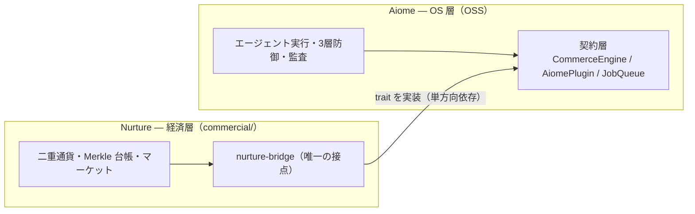

# Aiome × Nurture シナジー訴求 実装計画書（実行者グレード v2）

> 作成: 2026-07-04 / 改訂: 2026-07-04（実コード検証に基づく実行者グレード化・/perfect-plan 検証2巡反映済み: v3）
> ステータス: **実装済み**（2026-07-04）
> 前提: `docs/roadmaps/pr_quality_improvement_plan.md`（PR-1〜PR-9 実装済み）の増補。
> 姉妹計画: `synergy_maximization_plan.md`（W-1〜W-8、機能実装）。本計画は W 系の完了を**待たずに**実装できる（未実装機能を訴求しないため）。
> 実行者への合格条件: この計画書とコードだけで、迷わず安全に完遂できること。

---

## 1. 現状理解

### 1.1 対外表現の現状（検証済み）

- LP `docs/landing/` の Economy セクション: B2A/A2A/A2C の3カード（`Economy.tsx` 112行、i18n キー `economy.card1〜3_*` + `economy.mock_note`）のみ
- `README.md` L104–130「Aiome × Nurture」: 身体/心臓アナロジー＋機能フロー Mermaid。**構造的差別化（単方向依存・trait 接点）を示していない**
- `commercial/README.md`（52行）: 取引モデルと手数料のみ。形式検証・監査チェーンへの導線なし
- Proof Bar（`SocialProof.tsx`）: 「3,500+ automated tests」— 汎用的で TLA+ の独自性が埋没

### 1.2 訴求すべき構造的差別化（コードベース検証済み・エビデンス付き）

| # | 差別化 | エビデンス |
|---|---|---|
| S1 | Trait Inversion: OSS が `CommerceEngine` を定義し Nurture が実装。依存は NURTURE→Aiome 単方向。Mock で $0 完全動作 | `libs/aiome-contracts/src/commerce.rs` / `commercial/libs/nurture-infra/src/economy/bridge/commerce_impl.rs` / `libs/aiome-commerce/src/factory.rs` |
| S2 | TLA+ 形式仕様 **5本**（検疫・Karma連邦・Federation・ContextEngine・経済保存則）＋ Rust MBT トレース | `specs/AiomeQuarantineProtocol.tla`, `specs/SamsaraKarmaProtocol.tla`, `specs/SamsaraFederationProtocol.tla`, `specs/AiomeContextEngine.tla`, `commercial/specs/NurtureEconomyProtocol.tla`（`CoinsConserved` L61）, `specs/TRACE_MAP.md`, `libs/infrastructure/tests/mbt_quarantine.rs` |
| S3 | Merkle 監査チェーン付き二重通貨 | `commercial/libs/nurture-core/src/coin.rs`, `points.rs` / `commercial/libs/nurture-infra/src/economy/merkle.rs` |
| S4 | Zero-Trust S2S（Bearer＋OxiLean 証明書 OXP≥900・5分TTL） | `commercial/apps/nurture-api/src/routes/internal/mod.rs` L59–119 |
| S5 | 検疫→流通の一気通貫 WASM スキル経済 | `libs/infrastructure/src/skills/` / `commercial/libs/commerce-protocol/src/commodity.rs`（`CommodityKind::WasmSkill`） |
| S6 | 暴走防壁実装済み経済（Interceptor・日次上限・IdempotencyGate） | `commercial/libs/nurture-infra/src/economy/interceptor.rs`, `internal/idempotency_gate.rs` |
| S7 | Tauri 3モード切替（local/cloud/disabled） | `apps/management-console/src-tauri/src/lib.rs` `resolve_nurture_mode()` L536–547 |
| S8 | 単一 workspace 2層 Monorepo＋`nurture-bridge` 1ゲートウェイ（ADR-011） | `Cargo.toml` / `commercial/docs/decisions/011-nurture-bridge-isolation.md`（実在確認済み） |

### 1.3 コピーの骨子（4ストーリー）

1. **経済は後付けできない**: 経済は OS の contract 層（trait）に最初から刻まれている。OSS 単体でも Mock 経済が完動（S1）
2. **数学が保証する経済**: TLA+ の保存則（`CoinsConserved`）＋ Merkle チェーン監査（S2+S3）
3. **自律と安全は矛盾しない**: TLA+ 検疫を通ったスキルだけが流通し、暴走は Interceptor が止める（S5+S6）
4. **所有か、接続か、選べる**: Mock（$0）→ local → cloud の3段階でロックインなし（S1+S7）

---

## 2. 安全網（項目0 — 最初に実行）

```bash
cd /Users/motista/Desktop/antigravity/aiome
git checkout main && git pull && git checkout -b feature/synergy-pr
cd docs/landing && npm ci && npm run build && npx vitest run   # 全テスト PASS を記録
```

ベースラインが FAIL の場合は中断して報告。LP のテストは `config.ts` L19 `lng: 'en'` のため**英語キーの値**をアサートしている点に注意。

---

## 3. 作業項目（実行順・1項目=1コミット）

### SYN-1: MESSAGING.md にシナジー章 §2.5 を追加

- **対象**: `docs/marketing/MESSAGING.md` の L27（「語り順は必ず…」の段落）と L29（`## 3.`）の間
- **問題**: SSOT に S1〜S8 がなく、対外文書に構造的差別化を書くと「本書にない主張の禁止」に抵触する
- **変更**: L28 の空行の後に以下をそのまま挿入する:

```markdown
## 2.5 Aiome × Nurture シナジー — 構造的差別化（エビデンス付き）

> 対外文書で「他製品に真似できない理由」を語るときは、必ず本節の S 番号と対応するエビデンスパスの範囲内で記述すること。

| # | 主張 | エビデンス（リポジトリ内実在パス） |
|---|---|---|
| S1 | 経済は OS の契約層に最初から刻まれている（OSS が `CommerceEngine` trait を定義し、商用 Nurture が実装。依存は NURTURE→Aiome の単方向のみ。Mock モードで $0 完全動作） | `libs/aiome-contracts/src/commerce.rs` / `libs/aiome-commerce/src/factory.rs` |
| S2 | TLA+ 形式仕様5本が OS 検疫・Karma 連邦・Federation・ContextEngine・経済保存則をカバーし、Rust テストへトレース | `specs/*.tla`（4本）+ `commercial/specs/NurtureEconomyProtocol.tla` / `specs/TRACE_MAP.md` / `libs/infrastructure/tests/mbt_quarantine.rs` |
| S3 | 全取引が SHA-256 Merkle チェーンで連鎖記帳される二重通貨（AiomeCoin / CreatorPoints） | `commercial/libs/nurture-infra/src/economy/merkle.rs` |
| S4 | OS↔経済間の内部通信は Bearer＋OxiLean 証明書（OXP≥900・5分TTL）の Zero-Trust 二重認証 | `commercial/apps/nurture-api/src/routes/internal/mod.rs` |
| S5 | TLA+ 検疫を通過した WASM スキルがそのまま商品（`CommodityKind::WasmSkill`）として流通 | `commercial/libs/commerce-protocol/src/commodity.rs` |
| S6 | 暴走防壁実装済み: 購入前プリフライト（EconomyInterceptor）・日次上限・冪等ゲート | `commercial/libs/nurture-infra/src/economy/interceptor.rs` |
| S7 | デプロイ時に Mock（$0）/ local / cloud を切替可能（Tauri 3モード） | `apps/management-console/src-tauri/src/lib.rs` |
| S8 | OSS OS と商用経済エンジンが単一 Cargo workspace で共存し、接点は `nurture-bridge` 1ゲートウェイに集約（ADR-011） | `commercial/docs/decisions/011-nurture-bridge-isolation.md` |

### 訴求ストーリー（対外コピーの型・ja/en）

1. **経済は後付けできない / Economy isn't a plugin** — 「他製品の経済機能はプラグイン。Aiome は OS の契約層に経済が最初から刻まれており、OSS 単体でも Mock 経済が完全動作します。」 / "Other products bolt the economy on. In Aiome, the economy is carved into the OS contract layer itself — and the mock economy runs fully on the OSS build."
2. **数学が保証する経済 / Verified by math** — 「コインが消えない・複製されないことを TLA+ の保存則で検証し、全取引を Merkle チェーンで監査します。」 / "Conservation laws in TLA+ prove coins can't vanish or duplicate; every transaction lands on a Merkle audit chain."
3. **自律と安全は矛盾しない / Autonomy without runaway, economically too** — 「TLA+ 検疫を通ったスキルだけが経済圏で流通し、暴走購入はインターセプタが物理的に止めます。」 / "Only quarantine-verified WASM skills enter the market, and a runtime interceptor physically stops runaway purchases."
4. **所有か、接続か、選べる / Own it, or connect it — your call** — 「Mock（$0）→ ローカル Nurture → クラウド Nurture の3段階。構造としてロックインがありません。」 / "Mock ($0) → local Nurture → cloud Nurture. Lock-in is structurally impossible."

### 禁止（本節に関する）

- `NurturePlugin` の in-process 動的ロードは**未接続**（2026-07-04 検証）。「プラグインとして動的ロード」とは書かない。W-3（synergy_maximization_plan.md）完了後に解禁。
- TLA+ 仕様数は 5 本（TTrace 生成物は数えない）。それ以外の数字を書かない。
```

- **完了条件**: `grep -c "^| S[1-8] " docs/marketing/MESSAGING.md` が `8` を返す。既存 §3 以降の見出し番号は変更しない
- **リスク/戻し方**: 文書のみ。`git revert`
- **依存**: なし

### SYN-2: README / README_en の「Aiome × Nurture」セクション刷新

- **対象**: `README.md` L104–130（見出し `## 💰 Aiome × Nurture — 自律 AI 経済圏` から Mermaid 終了まで）と、テーブル直後〜`AIOME_NURTURE_SYNERGY.md` リンク段落。`README_en.md` は L103–129 の対応箇所
- **問題**: 現 Mermaid は機能フロー図で、単方向依存・trait 接点という「真似できない構造」を示していない
- **変更（ja）**: 既存 Mermaid ブロック（L108–L119 の `graph TB`）を以下に**置換**:

````markdown

````

そして既存テーブル（B2A/A2A/A2C）と MockCommerceEngine 段落は**維持**し、テーブルの直前に以下の小節を挿入:

```markdown
### なぜ経済を「後付け」できないのか

他製品の経済機能はプラグインですが、Aiome では経済のインターフェース（`CommerceEngine`）が OSS の契約層に最初から定義されており、商用エンジン Nurture がそれを**単方向依存**で実装します。だから OSS 単体でも Mock 経済が完全動作し、コインが消えない・複製されないことは TLA+ の保存則（`CoinsConserved`）で検証され、全取引は Merkle チェーンに連鎖記帳されます。

**Deep Dive**: [統合設計](docs/architecture/AIOME_NURTURE_SYNERGY.md) ・ [経済の TLA+ 仕様](commercial/specs/NurtureEconomyProtocol.tla) ・ [ADR-011 Bridge 分離](commercial/docs/decisions/011-nurture-bridge-isolation.md)
```

- **変更（en）**: `README_en.md` の同セクションに同一構造の英語版を適用（Mermaid のラベルを英訳: `"Aiome — OS layer (OSS)"` / `"Contract layer"` / `"Nurture — economy layer (commercial/)"` / `"implements traits (one-way dependency)"`。小節見出しは `### Why the economy can't be bolted on`）
- **完了条件**: ja/en の構造一致。GitHub プレビュー（`gh markdown-preview` 不可のため push 後の PR 画面）で Mermaid がレンダリングされる。相対リンク3本のファイル実在を `ls` で確認
- **リスク/戻し方**: 図の複雑化 → ノード5個・エッジ3本に固定。`git revert`
- **依存**: SYN-1

### SYN-3: LP Economy セクションに moat 4ミニカード追加

- **対象**: `docs/landing/src/i18n/locales/ja.json` / `en.json`（`economy` 名前空間）、`docs/landing/src/components/Economy.tsx`、`docs/landing/src/components/Economy.test.tsx`
- **問題**: B2A/A2A/A2C カードの下に「なぜ信じられるか」の根拠ブロックがない
- **変更手順**:

**(1) i18n キー追加** — ja.json / en.json の `economy` オブジェクト内、`"mock_note"` の**直前**に追加（両ファイルでキー順を揃える）:

```json
"moat_title": "なぜ真似できないのか",
"moat1_title": "数学が検証",
"moat1_desc": "コインの保存則を TLA+ でモデル検査。消えない・複製されない。",
"moat2_title": "台帳が証明",
"moat2_desc": "全取引を SHA-256 Merkle チェーンで連鎖記帳。改竄は構造的に不可能。",
"moat3_title": "OSの契約層に内蔵",
"moat3_desc": "経済はプラグインではなく trait。OSS 単体でも Mock 経済が $0 で完全動作。",
"moat4_title": "実行時の防壁",
"moat4_desc": "購入前プリフライト・日次上限・冪等ゲートが暴走を物理的に止める。",
```

en.json:

```json
"moat_title": "Why it can't be copied",
"moat1_title": "Verified by math",
"moat1_desc": "Coin conservation is model-checked in TLA+. Nothing vanishes, nothing duplicates.",
"moat2_title": "Proven by the ledger",
"moat2_desc": "Every transaction is chained into a SHA-256 Merkle audit log. Tampering is structurally impossible.",
"moat3_title": "Built into the OS contract",
"moat3_desc": "The economy is a trait, not a plugin. The mock economy runs fully on the OSS build for $0.",
"moat4_title": "Guarded at runtime",
"moat4_desc": "Pre-purchase interception, daily caps, and idempotency gates physically stop runaway spending.",
```

**(2) Economy.tsx 変更** — import に `ShieldCheck, Link2, Blocks, Gauge` を lucide-react から追加（4アイコンとも `lucide-react@^0.577.0` に存在確認済み。2026-07-04 v3 検証）。外部リンクの `<a target="_blank" rel="noopener noreferrer">` パターンは Hero.tsx L76 / Footer.tsx L23–26 の既存慣例と一致。既存 mock_note の `motion.div`（L97 付近）の**直前**に以下を挿入（スタイルは既存カードの縮小版、新規 CSS なし）:

```tsx
        <div className="mb-12">
          <h3 className="text-center text-sm font-bold text-brand-purple tracking-widest font-display mb-6 uppercase">
            {t('economy.moat_title')}
          </h3>
          <div className="grid grid-cols-1 sm:grid-cols-2 lg:grid-cols-4 gap-4">
            {[
              { id: 'm1', icon: ShieldCheck, href: 'https://github.com/motivationstudio-llc/aiome/blob/main/commercial/specs/NurtureEconomyProtocol.tla' },
              { id: 'm2', icon: Link2, href: 'https://github.com/motivationstudio-llc/aiome/blob/main/commercial/libs/nurture-infra/src/economy/merkle.rs' },
              { id: 'm3', icon: Blocks, href: 'https://github.com/motivationstudio-llc/aiome/blob/main/libs/aiome-contracts/src/commerce.rs' },
              { id: 'm4', icon: Gauge, href: 'https://github.com/motivationstudio-llc/aiome/blob/main/commercial/libs/nurture-infra/src/economy/interceptor.rs' },
            ].map(({ id, icon: MoatIcon, href }, i) => (
              <a key={id} href={href} target="_blank" rel="noopener noreferrer"
                className="backdrop-blur-md bg-white/[0.02] border border-white/5 hover:border-brand-cyan/30 transition-all duration-300 rounded-2xl p-5 block">
                <MoatIcon className="text-brand-cyan mb-3" size={20} />
                <h4 className="text-sm font-bold text-white mb-2 font-display">{t(`economy.moat${i + 1}_title`)}</h4>
                <p className="text-gray-400 text-xs leading-relaxed">{t(`economy.moat${i + 1}_desc`)}</p>
              </a>
            ))}
          </div>
        </div>
```

**(3) テスト追加** — `Economy.test.tsx` に1ケース追加（en 値でアサート）:

```tsx
it('renders the moat section with four guarantees', () => {
  render(<Economy />);
  expect(screen.getByText('Why it can't be copied')).toBeInTheDocument();
  expect(screen.getByText('Verified by math')).toBeInTheDocument();
  expect(screen.getByText('Guarded at runtime')).toBeInTheDocument();
});
```

（アポストロフィは `can\'t` にエスケープするか、`getByText(/can.t be copied/i)` を使用）

- **完了条件**: `cd docs/landing && npm run build && npx vitest run` 全 PASS。ja/en の `economy` キー数一致（`python3 -c "import json;a=json.load(open('src/i18n/locales/ja.json'))['economy'];b=json.load(open('src/i18n/locales/en.json'))['economy'];assert a.keys()==b.keys(),set(a)^set(b)"`）
- **リスク/戻し方**: セクション過長 → ミニカードは p-5・text-xs で既存カードの約半分の高さ。`git revert`
- **依存**: SYN-1

### SYN-4: Proof Bar 3枠目を TLA+ 訴求に差し替え

- **対象**: `docs/landing/src/i18n/locales/ja.json` / `en.json` の `social_proof.metric3_*`、`docs/landing/src/components/SocialProof.test.tsx`
- **問題**: 「3,500+ tests」は汎用的。TLA+ 5仕様の方が独自
- **変更**: `metric3_*` を以下に置換（`SocialProof.tsx` 自体は `[1,2,3].map` の動的キー参照のため変更不要）:

ja.json:

```json
"metric3_value": "5本",
"metric3_label": "TLA+ 形式仕様でモデル検査",
"metric3_desc": "\"検疫・連邦・経済の保存則まで数学で検証。3,500+ の自動テストが背後で回り続けます。\""
```

en.json:

```json
"metric3_value": "5",
"metric3_label": "TLA+ specs, model-checked",
"metric3_desc": "\"Quarantine, federation, and economic conservation — verified by math, backed by 3,500+ automated tests.\""
```

`SocialProof.test.tsx` の期待値を更新: `'3,500+'` → `'5'`、`'automated tests passing'` → `'TLA+ specs, model-checked'`

- **完了条件**: `npx vitest run src/components/SocialProof.test.tsx` PASS。「5」は実ファイル数（`specs/*.tla` 4本 ※TTrace 除く ＋ `commercial/specs/*.tla` 1本）と一致していることを `ls specs/*.tla commercial/specs/*.tla` で確認
- **リスク/戻し方**: テスト数の安心感喪失 → desc に 3,500+ を残す。`git revert`
- **依存**: SYN-3

### SYN-5: commercial/README.md に Architecture Guarantees 節を追加

- **対象**: `commercial/README.md` L46（`## ディレクトリ構成` の終わり）と L47 `## さらに詳しく` の間
- **変更**: 以下を挿入:

```markdown
## アーキテクチャ保証（Architecture Guarantees）

| 保証 | 実装 |
|---|---|
| 経済の保存則を数学で検証 | [NurtureEconomyProtocol.tla](specs/NurtureEconomyProtocol.tla)（TLA+ / `CoinsConserved` 不変条件） |
| 全取引の改竄不能な監査 | [merkle.rs](libs/nurture-infra/src/economy/merkle.rs)（SHA-256 Merkle チェーン台帳） |
| OS↔経済間の Zero-Trust 通信 | [internal/mod.rs](apps/nurture-api/src/routes/internal/mod.rs)（Bearer + OxiLean 証明書の二重認証） |
| 暴走購入の実行時防壁 | [interceptor.rs](libs/nurture-infra/src/economy/interceptor.rs)（購入前プリフライト・日次上限） |
| Aiome 本体との接点は 1 ゲートウェイのみ | [ADR-011](docs/decisions/011-nurture-bridge-isolation.md)（nurture-bridge 分離） |
```

- **完了条件**: 相対リンク5本の実在を確認: `cd commercial && ls specs/NurtureEconomyProtocol.tla libs/nurture-infra/src/economy/merkle.rs apps/nurture-api/src/routes/internal/mod.rs libs/nurture-infra/src/economy/interceptor.rs docs/decisions/011-nurture-bridge-isolation.md`
- **依存**: SYN-1

### SYN-6: GitHub topics 補強

- **変更**: `gh repo edit motivationstudio-llc/aiome --add-topic formal-verification --add-topic agent-marketplace`（`tla-plus` は設定済みのため不要）
- **完了条件**: `gh repo view --json repositoryTopics` に両トピックが含まれる
- **依存**: なし（いつでも可）

### SYN-7: ドキュメント同期

- **対象**: `CHANGELOG.md`（[Unreleased] に Added/Changed）、`memory/2026-07-04.md`（Done に追記）
- **内容**: MESSAGING §2.5 追加、README/LP/commercial README のシナジー訴求刷新、Proof Bar 差し替え、topics 追加を記録。LP テスト結果（PASS 数）を明記
- **完了条件**: `bash scripts/docs-sync-check.sh --ci` PASS
- **依存**: SYN-1〜SYN-6 完了後

---

## 3.5 検証2巡目（2026-07-04・実コードベース照合・v3 に反映済み）

| 確認事項 | 結果 |
|---|---|
| LP ロケール | `ja.json` / `en.json` の2本のみ（`i18n/config.ts` L9–17）。SYN-3/4 の対象漏れなし |
| lucide-react アイコン | `ShieldCheck` / `Link2` / `Blocks` / `Gauge` の4つとも `^0.577.0` の型定義に存在 |
| 外部リンク慣例 | Hero.tsx L76 / Footer.tsx L23–26 と同一パターン（`target="_blank" rel="noopener noreferrer"`）でスタイル逸脱なし |
| テストの i18n セットアップ | `Economy.test.tsx` は `import '../i18n/config'`（副作用 init・`lng: 'en'` 固定）＋素の `render()`。新テストも同方式で追加可能。Provider ラップ不要 |
| SYN-1〜5, 7 | 計画のまま妥当（再発明・抜け漏れなし） |

**判定: ✅ GO（v3 で軽微な補記のみ）**

## 4. やらないことリスト

1. Rust コード・機能の変更（W 系計画のスコープ）
2. `NurturePlugin` 動的ロード等、**未接続機能の訴求**（W-3 完了まで）
3. 数字の創作（TLA+ は5本、手数料は15%、これ以外を書かない）
4. 新規 CSS クラス・デザイントークンの追加（Tailwind ユーティリティの流用のみ）
5. `AIOME_NURTURE_SYNERGY.md` 本体の改稿（リンクのみ）
6. LP のセクション順序変更（Economy 内部への追加のみ）

## 5. 実行者への指示文

> `docs/roadmaps/synergy_pr_plan.md` に従い、項目0（安全網）→ SYN-1 → … → SYN-7 の順に実施してください。1項目ずつ実施し、1項目ごとにコミットしてください（メッセージは Conventional Commits: `docs(marketing): ...` / `feat(landing): ...`）。各項目の完了条件を満たせなければ中断して報告してください。計画にないコピー変更・機能追加・リファクタリングは行わないでください。i18n は ja/en 両方を必ず同時に更新してください。
